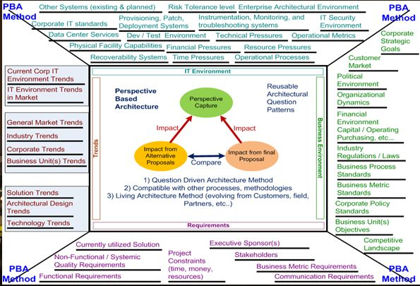
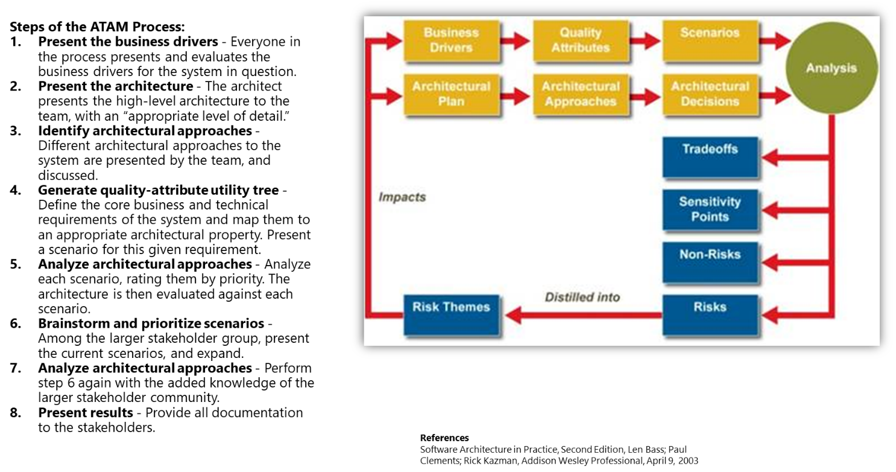

This report was prepared for the

Iasa

12325 Hymeadow 1-102

Austin Tx, 78750

The ideas and findings in this report should not be construed as an official Iasa position. It is published in the interest of scientific and technical information exchange. The Iasa is a non-profit professional association sponsored by various corporate and government entitites.

Copyright 2018 Iasa

NO WARRANTY

THIS MATERIAL IS FURNISHED ON AN "AS-IS" BASIS. IASA MAKES NO WARRANTIES OF ANY KIND, EITHER EXPRESSED OR IMPLIED, AS TO ANY MATTER INCLUDING, BUT NOT LIMITED TO, WARRANTY OF FITNESS FOR PURPOSE OR MERCHANTABILITY, EXCLUSIVITY, OR RESULTS OBTAINED FROM USE OF THE MATERIAL. CARNEGIE MELLON UNIVERSITY DOES NOT MAKE ANY WARRANTY OF ANY KIND WITH RESPECT TO FREEDOM FROM PATENT, TRADEMARK, OR COPYRIGHT INFRINGEMENT.

Use of any trademarks in this report is not intended in any way to infringe on the rights of the trademark holder.

Internal use. Permission to reproduce this document and to prepare derivative works from this document for internal use is granted, provided the copyright and "No Warranty" statements are included with all reproductions and derivative works.

External use. This document may be reproduced in its entirety, without modification, and freely distributed in written or electronic form without requesting formal permission. Permission is required for any other external and/or commercial use. Requests for permission should be directed to the Iasa at contactus@iasaglobal.org.

This work was created for the operation of the Iasa, a non-profit professional association. It is licensed under creative commons.

 ITABoK 3.0 by [IASA](http://iasaglobal.org/) is licensed under a [Creative Commons Attribution-NonCommercial 4.0 International License](http://creativecommons.org/licenses/by-nc/4.0/). Based on a work at <https://www.iasaglobal.org/itabok3_0/>.

Table of Contents

[Architecture Analysis](#architecture-analysis)

# Architecture Analysis

-   Definition: a method or procedure for analyzing architecture decisions
-   Catch mistakes up front before build
-   Analyze quality attributes at runtime
-   Ensure stakeholder understanding
-   Examples:
    -   Perspectives-based architecture
    -   Architecture Trade-off And Analysis Method

A good tool to use that is part of the emerging suite of question-based patterns is the;

-   Perspectives-Based Architectural Analysis Methodology (PBAAM).

This structured set of questions can be used to review your architecture and sure it is aligned with;

-   The organizational structure and business imperatives, and
    -   That the solution will land in the field, be adopted and can be supported.

Another tool that can be used is the

-   Architecture Tradeoff Analysis Method (ATAM)

This is a formal process and structure that works well for big projects and large teams.

Consider downloading and reviewing the whitepaper for this tool if you are not familiar with it.
