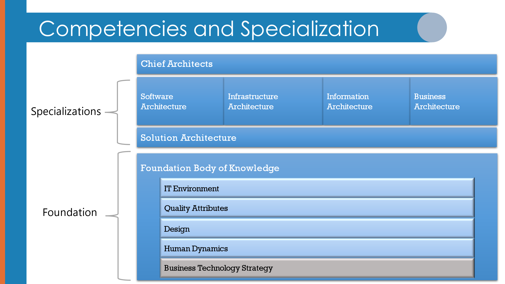
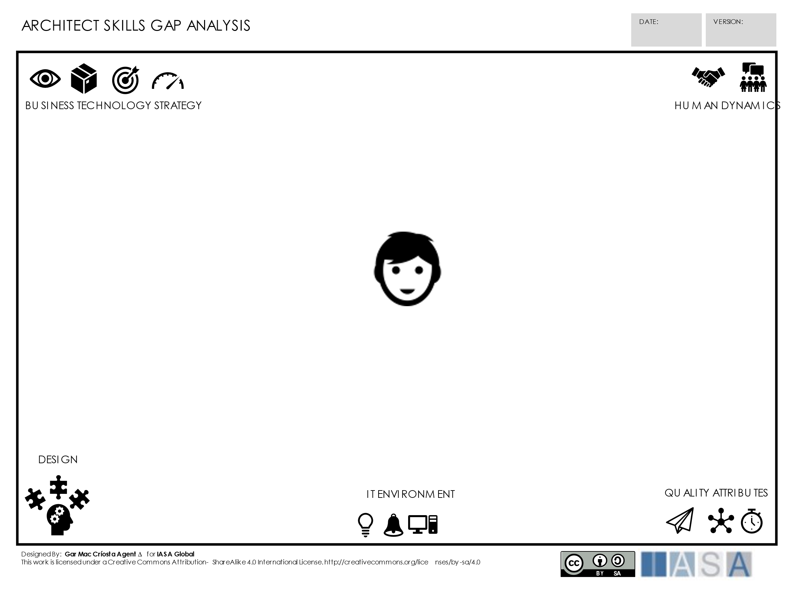
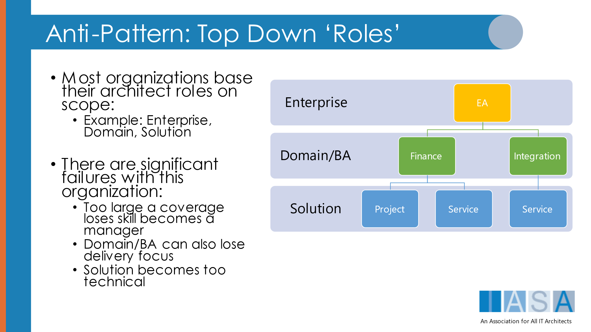
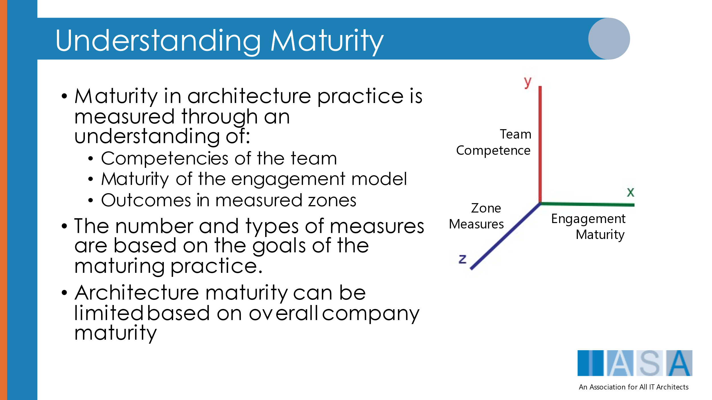

#### 

This report was prepared for the

Iasa

12325 Hymeadow 1-102

Austin Tx, 78750

The ideas and findings in this report should not be construed as an official Iasa position. It is published in the interest of scientific and technical information exchange. The Iasa is a non-profit professional association sponsored by various corporate and government entities.

Copyright 2018 Iasa

NO WARRANTY

THIS MATERIAL IS FURNISHED ON AN "AS-IS" BASIS. IASA MAKES NO WARRANTIES OF ANY KIND, EITHER EXPRESSED OR IMPLIED, AS TO ANY MATTER INCLUDING, BUT NOT LIMITED TO, WARRANTY OF FITNESS FOR PURPOSE OR MERCHANTABILITY, EXCLUSIVITY, OR RESULTS OBTAINED FROM USE OF THE MATERIAL. CARNEGIE MELLON UNIVERSITY DOES NOT MAKE ANY WARRANTY OF ANY KIND WITH RESPECT TO FREEDOM FROM PATENT, TRADEMARK, OR COPYRIGHT INFRINGEMENT.

Use of any trademarks in this report is not intended in any way to infringe on the rights of the trademark holder.

Internal use. Permission to reproduce this document and to prepare derivative works from this document for internal use is granted, provided the copyright and "No Warranty" statements are included with all reproductions and derivative works.

External use. This document may be reproduced in its entirety, without modification, and freely distributed in written or electronic form without requesting formal permission. Permission is required for any other external and/or commercial use. Requests for permission should be directed to the Iasa at contactus@iasaglobal.org.

This work was created for the operation of the Iasa, a non-profit professional association. It is licensed under creative commons.

 ITABoK 3.0 by [IASA](http://iasaglobal.org/) is licensed under a [Creative Commons Attribution-NonCommercial 4.0 International License](http://creativecommons.org/licenses/by-nc/4.0/). Based on a work at <https://www.iasaglobal.org/itabok3_0/>.

Table of Contents

[What is an Architecture Practice](#what-is-an-architecture-practice)

[How Does a Practice Mindset Differ From Most Organizations](#how-does-a-practice-mindset-differ-from-most-organizations)

[Why is a Practice Important to Architects](#why-is-a-practice-important-to-architects)

[Competencies, Career Path and Advancement](#competencies-career-path-and-advancement)

[Architect Titles, Roles and Specializations in a Practice Model](#architect-titles-roles-and-specializations-in-a-practice-model)

[Chief Architects Over Enterprise Architects](#chief-architects-over-enterprise-architects)

[Competencies and Enterprise Architecture](#competencies-and-enterprise-architecture)

[The BTABoK Answer to the Challenge – Chief Architects over Enterprise Architects](#the-btabok-answer-to-the-challenge--chief-architects-over-enterprise-architects)

[Solution Architects](#solution-architects-and-other-generalists)

[Business Architects](#business-architects)

[Software Architects](#software-architects)

[Information Architects](#information-architects)

[Infrastructure Architects](#infrastructure-architects)

[Domain Architects, Sub-Specialists and Experts](#_Toc91079458)

[The Architects Practice in the Enterprise](#the-architects-practice-in-the-enterprise)

[Building an Architecture Practice](#building-an-architecture-practice)

[Large or Small Groups and In-Between](#large-or-small-groups-and-in-between)

[The Architecture Practice Steering Body](#the-architecture-practice-steering-body)

[Growing Stakeholder Trust](#growing-maturity)

[Managing an Engagement Model](#growing-people)

[Architecture Practice Goals](#architecture-practice-objectives)

[Processes and Deliverable](#processes-deliverables-and-tools)

[HR and Job Titles](#hr-and-job-titles)

[References and further reading](#references-and-further-reading)

# 

Quote: “A practice model is the only way to organize a successful architecture group in the long term.”

\- Paul Preiss

# What is an Architecture Practice

The average corporation has employees who are educated and skilled. They acquire these employees through interviews and other hiring methods. However, this model does not apply to professions. Doctors are not ‘promoted’ into being doctors, nor are lawyers or accountants. Instead professions organize themselves into ‘practice models’. A practice model is a group of professionals, most of whom are reasonably junior, to achieve growth in a particular set of skills and apply those skills to creating something of value.

The technology world does not have anything like this currently. The employers look at certifications, interviews, and experience and decide what job the person qualifies for, whether it be an architect, a programmer or a manager. There’s one big problem with this, it makes creating architects, engineers and

## How Does a Practice Mindset Differ From Most Organizations

Think about all of the professional groups from more standard professions like law and medicine. In these groups, the basis for advancement, delivery, and growth of the profession lies within the overall body of practitioners and is less based on the internal politics, policies and structure of the organizations that employ them. This practice mindset restructurers the idea of career around mastering a shared body of knowledge and even sub-specializations within the profession. Medical practices are by far the easiest to describe in terms of mindset. Doctors, nurses and operational staff including executive management follow different models for education, skill mastery, advancement, mentoring and thought leadership. It also impacts areas of measurement, innovation and societal interactions including relationships with higher education, law and government, not to mention the relationship to ethics.

There is no method for example of promoting someone to a surgeon within an organization. Learning, mentoring, competency growth, certifications, and most of all successful demonstration of competency within the modern body of knowledge guide the career of the individual.

# Why is a Practice Important to Architects

A practice mindset may be the most essential change in architecture and in technology in general coming within the next few decades. While technology advances and management techniques remain driving forces, they have reached a level of societal impact (human safety, fiscal impact, culture, and law) which require a fundamental shift in the approach of technologists to employment, growth and scope of impact.

In addition, a practice model brings significant benefits to all parties within the system. Problems that have plagued IT and organizations both vendor and non-vendor alike can be linked with the solutions provided by a practice model over a management model for professionals involved in the field. This is not limited to architects but they and engineers are the most obvious candidates for development of a true professional model. Below are issues and benefits that can be achieved through this shift in employment and experiential model.

| Benefits/Issues                                       | Description                                                                                                                                                                                                                                                                                                                                                                               | Practice/Professional Impact                                                                                                                                                                                                                                                                                                                                                                                                                                     |
|-------------------------------------------------------|-------------------------------------------------------------------------------------------------------------------------------------------------------------------------------------------------------------------------------------------------------------------------------------------------------------------------------------------------------------------------------------------|------------------------------------------------------------------------------------------------------------------------------------------------------------------------------------------------------------------------------------------------------------------------------------------------------------------------------------------------------------------------------------------------------------------------------------------------------------------|
| Effective adoption of modern methods and techniques.  | The industry currently experiences great difficulty in using, adapting, growing and maturing useful techniques such as Agility, CI/CD, DDD, etc.                                                                                                                                                                                                                                          | A practice model requires that professionals maintain certain minimum levels of modern understanding. A professional is required to acquire new skills and to use them in practice and share findings in useful ways w                                                                                                                                                                                                                                           |
| Difficulty in finding and retaining talent            | There are never enough architects to go around. In fact scarcity defines many of our engagement models. Great architects are hard to find and difficult to create even for the most advanced global organizations.                                                                                                                                                                        | Much of this difficulty rests in the lack of a professional practice model. Because each company, service integrator and vendor ‘create’ their own version of architects, they are effectively re-inventing everything themselves over and over again.                                                                                                                                                                                                           |
| Poor understanding of value                           | Architects are often seen as an unnecessary resource who struggle to define their value to companies and society.                                                                                                                                                                                                                                                                         | Again professions have faced this challenge dozens of times. A professional model defines its value ‘as a body’ both internally and externally.                                                                                                                                                                                                                                                                                                                  |
| Clear role interactions                               | Role confusion dominates the technology industry today. Multi-skilled teams, T-shaped skills, random job titles. The confusion creates the chaos that is modern technology delivery.                                                                                                                                                                                                      | Professional models have very clearly identified and agreed upon role interactions and responsibilities. In most of these cases these interactions are legally enforced.                                                                                                                                                                                                                                                                                         |
| Common competencies across organizations              | As each organization defines architecture differently, an architect in one company has almost nothing in common with one from another. This increases the cost of hiring and training and decreases quality and value dramatically.                                                                                                                                                       | Professions are defined by competency models, not by role or job title. Competencies are measured by demonstrated success. This allows ease of hiring and common language across boundaries both corporate and cultural. It also increases the quality and value of delivery for every practitioner.                                                                                                                                                             |
| More successful delivery                              | Often success is a whimsical notion defined by a management team based on unclear objectives which go unmeasured.                                                                                                                                                                                                                                                                         | A practice model has very clear objectives and members of the profession do not advance unless they are able to show they have contributed, lead, delivered against those measures.                                                                                                                                                                                                                                                                              |
| Trust and Ethics                                      | There are severe trust and ethics issues building and present in modern technology delivery. Vendors and Sis are untrusted by clients. Technologists are untrusted by other business groups. This lack of trust costs the world billions in broken promises, lawsuits and missed opportunities. Ethical practice does not effectively exist in modern technology at all.                  | Professions are founded on a societal contract based on ethics and trust. This contract is enforced through liability, legislation and litigation. Doctors, lawyers, architects, structural engineers, psychologists to name a few are able to practice primarily because they are trusted. This trust is based on rigorous enforcement of ethics with clear penalties for breach.                                                                               |
| Structured Career Path                                | Becoming an architect is still almost a random roll of the dice. The path to Distinguished Architect is half luck or worse. This lack of career path creates more confusion in value, role and execution than almost anything else in the industry.                                                                                                                                       | Professional practice models use an externalized (professional) career path which cannot be superceded by any other role, title or authority. This career path guarantees (within human limits) the baseline quality of the practitioner. It also creates a large pool of potential candidates who are able to select their career early and grow in accordance with their competencies.                                                                         |
| Technical Debt and Legacy Modernization               | There is a pile of unpayable debt lying hidden in almost every organization on the planet. This debt is easily in the billions of dollars. The debt is a large pile of poor decisions made by those who are either unaware or unwilling to manage it. This debt then makes modernization (note: legacy is NOT debt) very difficult and costs companies in more ways than can be counted.  | Professional models manage healthy debt and are aware of the difference between unmanaged, unhealthy debt and healthy, value impacting loans. The techniques involved in this management are part of the competencies and the body of knowledge that every practitioner must demonstrate success in executing. Without a profession, the worlds technical debt will ultimately consume its ability to pay it back.                                               |
| Low Value contribution                                | Without competency assurance, the individual practitioner much less the total group of architects will not be able to give anything close to a value-based contribution, at least compared with a similar group of competency based architects. This lack of value heightens then negative aspects of the entire spectrum of architecture execution throughout the industry.              | In many organizations, the term architect, the word architecture or anything related are seen as completely negative. There are executive leaders of many large companies who simply reject the notion that architecture has any value at all (this comes from direct quotes from corporate assessments). Professional models suffer some difficulties based on the poorest performers but they are by far more valuable overall than non-professional methods.  |
| Extremely high costs of architects and architecture   | It is well established that architects are expensive. But they are much more expensive than they need to be. Maintaining an architecture practice independently means training, career path, mentoring, and dealing with the mistakes of poorly skilled practitioners.                                                                                                                    | A practice method develops professionals along a very carefully managed career path from early learning through true mastery. This allows organizations to a) offload expense of hiring and training to the profession and the practitioner and b) to lower the overall cost of employment through clear utilization and engagement methods without the wasted reinvention of practice methods based on executive whims.                                         |

While this list is in no way a comprehensive list of the pros and cons of investing in a professional practice model, it clearly defines the value that can be achieved by doing so.

# Competencies, Career Path and Advancement

Much has been made about what is an architect. But that is fundamentally the wrong focus. Any profession is defined by four fundamental components, a) it’s value proposition to society, b) the competencies required (often by law) to practice it, c) an updated and well attended body of knowledge, and d) the method by which an individual advances to the highest levels of the profession. These elements are not decided by natural law or philosophical debate, they are decided by a large enough body of individuals working together to agree on them and then enforcing those standards internally and externally as well as championing them to society, government and laypeople. This is how all respected professions are built. Within that context it is also an expectation that a) all practitioners will contribute learning back into the body of knowledge, b) new techniques will be researched independently to the best of the professions abilities for safety and efficacy, c) that those who practice poorly will be removed from the profession and d) that advancement will only be achieved through successful demonstration of the competencies.

This requirement may sound like an onerous burden, and frankly, it is. Professions are expensive propositions to society as they require a huge underlying infrastructure to maintain. From university accreditation (think about the difficulty of medical school accreditation), mentoring effectiveness, common employment methods, certifications, legislation, even global treaties often include elements of professional designation and cross-border accreditation. However, when something is as critical to human safety, identity, global security and fiscal interests of organizations, it requires a true professional infrastructure to ensure it is as optimized as possible within human system boundaries. This body of knowledge (the BTABoK) is founded on the notion that technology strategy and architecture have reached this critical stage.

Therefore the BTABoK is founded on the tenet that all organizations which hope to achieve true digital advantage, ensure the safety of people, and deliver ethical and sustainable technology as a part of their operations should switch to a shared competency model, common career path and change their methods of advancement. A later section will describe the very simple, cost effective ways of achieving this very important goal.

The competency model in the BTABoK is very well established and in use by organizations all over the world. Using a competency based approach removes the confusion about titles and roles and has the added benefit of allowing the individual to grow and improve their overall architecture career in very specific and achievable ways. Explore the competency model in depth here. Or join the thousands of individuals who have taken self-assessments and peer assessments here.

Figure 1 BTABoK Competencies and Specialization

The competency model used in the BTABoK establishes a clear value proposition within the profession and that is Business Technology Strategy. Later sections of this article will clarify how that applies to specialists such as business or software architects as well as how sub-specialists or technical experts are included. In addition, the Extended Team article explores ways to use the competencies in environments where architecture as a profession is not firmly established. Below is a common canvas used to highlight competency strengths and weaknesses in both individuals and architecture teams.

Figure 2 Architect Skills Gap Analysis Canvas

# Architect Titles, Roles and Specializations in a Practice Model

This topic is at the core of creating a profession from the chaotic mess that is today’s technology world. Effectively, the world of architecture must move to official designations with meaning derived from successful practice, not just successful career advancement. This is best highlighted in how one achieves titles and how one advances to senior levels within their specialization or within the overall profession. In a practice model, a large group of organizations must change the following:

1.  Adopting an externally agreed competency model for architects and measuring successful achievements within those competencies during the professional’s employment (most of this will be done for the organization by the external professional association… Iasa, and the individuals themselves).
2.  Applying the title only to those who have achieved externally verifiable evidence of advancement in those competencies.
3.  Removing the title based on ethical breaches, principles, and practices from those that cannot or will not deliver successfully.
4.  Creating opportunities to practice the competencies under guided mentoring from qualified mentors either internally or externally.
5.  Supporting a career advancement method based primarily on achievements within the competency model.
6.  Adopting a method by which the most critical (see Safety and Liability) class of problems/solutions cannot be worked on by non-professionals.
7.  Requiring (or at least preferring) vendors and external partners to adhere to the same levels of standards of practice.

This list may sound very intense to individuals in today’s chaotic environment. However, the techniques involved may be adopted gradually, with significant benefits to all parties involved. In addition, if a practice adopts these methods according to the recommended engagement model methods, it will in fact significantly lower the total cost of architecture, increase the value generated and effectively pay for itself.

## Chief Architects Over Enterprise Architects

**(Note from the Iasa CEO, Paul Preiss: We are fully aware of the incendiary nature of this section and the following statements and fully intend to continue documenting and structuring the BTABoK around successful practices including successful enterprise architects, we ask only that you understand that true professions must follow very specific and powerful guidelines for them to be successful overall. I believe this article will demonstrate those forces and guidelines, but we remain as always open to the ongoing discussions which will lead to the most useful body of knowledge for ALL architects. Regardless of popularity of these statements our commitment remains to create a true profession.)**

**The basic stance of the BTABoK is, what is known as enterprise architecture is actually the combined of every architect working with an organization and is therefore not a job title, but in fact the combined effort of all architects both junior and senior.**

The BTABoK and Iasa have in some ways over the years been seen as ‘anti-enterprise architecture’. This is due to a few fundamental principles of professions which form the core of the association as well as strong statistical and anecdotal evidence of the difficulty enterprise architects have faced in industry. Stated simply, evidence strongly suggests that the enterprise is too large a scope to effectively be proactive in delivery of the primary value proposition of architects, business technology strategy. The focus is on the word delivery, not value nor evidence that excellent and successful enterprise architects exist. What the evidence of corporate assessments and critical authors suggests is that enterprise architecture ONLY teams end up focused on executive and management style techniques as opposed to active participation in delivery. Think of it this way, the lead executive of a hospital is concerned with profitability, technology, legal issues, employment, finance, administration, management, etc. However, they do not and are not allowed to treat patients, no matter their length of employment. The chief of medicine is often concerned with all of the same issues, and may in practice also report to the board of directors. However, the chief of medicine, and all the chiefs of the ‘domain’ or specialization areas are required to see patients and based on our research, they are actively engaged in seeing patients up to 70-80% of the time, regardless of their additional duties. This is the area of translation needed between specialists and ‘enterprise’ architects.

### Competencies and Enterprise Architecture

This article has described the essential nature of a competency model for a profession to function. Iasa has undergone years of research into competencies and how they relate to each other and what ‘types’ of architects need those competencies to be effective. This includes specializations such as business architects, software architects, etc. The findings of this process have indicated that all of the competencies which are important to enterprise architects are in fact found either in the Core Competencies (the five pillars) or within one of the specializations.

In addition, there is a level of scope at which one cannot be proactively engaged with the delivery of technology strategy which leads to competency or skill atrophy. Think about it this way, at some point, enterprise architects often function without applying the skills of two to three of the foundation pillars, much less a specialization for years. Without that application, those skills become less applicable to modern technology strategy. In these cases the architects have effectively ‘phased out’ of practice into more of a management role. This is one of the forces and guidelines of a true profession, that core skills and modern approaches must be constantly maintained through practice.

### The BTABoK Answer to the Challenge – Chief Architects over Enterprise Architects

This situation has created a major dilemma for this Body of Knowledge as Enterprise Architect(ure) is in such common use that to avoid it risks alienating a large body of the leadership of the practices around the world. However, the BTABoK has found a solution to this issue that solves the problems previously identified. The solution is to move to a Chief of \___\_ Architecture method of titles and career advancement over the use of the Enterprise Architect title. This is the method employed by the medical profession and it has worked well. Examples include, the chief of integration architecture, chief of security architecture, chief of consumer banking architecture… It becomes apparent very quickly that these individuals retain their seniority in the architecture practice but also retain their very real delivery responsibilities.

This is an area the BTABoK will continue to explore, through polling, interviews, architecture practice assessments and debates.

# Specializations in Architecture

The primary focus of an architecture practice is to maximize the value created from technology strategy throughout an organization. This is extremely well documented in the value article as well as throughout the BTABoK. However, it is in the nature of complex professions like architecture for individuals to specialize in specific functions of this objective. In many cases, specialists will be involved in activities that aren’t exactly architecture as well.

**The first rule of specialization is that ALL specialization is based on a common competency foundation.** As long as that is the case, specialization creates significant advantage especially in large architecture practices.

In the BTABoK all architects are required to have a minimum level of competence in the 5 pillars of architecture. This creates the common language, shared purpose and value potential of the entire practice model.

Once baseline competence is established, preferably early in a practioners career, then specialization is most based on two very poorly understood competency frameworks.

### Technical to Business And Breadth to Depth

One of the most critical factors in understanding architects and their specializations is based on a) their amount of technical versus business competence, and b) the breadth versus depth in knowledge and experience of the architect. This spectrum creates a large degree of the misunderstandings, role confusion and difficulty with titles in the technology industry as well as specifically in architecture.

The BTABoK competency model would suggest for example that business architects spend a significant portion of their time in the right hand section of the diagram and thus their competencies will be significantly higher in those areas. Software architects and infrastructure architects spend a large percentage of their time in areas in the left side of the diagram, which is optimal as long as all of the architects in the practice have the foundation knowledge at the center of the graph and maintain that knowledge over time.

### Scope of Impact and Level of Specialized Knowledge

The other area of impact to specialization is the level of specificity or specialized knowledge of the individual compared with their scope of impact, or more accurately, the scope of impact of their decisions. This scope question is what creates so many titles which are not in fact competency based but scope based such as Enterprise Architect, Domain Architect, Platform Architect, etc. These titles are generally based not on competency measures but on scope and area of knowledge. For example, the title Enterprise Architect for Payments in Consumer Banking, is based solely on a) a semi-understood enterprise level of scope in a b) highly specialized domain knowledge area.

In the BTABoK scope of impact is addressed not by title but by career path level and specialization. For example, the Chief Architect for a particular domain area would be a) board certified in their specialization and b) that specialization would be highly aligned with their area of work. So in the previous example, the BTABoK would suggest the title Chief Architect of Payments or Chief Architect of Consumer Banking and the individual would likely need to have achieved the CITA-Distinguished in Business Architecture before qualifying for the job. While this may seem complicated at first, the BTABoK method almost guarantees a much higher degree of quality of communication, outcomes, role interactions, and professional capability in the industry.

# What are the Recognized/Certified Specializations?

The BTABoK recognizes five primary specializations which can be board certified and delivered as a part of the working architecture practice. BIISS or Business, Information, Infrastructure, Software and Solution architects. These specializations include all of the competencies necessary to support an architect in any activity within their area of focus. In addition, the BTABoK recognizes a number of sub-specializations which are areas of extremely specialized areas of knowledge but at a higher scope. The BTABoK includes Role Descriptions for each of these specializations useable for hiring purposes.

## Business Architects

The business architect specialization focuses deeply on integrating with all areas of the organizations business and operational units. Their primary responsibility is to work with business stakeholders to optimize business strategy with the maximum in strategic digital gain. Business architects spend significant portions of their time working with models and canvases that are distinctly about business decisions. However, in the BTABoK (as opposed to other competency models) business architects retain a strong degree of technical skill, thus allowing them to function as a digital strategist partnered with other business units. The degree of technical skill retained is primarily based on their background if they are already experienced, but is very well defined if they follow the BTABoK competency and career path. This structure for the business architect specialization creates significant benefits for the architecture practice:

-   Business architects are able to work alongside more technical specialists and speak the same language
-   The career path for all architects remains based on the same competency model
-   The architecture practice helps to shape strategy throughout the organization, optimizing digital outcomes
-   The architecture practice is able to acquire the business information, insights and objectives that allow for effective decisions in the more technical/depth areas of architecture
-   The architecture practice generates more measurable business outcomes for the organization
-   Success is measured at value stream, capability, and objectives levels instead of at IT delivery
-   The architecture practice may communicate directly with areas it does not traditionally reach

In the BTABoK, board certified Chief Business Architects largely replace the business facing portion of the ‘enterprise architect’ practice.

## Information Architects

Information architects may actually be the most poorly understood and most fragmented specialization in the architecture field. This group of architects is responsible for the usage, transformation, storage and retrieval and analysis of information as it impacts digital advantage. They function at all levels of scope much like the other architect specializations. The reason for the confusion lies in the backgrounds of the current practitioners.

A review of current job titles in industry, membership and job boards indicates 3 primary ways the title is currently used.

One is very usage and usability focused for example in web application or website or user interface design.

The second is in integration, transformation and movement of information within the organization and between the organization and its business ecosystem.

The third is focused specifically on data, information management and analytics. This focus is on the storage, retrieval and analytics of the data itself with a strong focus on knowledge management.

The BTABoK competency model unifies these into an underlying information architecture baseline and treats the three focus areas as sub-specializations and topic areas. Iasa supports board certification of information architects and training in topic areas for the sub-specializations.

## Infrastructure Architects

Infrastructure architects were traditionally thought of as big data center architects. Effectively those that designed and operated data centers. However the BTABoK treats infrastructure architects differently. The specialization is based on the use of hardware resources, network resources, compute resources which exist in the organization, in partner organizations and in the organizations products. For example, there are running machines that connect to watches, software, and home networks as well as product partners etc. These edge compute, cloud, IoT and other compute, storage, connect environments are the purview of the infrastructure architects as much as the traditional data center, employee device management, collaboration and many other significant business outcomes. It should be noted however there is almost as much fragmentation in the infrastructure architecture space as thee is in information architecture. The BTABoK roadmap includes significant focus on these areas of architecture knowledge and techniques.

## Software Architects

Software architecture is probably the most understood of the architecture specializations. Iasa software architects have strong business competencies which form their ability to drive value decisions deep in technology delivery. Software architects focus on delivery of value through small to extremely large software intensive systems. They work in partnership with engineering/development (which the BTABoK treats as entirely separate professions) as well as product, program management to deliver measured business outcomes, value and structurally sound software systems.

## Solution Architects and Other Generalists

The industry treats the title of solution architect as a catch all for those who work to deliver technically driven outcomes. There are infrastructure architects titled as solution architects as well as information and software architects that also have that title. The BTABoK treats solution architects as expert generalists focused on delivery of value through a time constrained set of activities for large products, programs or projects. This essentially boils down to a scope issue much like enterprise architects however the solution architect is focused on delivery of something in particular. In general solution architects are those who lead other specialists through major deliveries. The BTABoK pairs solution architects with business architects at the value stream and program level working effectively together. Solution architects are certified by Iasa by a mixed board of specialists.

## Sub-Specialization, Topic Areas, and Technical Expert

There are numerous depth areas within reach of architects in both business and technology. Many of these areas are also extremely broad by themselves. For example, security, integration, business domain areas, cloud, AI, government areas, are all examples of extremely deep fields of study. The BTABoK does not currently recognize these depth areas as full architect specializations for two primary reasons, a) there is plenty of room in the industry for technical and business experts who are not architects and without a significant percentage of them in architecture practices there is no reason they need to achieve the architects foundation competencies, and b) the practitioners are often deeply expert in their area but lack the foundation competencies to function as architects. However, the BTABoK includes Topic Area certifications in these areas which include certifications for achievements and experience though these certifications should not be seen a career levels. It is possible these topic areas will become full specializations in the future. Topic areas currently include, Cloud Architecture, Integration Architecture, Security Architecture and AI Architecture.

# The Architects Practice in the Enterprise

The most important element of building an architecture practice is simple though difficult. Take everyone in the company, and its direct vendors and service integrators with the title architect and roll them into an Architecture Practice. Some call this a Center of Excellence, some call it other names. The basis for the practice is to get all architects aligned with the primary success elements of the architecture practices:

-   A competency, experience based career path,
-   A value outcome based mindset,
-   A set of measured quality attribute based structural drivers,
-   A clear understanding of current maturity of the practice, and
-   An agreed path towards increasing maturity over time.

The practice, may need to include representatives from ‘non-architect’ architects, especially in early maturity phases. The extended team article describes this in detail.

## Large or Small Groups and In-Between

There is a great deal of difference between an architecture practice with 1-15 members and one with 1000+. Iasa has worked with practices of all sizes in military, government, commercial, product vendor and service integrator business. The BTABoK methods are built to scale both up and down. It is essential that the organization understand the principles of developing an engagement model and maturity so as not to take on too large or too small a practice model.

# Building an Architecture Practice

As in all of the outcome model articles of the BTABoK there are a set of objectives and measures which can aid the architecture practice in growing the success of the outcomes and goals. They practice should clearly define and envision its drivers, its success criteria, its measures and metrics and should review every concept listed in the BTABoK to decide the applicability of those concepts.

In general, the Architecture Practice should be responsible for the following 5 types of activities.

1.  Building a Practice Steering Body
2.  Growing People
3.  Growing Maturity
4.  Growing Acceptance/Awareness
5.  Managing the Engagement Model

## The Architecture Practice Steering Body

In larger architecture practices a steering group is recommended to to drive the success of the overall practice. It should include representatives from every area where architects are employed or used, potentially including representatives from primary vendors or service integrators. However, those companies need to adhere to the concepts of the BTABoK before being invited to this level of integration.

To form a steering group, create a representative group small enough to accomplish leadership but large enough to represent the architects of the organization. In most organizations there is a hierarchical order of enterprise and chief architects at the top who often report to a VP of IT or a CTO. These individuals often either invent the engagement model or rely on vendors methods and advice. This is a mistake as much of the real decision making and execution is done by architects during delivery. These individuals must be as on-board with the engagement model as the leadership so the steering committee should include representatives from all of the specializations as well as even ‘junior architects’ who have demonstrated a deep commitment to the success of the practice. The purpose of this group is to define the practice, role, tasks, deliverables etc. that make up the engagement model of the organization. They may take freely from the BTABoK but may also use other sources such as DODAF, TOGAF, FEAF, SAFe, BCS, etc. However, it should be noted that framework adoption does not generally work by itself, most frameworks are not Bodies of Knowledge and are therefore very proscriptive in their approach. In addition, most frameworks do not include a fully rounded view of the practice from the perspective of all of the specializations.

## Growing People

Great professionals make great practices. The first responsibility of the architecture practice is to mature, grow, and nurture the competencies of its’ members. This is no small effort in today’s world as the members will themselves have different backgrounds, beliefs about architecture, understanding, competencies. In many cases these differences are the primary limit to the perception of value as well as the maturation of the practice itself. It is very common for groups of architects to blame the organization or industry for their difficulties when they themselves do not agree on a common set of outcomes, techniques or practices.

Growing the group of architects is based on

-   Adopting a competency model,
-   Measuring each practitioner and extended team member against it,
-   Committing to both knowledge and mentoring based growth,
-   Measuring the growth in competencies,
-   Rewarding/promoting/supporting individuals for achievements, and
-   Committing learning back to a shared industry body of knowledge.

People advancement can be done as a part of training but it is essential that the training be followed up and supported in the engagement model and via a mentoring method that allows individuals to try new skills under appropriate circumstances.

### HR and Job Titles

One of the longest processes to deal with in a mature practice is that HR, employment, promotion and titles. In the current environment titles are relatively arbitrary as well as promotion methods when considered from the perspective of the industry. Even within very large organizations there is a huge amount of variety. A great place for the development of the practice is with Human Resources who are experienced using external skill standards for hiring, promotion and ethics. However even HR in most type of organizations are not fully familiar with how that is handled when professional titles are important to outcomes. Accounting and law may provide a certain level of guidance in these areas but the steering body should actively work with Iasa and with HR to aid in the development of such standards.

### Understanding Current Touchpoints

One of the first components of an architecture practice is what other groups and stakeholders it works with. For example, are a portion of the architects working with operations, or IT Management or Business Management? Does the architecture team work across the PMO or product management, change planning, business capabilities, strategy etc. Most architecture practices have a very heavy focus area. For example, the software architects may be working heavily with DevOps which puts them primarily in contact with a) developers, b) operations, c) product owners, and d) mid-level IT Management. This kind of clustering of interactions then limits their ability to truly understand the business value and objectives of senior management. The reverse may be true of a group of business architects working on capabilities or strategy with senior business management. In each of these cases the goal of understanding touchpoints is to create a strategy which allows the practice to flow from strategy to execution to digital advantage (benefits) without loss of architecture excellence or maturity.

To understand the type and nature of interactions with these stakeholders use the Architecture Touchpoints Canvas. This exercise is best done by the entire steering group. The goal is to document the target state of the engagement model with current staff and competencies. It is also useful in understanding the current state of interactions.

Figure 3 Architecture Touchpoints Canvas

## Growing Maturity

The maturity of an architect practice is measured by understanding it’s impact on the outcomes (zone measures) of the digital advantage of an organization. It is impacted primarily by the competence of the team and the maturity of the engagement model. However, it should be noted that even extremely competent team may only mature the architecture practice within the limits of the overall company maturity. For example, if the executive team is not mature in operations, finance, etc or is resistant to digital transformation, the architecture practice maturity will be limited. See BTABoK Maturity Model and Architecture Capability.

### Architecture Practice Objectives

As a part of the practice and engagement model there should be clear objectives for the entire group of architects employed by an organization, including vendors and SI partners. This means the practice has to set and measure these objectives and how they are being achieved alongside working with other business units on digital advantage. In most cases these two elements will cross over significantly. Effectively the architecture practice becomes responsible for a portion of outcomes related to all areas of the business it officially supports. However, it needs to be noted that based on the BTABoK, this level of support must be proactive involvement in the delivery of value for the business units the practice engages with, including the IT business unit, thus enterprise wide objectives are only possible if there are enough architects to commit to such proactive engagement. See the Coverage article for more guidance.

### 

## Growing Acceptance/Awareness

The architecture practice as a whole, not just the steering body must represent itself as a professional group that serves a valuable and essential function of the enterprise. It also must strive to demonstrate this to the industry. The purpose of the first is to always grow awareness around how the organization perceives architecture as an organizational capability. The purpose of the second is to ensure that the organization is desirable as an employer or client in the architecture community and profession. This is also a secondary outcome of the presentation and contribution of thought leadership back into the community of architects.

### Managing Contributions and Collaboration

There are numerous ways for every level of architect to contribute back into the profession in a way that is measured. These contributions should become a fundamental part of achievement especially early on in the architect career path. Many architects believe they cannot contribute until they are very senior but in many ways this is the root of our lack of shared professional body of knowledge.

Some examples and opportunities include:

-   Sharing learning on application of a BTABoK concept or method on a project – both and good and bad results (of course this contribution must have private data removed but the learning remains)
-   Creating videos, articles, or other records of applying patterns or techniques and tagging them to the body of knowledge
-   Patterns, quality attributes and viewpoint examples
-   Supporting working groups delivery especially where the working group needs more junior members to help with the overall time contribution required

    For more senior members

-   Videos, interviews, and speaking opportunities
-   Article contribution to official publications and organizations (beyond personal blogs)
-   Mentoring and teaching
-   Contribution to the Body of Knowledge
-   Coordination of organization architecture practice learnings as overall contributions
-   Participation in and leadership of working groups
-   Influencing the organization to adopt external levels of knowledge and practice

## Managing the Engagement Model

It is essential that this group create an understandable engagement model and that they do so in a way that represents the real work of the architects in the organization. For a full description of developing an engagement model see Engagement Models.

The Architect Capability Canvas provides a tools for overall capability management of the architecture practice and there are multiple additional canvases which aid in the development of a truly well-understood and accepted model of practice.

### Processes, Deliverables and Tools

One of the critical elements of the engagement model are the processes, deliverables and tools architects in the practice use to deliver their work, including frameworks, documents, collaboration, etc. The architecture practice should make annual or bi-annual updates to this based on feedback, experimentation and success from the entire practice group.

The Engagement Model Designer can be used to understand current and future state techniques on a single page.

# References and further reading
