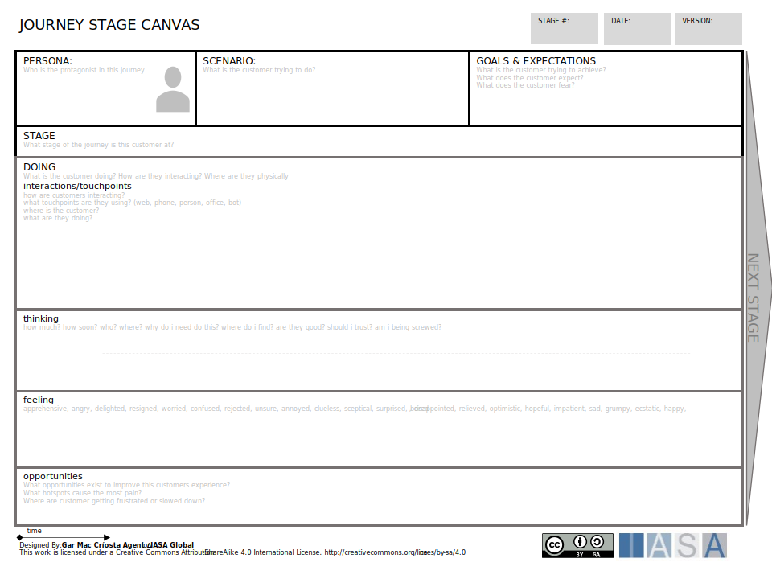
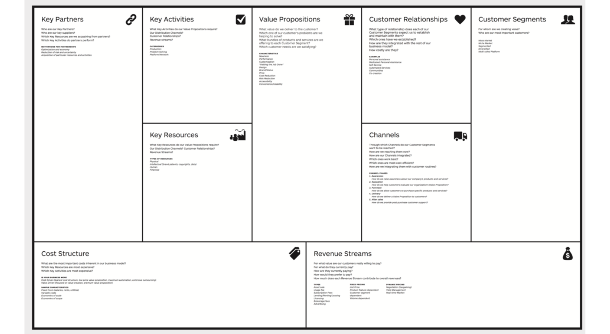
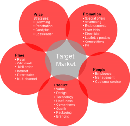
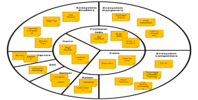
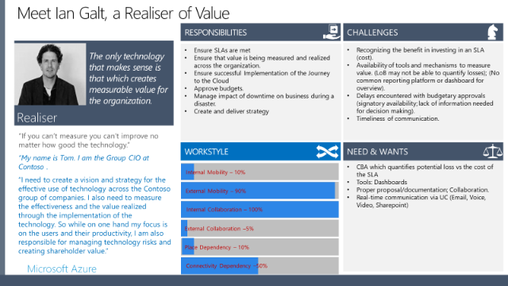
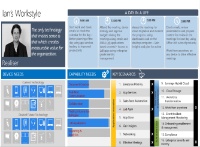
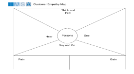
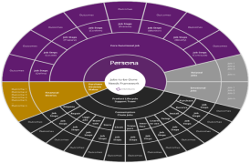
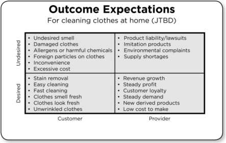
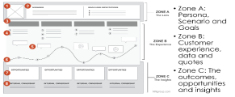

> “You’ve got to start with the customer experience and work back the technology, not the other way round.”

*Steve Jobs*

**INTRODUCTION**

Before the advent of industrialization, goods and services were local and consisted primarily of limited, handcrafted, customized and labour-intensive home-based production and consumption. Industrialization, with its large centralized machines powered first by water and subsequently electricity changed all that. Henry Ford made famous the concept of mass production, with his much-quoted quip “Any customer can have a car painted any colour that he wants so long as it is black” aided by technology and the assembly line paradigm. He was able to profoundly change not just the transportation landscape but industry and [culture](https://btabok.iasaglobal.org/btabok_3/digital-outcome-model/culture/) itself.

Today, the leaps in technology have once more changed the focus from mass production to customized production. You now have more shades of black and every other colour than ever existed in history. Industry is now focused on fulfilling the desires of the One. Allowing personal choice at almost every level to decide how products/services will be delivered and consumed.

Information technology has had a similar trajectory. When it first arrived on the scene its focus was to digitize key processes, be they accounting or inventory or logistics. These processes had been standardized over the decades and technology’s job was to make them faster, more efficient and less [risk](https://btabok.iasaglobal.org/btabok_3/risk-methods/) prone. But as technology matured, changed, became more ubiquitous and the differentiating driver for business, its function changed to empowering the Customer making him the center of the universe. The success of a technology has shifted from digitizing processes to focusing on the Customer and making it easy for him through what it enables him to do, the challenges and pains it addresses and resolves, and the goals and outcomes it helps him to achieve.

This Customer value centric focus requires the technologist to put the Customer at the heart of the development process. And for this he needs to understand the Customer at several levels; by listening to him with empathy, identifying not just his underserved needs but also the anxieties that motivate his behaviour, understand his feelings and attitudes as they impact the way he works, put a face to him making him human instead of seeing him as some abstract entity, know what value means to him (and no, it doesn’t always mean speed or efficiency), know where he is coming from and where he needs to go, while situating him within his business context. Putting the customer at the center also requires the technologist to take a step back from his technology focus and develop new *skills within the context of* [*business*](https://btabok.iasaglobal.org/btabok_3/digital-outcome-model/business-capabilities/)*,* [*design*](https://btabok.iasaglobal.org/btabok_3/operating-model/design/) *and human dynamics* and use those to drive technology and not the other way around. Fortunately, for us, these are not insurmountable odds and there are several tools and techniques that make the learning easier, aiding us in not just modelling the Customer’s Journey, from challenge and desire to successful outcome, but in providing us with a framework to think about the Customer.

**The Customer**

**But who is this Customer?**

The most obvious answer to this is, it is the organization and the sponsor that hires us to develop some solution that will address a problem. But at another level it is the user of the solution, the person we are developing for. And at yet another level it is everybody, normally referred to as a [stakeholder](https://btabok.iasaglobal.org/btabok_3/stakeholders/), who has some value to realize from the solution, even if they do not directly engage with it.

**Customer Journey Map**

The customer journey map helps identify the full interaction lifecycle of our customer (based on personas) to engaging with the organization.

**Journey Stage Card**

For each of the stages of a customer journey we can identify the details of the interaction and opportunities based on it using the journey stage card.

**Customer Persona Card**

Which bring us to the next question, how do we discover this Customer?

Business Model

Developing (or using if they already exist) both of two models are the first step in this discovery. The first is the *Business Model (BM)*. The Business Model is interesting because not only is it a concise one pager that gives us a high level and extremely pertinent view, but developing it also helps in situating the problem and solution in the larger context and not just within a narrower product/service related paradigm. In my opinion, developing this model is also a great way to up our game and get access to business and the real decision makers as well as to make sure we have a shared vision of where value is and what it means for the Customer. The BM describes important aspects; from the Customer Segment, distribution channels, revenue to be realized and the cost that will be incurred before that happens, to the key value proposition for the service/product.

The second is the 5P’s marketing model.

5 P’s  

The 5P’s is normally what the marketing folk use to understand and describe the ecosystem for the product/service to be developed. This model is more focused on the product/service and defines the attributes of the Product, the Pricing strategies, the channels or Places through which the product can be distributed, the Promotional strategies that would influence consumption of the product, and the People at whom the product is aimed as well as the kind of experience they would expect and their specific needs that need to be fulfilled.

Solution Ecosystem 

With the above two models as our foundation we can now delve deeper into the problem space to expand our knowledge of the Customer by modelling the overall ecosystem perspective. If we take the diagram here, we can see it is the way an organization like IASA would be described. In the centre we have what IASA needs to do for its Customer, the budding architect; work with him to grow his skills and get him certified. And the challenges the budding architect will face in his journey juxtaposed against the gains or value that he can/will enjoy. Around this core is an understanding of the resistance the budding architect will consider in terms of dampeners, pitted against what will induce him to work with IASA; the enablers. We also have the activities IASA will have to conduct to make its position stronger and more meaningful as well as the competitors it will have to contend with. To an extent this is like the high-level description of the system we used to do earlier during the requirements gathering phase. The difference is in the model we use. The key advantage of this to what would otherwise have been a document is now a pictorial representation making it easier to understand and communicate with. Having modelled the 90000-foot view of the problem/solution space we need to get closer to the Customer and understand and model his [*viewpoint*](https://btabok.iasaglobal.org/views-and-viewpoints/) and describe how we can enable him.

**Personas**

The notion definition of Personas has existed in depth psychology for some time now but within the IT domain they were created by Alan Cooper and popularized in his book ‘The Inmates Are Running the Asylum: Why High Tech Products Drive Us Crazy and How to Restore the Sanity’ (Sams Publishing, 1999). His contention was that we need technology to work the way people think and unfortunately the technologists were not doing that. This was because the technologist was not thinking of the user. To bring the user alive the first step he took was to put a face on him (the user)—a memorable, engaging, and actionable image that endeavoured to make him human and serve as a design target conveying information to the product team in ways that other artefacts could not.

The word Persona is derived from a Latin word which means Mask. This mask or the Persona we adopt enables us to behave differently. For example, our behaviour with our children is different from that with our parents or colleagues or friends etc. And it is not just behaviour but our language, our mannerisms, what we speak about or don’t, the skills and capacities we bring to bear, and so on so forth. In the work context, this mask is often interpreted to mean a role. While this does have a certain validity, it tends to be limiting when considered from the point of view of how a person within a role may function. A role is an organizational construct. It is something within which a person is constrained in what he does but not necessarily how he does it. It doesn’t specify the person’s working style. Even though it may influence it to some extent. While a role may change, and this change may impact some aspects of the Persona it will probably not impact the working style too much.

However, a Persona is also not a person. A Persona is a pattern and there will be many persons that fall into the pattern to make it worthwhile to consider. A Persona as a set of users is normally determined by the similarities of several factors; outcomes, activities, working style, etc., as the images below show. Developing for a Persona is akin to developing for a specific user set. As technologists our judgement call will be to ensure we have a balanced sense of the Persona, that it does not speak for too few or too many persons, as well as categorizes for the appropriate set of similarities we may be interested in delivering for. Developing while keeping the Persona in mind enables a level of customization both in terms of what we deliver as well how we deliver it. For example, we could have a release in which we develop functionality for a specific Persona or similar functionality for many Personas. The entire deployment cycle, right from communications to training to operational and support needs, would then be geared keeping those Persona(s) in mind.

On the left is an example of a Persona. Notice the photo of Ian. It puts a human face to the Persona that has been labelled as a Realiser of Value. Ian represents one instance of this Persona. This specific Persona, among several others, was culled out of the information gathered through interviews and questionnaires. Since the project was based on understanding information and collaboration needs the questions asked were framed to expose those.

The detailed model enables us to gain an accurate understanding of the Persona not just in terms of what he wants to do and therefore what we should focus our resources on developing for, the kind of experience he wants to have through his engagement with the technology and also how we can achieve non-functional attributes across common resources, for example based on when Persona(s) are most likely to access the system we could spin of multiple Virtual Machines (VM).

Most people use a combination of two approaches; interviews and/or questionnaires. The questionnaire has the advantage of reaching to a larger cross-section of people than we would encounter through interview/workshops. If this questionnaire is well framed it could help us understand almost all the aspects of the Persona. However, to get into the shoes of the Persona, an exercise in genuine empathy, interviews are a great tool. The intent of the interview should be to understand what drives the person, his behavioural patterns in terms of several factors, for example, quality, construction of worktime, what does work satisfaction mean to him, interaction preferences and so on. The empathy map on the left can help describe your sense of the Persona; what does he think about tasks, outcomes, his work; how does he feel as he goes about the lifecycle; where does he get information, who does he trust; how does he see the work environment and his sense of himself within it; how does he engage with others (say & do); the pain both emotional and physical as well the value or gains he sees as he performs his tasks. As a word of caution, the tool only aids expression. The ability to demonstrate genuine empathy is what is important. Watching popular TV interviewers is a great place to learn how to inculcate empathy. Another way is watching and observing the users as they go about their work and then writing up what you observed and how you felt through that observation. And still another is being in touch with your own emotional self as you go about using products/services.

**Other Models**

There are several other models that can help expose other aspects of the Persona and his work. For example, the model on the left links what the Persona does with the outcome expected. An outcome is essentially what the Customer wants to achieve or realize as an end goal. It would normally be something that drives his/the organization’s success metrics. An outcome is thought of from two angles; desired and not desired. The diagram here models not just a persona and his jobs but also the larger ecosystem he exists within in the form of the Support Team.

**Outcomes**

A good method to frame an outcome is by prefixing it with the word Maximize or Minimize or Desired and Undesired. Below are some examples from an IASA point of view:

Minimize the time to get certified

Maximize the application of learning

Minimize live instructor time

Maximize number of students per class

The chart on the left shows outcomes based on who desires/undesires them. Another important categorization for outcomes is overserved/underserved. Knowing this about an outcome enables the redirection of resources. The one caveat is that the underserved outcome also needs to be reasonably important in driving value. Outcomes themselves need to be tied to one or more measurable metric. This could be financial -top/bottom-line related to both increased revenue and reduced costs, quantitative – increase in customers, development focused – entering new markets or new products, and qualitative – environmental friendliness. The importance of a metric determines where resources will be allocated. Given the importance of IT as well as its contribution to capital expenditure IT projects normally have a business case that support it. This business case answers multiple questions; how much it will cost, what are the returns, when will the returns be realized, what is the cost benefit ratio, what is the breakeven point, what alternatives exist, and which is the most appropriate and why etc. The technologist is best suited to make this calculation. He would know exactly what inputs need to be considered as well as the risks inherent in the technology which need to be factored into the calculation. Different organizations use different [*methods to calculate value;*](https://btabok.iasaglobal.org/btabok_3/value-methods/) Return on Investment (ROI), Total Cost of Ownership (TCO), Cost Benefit Analysis (CBA), Net Present Value (NPV) etc.

**The Job**

Achieving an outcome is based on the actions that need to be undertaken. Defining the job or action is done along several parameters;

define – what is the job and its current status in terms of quality, cost, periodicity etc.; locate – the resources required to do the job; prepare – setting up the ambient environment to make it possible to do the job; confirm – that a job can be done, execute – carry out the job; monitor – that the job is being appropriately carried out; modify – the job to improve execution, and finally conclude – bring it to a logical end. Knowing how to improve a job requires a good understanding of how a job is currently done. Sometimes it may be useful to do the job, to get a first-hand sense of what it entails.

This end to end user experience, considering all the different aspects we have mentioned above, defines the Customer’s Journey in a wholistic rather than a transactional manner. More importantly it puts the Customer at the centre and recognizes him as the creator of value.

**Scenarios**

The final step is to consider all the information we have captured and described through the models so far and detail it through a Persona/Scenario perspective. At one level this describes the Customer’s Journey and at another level it marks the culmination, in design, of it. The basic idea is to take a scenario and explode it through the steps the scenario would flow.

This is like a usecase but more pictorial and summarized and shows the current flow or stages of work to accomplish the scenario. While the Goals state what the future is about this model captures the lived experience highlighted by appropriate quotes and data as well as identifies the opportunities for improvement. The entire development effort and subsequent downstream work can be driven by the scenario selected. And this can be directly tied the value it creates. The product/service itself can be modelled as a series of Persona driven scenarios.

**Conclusion**

The Customer’s Journey is based on keeping the Customer or the Persona at the centre. It is derived from his point of view but situating him within the organizational context. It depicts the end to end lifecycle; from desire/need, to challenge/constraints, to ways and styles of working, to outcomes that need to be achieved. When the technologist engages with the Customer he needs to understand not just the outcome but what does “each” user need to achieve it and how can technology enable him. This enablement is what many refer to as the *Digitalization* process. The new holy grail for both technologists and organizations, today.
