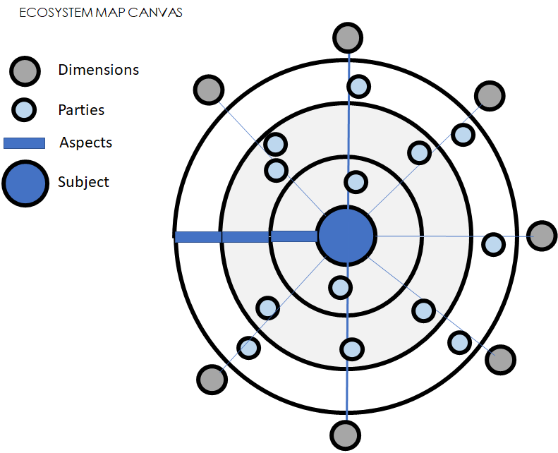

<article class="example gallery-cols-3">
    <figure>
        
        <figcaption>Image 1</figcaption>
    </figure>
    <figure>
        <a href="http://example.com/image2_big.jpg">
        <figcaption>Image 2</figcaption></a>
    </figure>
    <figure>
        
    </figure>
</article>