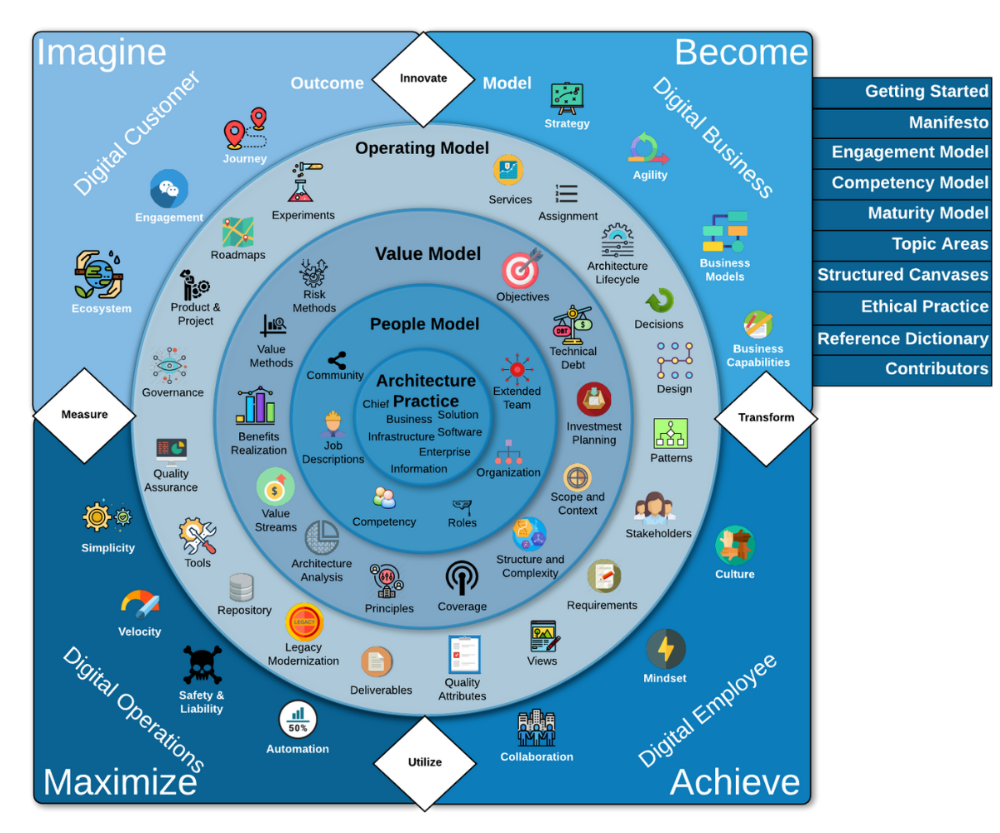

<body>

The Business Technology Architecture Body of Knowledge (BTABoK) is a free public archive of Business Technology architecture best practices, skills, and knowledge developed from the experience of individual and corporate members of Iasa, the world’s largest architecture professional organization.
You can find the btabok github pages site at: <a href="https://iasa-global.github.io/btabok/">BTABoK</a>
BTABoK provides the tools and resources needed by individuals and organizations to set industry standards for professional career development and well as hiring practices and incorporation of IT architects into established or developing institutions. 

<map name="rage_image_map">
    <area shape="rect" href="https://iasa-global.github.io/btabok/ecosystem.html" coords="45,199,95,261" alt="" target="_blank">
	<area shape="rect" href="https://iasa-global.github.io/btabok/engagement.html" coords="101,134,155,180" alt="" target="_blank">
	<area shape="rect" href="https://iasa-global.github.io/btabok/journey.html" coords="175,78,222,127" alt="" target="_blank">
	<area shape="rect" href="https://iasa-global.github.io/btabok/innovate.html" coords="322,30,381,78" alt="" target="_blank">
    <area shape="rect" href="https://iasa-global.github.io/btabok/strategy.html" coords="464,59,496,97" alt="" target="_blank">
	<area shape="rect" href="https://iasa-global.github.io/btabok/agility.html" coords="528,101,569,148" alt="" target="_blank">
	<area shape="rect" href="https://iasa-global.github.io/btabok/business_models.html" coords="597,176,639,229" alt="" target="_blank">
	<area shape="rect" href="https://iasa-global.github.io/btabok/business_capabilities.html" coords="622,261,674,304" alt="" target="_blank">
	<area shape="rect" href="https://iasa-global.github.io/btabok/transform.html" coords="619,334,684,370" alt="" target="_blank">
    <area shape="rect" href="https://iasa-global.github.io/btabok/culture.html" coords="605,440,648,497" alt="" target="_blank">
	<area shape="rect" href="https://iasa-global.github.io/btabok/mindset.html" coords="546,537,577,583" alt="" target="_blank">
	<area shape="rect" href="https://iasa-global.github.io/btabok/collaboration.html" coords="428,612,475,654" alt="" target="_blank">
	<area shape="rect" href="https://iasa-global.github.io/btabok/utilize.html" coords="326,631,379,678" alt="" target="_blank">
	<area shape="rect" href="https://iasa-global.github.io/btabok/automation.html" coords="224,601,267,646" alt="" target="_blank">
	<area shape="rect" href="https://iasa-global.github.io/btabok/safety_liability.html" coords="142,550,171,611" alt="" target="_blank">
	<area shape="rect" href="https://iasa-global.github.io/btabok/velocity.html" coords="87,501,122,546" alt="" target="_blank">
	<area shape="rect" href="https://iasa-global.github.io/btabok/simplicity.html" coords="57,426,96,467" alt="" target="_blank">
	<area shape="rect" href="https://iasa-global.github.io/btabok/measures.html" coords="23,334,81,368" alt="" target="_blank">
    <area shape="rect" href="https://iasa-global.github.io/btabok/services.html" coords="414,126,441,164" alt="" target="_blank">
	<area shape="rect" href="https://iasa-global.github.io/btabok/assignment.html" coords="460,150,502,175" alt="" target="_blank">
	<area shape="rect" href="https://iasa-global.github.io/btabok/architecture_lifecycle.html" coords="506,183,535,230" alt="" target="_blank">
	<area shape="rect" href="https://iasa-global.github.io/btabok/decisions.html" coords="546,240,572,273" alt="" target="_blank">
	<area shape="rect" href="https://iasa-global.github.io/btabok/design.html" coords="556,292,586,331" alt="" target="_blank">
	<area shape="rect" href="https://iasa-global.github.io/btabok/architecture_pattern_repository.html" coords="552,351,582,391" alt="" target="_blank">
	<area shape="rect" href="https://iasa-global.github.io/btabok/stakeholders.html" coords="537,420,575,454" alt="" target="_blank">
	<area shape="rect" href="https://iasa-global.github.io/btabok/requirements.html" coords="490,480,527,519" alt="" target="_blank">
	<area shape="rect" href="https://iasa-global.github.io/btabok/views.html" coords="442,525,469,567" alt="" target="_blank">
	<area shape="rect" href="https://iasa-global.github.io/btabok/quality_attributes.html" coords="372,546,404,596" alt="" target="_blank">
	<area shape="rect" href="https://iasa-global.github.io/btabok/deliverables.html" coords="298,556,330,592" alt="" target="_blank">
	<area shape="rect" href="https://iasa-global.github.io/btabok/legacy_modernization.html" coords="234,522,260,565" alt="" target="_blank">
	<area shape="rect" href="https://iasa-global.github.io/btabok/repository.html" coords="181,490,206,521" alt="" target="_blank">
	<area shape="rect" href="https://iasa-global.github.io/btabok/architecture_tools.html" coords="139,437,169,479" alt="" target="_blank">
	<area shape="rect" href="https://iasa-global.github.io/btabok/quality_assurance.html" coords="112,368,148,413" alt="" target="_blank">
	<area shape="rect" href="https://iasa-global.github.io/btabok/governance.html" coords="115,294,149,330" alt="" target="_blank">
	<area shape="rect" href="https://iasa-global.github.io/btabok/product_project.html" coords="138,228,166,265" alt="" target="_blank">
	<area shape="rect" href="https://iasa-global.github.io/btabok/roadmap.html" coords="178,178,204,213" alt="" target="_blank">
	<area shape="rect" href="https://iasa-global.github.io/btabok/experiments.html" coords="234,134,263,176" alt="" target="_blank">
    <area shape="rect" href="https://iasa-global.github.io/btabok/objectives.html" coords="422,210,454,245" alt="" target="_blank">
	<area shape="rect" href="https://iasa-global.github.io/btabok/technical_debt.html" coords="467,258,498,298" alt="" target="_blank">
	<area shape="rect" href="https://iasa-global.github.io/btabok/investment_planning.html" coords="484,324,520,372" alt="" target="_blank">
	<area shape="rect" href="https://iasa-global.github.io/btabok/scope_context.html" coords="471,396,500,436" alt="" target="_blank">
	<area shape="rect" href="https://iasa-global.github.io/btabok/structural_complexity.html" coords="431,447,461,487" alt="" target="_blank">
	<area shape="rect" href="https://iasa-global.github.io/btabok/coverage.html" coords="372,482,396,518" alt="" target="_blank">
	<area shape="rect" href="https://iasa-global.github.io/btabok/principles.html" coords="305,479,332,519" alt="" target="_blank">
	<area shape="rect" href="https://iasa-global.github.io/btabok/analysis.html" coords="250,449,275,494" alt="" target="_blank">
	<area shape="rect" href="https://iasa-global.github.io/btabok/value_streams.html" coords="209,394,234,448" alt="" target="_blank">
	<area shape="rect" href="https://iasa-global.github.io/btabok/benefits_realization.html" coords="191,329,223,383" alt="" target="_blank">
	<area shape="rect" href="https://iasa-global.github.io/btabok/value_methods.html" coords="207,266,234,308" alt="" target="_blank">
	<area shape="rect" href="https://iasa-global.github.io/btabok/risk_methods.html" coords="243,219,268,257" alt="" target="_blank">
    <area shape="rect" href="https://iasa-global.github.io/btabok/extended_team.html" coords="416,300,447,340" alt="" target="_blank">
	<area shape="rect" href="https://iasa-global.github.io/btabok/organization.html" coords="411,371,445,406" alt="" target="_blank">
	<area shape="rect" href="https://iasa-global.github.io/btabok/roles.html" coords="373,421,399,452" alt="" target="_blank">
	<area shape="rect" href="https://iasa-global.github.io/btabok/competency.html" coords="299,412,329,446" alt="" target="_blank">
	<area shape="rect" href="https://iasa-global.github.io/btabok/job_description.html" coords="254,348,287,391" alt="" target="_blank">
	<area shape="rect" href="https://iasa-global.github.io/btabok/community.html" coords="259,293,291,318" alt="" target="_blank">
	<area shape="rect" href="https://iasa-global.github.io/btabok/architecture_practice.html" coords="327,323,380,374" alt="" target="_blank">

</map>

The Business Technology Architecture Body of Knowledge (BTABoK) is a free public archive of Business Technology architecture best practices, skills, and knowledge developed from the experience of individual and corporate members of Iasa, the world’s largest architecture professional organization.
You can find the btabok github pages site at: <a href="https://iasa-global.github.io/btabok/">BTABoK</a>
BTABoK provides the tools and resources needed by individuals and organizations to set industry standards for professional career development and well as hiring practices and incorporation of IT architects into established or developing institutions.

<h2>Who is the BTABoK for?</h2>

The BTABoK was designed ground up to be a practical resource for any type of architect in any type of organization. It includes as much business as technical thinking as well as up to date tools in both of these spaces. It has a very strong approach to stakeholder management as well as an easy to use competency model which can be modified for your organization.

<h2>What is in this Site?</h2>

The BTABoK is a tool. It works for all architects whether you consider yourself a business focused architect or a technical one. It is also the only truly open body of knowledge in existence. In the following video Paul Preiss describes the value and the use of the BTABoK (he uses it's previous title, ITABoK but they are the same thing).

https://user-images.githubusercontent.com/41272798/187097260-027cc44a-86e8-4d17-bc25-b22ef527de22.mp4

**Defining the IT Architect Profession** – What is a BT architect? We provide industry reference models for architects skills and competencies backed by international certifications.

**Utilization & Engagement of IT Architects** – How are IT architects utilized within organizations and what are the interaction models between them and their clients or employers?

**Career Pathway** – Describes the standard career path of an architect including specializations and career achievement milestones.

<h2>Overview</h2>

The Business Technology Architecture Body of Knowledge (BTABoK) has been developed from the experience and practice of individual and corporate members.

In addition to being a reference, a knowledge base and a list of professional capabilities, the BTABoK is meant to be essential in implementing an architecture practice within an organization, without significant changes to other standards, roles, practices and lifecycles. An architecture practice provides high levels of value in both business and technical strategy, and that value can be measured as a contribution to the organization. Architecture is appropriate and essential for extremely small businesses, as well as, the largest businesses in the world, including non-profit, government, and defense.

The BTABoK is first and foremost intended for individual practicing architects, though it does include significant portions dedicated to organizational excellence. It is meant as a people framework as opposed to a process, methodology or standard. It is meant to be the living body of knowledge for the practice of an architect attempting to fulfill their duty to their customer or employer. While Iasa includes corporate examples and concerns, the BTABoK must be useful by the independent practitioner and must assume that a single architect is as important as a group of architects. In addition, the BTABoK must be consistent and useful at any degree of scale, regardless of the number of architects involved in the endeavor, whether that be the delivery of a global fortune 100 business strategy or the delivery of a single solution for a small business.

The BTABoK is inclusive of all specializations, sub-specializations and career levels of the architect profession. Although the title includes the terms information technology, the content has been written by keeping business, enterprise, solutions, software, information and infrastructure architects and their derivations in mind. Practitioners from each of these specializations continue to help in the development and maintenance of the body of knowledge.

<h2>What is Architecture</h2>

As the favorite topic of architects everywhere, what is architecture and what are architects is central to the theme of the BTABoK. Read the [What is Architecture Article](../btabok/what_is_architecture.md).

<h2>Roadmap</h2>

The plan is to have version 3.0 as the main branch by the end of the summer. From hear we will create a new branch for 4.0 which we expect to freeze next summer. The goals of 4.0 are to

- rework and modernize the competency model
- develop a further connection with engineering and other architect partners
- create a complete set of deliverables using the BTABoK
- complete the patterns library and other libraries of the BTABoK

<h2>Committers and Editors</h2>

The BTABoK is the only truly open source and maintained body of knowledge for architects. As an open source BoK anyone can do a pull request after fixing or suggesting changes to the BoKor adding material. The committers on the project are a group of board certified architects who have worked very hard to create the body of knowledge. They will determine what pull requests get included into the bok. To become a committer you will have to have a large number of successful pull requests and have a discussion with the committer team.

<h2>BTABoK Editing Guidelines</h2>

The BTABoK is designed with a theme, linking and embedding primarily targeted at the BTABoK GitPages site. However, it also serves in many other functions. Thus it is important to follow the guidelines in editing the body of knowledge. Any pull requests that do not will be rejected.

The major elements of the guidelines include

- How to write BTABoK Articles – Writing Guidelines (separate link)
- Markdown Editors – The committers primarily use MarkText or Word with an addon called Writage <a href="https://www.writage.com/"> https://www.writage.com/.</a> However as long as it is valid markdown using simple formatting it is up to the author what to use.
- Images – standard images should be stored in the media folder in png format. The images must be licensed for free use or created by the author of the article and express permissions put in the GitHub ‘add’ comments. This frees us from concern over image licensing issues.
- Canvases – canvases and cards should be stored in two primary formats – ppt and SVG. This makes the editing of canvases relatively easy for anyone in the world as well as making them usable to architects doing presentations. These should be stored in media/canvases for the SVG files and media/files for the ppt files (the SVG files are considered the master copy).
- Linking – linking should always be relative within the BTABoK as the files are published to gitpages. However, the goal is to convert these to published files on the official WordPress pages as well. This will be covered in a separate section.

<h2>Additional Help Needed</h2>

We are always looking for new committers, as well as those wanting to use the BTABoK in their day in and day out work. If you find an issue please submit it and/or fix it and do a pull request. 

</body>