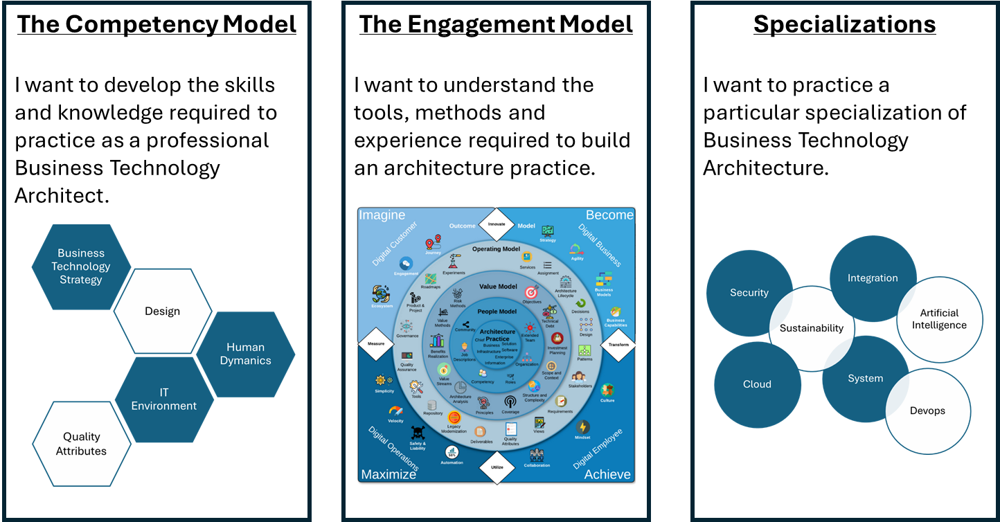

# Welcome to the world of Business Technology Architecture

The Business Technology Body of Knowledge or BTABoK provides professional Business Technology Architects with a source for career and skills development and the fundamentals for building a successful architecture practice. 

The BTABoK has been developed from the experience of practicing architects and provides essential knowledge for implementing an architecture practice within an organization, limiting impact on existing standards, roles, practices and lifecycles. The BTABoK is very scalable and can be applied in small business as well as large international corporate organisations, and across many industry sectors.   

The value of the BTABoK is first and foremost intended for individual practicing architects, though it does include significant portions dedicated to organizational excellence. It is a people-centric body of knowledge as opposed to a process, methodology or standard. A living body of knowledge which accompanies the practicing architect throughout their career facilitating the delivery of professional architecture services to customers or employers.

## How to read the BTABoK

The BTABoK has three main sections which provide the foundations for a successful career as a BT-Architect.

These sections provide the main content of the BTABoK and are accessed by clicking on the above items, or via the sidebar menu. Other sections regarding topics such as ethics, accreditation and contribution can be accessed from the sidebar menu.

