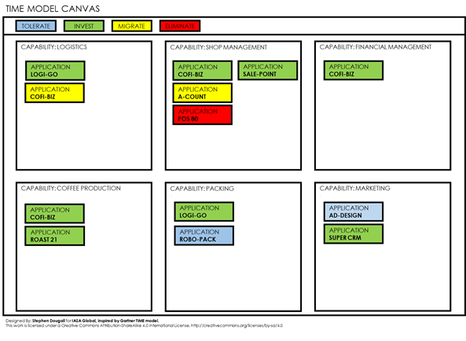

# Legacy Systems Transformation:

# Identification and Strategy

As an architect in an enterprise, it is a challenge to keep the system landscape sustainable and maintainable. A significant part of ensuring sustainability is the management of legacy systems, but how do we know which systems are legacy and when is the right time to start a transformation?

In order to identify a legacy system we have to ask ourselves, "What is a legacy system?". The BTABoK provides the answer to this question in the Legacy Modernization article, but perhaps some of the  key factors are when 

- **The costs for maintenance outweighs the benefits to the business**
  The technology, skills and resources which support the system may be expensive and difficult to find. Interoperability with modern technology may be poor leading to increased effort in development.

- **The cost of business workarounds and administration outweigh the benefits**
  The system is too difficult to change so workarounds are found in the business process. This leads to extra administration and a general slowdown in the ability of the business to react to customer needs.

- **The system itself is a risk to business**
  The system poses a risk to business due to deficiencies in areas such as security, reliability or redundancy. System failures due to such deficiencies can result in significant loss of income and business reputation.

So how do we identify our legacy systems? This can often take the form of an assessment to gather information about the system landscape. Within such an assessment metrics can be used to measure and compare systems. The following are some examples of such metrics:

- OPEX (Operational Expenditure)

- User satisfaction

- Supportability

- Business criticality

An organisation is likely to define its own metrics, based on what is important for the organisation's business. For example, some businesses may have security as a key factor, others may have user accessibility. So an important part of identifying legacy systems is understanding the things that are important to your business.

The result of the assessment provides the basis on which to identify which systems the organization determines as legacy, and enables the organisation to start planning a strategy to deal with these systems.

Transforming legacy systems is no easy task. There can be many dependencies between systems and even many legacy systems. It is often not feasible to do everything at once, so a longer-term strategy is needed.

One tool which can help to build a strategy is the TIME model from Gartner, which is described in the Legacy Modernization article. 

This model provides a way for stakeholders to identify which systems support the business's capabilities and decide which systems we want to retain and which systems we want to retire. The systems can then be categorised into Tolerate, Invest, Migrate or Eliminate. This allows us to make decisions on which systems we want to retain and which systems we actively want to transform or remove. Legacy systems often fall into the Migrate or Eliminate category. Systems which are categorized as Tolerate may also be an indication of a system which is on the road to legacy.

Once you have identified your legacy systems and the strategy for the system landscape, we can start to look at planning specific systems.  
