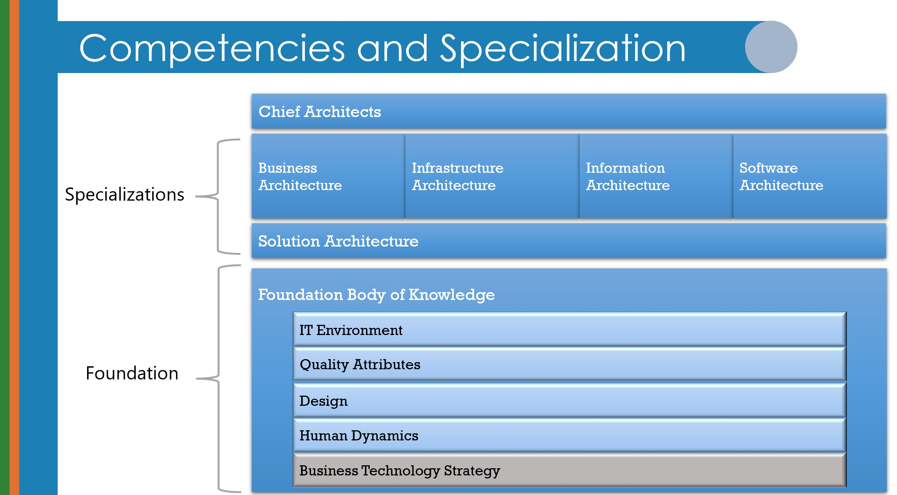
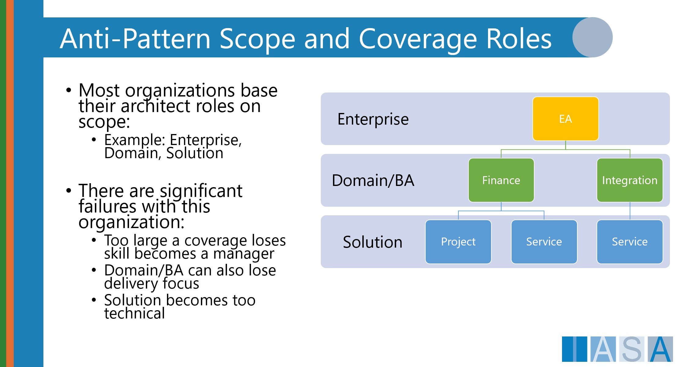
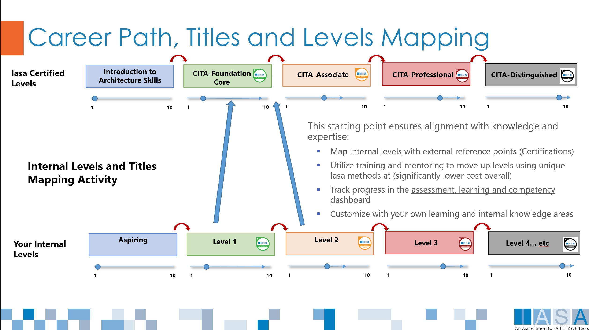
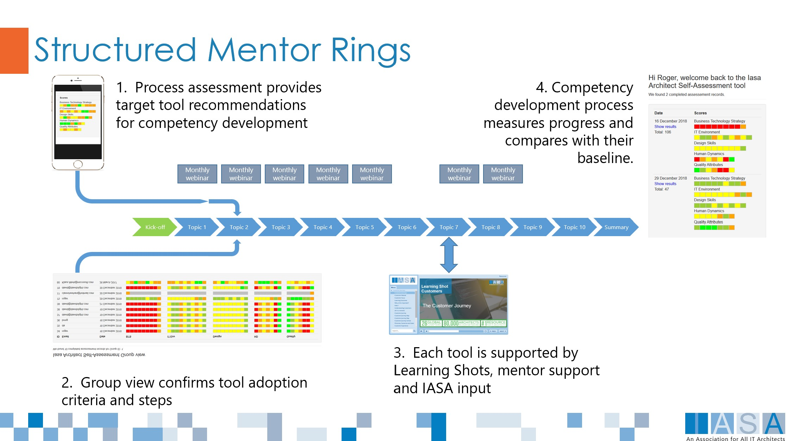

# Adopting the BTABoK Competency Model

The BTABoK competency model was established to guide and manage architects in their careers and serve as a shared competency management tool for organizations that employ architects. The competency model is based on years of research from practicing architects and creates a stable base for employing, educating, and working with architects of all types.

To move to the BTABoK Competency Model, an organization will need to take care to think through all of the career implications internally and externally for employees, HR, hiring, and career path planning. In addition, it is essential to take into account external certifications and training and how they link to the career growth of the employee and the organization. This guide will help an organization accomplish the primary planning activities and provide useful guidelines in the adoption process.

This document will focus on the adoption of the BTABoK Competency Model. There are other elements of using the BTABoK for employees and for the practices, such as Architect Mentoring, the Structured Canvas Approach, and Stakeholder Driven Architecture. These are addressed in other documents on this site.

## Architecture Practice Size

One of the most impactful elements of an architecture practice is its size. The size impacts almost all elements of the practice, competencies, and capabilities. For the purpose of the BTABoK, a small architecture practice is one with fewer than 25 architects, a medium practice is between 25-100 architects, and a large practice is one with 100+ architects. This distinction is not perfect, but it helps to organize policies and procedures.

# The Competency Model

The BTABoK Competency Model describes the critical competencies of all architects. It is based on similar efforts in medicine, building architecture, and other professions. The BTABoK is unique in the industry as it creates an obvious value proposition for architects, builds specializations on top of a shared body of knowledge and set of competencies, and is entirely independent of particular implementations, techniques, and frameworks. In addition, the BTABoK Competency Model is adaptable to special areas of knowledge specific to a particular architecture specialization, technique, or even technologies and architecture style.

The competency model is broken out into the following concepts.

- Every competency can be displayed on five levels, from awareness to mastery. This is taken from Bloom's Taxonomy and mapped to Iasa Certifications.
- Every competency includes multiple skills (individually measurable learning/demonstration areas)
- Competencies can relate to a knowledge/practice Concept from the BTABoK (or elsewhere). The relationship between the two is that one is a practical tool for an entire practice, and one is a measurable competency for a person.
- Moving from one level of mastery to another requires knowledge and experience in all but the case of awareness.

## The Principles

The career path is based on the following principles:

1. All specializations should share a set of competencies that differentiate the profession.
2. All architects should acquire and retain a percentage of these competencies.
3. No architect can achieve perfectly even scores across all competencies.
4. The competencies are grouped into competency groups that are similar in nature.
5. Technology, architecture styles, architecture tools, and platforms are not competencies.
6. There is a level of scope at which an architect cannot retain their proactive activities but instead become management.

The principles should guide decisions related to titles, competencies, and career paths and may be rolled out over time.

## The 5 Pillars

The five pillars (competency groups) are:

1. Business Technology Strategy - this pillar forms the baseline of the profession of business technology architecture. BTS is the application of business and technical competencies to create outcomes for architect clients.
2. Design - this pillar includes all of the competencies necessary to understand a problem or requirement space and design an effective solution to meet it.
3. Human Dynamics - this pillar includes the people skills necessary to achieve change through groups of human stakeholders, users, clients, and customers/beneficiaries.
4. Quality Attributes - this pillar includes knowledge of the cross-cutting systemic qualities and properties which emerge from complex systems.
5. IT Environment - this pillar includes the competencies related to creating, developing, managing, testing, and running technology systems.

Combining the five pillars makes an architect. Specialization is built on top.

## Specializations

Using specializations is hard in architecture practices. The idea of specialization is that it is large enough to be constant throughout the profession, has competencies based on the five pillars, and does not significantly overlap with another specialization. There are dozens and maybe hundreds of job titles in the marketplace, which makes the task even harder. The BTABoK currently recognizes five specialization areas for architects. The acronym for these is BIISS.

- Business - the specialization most focused on creating business outcomes, working with business strategy, and providing the cornerstone of business technology strategy. Note: the primary difference between BTABoK Business Architects and other definitions is that the BTABoK business architects maintain a degree of technical excellence (from the five pillars) throughout their careers. This allows business architects to interact and be seen as part of the other architect specializations, which may be more technically focused.
- Information - the specialization that deals with information as a strategy. This specialization focuses on information usage, transformation, transmission, storage, and retrieval. It is often associated with usability, integration, and/or data.
- Infrastructure - this specialization deals most often with the operations and running of platforms that support the IT environment. It involves the overlap between operations, data center (or cloud), compute, storage, and network, a generalization of the previous specializations with a focus on delivering as well as future-facing roles in IoT, product, and edge-compute.
- Software - this specialization deals primarily with the development and engineering of complex software systems and the outcomes of those systems.
- Solution - this 'specialization' is actually a generalization of the previous specializations with a focus on the delivery of value within a product/project or another change initiative. It most commonly is related to the delivery of larger, more complex solutions.

To map specializations, it is necessary to decide on titles and roles. It is not necessary to support all specializations directly, and it is likely that some roles will be called by other names; however the more rigorous about specialization and what it means the easier and less confusing the titles will be.

# Goals of the Change

As with all architecture activities, it is important to establish the objectives of the change. The BTABoK was founded with the notion of developing a World-Class Architecture Practice and these objectives roll up into it. There are any number of potential benefits to using an external professional career path for architects and they should be measured along with the change.

1. Stabilize Hiring and Employment
2. Standardize Skill Measurement
3. Decrease the Cost of Hiring
4. Increase Employee Retention and Job Satisfaction
5. Make Career Growth Repeatable

# Delivering the Plan

The competency model itself is relatively straightforward. However, adoption should be a part of a plan including stakeholders, level of adoption and approach.

1. Map existing job description/role to competencies.
2. Decide specializations if supporting.
3. Match internal HR Levels to Competencies and Career Levels.
4. Decide on Measurement methods to use and measure existing architects/extended team.
5. Setting Up Job Descriptions
6. Describe the Career Path and how to move between levels.
7. Describe how hiring will use the model for evaluating.

## Mapping Job Descriptions

Extract the competencies in the current job description/role requirement. Competencies do not include specific technologies. For example: Be able to program C\# at a senior level is not a competency. Engineering and Coding Software is a competency. Take the current measures for job performance and map them against the BTABoK 5 pillars. Take notes on the current levels and how those are covered in the competencies. Attempt to match missing competencies or save them to use within specialization. Review the competency skills to see if left over competencies are already mapped to an a BTABoK competency.

### Note: Enterprise, Domain, and Product Architects

The BTABoK does not recognize these as specializations as they either refer to Scope (see BTABoK definitions) or a particular knowledge area or technology (such as Cloud or Azure). Scopes make bad titles and specializations because no unique competency can be found within the specialization. However, it is possible to use Domain or Enterprise as an extension of seniority to solution architects though it appears to create some negative outcomes in many organizations (see architecture practice article).

To understand how to deal with Scope (link) and domain (which is a scope in BTABoK) as a title it is important to understand the relationship between scope and seniority. For example, in medicine, while a chief of medicine oversees and mentors less senior (with lower levels of competency) doctors, they still very much see patients. It is important when using scope as a distinguishing factor in titles that the higher levels of scope do not result in loss of competencies and loss of active architecture experience. The hierarchical relationship between enterprise architects and solution architects is seen as an anti-pattern. Instead, the BTABoK recommends the use of chief architect or principal architect titles to represent seniority, and scope is applied to specialization or domain area. Principe Software Architect for 'Domain Area' for example.

## Decide Specializations

 Specializations pose a particular problem in architecture practices as many practices are much smaller, by title, than the amount of architecture related work that is being done. In addition, since most organizations have different meanings to their job titles, specializations are often mis-aligned with skills. For example, many organizations use the title solution architect. However this may be prefaced or followed by any number of random other title elements and may in fact refer to a specialization itself. This brings one of the primary benefits of the BTABoK competency model, but it also means that the organization must be careful to select titles carefully. 

The size of the practice impacts specializations in two primary ways, a) in assignment of architects to work, b) the use of more generic titles or scope based titles instead of specialization. For example many organizations use generic scope based roles, as above, to move architects 'up'. However, this confuses their specialization. In addition, an organization, in an attempt to simplify the problem, may simply call all architects solution architects or use one of the scope based titles like domain or enterprise architects. 

To effectively manage specializations, the practice must decide whether they will be used in titles or they will be managed by assignment (see assignment) or in other ways. The use of specialization in titles normally only emerges in larger practices. And there is no current normalization of how that occurs, resulting in the numerous architect titles in the market. For example, some organizations call software architects, application architects, or even solution architects. Others may use a specific knowledge area such as networking architect, which is a specific knowledge area of infrastructure architecture. The BTABoK recommends that in smaller practices, the generic title of solution architect be used and that in larger practices specialization titles be used. 

## Match HR Levels

HR Levels are those internal markers for achieving new pay grades, seniority, or other benefits. In the BTABoK, these should not be achieved simply through promotion for architects but at least at critical levels be based on outside measurements (certifications) and internal mentoring. However, this is often a difficult task in modern companies.

Most organizations use a numerical model for employee level. This method is common across industries to handle compensation, benefits, and other aspects of roles and jobs. The architect's career path most resembles that of other professionals and should include an understanding of how the internal levels map to the external levels.

It is possible to have multiple HR Levels mapped to a single external certification level. For example, the CITA-Professional level may be augmented with a Principle Architect level inside the company. This mapping should be relatively easy to accomplish.

## Measuring Architects

Measuring architects involves two aspects, one is measuring the baseline of an architect's competencies, and two involves showing growth in those competencies over time. The goal of these measurements is to get as reasonable an estimate as possible of the exact level of the architect's knowledge, experience, and abilities within that competency possible (genuine exactness in this is not possible).

There are four ways to measure competency:

1. Self-assessment: the professional measures their own competencies against the competency model.
2. Peer assessment: the professional is measured by what others have seen them do from the outside (t)
3. Direct mentoring: a mentor to the professional provides direct feedback on the level that a professional has learned or demonstrated to them.
4. Certification: the professional is measured against an internal or external certification process based on the competency model.

These measurements are used to provide feedback to the organization on the professional level. When Iasa describes '360 degree measures, it is assumed that all four types will be used. It is possible to get started successfully, though a little confusing to the professionals, with the simpler peer and self-assessments.

## Setting Up Job Descriptions

The BTABoK provides detailed job descriptions in line with the current competency model. Organizations may use these, use their own, or change them in whatever way suits them best. While changing the job description is relatively easy, it is essential to keep in connection with the basic competency model and specialization, or there is the risk of disconnecting the job from the ability to move forward in the architecture profession. For example, many organizations will dual-title software architects as technical leads or senior software engineers, which can dilute or even remove the business technology strategy, human dynamics, and even design skills from the job, limiting the effectiveness of the competency model for architects. 

There are three primary components in managing the job description and its relationship to the competencies a) the title, b) the responsibilities of the architect, and c) the preferred education and experience. The responsibilities should be mapped to specific groups of competencies. For example, "Participate and recommend prioritization through the project implementation process" will use many elements of design, BTS, and IT environment competencies. 

## Managing a Career Path

Most organizations use a numerical model for employee level. This method is standard across industries to handle compensation, benefits, and other aspects of roles and jobs. The architect's career path most resembles that of other professionals and should include understanding how the internal levels map to the external levels. 

### Managers Versus Mentors

There is a significant difference between managing an architect and seeing a demonstration of their competencies at different career levels. The demonstration of competencies cannot be measured by non-professionals easily. Thus, other professions have a manager role and a mentor or advisor role in managing professionals. The manager is responsible for the day-to-day activities and assignments of the professional, while the mentor is responsible for identifying competencies, reviewing progress, and signing off on career milestones. Thus, the professional is able to work effectively for the organization through its management function, but career progression requires signed of demonstration of excellence. 

The Iasa Mentoring Method was designed based on similar programs used by the [American Institute of Architects ]([Making_Mentoring_Work.pdf (catalyst.org)](https://www.catalyst.org/wp-content/uploads/2019/01/Making_Mentoring_Work.pdf)). The program directly separates the concept of management from mentor(s). This allows the greatest flexibility in how architects are deployed throughout the organization while also optimizing their career advancement to the benefit of the client and employer. The basic structure of mentoring follows a few major rules:

1. Architects cannot progress without reviewed outputs from one or more qualified mentors (qualification may be based on career level or certification levels).

2. Managers are responsible for the day-to-day assignments and tasks but are required to ensure opportunity for broad skill development is in place for all architects. 

3. Mentors/mentees meet regularly (frequency determined by internal architecture practice standards). 

4. Mentors are available to support the delivery of tasks that extend beyond the architects current skill level, or mentees are given time to work on these tasks with a mentor. 

5. The promotion of architects beyond critical milestones must include mentor support for the promotion and must be documented by the mentor as to their experience with the mentee. Both mentee and mentor are held  accountable for this growth. 

## Growing Competencies

The ultimate goal of the competency model is helping to ensure that individual architects are prepared to do the job at the correct level and are able to grow their competencies. However as each of the pillars has numerous competencies and architects often grow different competencies at different rates, the BTABoK uses a total average for the pillar to determine the individuals overall professional level. 

**THE FOLLOWING NUMBERS ARE FOR DEMONSTRATION ONLY. A FULL VERSION WILL BE AVAILABLE SOON**

We match the total estimate of each pillar to the number of competencies it contains. BTS (business technology strategy) contains 10 competencies. We estimate that the architect needs to be a level 3 (professional) at around 2/3 or more of them. It is unheard of for an architect to be an equal level at every competency in a pillar. So a professional level architect would need an overall recommended skill level at BTS of 21+. While at first this seems complicated it is actually very easy to manage through online personal and peer assessments. In addition the mentoring program actually documents the particular skill growth areas and their demonstrations so each step can be backed up by real world work. 

| Capability                                    | Foundation | Associate | Professional | Distinguished |
| --------------------------------------------- | ---------- | --------- | ------------ | ------------- |
| Business Technology Strategy                  | 7+         | 14+       | 21+          | 28+           |
| IT Environment                                |            |           |              |               |
| Design Skills                                 |            |           |              |               |
| Human Dynamics                                |            |           |              |               |
| Quality Attributes                            |            |           |              |               |
| Specialization Skills (Choose  1 Category) |            |           |              |               |
| Software Architecture                         |            |           |              |               |
| Infrastructure Architecture                   |            |           |              |               |
| Business Architecture                         |            |           |              |               |
| Information Architecture                      |            |           |              |               |

## Managing a Hiring Program

To effectively hire architects using this competency model is significantly easier and more cost-effective than current methods. The individual may show external validation from mentors/managers as to their competency evaluation using any number of [tools ](https://assessments.iasaglobal.org) and showing that the individual performed those task to the external level indicated on their assessment through mentor assessments using the Iasa mentoring method. 

Using the external reference points of a structured competency model with supporting certifications, training and degrees is a part of the maintenance that the BTABoK provides to hiring managers. For example, the CITA-P board certification, is an extremely rigorous process that a potential architect can achieve through Iasa. It is also based fully on the competency model and the ethical standards of Iasa. Thus much of the evaluation of a potential candidate can be focused primarily on culture fit, specific areas of focus (such as industry or particular business domains or other relevant topics), saving the hiring company many hundreds of hours of interviews with potential candidates. 

# References

[AXP resources - AIA](https://www.aia.org/pages/2661-idp-resources)
