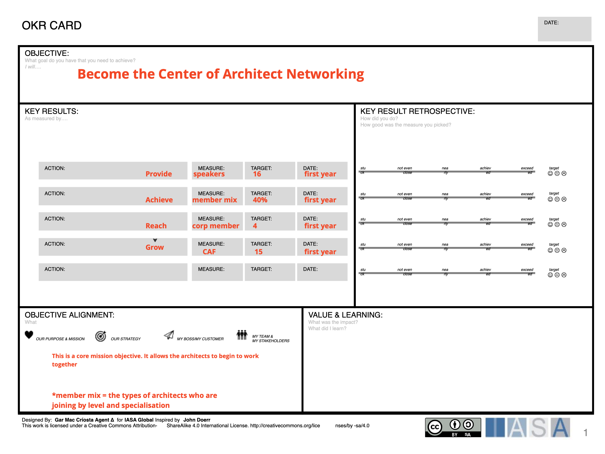

# Creating A Canvas

The structured canvas approach is really quite fun and powerful, especially when you begin authoring and modifying canvases or cards to suite your own environment. What follows is a guide on some easy ways to a) modify canvases to your own designs, and/or, b) to create brand new canvases and introduce them to the BTABoK SCA. 

## Steps involved in creating a canvas

So you have a canvas idea. How then do you add it to the BTABoK? First ensure it is not already there, and it is not a copyright work that you are duplicating. Then follow these steps. 

1. Make your canvas or card in PPT - We like to do our original authoring in PPT simply because of the ease of use. However feel free to skip this step. 

2. Take a working canvas from the btabok and edit the SVG data - I generally take the SVG from the decision record (it is nice and clean) or from one of the grid canvases (like API design) and modify it to my needs. The easiest way to do this is to upload it into a SVG editor (I uses BoxySVG even though you have to pay for advanced features you can always edit and copy/paste from the SVG source). This will allow you to create a completely clean canvas and also has the logo and copyright materials in it. Once you have your SVG it is time to connect it to the BTABoK. 

3. Create a canvas marke down file (duplicate existing) - The canvas mark down is the file which explains the canvas and how it is used. Feel free to make this as expressive as you would like. Generally I find just the overview of using it, plus the details per cell are enough. However, recently we have started created worked examples of each canvas which has made them easier to use! Here is a worked OKR card to show you what it looks like. 

4. Modify the markdown with a unique name and a unique title - The frontmatter in the markdown file tells our system what the unique html file is called. Also it puts the canvas in the collections (software, core, etc). Just focus on the name and url for now.

5. Fill out a description for the canvas overview - this should detail what the canvas is used for and why it is important. Feel free to give detailed guidance for its use. 

6. Add the canvas svg and the ppt to the media folder - all svg files go int the media folder under the structured_canvas folder. The ppt download goes under media/ppt for those that want to use them as a part of a presentation. 

7. Write a table in the md file with each of the canvas 'cells' and what to put in them - for each 'cell' in the canvas, the parts of the canvas the user fills out, put in a description of what goes in it and a link to any BTABoK concept that it could interact with... for example, in the business model canvas the customer segment 'cell' commonly informs us of both Personas as well as Market details. Both of these are part of the customer jouney article in the BTABoK and link directly to another canvas. This portion of the process will connect your canvas to the BTABoK more thoroughly and will increase the chances of your canvas being approved by the committers. 

The structured canvas method is meant to provide a navigable set of practical tools and concepts for the user. Thus the more detail you put into the BTABoK which supports your canvas method the better it will be adopted. Don't forget to lookup in the glossary any definitions from you canvas which need to be inserted or changed. 
