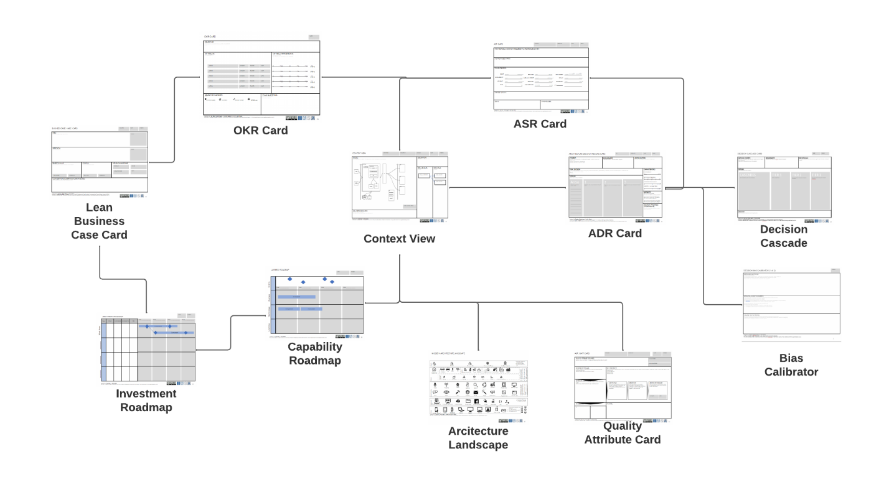

# Decision Rights Rule the World - Design Part 3

Welcome to part 3 of my design with the BTABoK Series. If you are unaware, the authors and contributors are writing a set of scenarios like this series to discuss using the BTABoK toolset in practical ways. 

If you read my newsletter regularly, you are probably aware of how important I believe design decisions are to a well structured architecture. In fact, I strongly believe that decisions are the cornerstone, the currency and the point of architecture. 

In fact I often describe great architecture as 

> "making great business technology decisions, at the right velocity, in complex ecosystems with a complex set of stakeholders." 

But what makes a decision great or even architectural? And if this is so important why do we not do a better job of it?

Design Canvases from the BTABoK

Taken from BTABoK Design Article: [Design | IASA - BTABoK](https://iasa-global.github.io/btabok/design.html)

If you haven’t read the BTABoK article and Part 1, you may want to familiarize yourself with those first. Always keep in mind the BTABoK is open source. If you don’t like the article, change however you want (no delete sorry 😊) and do a pull request and the editorial team will review and accept/reject. Also, we are shamelessly looking for volunteers for special BTABoK projects, like the Pattern Library.

So where do all these options come from and how do we as architects keep up with them? The short answer is a) we study constantly and b) we don't - we simply learn to work with technical experts in a way that fundamentally supplements systems thinking.

## The Decision Record

This used to be called the T-Shaped Architect. We were depth experts in a single area of technology, then realized that it connected with so many other parts that we began to split out. Maybe we were java and spring experts but then had to do a .net project. Then we had to integrate the two. Maybe we started with data then moved into larger solutions and began programming. But technical breadth has turned into what I like to call the Tree-Shaped Architect. The simple truth is technology has grown into a behemoth of options and we go down branches of depth and then cross over to other branches. We have no hope of knowing it all but the key is to keep learning. The hardest truth for the lifelong architect is we can never stop practicing new technologies.

Decision Characteristics

The demand signal card and the technology tracker cards will help you find ways of determining what your business or client's needs might be and where you want to focus your efforts.

The Demand Signal Card from the SCA

The Technology Tracker Card from the SCA

Of course, the good old-fashioned way of keeping up to date (the way I mostly use) is to just do prototype after prototype. I'm currently working on a React/Spring prototype application which we are using in our software architecture course... I will be rewriting it in Node, .net, and whatever other technology I can find... then I get to implement it using different architecture styles... wooo hoo, hey it gives us something more fun to do on Sundays than clean the house :-)

### Decision Velocity - Too Slow or Too Fast?

Technical depth refers to the options that come from depth knowledge a a particular area. For example my software specialization is in full-stack java/spring development with multiple types of front ends. This gives me a great deal of insight into analogous technology choices... ones that are closely related like kotlin and .net, but also ones that work fundamentally differently like reactive programming and node.js running in containers. However, technical depth is a danger zone for architects in design as it becomes a default decision as opposed to an objective one. This is one reason Iasa makes decision records the fundamental building blocks of an architecture as opposed to designs or models. One it helps us expose our biases (you will love the bias calibrator) as well as to force us to look at multiple options, references models or technologies to solve a problem.

## Decision Record Types

Let's face it, tk!

## Reference Models

Chris 

## Managing All These Options

So the

## How Many Options Should I ‘Know’?

So howupdated and sharpen your technical skills

## Software, Solution, Infrastructure and Information

For 

## Business and Chief Architects (Enterprise Too)

As y

The

## How Options Impact Value/Requirements

Anyone who has designed systems (or even dog houses) knows that once you start creating or developing requirements you start creating work and potential value. Some things are more valuable than others! And that is where the next article come in.

# BTABoK References

[Design | IASA - BTABoK (iasa-global.github.io)](https://iasa-global.github.io/btabok/design.html)

You can find all of these canvases in a mocked-up miro board of the Iasa canvases we will be covering in these articles here: [Miro | Online Whiteboard for Visual Collaboration](https://miro.com/app/board/uXjVORNRx4s=/?share_link_id=155880042988).

I am looking forward to this Design Series based on the BTABoK. Here is my current thinking on the order they will come in:

~~1.      Dissecting Design – And Introduction - Done~~

~~2.      Options, Options, Options – So Many Choices - Done~~

3.      Decision Rights Rule the World – Why Agile Architecture is so Hard (Coming Soon)

4.      From Cornflower Blue Buttons to Architecturally Significant Requirements

5.      Views and *BEYOND* – Thinking, Facilitating, and Communicating

6.      I Like Patterns – Patterns, Reference Models, and Conformance

7.      Assessments, Tests, and Chasing Perfection – How Governance and Assessment are Different
