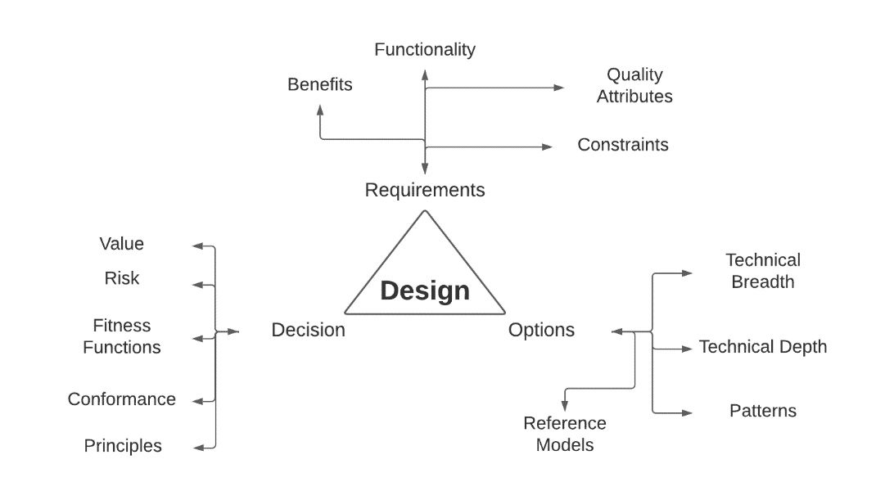

# Decision Rights Rule the World - Design Part 3

Welcome to part 3 of my design with the BTABoK Series. If you are unaware, the authors and contributors are writing a set of scenarios like this series to discuss using the BTABoK toolset in practical ways. 

If you read my newsletter regularly, you are probably aware of how important I believe design decisions are to a well-structured architecture. In fact, I strongly believe that decisions are the cornerstone, the currency, and the point of architecture. 

In fact, I often describe great architecture as 

> "making great business technology decisions, at the right velocity, in complex ecosystems with a complex set of stakeholders." 

But what makes a decision great or even architectural? And if this is so important why do we not do a better job of it?

Primary Design Canvases from the BTABoK

Taken from BTABoK Design Article: [Design | IASA - BTABoK](https://iasa-global.github.io/btabok/design.html)

If you haven’t read the BTABoK article and Part 1, you may want to familiarize yourself with those first. Always keep in mind the BTABoK is open source. If you don’t like the article, change it however you want and do a pull request, and the editorial team will review and accept/reject it. Also, we are shamelessly looking for volunteers for special BTABoK projects, like the Pattern Library.

## The Decision Record

An architectural decision is one that impacts:

1. Quality attributes

2. Value outcomes

3. Politics

4. Complexity

It is often easier to say it is one which delivers against an architectural requirement. The decision needs a number of options and these options are then compared in areas of impact. I like to use a numbering system of 1-10 in decisions because it gives enough room to compare but doesn't get too complicated. The essential element is that stakeholders get a solid understanding of what is a 10 and what is a 1 in your organization. 

As you can see the decision record provides plenty of space for the implementation of a decision. It includes the context (what is shaping the decision), traceability to the [ASR](../structured_canvases/architecture_requirement_card.md), and the [scope ](../engagement_model/scope_context.md)of the decision.

## Decision Importance

Think of the number of decisions made related to technology daily in your organization. Try to imagine, every library, product, SaaS tool, vendor agreement, pattern, style, and reference model that is being chosen by one or more people. From huge (ERP, standardizing a single cloud vendor, information management structures) to small (library dependency, pattern application to code, GitHub structure). The real question is, how many of those are architecturally relevant (Note: it is NOT all of them)? And how many of them come with a decision record of any kind? 

I have asked this question of countless audiences and teams over time. The answer is... almost none. And that is scary. We end up with WHAT we decided, not WHY we decided. Traceability, understanding, decision excellence are all thrown out the window because we think it might take too, long. Just FYI, whenever I have implemented decision management in teams, important decisions (structural, value-based, etc) go FASTER not slower. The decision record allows us to focus on apples to apples instead of long-winded, emotionally charged, opinion-heavy, biased arguments. 

## Facilitation, Command and Control and Method

Anyone who has worked in a team knows that they don't know everything and that includes architects. However, we also know that some decisions are too important or too specialized, political or otherwise impossible to make as a group. The goal of the decision record is to allow facilitated decisions where necessary and command and control decisions where important. This allows decisions to be identified within context. 

The techniques for using the canvases in these contexts are described below. 

### Last Responsible Moment

This comes up time after time. Emergent design supports the last responsible moment or the latest moment where a decision can be made. If following set-based design from SAFe, this might not even occur during the initial build phases. The decision record supports even that. Either way, in the end, we look at a filled decision and it is obvious what the architect evaluated and why! 

## Breaking Down the ADR

The following defines how to make the most out of the ADR in practice. First, it should be noted the average product would not have a significant number of decision records. Even in large projects, the number of ADRs might not be more than 20. Much of the 'volume' can be reduced using decision cascades and principles. In addition, the views and viewpoints in use will help describe decisions in context, allowing plenty of flexibility to stakeholders in how they execute. 

### Decision Overview

This area is for the basic decision elements.

#### Context

The context is the name of the decision plus any related context elements. This sounds a bit generic and it is meant to be. Use your imagination, throw sticky note into it, and don't worry about perfect just usefulness. 

#### Traceability

This is a chance to link the decision to a requirement or objective. The decision does not have to be linked but it deeply helps traceability. To link to a requirement simply list the name of the ASR. This is relatively straightforward. 

#### Scope

As you know scope is a tricky subject in architecture. However, you can simply use the classifications from the [scope article](../engagement_model/scope_context.md) in the BTABoK.

### Decision Characteristics

The decision characteristics is one of the most important elements of the card, though people often overlook it. As you get more experienced in design you will realize these elements impact the overall importance and decision making process by a wide margin. So you should definitely get good at filling these in! 

##### Decision Reversibility - Are we stuck with this?

Reversibility is inexorably tied to scope of course. But it can be a lot smaller too. Think about a design style like Microservices or Serverless. It is pretty hard to roll that back if you've gotten a way into delivery. Same can be said for product purchases or library dependencies. So think a bit. Will we be able to reverse this decision easily... if not then...

##### Decision Velocity - Too slow or too fast?

Maybe we should go a little slower on this decision. Or are we plodding along trying to get it perfect. [Velocity](../engagement_model/velocity.md) is itself more art than science. However, we want to try to move at the highest velocity possible without giving in to the god of speed. Try to aim for too short, then let it lag a bit and revisit as the decisions begin to cascade. 

##### Decision Information - Too much or too little?

Most engineers want all the information possible. But a great architect knows there is no such thing as 100% of the information we need. Shoot for 70% or a little lower if possible. And look for ways to speed even that up. 

##### Decision Effort - How much effort should the decision take?

Effort is not just a function of calendar time but of resources. One organization I know of spent a year on an enterprise-scoped decision and roughly 5 people were involved the whole time. That is a lot of effort. Think through the importance of the decision and treat it like any other work element. 

### Decision Authority

Decision style is almost always taken for granted. The decision is completely over-written by a senior or manager when the team had found the best answer. The team comes up with a decision that is sub-par due to a lack of expertise. Politics override our awareness of the wrongness of a decision. But focusing on decision style and making it explicit will seriously help you as an architect understand and manage these elements. Remember though, never get emotionally attached to decisions. Also remember that Tier 1 decisions should NOT subject to politics, prestige or opinion. They impact lives so get it RIGHT. 

##### Decision Ownership

Who owns this decision? Who owns it really? Are they paying for it? The decision owner is not often listed on a decision and yet everyone knows who it is. Make sure the real owner is listed and try to spread that as little as possible. 

#### Decision Process

What techniques are we using to make the decision? My favorite is the time-boxed decision meeting. Print the record(s) on the wall and give everyone sticky notes. Everyone gets a vote. Then allow individuals to argue out numeric differences or opinions but time-box the whole thing. Often I will have everyone fill out their numbers in secret so we hear their real opinions, not just what they heard from someone else. 

Other techniques include decision boards, single owner and more. This is kind of an exciting area to do more research as we learn more about good architectural decisions. 

#### Decision Style

Decision poker is a fun game... know how the decision is being made and list it. 

#### Linked Decisions

There are a lot of decisions which impact each other. This area allows the architect to explore those linkages and describe them. Some decisions will cancel out others (should I use Lamdas in AWS, duh no we are deploying to Azure is a silly but fitting example). 

#### Linked Principles

Principles will often cancel out decisions as well. If we have a principle that we prefer 'Cloud Native' solutions I don't really need a decision record on whether to use Serverless if possible as that is the most cloud native style. 

#### Biases

There are often cognitive biases in decisions. The BTABoK includes a set of decision bias calibrators to help unearth biases found. Use this section to connect to those biases. 

## Decision Record Types

So when do I need a decision record. Currently we are aware of three major areas where ADRs are used. But feel free to message me about others you know. These are relatively loose and the architect should use whatever decision records they think they need. 

### Design Patterns and Structure

Structural decisions are relatively easy to identify. Should we go with Serverless, Microservices, or Macroservices (I HATE the term monolithic, it sounds soooo awful which makes it cognitively biased:-))? These structural choices or Patterns are about the implementation of a set of systems. They apply to any concept in structure (domain entities), routing, hosting, etc. These decisions are critical to the overall topology, shape and engineering rigor of the final system. 

### Business Technology Components

Component decisions are about whether we support certain pre-built or existing building blocks of a system. I like to think of these as ERP, Oauth or other existing standards and tools. 

### Products

The product bake-off is a tried and tested decision technique and very common for architects. Comparing products, frameworks or technologies fits into this category. 

## Conclusion

Well I hope this helps in terms of using the BTABoK for referencing architecture decisions. This is one of my most passionate topic areas and should be on the MUST DO list of any architecture practice. We cannot provide value if we don't know how we make decisions! 

In a somewhat backwards way, I started with decisions and will be working to a requirements and objectives article next because I want to show the contextual nature of architecture and how changing decisions can change requirements. 

# BTABoK References

[Design | IASA - BTABoK (iasa-global.github.io)](https://iasa-global.github.io/btabok/design.html)

You can find all of these canvases in a mocked-up miro board of the Iasa canvases we will be covering in these articles here: [Miro | Online Whiteboard for Visual Collaboration](https://miro.com/app/board/uXjVORNRx4s=/?share_link_id=155880042988).

I am looking forward to this Design Series based on the BTABoK. Here is my current thinking on the order they will come in:

~~1.      Dissecting Design – And Introduction - Done~~

~~2.      Options, Options, Options – So Many Choices - Done~~

~~3.      Decision Rights Rule the World – Why Agile Architecture is so Hard~~

4.      From Cornflower Blue Buttons to Architecturally Significant Requirements

5.      Views and *BEYOND* – Thinking, Facilitating, and Communicating

6.      I Like Patterns – Patterns, Reference Models, and Conformance

7.      Assessments, Tests, and Chasing Perfection – How Governance and Assessment are Different
