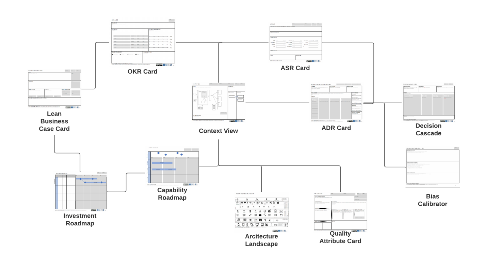
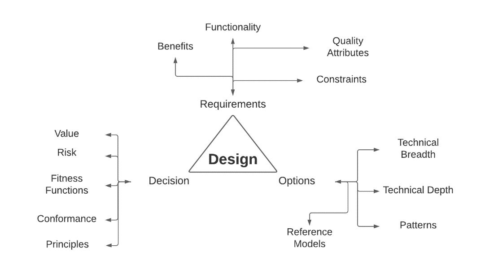
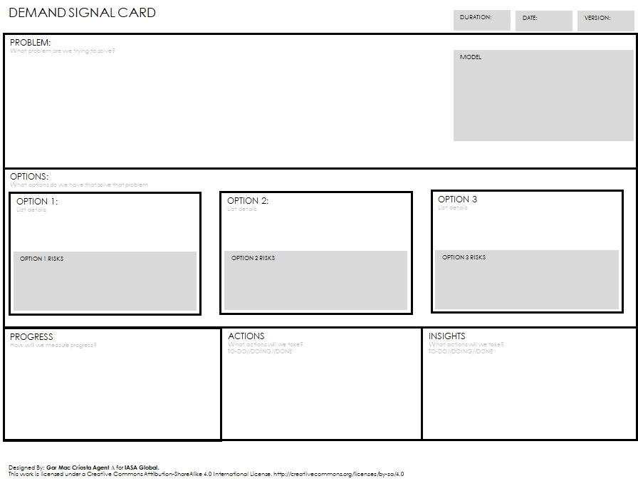
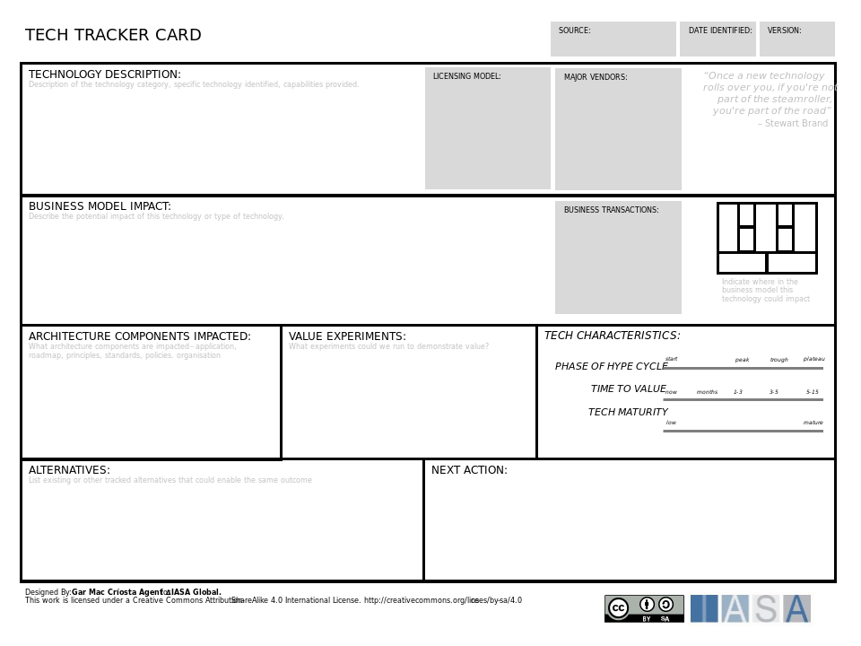
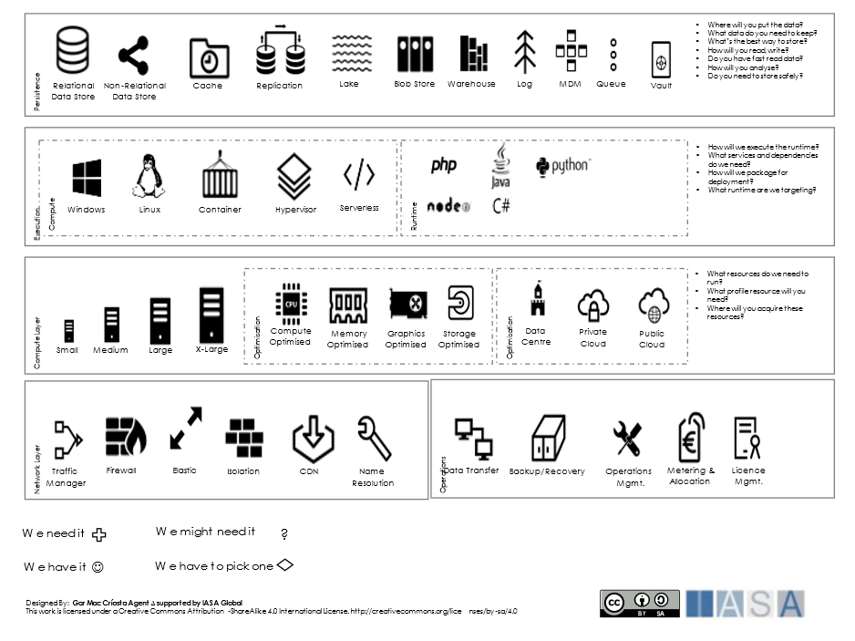
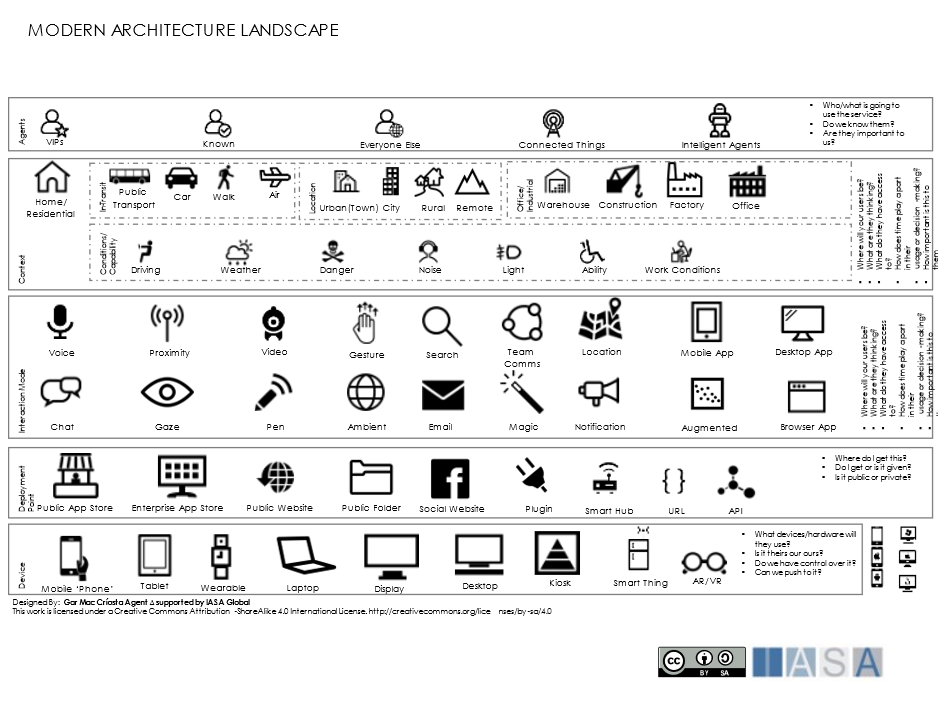
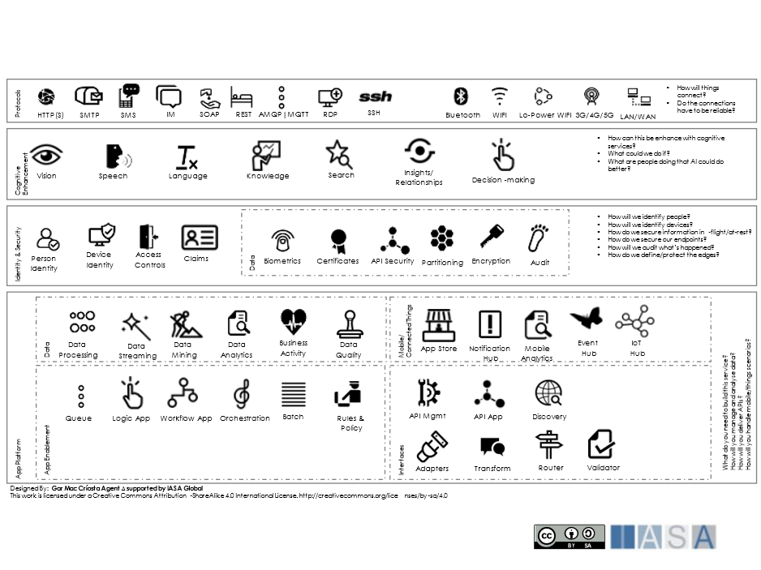

# Options, Options, Options! Design Part 2

What do we do with so many choices?

I have to say that today’s combinations of business and technology are far more complex than 10 years ago, much less 20. In the technology space, according to the TIOBE index, there are roughly 30 highly popular coding languages in a sea of somewhere around 250-2500 in use. There are a seemingly infinite number of platforms, products, tools, and libraries, all both open and closed source. There are major differences in access methods, costs, usage, service level agreements, etc. Remember as well that this doesn’t just include web applications and phone applications, but specialized systems such as medical devices, IoT, smart flow controllers for liquids and gases, satellites, remote procedure calls, specialized hardware, quantum, and a host of other options. What is an architect to do?

In the BTABoK we connect design options, decisions, stakeholders and business outcomes through structured canvases. This has an amazing impact on how options are evaluated and delivered.

Design Canvases from the BTABoK

This only gets more complicated as we start talking about business outcomes, business models, and value generation. There are somewhere between 45-55 pure-play technology companies (Microsoft, IBM, Apple, etc.) in the fortune 500. And yet that number goes to 100% if you believe the quote from the CEO of Bank of America:

> BofA CEO on the future of banking: 'We're clearly a
> technology company' – Brian Moynihan

This goes right to the heart of architecture vs engineering. If BoA is a technology company, then what about a dairy company or a construction company? What about a coffee shop, hotel chain, hospital, or travel agency? Is Airbnb a technology company or a hospitality company? How can it be both? And most important to this series of articles is how does that impact a particular decision in technology like serverless vs microservice vs SOA? How does that decision impact the creation of value in those business models? Business models and requirements create options to implement, but options to implement also create business models and requirements. Darn, but I love architecture!

Taken from BTABoK Design Article: https://iasa-global.github.io/btabok/design.html

If you haven’t read the BTABoK article and Part 1, you may want to familiarize yourself with those first. Always keep in mind the BTABoK is open source. If you don’t like the article, change however you want (no delete sorry 😊) and do a pull request and the editorial team will review and accept/reject. Also, we are shamelessly looking for volunteers for special BTABoK projects, like the Pattern Library.

So where do all these options come from and how do we as architects keep up with them? The short answer is a) we study constantly and b) we don't - we simply learn to work with technical experts in a way that fundamentally supplements systems thinking.

## Technical Breadth

This used to be called the T-Shaped Architect. We were depth experts in a single area of technology, then realized that it connected with so many other parts that we began to split out. Maybe we were java and spring experts but then had to do a .net project. Then we had to integrate the two. Maybe we started with data then moved into larger solutions and began programming. But technical breadth has turned into what I like to call the Tree-Shaped Architect. The simple truth is technology has grown into a behemoth of options and we go down branches of depth and then cross over to other branches. We have no hope of knowing it all but the key is to keep learning. The hardest truth for the lifelong architect is we can never stop practicing new technologies.

The demand signal card and the technology tracker cards will help you find ways of determining what your business or client's needs might be and where you want to focus your efforts.

The Demand Signal Card from the SCA

The Technology Tracker Card from the SCA

Of course, the good old-fashioned way of keeping up to date (the way I mostly use) is to just do prototype after prototype. I'm currently working on a React/Spring prototype application which we are using in our software architecture course... I will be rewriting it in Node, .net, and whatever other technology I can find... then I get to implement it using different architecture styles... wooo hoo, hey it gives us something more fun to do on Sundays than clean the house :-)

## Technical Depth

Technical depth refers to the options that come from depth knowledge a a particular area. For example my software specialization is in full-stack java/spring development with multiple types of front ends. This gives me a great deal of insight into analogous technology choices... ones that are closely related like kotlin and .net, but also ones that work fundamentally differently like reactive programming and node.js running in containers. However, technical depth is a danger zone for architects in design as it becomes a default decision as opposed to an objective one. This is one reason Iasa makes decision records the fundamental building blocks of an architecture as opposed to designs or models. One it helps us expose our biases (you will love the bias calibrator) as well as to force us to look at multiple options, references models or technologies to solve a problem.

## Patterns

Let's face it, the pattern world is a mess. There are a lot of resources out there but many if not all are conflicting. Martin Fowler's book on EA is a list of patterns, Greghor's work on integration patterns is decades old, there aer 5-10 github repositories with patterns, styles, and even reference models which are called patterns. Is is strangler, strangler fig, fig strangler, or some other name? Where and how is it used? Who is the expert and what if it doesn't work? Integration patterns, infrastructure patterns, design patterns, architecture styles, it's a jungle. Even the vendors get it wrong and they are certifying people on it! Try to find the sidecar pattern on AWS CAF vs on Azure CAF... see if you can figure out which one is right!

The time has come to have a pattern ontology, tagging system and single point of expertise. That is the Pattern Library we hope to build (and we hope you contribute and help - just contact me if you want to be in the working group) in the BTABoK. We clarify the difference between patterns, styles, scopes of application and areas of use. We also clarify the difference between patterns and reference models. Please, join us and submit a pattern to the repository! We are also asking the existing pattern repositories to link to and to contribute their excellent work!

## Reference Models

Chris Cooper-Bland says reference models are patterns within context. I like that very much. They are meant to be modified, where patterns are meant to be implemented as is. This is an exciting area to catalog as there are literally thousands of reference architectures in the world and we need some way of navigating them. Any help you can provide would be wonderful.

## Managing All These Options

So the best way to think about options is to study the areas in which technologies play. That is why we use the design landscape cards, to help us narrow down a solutions options to what we want, what we need, what we need to decide and what we already have.

The design landscape (1 of 3)

The design landscape (2 of 3)

The design landscape (3 of 3)

## How Many Options Should I ‘Know’?

So how do we know what to study? There are two approaches in the BTABoK. First is understanding demand signals within our client's business model. For example, recently a friend of mine gave a talk about blockchain in healthcare. Her conclusion was that while blockchain is an awesome technology, for her business, there are just simply more reliable and frankly cheaper ways to do the same things. This would imply that while there is a demand signal, it is not a scenario that the architects there would experiment with or attempt to master.

## Software, Solution, Infrastructure and Information

For those of us who maintain a deep relationship to technology, the challenge tends to be staying as connected to business as we do technology. It is easy enough with day in and day out work with other types of technology experts and architects to stay up to date and keep your technical skills sharp. But never forget, the technology serves the client's business needs and if you don't know those, your decision records will reflect only technology, structural reasoning and cost. That makes you a dev lead, not an architect.

## Business and Chief Architects (Enterprise Too)

As you may know, the BTABoK uses the term chief architects or principle architects over domain/scope-based titles. Not to leave the EAs out but we want to give you all promotions to chief architects with seniority and areas of direct outcome ownership. But how much technology do you need? And at what point in your career did you get it? And most importantly how do you keep up with technology at these levels?

The answers to these questions vary greatly based on the company right now, but as we will see in future articles in the series, there are some very solid models for making this work being put into place at big companies which transcend individual corporations. In fact, implementing the BTABoK is significantly based on these methods.

## How Options Impact Value/Requirements

Anyone who has designed systems (or even dog houses) knows that once you start creating or developing requirements you start creating work and potential value. Some things are more valuable than others! And that is where the next article come in.

BTABoK References

[Design | IASA - BTABoK (iasa-global.github.io)](https://iasa-global.github.io/btabok/design.html)

You can find all of these canvases in a mocked-up miro board of the Iasa canvases we will be covering in these articles here: [Miro | Online Whiteboard for Visual Collaboration](https://miro.com/app/board/uXjVORNRx4s=/?share_link_id=155880042988).

I am looking forward to this Design Series based on the BTABoK. Here is my current thinking on the order they will come in:

~~1.      Dissecting Design – And Introduction - Done~~

~~2.      Options, Options, Options – So Many Choices - Done~~

3.      Decision Rights Rule the World – Why Agile Architecture is so Hard (Coming Soon)

4.      From Cornflower Blue Buttons to Architecturally Significant Requirements

5.      Views and *BEYOND* – Thinking, Facilitating, and Communicating

6.      I Like Patterns – Patterns, Reference Models, and Conformance

7.      Assessments, Tests, and Chasing Perfection – How Governance and Assessment are Different
