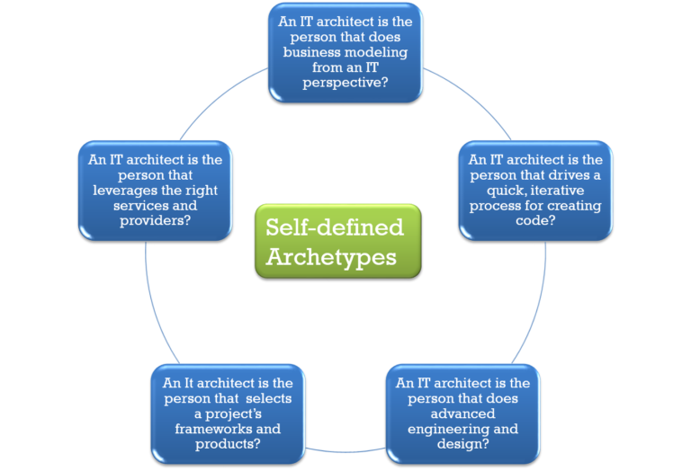
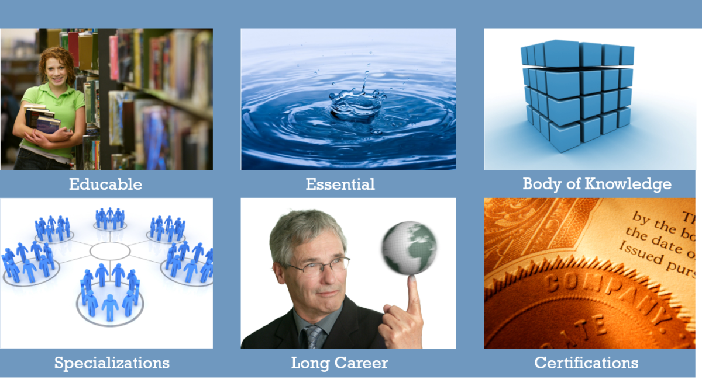

# What is Architecture?

## Iasa Definition

The Iasa community feels that both sides of those definitions, when blended are a good definition. **IT architecture is the art and science of designing and delivering valuable technology strategy.**

We must be able to describe a strategy for solving business problem with IT. By having business skills, we speak the language of business to executive sponsors to understand what drives the organization, what challenges they face, and what others in their domain are doing and what challenges they face.

We must use our broad technical skills to evaluate the existing IT environment, the staff and skills they have, how they operate and at what operational maturity level. We must use the language of architecture to speak with our peers, understand and communicate effectively so we can make sure various teams, projects, and solutions all integrate successfully into an existing operational environment.

We also must use past deep technical expertise to quickly explore and learn new technologies we may not have experience with. We must be able to speak the language of technology to subject matter experts in order to have relevant conversations with them and have any credibility when speaking with them. If we don’t we risk them taking a path other than the one we suggest, and that could have a negative impact on the value the solution provides.

**Other Definitions**

Is there confusion over what architecture is? No, not really. There are just different aspects of what architects do based on the role they play in their organization. The good news is these differing descriptions align well.

If you look at the definition of architect in any dictionary, you’ll see the definition of a building architect highlighting a blend of art, science, and practice. There are now parallel descriptions for IT architecture that describes the art, science, and practice of organizing and integrating computer systems. From MIT, the description offered is more knowing the business process and reflecting a solution with IT. From SEI, the description offered sounds more like the definition found in dictionaries, focusing on the technical aspects of designing or engineering a complex solution.

Various definitions Include:

**1** **:** the art or science of building; *specifically* **:** the art or practice of designing and building structures and especially habitable ones  
**2 a** **:** formation or construction resulting from or as if from a conscious act <the architecture of the garden> **b** **:** a unifying or coherent form or structure <the novel lacks architecture>  
**3** **:** architectural product or work  
**4** **:** a method or style of building  
**5** **:** the manner in which the components of a computer or computer system are organized and integrated

* http://www.merriam-webster.com/dictionary/Architecture

**Enterprise architecture** is the organizing logic for business processes and IT infrastructure reflecting the integration and standardization requirements of the firm’s operating model. *MIT Center for Information Systems Research, Peter Weill, Director, as presented at the Sixth e-Business Conference, Barcelona Spain, 27 March 2007*

The **software architecture** of a program or computing system is the structure or structures of the system, which comprise software elements, the externally visible properties of those elements, and the relationships among them. *Bass, Clements, and* *Kazman**.*  <u><i>Software Architecture in Practice&nbsp;</i></u> *2nd* *ed**, Addison-Wesley 2003*

## **A Profession**

Iasa’s vision is to turn IT Architecture into a profession, which is a group of people pursuing a learned art with a common calling. There is some controversy around what constitutes a profession, but most agree it is educable, essential, has a large common body of knowledge, has specializations, can be practiced for an entire career, and often has certifications and a code of ethics.

Twenty years ago, you were a project manager because you could manage projects, and you could manage projects because you had managed projects. Does that sound like your experience as an architect today?

There was no formal training or common set of tools, languages, or process for project management. Now, there are tools, training, common language, common tools, and various but related approaches to managing projects.

### **What is an Architect?**

Put three architects in a room and they can discuss why they are architects and the other two are not until their throats are sore. Typically, they possess the same core set of skills and values, but each, based on his or her company’s organizational structure, will resonate with a different archetype.

  
Iasa research suggests that most architects fall into one or two of these architect archetypes. All have similar foundational skills, but each has a different perspective based on his or her architectural practice. Do you see one or two that resonate with you?

From Iasa’s perspective, an architect is the technology strategist for the business. To be a technology strategist requires that he or she have a broad understanding of technology that spans programming and development of custom applications, the infrastructure environment that the solution must reside in, and the operational environment that provides support.

### **Specializations**

Just as there are different archetypes for architects, each of us has a unique background. Some start as a developer and grow business skills, and possibly infrastructure skills. Some come from an infrastructure or operations background and grow business or developer skills, while others come from a business background and grow technical competence out of passion or need.  

As architects, we face many challenges that go beyond the current projects we may be engaged in, from a lack of understanding of what we do, what value IT does or can bring to an organization, ill-defined structure that has grown over time, and not having true authority to use as a lever.

IT ARCHITECTS’ CHALLENGES:  
• Lack of understanding of the architect specialization and no direct authority as an architect  
• Existing misalignments between technology and “the business” seen as insurmountable  
• Overcoming ad hoc infrastructures

As an architect, your value and role may not be well defined. Additionally, architects tend to be individual contributors who have no direct authority and many times are seen as interlopers who drop into projects for a brief time to provide no value and put up roadblocks to delivering a solution.

Based on your role as the organization’s technology strategist, you can work to socialize these value statements. Whether you are a staff architect or a consulting architect, you contribute to the perception of architecture inside of an organization and are part owner of the projects in which you are involved. As you practice and grow your skills, you strive to create a perception of architecture that highlights the value of architects and the strength architectural practice can bring to the organization.

The architectural community doesn’t agree on what architecture is, and most architects could not describe the value they provide during an elevator ride with an executive sponsor. There is not a widely held understanding of what value architects provide and when they are needed.

Many organizations feel there is a chasm between the goals and needs of the business and the goals and needs of the IT department. In many cases, business leaders feel IT is a cost center or a necessary evil required to operate as a business.  
In some organizations, budgets and authority over IT are centralized, whereas in others, the budgets and authority are splintered across business units. This can drive confusion and internal “turf wars.”

We work in environments that have grown over time but are poorly documented and not well conceived. There are many isolated technical projects going on, but they do not reflect the existing environment and are created in silos. These are operated together and become the infrastructure.

In summary, the IT architect profession is in its infancy. Various groups have various descriptions for architects and architecture and use different terms and titles interchangeably. Based on your own work environment and background, you will have your own perspective on which skills are essential and what the role of an architect and value of architecture are.  

Through collaborative work with architects across the globe, the Iasa community defines IT architecture as the art or science of designing and delivering valuable technology strategies. We also define the IT architect as the technology strategist for the business. Our goal is to formalize the IT architect profession, creating a common body of knowledge and a common language.
