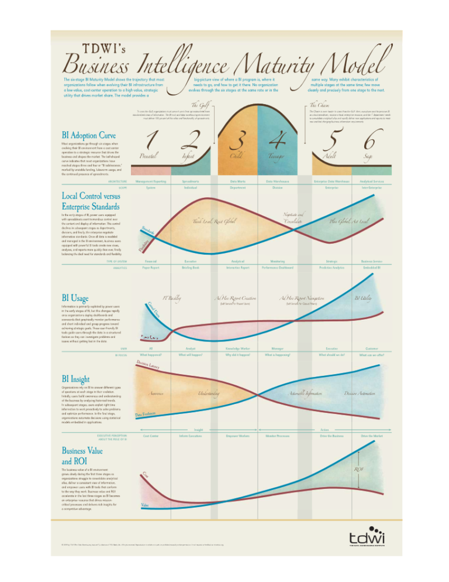
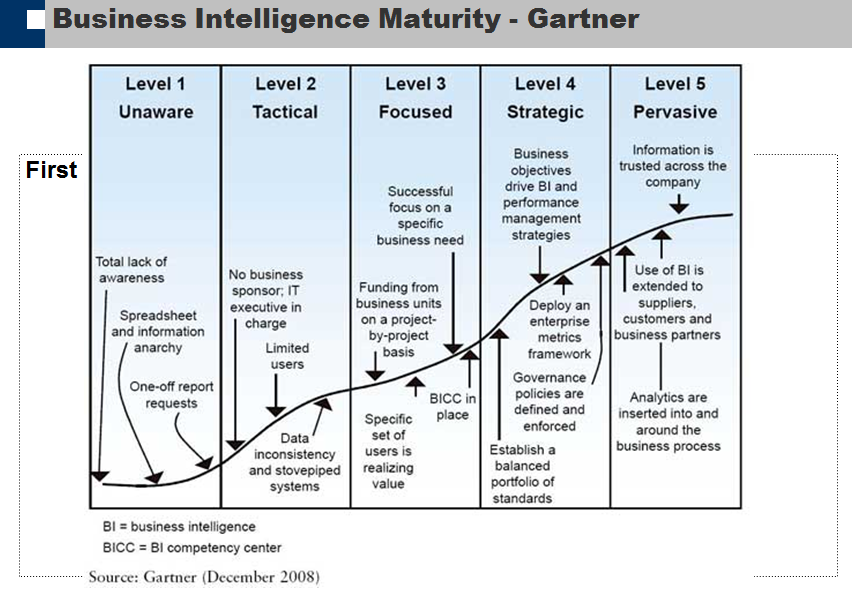

# Description

**Business intelligence** (**BI**) is the set of techniques and tools for the transformation of raw data into meaningful and useful information for business analysis purposes. BI technologies are capable of handling large amounts of unstructured data to help identify, develop and otherwise create new strategic business opportunities. The goal of BI is to allow for the easy interpretation of these large volumes of data. Identifying new opportunities and implementing an effective strategy based on insights can provide businesses with a competitive market advantage and long-term stability.

A** Data Warehouse** (**DW** or **DWH**), also known as an **enterprise data warehouse** (**EDW**), is a system used for reporting and data analysis. DWs are central repositories of integrated data from one or more disparate sources. They store current and historical data and are used for creating analytical reports for knowledge workers throughout the enterprise. Examples of reports could range from annual and quarterly comparisons and trends to detailed daily sales analyses.

# Overview

BI technologies provide historical, current and predictive views of business operations. Common functions of business intelligence technologies are reporting, online analytical processing, analytics, data mining, process mining, complex event processing, business performance management, benchmarking, text mining, predictive analytics and prescriptive analytics.

**Why does an Architect need this skill**

An architect ensures that business intelligence (BI), data warehousing(DW), data discovery, and advanced analytics can provide important competitive advantages, and thus want to evolve their analytics strategies beyond spreadsheets or simple BI reporting and dashboards. Architects seek to build a broad "analytics culture" in which data analysis plays an essential role in all decisions and is fundamental to business collaboration.

**How does an Architect use this capability**

An architect helps companies to determine the:

-   Business Need -- Define what are the top business needs and demands for BI, as well as the benefits a BI/DW program will bring to your company
-   Availability of Information -- Whether the company has all the information they need to answer their current business questions and identify and easily support new business opportunities
-   Current Business Intelligence Capability -- Assess the effectiveness of your BI organization and governance, identify current and future users of BI, assess the extent of transforming existing data into meaningful information, define standard KPIs and business transformation rules
-   Review of Current BI Systems -- Including decision support, ad hoc query and reporting, analysis, forecasting, and data mining
-   Information Latency -- How timely and up-to-date current information is and what gap analysis exists between current situation and future needs

# Proven Practices

With most companies listing BI/DW within their top agenda, and with the rising costs and confusion around proving the worth of BI/DW and justifying its costs, it makes sense to try and understand the evolution of BI adoption and maturity in organisations.

The Business Intelligence Maturity Assessment should answer these questions:

1.  Business need for BI/DW and benefits
2.  Review and assessment of existing systems and data
3.  Analysis and recommendation of current BI organization and user groups.

Below are couple of industry proven practices to help organisation to gain maturity on their BI practices

## **1\. The TDWI BI Maturity Model **

*The Data Warehousing Institute (TDWI)* is a premier body in the field of BI and eponymous Data warehousing and proposes a six stage BI maturity model. The underlying assumption being that BI implementation in organizations typically evolves from a low-value cost centre operation to a high value strategic utility to provide competitive advantage.

**Stage 1: Prenatal** -- Executive perception is that of a cost-center, which primarily churns out static reports for management operational reporting. It is also the stage which costs the most.

**Stage 2: Infant** -- The BI function's role is to inform executives, with several reports leading to "***spreadmarts***"

A '***Gulf***' separates Stage 2 and Stage 3.

**Stage 3: Child** -- The BI function's role is perceived to empower workers, and this is the first evolution into an analytical system where OLAP and ad-hoc reports are used off data marts.

**Stage 4: Teenager** -- The BI function has evolved into a performance monitoring system by now, using Dashboards and Scorecards, supported by data warehouses.

A '***Chasm***' separates Stage 4 and Stage 5.

**Stage 5: Adult** -- This is where the ROI from the BI function shoots up, with predictive analytics answering what-if questions making the BI a strategic utility. The TDWI thinks that organizations' BI architecture has evolved to have enterprise DW by now, with BI becoming a 'Drive the Business' function.

**Stage 6: Sage** -- The BI function at this stage has the highest ROI and decreasing costs based off Analytic Services (SOA) with pervasive BI (e.g. embedded BI) making it 'Drive the market'

## **2\. Gartner**

*Gartner*, the IT research and advisory group's BI maturity model is based on 3 key areas of assessment -- people, processes and metrics. It has 5 maturity levels:

**Level 1 -- Unaware** -- Spreadsheet and information anarchy, one-off report requests

**Level 2 -- Tactical** -- Usage limited to few executives with data inconsistency and stovepipe systems

**Level 3- Focused** -- Specific ser if users realize value, with focus on specific business need and BI competency centre (BICC) in place

**Level 4 -- Strategic** -- Business objectives drive the BI and performance management systems with well defined and enforced governance policies and standards

**Level 5 -- Pervasive** -- Use of BI is extended to suppliers and customers, information is trusted (holy grail of single version of truth) with analytics embedded in business processes

Please note -- The adoption of maturity model and demonstrating its worth as a strategic tool lies in its ***complexity***. BI is a broad area encompassing both technical and non-technical aspects like people and process; therefore the models can only provide a prescriptive framework which needs to be adapted by each organization. It is important to understand that various departments of an organization can be at varying levels of maturity and not every organization follows the same trajectory of evolution or has to go through each stage.

# Sub-Capabilities

## Information Delivery : Reporting, Dashboards and Adhoc query

Enables users to share and discuss information, analysis, analytic content and decisions via discussion threads, chat and annotations.

-   **Storytelling:** Does the tool support the creation of a storyboard to present a series of analytic content?
-   **Discussion threads:** Does the product enable discussion threads and commentary on shared BI content (reports, dashboards and analysis)? Can users add voice comments to BI content? Can users create annotations to the query result (or any BI artifact) that are tied to a workflow-driven process?
-   **Integration with social platforms:** Does the product integrate with social platforms, and can it be used to discuss the results of such integration?
-   **Timelines:** Can users see their collaboration, annotations and comments on a timeline?
-   **Sharing and real-time collaboration:** Can users find other relevant users and share and collaborate on BI, analysis and dashboard content?

| **Iasa Certification Level** | **Learning Objective** |
| :-: | :-: |
| **CITA- Foundation** | -   Learner will be able
| **CITA -- Associate** | -   Start list items here...
| **CITA -- Specialist** | -   Start list items here...
| **CITA -- Professional** | -   Start list items here...

## Information Integration : Infrastructure, Metadata, Data Modelling, Data lineage, Development and Deployment.

-   **BI Infrastructure:** How the platform/content can be integrated with complementary BI capabilities such as portals, databases, business process management, complex-event processing engines, Hadoop distributions, search engines and social platforms.
-   **Integrated semantic/metadata layer:** How many different metadata/semantic layers exist in the platform? Is there a single metadata layer for all platform tools?
-   **Data modelling:** What skills are required to model data using the platform? Is scripting required for data modelling?
-   **Data lineage and impact analysis:** How is data lineage supported to determine which source systems contributed to the report, regardless of the ETL tool used? How is impact analysis supported to highlight changes in the source data (down to which fields are impacted within a report) that affect downstream reports?
-   **BI Development:** The BI platform should provide a set of programmatic development tools, coupled with a software developer's kit, to create BI applications and integrate them into a business process and/or embed them in another application
-   **BI Deployment :** Platform-as-a-service and analytic-application-as-a-service capabilities for building, deploying and managing analytics and analytic applications in the cloud or on-premise, based on both cloud and on-premises data.

| **Iasa Certification Level** | **Learning Objective** |
| :-: | :-: |
| **CITA- Foundation** | -   Start list items here...
| **CITA -- Associate** | -   Start list items here...
| **CITA -- Specialist** | -   Start list items here...
| **CITA -- Professional** | -   Start list items here...

## Information Analysis : Interactivity, User Experience, Visualisations, Authoring, In-memory interactivity

-   **Interactivity and exploration:** How does the product support visual interaction with content such as dragging and dropping what users want to see, or selecting a data point to get additional detail? Can users perform analysis tasks --- including sort, drill and pivot --- by simply interacting with visual images or using drag-and-drop manipulation?
-   **User experience:** What tutorials, online information, help, wizards, contextual aids, preferences, and communities are available to support the user?
-   **Information visualizations:** How does the product support basic charts, multidimensional rendering, visualizations linking, conditional formatting, advanced charts, trellising, live data, animation, contours and asymmetric reporting?
-   **Content authoring:** How does the product support code-free, business-user-authored data discovery and dashboard design? Does the product allow the creation of dashboards by laying outplacing and linking different visualizations on a single page? Is the authoring environment WYSIWYG? Can business users create and edit metrics and dimensions, hierarchies and groupings of data items? Can they create infographics? What types of parameters can be created by users?
-   **In-memory interactive analysis:** How does the product use in-memory technology to improve user interactivity? Are there capabilities to optimize interactive analysis between data that is held in-memory and data that is accessed directly in the database?

| **Iasa Certification Level** | **Learning Objective** |
| :-: | :-: |
| **CITA- Foundation** | -   Start list items here...
| **CITA -- Associate** | -   Start list items here...
| **CITA -- Specialist** | -   Start list items here...
| **CITA -- Professional** | -   Start list items here...

# Resources

**Articles:**

[https://en.wikipedia.org/wiki/Business_intelligence](https://en.wikipedia.org/wiki/Business_intelligence){:target="_blank"}
[https://en.wikipedia.org/wiki/Data_warehouse](https://en.wikipedia.org/wiki/Data_warehouse){:target="_blank"}
[https://tdwi.org/pages/maturity-model/analytics-maturity-model-assessment-tool.aspx](https://tdwi.org/pages/maturity-model/analytics-maturity-model-assessment-tool.aspx){:target="_blank"}
[http://www.informationbuilders.com/products/webfocus/pdf/Gartner_BI_Matrix.pdf](http://www.informationbuilders.com/products/webfocus/pdf/Gartner_BI_Matrix.pdf){:target="_blank"}

**Blogs / Webcasts / News / Reference Resources:**

[http://www.jamesserra.com/archive/2013/06/business-intelligence-maturity-assessment/](http://www.jamesserra.com/archive/2013/06/business-intelligence-maturity-assessment/){:target="_blank"}
[https://biguru.wordpress.com/2012/01/08/bi-maturity-models/](https://biguru.wordpress.com/2012/01/08/bi-maturity-models/){:target="_blank"}

# Authors

**Andres Hurtado**
*Software Architect & Developer*

Software architect and developer working inside private and public sectors. He has worked in Colombia, designing and implementing enterprise solutions and has over 14 years of experience in software development process, enterprise application integration and research about technologies to leverage the product development.

**Jaya Mudugal**
*Information & Solution Architect*

Customer-focused Information Architect with 12 years of experience in improvement-based technical project delivery and business analysis. Demonstrated mastery in facilitating evaluation of business requirements to provide suitable technical solution; ability to consistently deliver enhancements and solutions that drive customer satisfaction and loyalty.\
Proven mentor and trainer and can adapt quickly to the organisation's objectives and needs.
