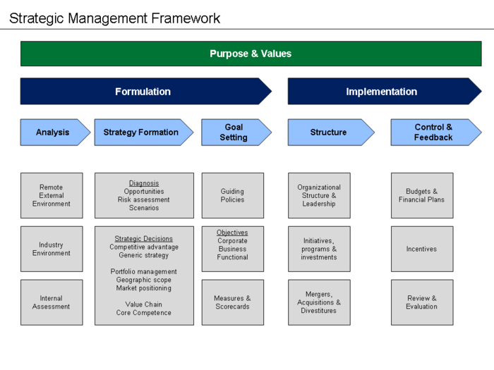
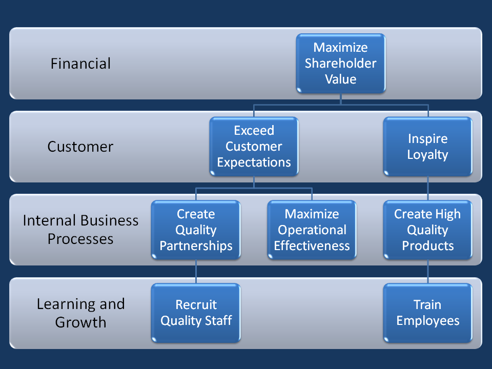
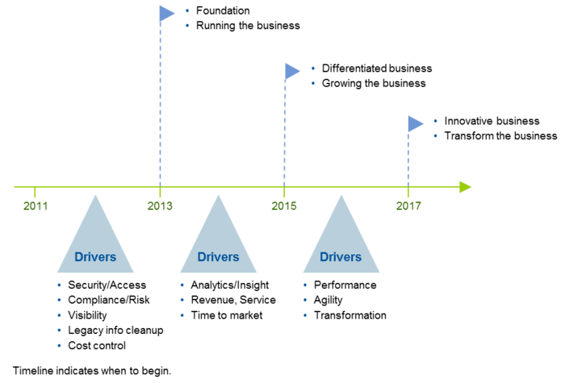

# Description 

There are many definitions for Business Strategy proposed by multitudes of authors. The definition can be aggregated as either separately or in combination. Strategy is a high level plan to achieve one or more goals under conditions of uncertainty. According to Porter there are three principles  underlying strategy: creating a "unique and valuable [market] position", making trade-offs by choosing "what not to do", and creating fit  by aligning company activities with one another to support the chosen strategy(1). Strategy can also be seen as a coherent set of analyses, concepts, policies, arguments and actions that respond to high stakes challenge (2). Business is defined as an organization involved in the trade of goods, services or both to consumers (3). Business Strategy can be expressed in the form of Strategic Management Frameworks (**Figure 1**) or the strategy map (**Figure 2**).

**Figure 1**

**Figure 2**

# Overview

Business strategy is pertinent to the architect as it is the foundation for his value delivery to the organization. The capability to review the business strategy is important for the architect to contribute in terms of technology and architectural aspects during  the lifecycle of business strategy management. The architect has many roles to carry out during the Business Strategy management and lifecycle. The main role is to be the technology strategist and contribute on how technology can be leveraged to achieve the outcomes for the business strategy (6).

# Proven Practices

The architects role can be segregated according to the phases of the Management of the business strategy (7). During the development phase, to be an active part of the team developing the business strategy, contributing on the architectural and technology aspects during the strategic analysis and formulation of the business strategy and maintaining traceability to the mission vision and value.

During the translation of strategy, contributing to the definition of strategic objectives and themes, selection of measures and target; and the strategic initiatives leveraging on technology to increase value of the business outcome.During the planning for operations phase contributing to improvement of key processes, development of operations plan, planning for resource capacity and preparing the budget.

During the execution of the initiatives, to identify and take ownership of technology related execution, facilitating and enabling the business owners in executing the processes and initiatives. During the monitoring and learning phase, to take an active part in the strategic an operational review. During the testing and adaptation of the strategy, taking part in the profitability analysis, strategic correlation analysis and examination of emerging strategies.

The capability to apply the architecture principles to the business strategy during the lifecycle management is important to deliver value to the organization. The role of the architect is to contribute and add value to the business outcome and strategy execution using established frameworks, diagrams and metrics. The frameworks are used to form the foundation for the strategic execution and form the basis for communication to relevant stakeholders and subject matter experts. The main use of architectural artifacts are to communicate complicated abstractions in the form of diagrams and metrics to subject matter experts. Diagrams are used to communicate complicated and abstract concepts in a concise visual manner to foster understanding of the concept while maintaining the real-world complexity. Metrics are used to show the complicated relationships between attributes and measures to the relevant stakeholders(8).

The most important role the architect have is to construct a traceability matrix from technology investments to the business outcomes stipulated in the business strategy to deliver value of the investments to the organization. The traceability must include the relationship of  the business to IT strategy and the linkages of the information technology to the  business infrastructure and processes (please refer **Figure 3**). One example is the technology information alignment perspective where the Business Strategy is the driver, the role of top management as a technology visionary, the Information System management serve as the technology architect and the performance criteria is technology leadership (9).

**Figure 3**

# Sub-Capabilities

## Business Strategy Formulation

| **Iasa Certification Level** | **Learning Objective** |
| :-: | :-: |
| **CITA- Foundation** | -   Able to outline the various methodology of strategy formulations and its trends over the years.
| **CITA -- Associate** | -   Able to describe the current methodology of business strategy formulation and its benefits to the enterprise.
| | -   Able to apply the methodology for business strategy formulation to a specific vertical industry within his/her domain of expertise.
| | -   Able to apply the methodology for business strategy formulation to a multiple vertical industry taking into account its unique characteristics.
| **CITA -- Specialist** | -   Able to illustrate the strengths and weaknesses of any given business strategy after analysing it within the context of the enterprise.
| | -   Able to solve issues related to business strategy formulation by analysing the pain points related to the enterprise business strategy.
| **CITA -- Professional** | -   Able to elaborate the methodology of the formulation of the business strategy to business stakeholders within specified environment.
| | -   Able to formulate an action plan for the formulation of a business strategy for a vertical industry that incorporate the uniqueness of the industry.
| | -   Able to appraise the methodology of business strategy formulation and model the business strategy execution according to accepted research methodology.
| | -   Able to construct a practical formulation of Business Strategy and lead the team that formulates the Business Strategy.

## Strategic Management System

| **Iasa Certification Level** | **Learning Objective** |
| :-: | :-: |
| **CITA- Foundation** | -   Able to outline the various methodology for Strategic Management System and its trends over the years.
| **CITA -- Associate** | -   Able to describe the current methodology for Strategic Management System and its benefits to the enterprise.
| | -   Able to apply the methodology for Strategic Management System to a specific vertical industry within his/her domain of expertise.
| | -   Able to apply the methodology for Strategic Management System to a multiple vertical industry taking into account its unique characteristics.
| **CITA -- Specialist** | -   Able to illustrate the strengths and weaknesses of any given Strategic Management System after analyzing it within the context of the enterprise.
| | -   Able to solve issues related for Strategic Management System by analysing the pain points related to the enterprise business strategy.
| **CITA -- Professional** | -   Able to elaborate the characteristics of a Strategic Management System to business stakeholders within specified environment.
| | -   Able to formulate an action plan for the formulation of a Strategic Management System for a vertical industry that incorporate the uniqueness of the industry.
| | -   Able to appraise a given Strategic Management System and model system according to accepted research methodology.
| | -   Able to construct a practical Strategic Management System and lead the team that formulates the Strategic Management System for any given vertical industry.

## Alignment to IT of Business Strategy

| **Iasa Certification Level** | **Learning Objective** |
| :-: | :-: |
| **CITA- Foundation** | -   Able to outline the various methodology for alignment of IT to Business Strategy and its trends over the years.
| **CITA -- Associate** | -   Able to describe the current methodology for alignment of IT to Business Strategy and its benefits to the enterprise.
| | -   Able to apply the methodology for alignment of IT to Business Strategy to a specific vertical industry within his/her domain of expertise.
| | -   Able to apply the methodology for alignment of IT to Business Strategy to a multiple vertical industry taking into account its unique characteristics.
| **CITA -- Specialist** | -   Able to illustrate the strengths and weaknesses of any given alignment of IT to Business Strategy after analysing it within the context of the enterprise.
| | -   Able to solve issues related for alignment of IT to Business Strategy by analysing the pain points related to the enterprise business strategy.
| **CITA -- Professional** | -   Able to elaborate the characteristics of the methodology for alignment of IT to Business Strategy to business stakeholders within specified environment.
| | -   Able to formulate an action plan for alignment of IT to Business Strategy for a vertical industry that incorporate the uniqueness of the industry.
| | -   Able to appraise a given alignment of IT to Business Strategy and model the Information Technology according to accepted research methodology.
| | -   Able to construct a practical alignment of IT to Business Strategy and lead the team that formulates the alignment for any given vertical industry.

# Resources

**Blogs/Webcasts/News/Reference Resources:**

1.  [https://en.wikipedia.org/wiki/Strategy](https://en.wikipedia.org/wiki/Strategy){:target="_blank"}
2.  Good Strategy. Bad Strategy. The difference and why it matters. Richard P Rumelt. Crown Business. New York.2011
3.  [https://en.wikipedia.org/wiki/Business](https://en.wikipedia.org/wiki/Business){:target="_blank"}
4.  [https://en.wikipedia.org/wiki/Strategy](https://en.wikipedia.org/wiki/Strategy){:target="_blank"}
5.  Kaplan, R.S. and Norton D.P., HBR Jan 2008. [hbr.org](http://hbr.org/){:target="_blank"}
6.  IASA Lecture Business Architecture
7.  Kaplan, R.S. and Norton D.P., HBR Jan 2008. [HBR.org](http://hbr.org/){:target="_blank"}
8.  **Enterprise Architecture at Work**. Marc Lankhorst et al. Modelling, Communication and Analysis. Third Edition. 2013. Springer. Berlin Heidelberg.
9.  **Strategic Alignment Model.** Henderson and Venkatraman IBM Systems Journal, Vol 38, No 273, 1999

# Author

**Dr. Ariffin Mokhta**
*Director of Health Informatics*

Dr. Ariffin Marzuki bin Mokhtar is a National Specialist Registered (NSR) Anesthesiologist that graduated from the Universiti Kebangsaan Malaysia (UKM) (2002), and is currently practicing as a Consultant Anesthesiologist at the National Heart Institute (Institut Jantung Negara-IJN), Malaysia. He is a Certified Professional in Health Information Management and Systems (CPHIMS), a Certified IT Architect- Associate (CITA-A) and is Open Group Architecture Framework 9.1 Certified.

Apart from clinical practice in Cardiac Anesthesia and Critical Care, his current job scope as the Director of Health Informatics (DHI) for IJN includes implementation of IJNs Enterprise Architecture initiatives, advising the IJNs BOD and Management on matters pertaining to Information system Governance, best practices and supporting the IJNs accreditations initiatives that includes the JCI, MSQH, ISO 9001:2008, ISO 27001 and HACCP. He was involved with the JCI accreditation as a working committee member for JCI accreditation from 2007 and a permanent member of the Quality Committee up to 2013, after which he assumed the DHI post.

His current interest apart from clinical work in Anesthesia and Critical Care are the use of technology as an enabling tool to deliver high quality and safe care to patients including training and education of healthcare providers in using technology tools, development of clinical pathways, modeling clinical care, performance measure, healthcare organization transformation governance and management, healthcare business architecture and activity based costing and management.

