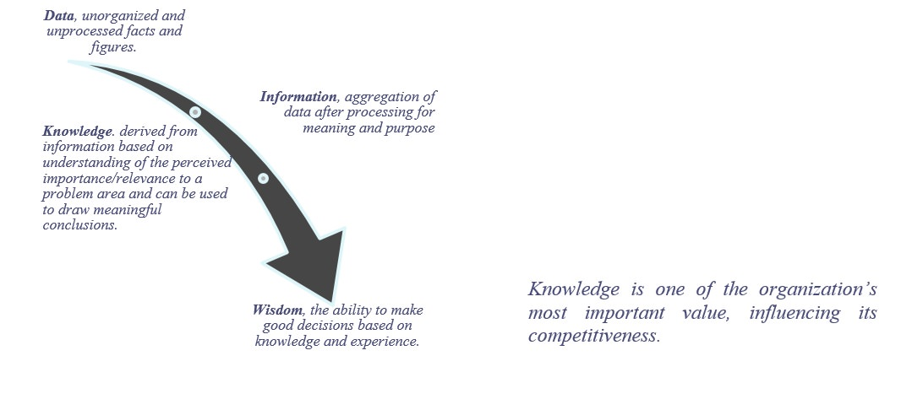
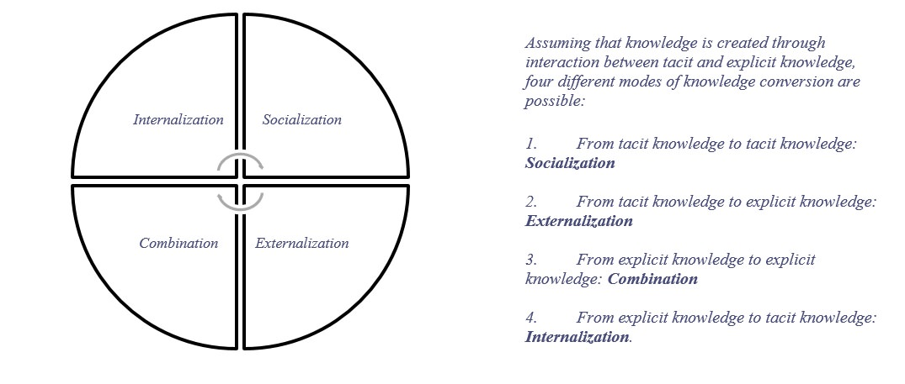
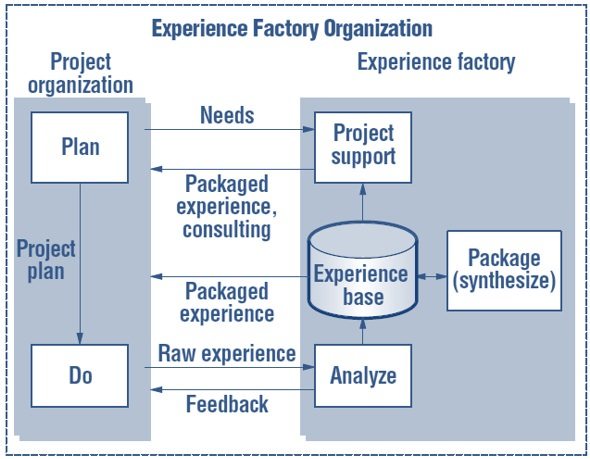

# Description 

Knowledge Management (KM) is a discipline that crosses many areas such as economics, informatics, psychology and technology. KM is seen as a strategy that creates, acquires, transfers, consolidates, shares and enhances the use of **knowledge** in order to improve organizational performance and survival in a business environment.

According to literature, there are two main types of knowledge which are **tacit** and **explicit**. Tacit knowledge refers to personal knowledge embedded in individual experience and involving intangible factors. This type of knowledge can be considered to be very difficult to transfer. On the other hand, explicit knowledge refers to the one that has already been documented and articulated into formal language, and can be much more easily accessible and transferred among individuals. Hence, one of the key functions of a KM strategy is to make tacit knowledge explicit.

In **Software Development**, KM is seen such as the process across the different phases/stages of the SDLC, that involves a cycle of exchanging tacit knowledge and converting it to explicit knowledge and then re-formulating it through an individual's experience and other factors (such as belief, perspective, and values) into tacit knowledge. Therefore individuals are the most important actor in KM, individuals performs through social and collaborative work tasks among the people in an organization to create, share, amplify, enlarge and justify the knowledge over an organizational setting. KM is expected to be **integral part** any software development environment.

# Overview

What Is Knowledge?

Knowledge has many interpretations and having different meaning at different contexts. Knowledge is a **"Process of Knowing"**. Someone with knowledge has the **"Capacity to Act"**. Knowledge is dynamically created, and is **intrinsically linked** to people, and is the basis of all action. Knowledge is not data or information, and should not be viewed as an object that can be leveraged by simply investing in Information Technology to manage it.

What Is Knowledge in Software Development?

The demands on software development in most industries and domains are increasing. Shorter time-to-market, better quality and better productivity are more and more goals to be achieved. To meet these requirements, most organizations have tried to better use one of its most important resource: the organizational software engineering knowledge. Historically, this knowledge has been stored on paper or in people's mind. Unfortunately, paper has limited accessibility and it is difficult to update.

Although every software development project is unique in some sense, similar experiences can help developers to perform their activities. Software developers spend great effort developing programs, specifications, and models, while at the same time participating in close people-to-people interactions as members of software teams. Reusing knowledge can prevent the repetition of past failures and guide the solution of recurrent problems:

By example, the sharing of lessons learned are one of the most important informal knowledge. Lessons learned are gained as a result of the work of the organization itself. They may describe both successful reports and problems. Successful lessons capture positive responses to crisis. Problem lessons address things that went wrong, and potential ways to solve the problem . Reuse of lessons learned from past software projects promotes good software development practices and prevents the repetition of mistakes.

Knowledge Management in Software Development

In the context of software development, KM can be used to capture the knowledge and experience generated during the software process. KM is simply about getting the right knowledge, to the right person, at the right time, in the right context.

There are many approaches to how software should be developed, which also affect how knowledge is managed. A main difference between methods here is if they are plan-based or traditional, which rely primarily on managing explicit knowledge, or agile methods, which primarily rely on managing tacit knowledge

So, to be effective, a knowledge management process should be integrated to the software development process. In this context, knowledge management systems can be very useful, a knowledge management system facilitates creation, access and reuse of knowledge, and its main goals are to promote knowledge growth, communication, preservation and sharing.

In software engineering, reusing life cycle experience, processes and products for software development is often referred to as having an **Experience Factory Organization**. In this framework, experience is collected from software development projects, and are packaged and stored in an experience base. By packing, we mean generalizing, tailoring, and formalizing experience so that it is easy to reuse.

The basis for the **Experience Factory Organization** concept is that software development projects can improve their performance (in terms of cost, quality, and schedule) by leveraging experience from previous projects.

The EFO approach split the responsibilities to maintain the experiences into two distinct organizations. We call these organizations the Project Organization, which uses packaged experience to deliver software products, and the Experience Factory, which supports software de velopment by providing tailored experience.

When using EFO, not only must the organization add another suborganization for learning, packaging, and storing experience, but it also must change the way it does its work.

# Proven Practices

**Clearly identify business problems and align knowledge management project with overall business objectives**.

Like any other software project, KM projects goals and objectives must be aligned to high-level objectives. This will give visibility to management about how KM activity going to solve business problems.

Business goals, strategies, and corresponding software goals were made explicit. If Business Goal is "Improve customer satisfaction". This business goal might have been made by the organization due to the business problem such as so many post-release issues in the recent deliverable. To achieve this business goal and to solve the business problems, software team could sets their goal to "Improve System test Effectiveness".

For achieving software goal of "Improve system test effectiveness", software project managers from their view point define their team's goals, refine those goals down to specifications of data to be collected, and then analyze and interpret the resulting data with respect to original goals. Such goal is then refined into specific questions that must be answered in order to evaluate the achievement of the goal.

At this level, KM project measurements must be linked to the above metrics, so that KM project will be aligned with overall business objectives.

**Define clear roles and responsibilities to lead KM practices**.

For successful implementation of KM, a well-staffed team and strong leader, with clearly defined responsibilities are essential.

Normally, exists a KM team leader selected by based on individual's expertise on project management skills, people skills. As a KM team leader, its responsibility of team leader to give guidance in organizing content and apply project management skills. In addition to this, he has the responsibility to improve his broad knowledge on various software sub-teams and start interacting with team members to contribute to KM.

KM team members will be subject matter experts from each sub-team within the software division. They include members from software development team, testing team, automation team, etc. As a KM team member, he/she must be familiar with content and process involved. It's the responsibility of team members to categorize information efficiently. They must be monitoring content regularly and should assess the relevance of existing information. This is particularly useful if other teams looking for relevant information, they will be prevented from information overload.

If the required KM skill sets are available with-in the team or there is scope to develop these skills with-in the teams, it will be good to have KM roles integrated in project teams. Due to this, the gap can be narrowed b/w KM and rest of the teams. But, it will be hard to define what percentage of project activities should be used for formal KM, as it varies based on the size of team, amount of tacit knowledge need to be converted and the complexity of the required knowledge.

**Implement KM in phased approach**.

Similar to incremental approaches applied to various software development projects, KM also needs an incremental approach with different phases. This will reduce the amount of risk involved in these KM activities.

Divide the KM solution into various parts and address specific parts of KM solution in each phase. By laying foundation for next phase, each phase must provide immediate benefits and provide measurable ROI.

For instance, this can be made effective by addressing the need of unified access to existing information as part of initial phase. And in the later phases address the need of improving the way knowledge is captured from various software sub-teams and managed.

**Customize KM technical infrastructure to make it user-friendlier**.

An organization KM system is the collection of information technologies used to facilitate the collection, organization, transfer and distribution of knowledge between various teams in software division.

Software developers are using various technologies such as document libraries (ex: Google docs), Knowledge Bases (wiki, etc.), blogs, forums, SharePoint, organization intranet, etc.

For instance, the wiki is an extremely powerful KM tool for creating, maintaining, and accessing knowledge bases. Since the introduction of the wiki technology in the early 2000s, many organizations have adopted the wiki for many of their knowledge bases.But, there are few disadvantages to wiki, as wiki platforms have a bit of learning curve. Team members have to dig into learn how to use it. If it becomes complex, team members will be reluctant to contribute to KM systems.

This kind of pros and cons exist in almost all the technologies. For this reason, KM has to maintain/organize the technical infrastructure to make it user-friendlier. They can customize the KM system to rely on multiple technologies based on the team member's convenience.

So, success of KM depends on how well we customize technical infrastructure to make it easy to find the information from the KM systems. That means, if development team members are looking for some information related to test teams, they should easily find the information about the test team and more importantly the relevant information.

**Encourage employees to contribute to KM by knowledge reuse and sharing**.

As discussed earlier about the model of knowledge conversion (Nonaka) between tacit and explicit knowledge, software teams must be encouraged to contribute to these conversion activities.

Conduct as much knowledge sharing sessions as possible within the teams and across the teams. This can be conducted in various instances such as whenever major issues noticed while development, new lessons learnt while carryout particular development/testing, discussion on show stopper issues and the way to debug it, etc.

The KM leaders are responsible to decide which topic and how frequently the knowledge session should be held based on work priority. This is to ensure that the sharing sessions will really benefit the engineers and suits to their interest as well.

**Make knowledge acquisition process continuous**.

KM is not an end itself. The knowledge acquisition process must be continuous in order to keep all knowledge up-to-date and ensure new knowledge is captured from time to time.

To support this, proper process needs to be defined as well, so that team members will record all related knowledge into the database. If a team member wants to share his tacit knowledge on a particular software, process, new methodologies, he should be given idea on the ways of sharing his knowledge with other team members, teams at organization level and ways of converting into explicit knowledge.

By doing this, knowledge acquisition task will be formalized within the software teams. This will help KM team to capture knowledge gained by the team members in a more effective way and continuously.

Another aspect of managing the knowledge in KM systems, involves handling special cases, such as team members who leaves the company. KM team needs to be able to make sure other team members do not waste time trying to contact that person while preserving the knowledge they have contributed.

**Review the KM project regularly**

KM projects must be reviewed regularly to assess what's missing and finding ways to better organizing knowledge. The review begins by breaking the information into two main categories: What knowledge currently exists and what knowledge is missing

Once the location or source of the missing information is identified, KM teams can begin to structure the relevant information so that it can be easily found.

One of the common mistakes most of the teams do while review process is more emphasis on cataloguing existing explicit information assets or the information that is documented, transferable and reproducible (ex: test reports, project proposals etc.,)

But, during review process, there should be more emphasis on reviewing the cycles of knowledge conversion.

**Balance between technology, culture and practice**.

For KM to be successful, there must be balancing act between Technology, culture and practice. This can be achieved by placing the desire of people to use/involve in KM activities ahead of the technology. This needs cultural change within the teams and support from the management.

For team members, if given the required time, training and incentives, they will begin to capture, manage and share knowledge with enthusiasm.

Overall, cultural changes of this magnitude take time, so they have to practice this continuously to see the results of KM.

**Share the success stories of KM practices at organization level**.

Normally, two thirds of KM effort needs to focus on non-technical issues such as culture and practice. For making this effective, must use motivational approaches such as sharing success stories about KM implemented recently within their organization. These positive impacts could be how the tools development process has been improved, quick fixing of the tools issues, reduced attrition rates and shortening skills gap within the test development team. By doing this, it will stimulate the team member's curiosity to involve in KM activities and help the KM team to apply KM methodologies in other parts of the organization.

# Sub-Capabilities

## Knowledge Management Process

A knowledge management project should support the activities that comprise a knowledge process. According to Staab a knowledge process involves the following steps:

-   **Creation**: The contents need to be created or converted, so that they fit the conventions of the company. Creation of computer-accessible knowledge typically moves between the formal and informal knowledge. It is also possible to import knowledge. Importing knowledge items into the KM system has the same or more importance than creating them.

-   **Capture**: Once you create knowledge items, the next step is to capture their essential contents. Knowledge items have to be captured in order to determine their importance and how they mesh with the development team vocabulary conventions.

-   **Retrieval and access**: This step satisfies the searches and queries for knowledge by the knowledge worker and dissemination of knowledge in a proactive manner.

-   **Use**: The knowledge worker will not only recall knowledge items, but will process them for further use. Many KM systems assume that once some relevant document is found, everything is done. Eventually, however, the way to use knowledge from the organization's collective memory becomes quite involved. Topics such as proactive access, personalization, and in particular, tight integration with user task play a crucial role for the effective reuse of knowledge.

| **Iasa Certification Level** | **Learning Objective** |
| :-: | :-: |
| **CITA- Foundation** | -   Learner will be able to name the steps in the KM Process and understand what they are.
| **CITA -- Associate** | -   Learner will be able to identify and describe the differences between the steps of a basic SDLC (conception, requirements, development, test, transition, deployment) and the steps of the KM process
| | -   Learner will be able to identify the joint points between the SDLC and the KM process.
| **CITA -- Specialist** | -   Learner will be able to identify and describe when it is most appropriate to use the different steps of the KM Process whit different SDLC, and highlight the advantages and disadvantages of each
| **CITA -- Professional** | -   *Learner will be able to customize the KM Process to get advantage over the different SDLCs and identify what is the most effective thing to do*
| | -   *Learner will know the risk of missing out activities defined in the KM process and be able to justify this where appropriate*

## Knowledge Management Infrastructure (system)

To support the KM process, knowledge management infrastructure should be provide to facilitate knowledge access and reuse. In order to facilitate communication and information exchange, a community may define a standard domain-oriented vocabulary using ontologies, this includes definitions and indications of how concepts are inter-related, which collectively impose a structure on the domain and constrain the possible interpretations of the terms. Ontologies are particularly important for KM. They constitute the glue that binds KM activities together, allowing a content-oriented view of KM. Ontologies define the shared vocabulary used in the KM system to facilitate communication, integration, search, storage and representation of knowledge.

The organizational or project memory (OM) must be at the core of this infrastructure, supporting knowledge sharing and reuse. Arranged around the OM, knowledge management services shall actively provide useful information to users working on knowledge-intensive tasks. These knowledge management services correspond to the activities of the knowledge management process: creation, capture, retrieval, access, dissemination, use, and preservation of the organization's knowledge.

The primary requirement for an OM is to prevent the loss and enhance the accessibility to organizational knowledge by providing a centralized, well-structured knowledge repository.

Typical utilization scenarios comprise discussion groups, search engines, information filtering, access to non--textual information objects, and expert--user communication. In these applications ontologies serve as "specifications of discourse in the form of a shared vocabulary".

| **Iasa Certification Level** | **Learning Objective** |
| :-: | :-: |
| **CITA- Foundation** | -   Learner will be able to name the various types of tools and techniques used by the current organization and understand what they are used for
| | -   Learner will be to identify the set of types of tools to be used
| **CITA -- Associate** | -   Learner will be able to use a number of the tools and techniques
| | -   Learner will be able to identify the common use scenarios for the KM infrastructure
| | -   Learner will be able to identify the different common concepts ontology for the KM infrastructure
| **CITA -- Specialist** | -   Learner will be an expert in some of the tools and techniques and be able to highlight the advantages and disadvantages of each
| | -   Learner will be able to identify the most favourable use scenarios for the KM infrastructure
| | -   Learner will be able to define the concepts that underlying the KM ontology
| **CITA -- Professional** | -   *Learner will be able to drive the introduction of new tools and technique into the organization*
| | -   Learner will be able to design the use scenarios for the KM infrastructure
| | -   *Learner will be able to define the ontology for the OM*

# Resources

**Articles:**

1.  Johnson, G and Scholes, K (2002) Exploring Corporate Strategy, 6th Edition, Prentice Hall
2.  Ted E. Lee , "Applying Knowledge Management Approach For Software Testing"
3.  Ikujiro Nonaka, "A Dynamic Theory of Organizational Knowledge Creation"
4.  ONG Kein Wei, TANG Mei Ying, "Knowledge Management Approach in Mobile Software System Testing"
5.  Anne Stuart, "5 Uneasy Pieces, Part 2, Knowledge Management," CIO Magazine, June 1, 1996
6.  Tom Davenport, "Known Evils, Common Pitfalls of Knowledge Management," CIO Magazine, June 15, 1997
7.  2010 Global Most Admired Knowledge Enterprises (MAKE) Report --- [www.knowledgebusiness.com/](http://www.knowledgebusiness.com/)
8.  Basili, Victor R; Mikael Lindvall, Myrna Regardie, Carolyn Seaman, Jens Heidrich, Jurgen Munch, Dieter Rombach, Adam Trendowicz (2010). "Linking Software Development and Business Strategy Through Measurement". Computer 43 (4): 57--65.
9.  Alexander Serenko, Nick Bontis, Timothy Hardie, (2007) "Organizational size and knowledge flow: a proposed theoretical link", Journal of Intellectual Capital, Vol. 8 Iss: 4, pp.610 -- 627
10. Research on Knowledge Management System in Enterprise -- Hua Jiang ; Sch. of Economic & Manage., Hebei Univ. of Eng., Handan, China ; Cuiqing Liu ; Zhenxing Cui
11. Knowledge Management http://www.methodsandtools.com/archive/knowledgemanagement.php
12. Tacit knowledge -- http://en.wikipedia.org/wiki/Tacit_knowledge
13. Explicit knowledge -- http://en.wikipedia.org/wiki/Explicit_knowledge
14. Ref. Nonaka I., Takeuchi H., The Knowledge Creating Company, (1995), Oxford University Press
15. Knowledge in software life cycle -- Havlice, Z. ; Dept. of Computer& Inf., Tech. Univ. of Kosice, Kosice ; Kunstar, J. ; Adamuscinova, I. ; Plocica, O.
16. Nonaka, I. and Takeuchi, H. 1995. The Knowledge-Creating Company. Oxford University Press.
17. Dybå, T., Kitchenham, B. A. and Jørgensen, M. 2005. Evidence-Based Software Engineering for Practitioners. IEEE Software 22(1): 58-65.
18. http://www.k-strategian.com/knowledge-based-value-creation/
19. http://en.wikipedia.org/wiki/Knowledge_organization_(management)
20. http://www.epistemics.co.uk/Notes/40-0-0.htm
21. Nonaka and H. Takeuchi, The Knowledge-Creating Company, Oxford University Press, 1995, pp. 284
22. M. Polanyi, The Tacit Dimension, Doubleday, 1967, pp. 108.
23. S. Nerur, V. Balijepally, Theoretical reflections on agile development methodologies, Communications of the ACM 50 (2007) 79--83.

# Author

**Juan Mestas**
*Senior Solution Architect -- Deloitte Ireland*

Juan Mestas is a Senior Architect in the Deloitte Technology Centre of Excellence with more than 15 years of experience in consultancy services and vertical industries, specializing on Enterprise Architecture (EA) and Solutions Architecture (SA).

Juan has successfully held multiple roles throughout his career from defining business processes with both business and technical stakeholders to the designing, prototyping and delivering architecture solutions that supports complex business challenges using a broad architecture and technology approach.

Juan's depth of experience in implementation projects of the main reference Enterprise Architecture frameworks (Zachman, TOGAF, DoDAF, and PEAF), leading enterprise architecture initiatives for the financial industry (banking, insurance) and projects of transformation in large and complex environments (public sector).

Juan counts with strong skills in design, implementation and deployment of complex enterprise solutions within the Microsoft/Oracle/IBM technology stack for different industries (energy, telecom, financial, retail, public sector). Juan is also a Scrum Trainer for Scrum.org (PST), Certified IT Architect Professional (CITA), TOGAF Certified and a MCSD Azure Solutions Architect.