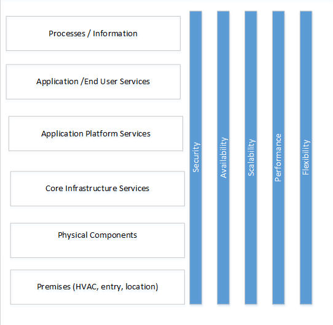

# Description

"Data Centers house critical computing resources in controlled environments and under centralized management, which enable enterprises to operate around the clock or according to their business needs".  Ultimately data centers need to support the applications that the business uses.

Although at a fundamental level all data centers consist mainly of three functional capabilities: processing, storage, and connectivity (networks); the technologies have evolved considerably since the early days.  Originally, a data center was a physical location that housed a mainframe.  The implementation technology has evolved in several significant leaps that have led to the idea of cloud services and even software defined 'virtual' data centers (based on Infrastructure as a service, IaaS).  Along with these changes the way that we realize and take into account the quality attributes that define these data centers has also changed, and it will likely continue to evolve.

The architect needs to understand the trade-offs between technologies based on overall business objectives.  The Architect needs to work closely across a variety of disciplines to deal with physical issues such as data center location, and the construction of the premises; the overall approach to technology such as traditional mid-range servers, data devices and network or perhaps even multi-tenant cloud configurations needs to be based on realistic scenarios with a careful consideration of costs and risk elements along with quality attributes.  Whole system design is important when one considers that in many cases the quality attributes may be defined around application quality attributes but need to be derived from a consideration of components that impact the overall quality attributes (e.g. the availability of an application depends on the availability of the premises, the availability inherent in the infrastructure as well as software considerations).

Infrastructure Architecture -- Infrastructure Building Blocks and Concepts Second Edition (Kindle Location 3607). Laan, Sjaak (2012-01-31).  Lulu Press Inc. Kindle Edition.

# Overview

The architect needs to understand how to make technology trade-offs based on the business requirements for the data center.  These can be significant investments so proper business cases that examine not only ROI, Rate of Return or other measures of financial 'feasibility' of how to provide for basic capabilities need to be analyzed along with a realistic assessment of quality attribute , risk factors in order to make use of the appropriate architectural patterns in the design of the datacenter.   The technology landscape has changed so dramatically that even the way quality attributes are  implemented has changed considerably when real physical 'iron' realizations are compared with 'cloud services'.

**Figure 1** -- Data Center

Figure 1 illustrates the different elements of data center design and shows that the key quality attributes the often are the most important from a data center design perspective.

The database needs to weight off alternative designs based on how well they meet the cost, risk and quality attribute criteria.  The architect needs to work quality driven trade-offs against the available options.  These considerations will help the architect use reference archiectures and modify them accordingly to meet the needs identified in use scenarios.  Techniques such as ATAM are widely used to engage the broader set of architectural stakeholders in these decisions.

**Processes / Information**.  The fundamental reason for the creation of a data center is to house process /information for business end users.  These processes and information processes drive out the major business requirements as well as the cost and risk justifications.  It is at this layer that most of the quality attributes need to be defined.  It is also important to specify the quality attributes in as technology independent manner as possible so that one can properly influence the design.  The starting point is to

**Application / End User Services**. The applications / end user services rely on underlying application platform support services, and technology standards need to support the business attributes identified by the business processes.  The data center ultimately needs to support software and applications -- and therefore software solution architects need to be consulted to drive out both the application architecture and the platform services that are required to support that architecture.

**Application Platform Services.**  Application platform services need to support the applications.  Typically these provide connectivity (such as network capabilities), storage capability, and processing in capability.  In more traditional data centers dedicated servers and network components provide these services.  In cloud based data centers these can be provided in a virtual layer on top of Infrastructure as a service or implemented as the lowest level platform as Platform as a service.

**Core Infrastructure Services.** In traditional datacenters core infrastructure services includes network services (e.g. things like Domain Name Server, Dynamic Host Control Protocol, firewalls), processing services (implemented by mid-range servers) and/or data storage services (e.g. SQL server, or directory services).  Infrastructure as a service provides essentially a virtual model of infrastructure components or a software defined set of core infrastructure services.  Traditional implementations use physical components to implement these services.  With Platform as a Service (PaaS) this layer does not need to be addressed.

**Physical Components** need to be architected and connected to provide core infrastructure services in a physically realized traditional data center.

**Premises** or facility . Describes the actual building, its location and essential services (HVAC, security etc.).   These factors also need to be considered carefully in data center design.

How these layers are design very much depends on the choice of technologies and interacts between each layer.

## Availability

Availability or uptime is an important consideration that needs to be selected based on business needs  It is often recognized by a defined Service Level agreement (contractual) or operational level agreement (internal).  In order to calculate the overall availability of an architecture there are several important considerations.

The availability of underlying components such as the premises or infrastructure is extremely important. Heating, ventilation, air conditioning, power and premises security need to be taken into account  in an overall availability calculation. In the simplest calculation availability is the product of the availability of the key layers.

Availability = IT infrastructure availability X data center availability

(HVAC)

Data center availability from Uptime Institute.

| Tier | Measures | Downtime Expectation |
| Tier 1

Availability: 99.671%

Type: Basic

 | Single path for power and HVAC

No redundant components.

 | Downtime very likely for planned and unplanned maintenance |
| Tier 2

Availability: 99.741%

Type: Redundant Components

 | Fulfills all Tier 1 requirements Single path for power and cooling distribution

Redundant components

 | Downtime likely for planned and unplanned maintenance. |
| Tier 3

Availability: 99.982%

Type: Concurrently  maintainable

 | Fulfills all Tier 1 and Tier 2 requirements.

Multiple Active power and cooling distribution paths.

Online one path active

Redundant components

All IT equipment must be dual powered.

 | No downtime due to planned maintenance.  Downtime unlikely for unlikely for planned maintenance. |
| Tier 4

Availability: 99.995%

Type: Fault Tolerant

 | Fulfills all Tier 1, Tier2 and Tier 3 requirements.

Multiple active power and cooling distribution paths.

Redundant components

All cooling equipment is independently dual-powered including chillers and Heating, Ventilating and Air Conditioning (HVAC) systems.

 | No downtime due to planned or unplanned maintenance. |

The tier classification only describes the availability of the datacenter facilities, not the availability of the IT infrastructure components.

IT infrastructure components have traditionally been assigned availability ratings based on the architectural configuration.  Traditional data centers have used failover, and strategies that increase device reliability (e.g. RAID disk arrays).  However, virtualization allows architectures that support failure across clusters.

Generally greater parallelism in the set up can achieve higher levels of availability -- this increases availability because the overall system no longer has a single point of failure.  If we assume a single system has 99% availability multiple parallel fail-over can achieve a high level of availability.

| Situation | Availability | Annual Downtime |
| 1 system | 99% | 87h 36 m |
| 2 systems | 99.99% | 52 m |
| 3 systems | 99.9999% | 32s |
| 4 systems | 99.999999 | Almost 0 |

IT availability for use with parallel paths used the following:

A = Availability

n-= number of systems in parallel.

A1 -- availability of single system

This approach although useful but is also a very expensive option to achieve high availability.

Virtualization has enabled sharing of resources across multiple clusters. <https://en.wikipedia.org/wiki/High-availability_cluster> provides a good summary of HA for both two and multi-node clusters. As noted in the reference HA clusters also use other techniques to increase infrastructure availability where possible. These include:

-   Disk mirroring ( RAID)
-   Redundant Network connections
-   Redundant Storage area network (SAN)
-   Redundant power supplies (usually grouped with data center tier as provided in the table above).

Cloud technologies have also extended the concepts inherent in virtualization to achieve high virtualization through better sharing of resources.  The following reference "Cloud Application Architectures: Building Applications and Infrastructure in the Cloud", provides a good overview of high availability cloud options.

Generally, the quality attributes like availability help drive the selection of the appropriate high availability architecture.  Availability costs money -- this also needs to be a consideration so that the data center is no overdesigned.

## Security

Security and the related privacy issues have taken front stage.  These issues impact all the layers of data center design.  In a traditional design security includes not only application access remotely but securing the facility.  While auditability of security levels is important areas such as cloud technology have adapted by introducing third party certifications to validate levels of auditability are achieved.

Regional and local issues with PII and laws also are important in data center set up.

## Scalability and Performance

Performance is the ability to meet the user's expectations in terms of 'wait' time: it is hard to define.  Scalability refers to the ability of the system to be able to handle increased loads of various types.  However, since users notice poor performance:

-   It is necessary to be able to quantitatively define especially in terms of service levels that the data center may need to meet. The architect needs to be aware that a performance metric defined on end user expectations through pages served up through an application will be very different to deal with from say simple measure of server throughput.
-   Designs should include testing for performance:
    -   Load testing indicates how a system performs under load.
    -   Stress testing indicates how a system performs under extreme load and when stretched.
    -   Endurance testing show how a system performs under load for long periods.

Scalability refers to the ease with which a system can be modified to handle changing load.  With traditional data centers a great deal of upfront capacity planning and sizing is required. Cloud datacenters help to decouple some of the sizing issues.

Similar to availability performance architecture references need to be evaluated. With cloud computing performance may not be as much an issue as the ability to deal with resource assignments and the proper granularity to add on resources or withdraw resources to cost effectively manages end user performance.  However bottlenecks could exist anywhere in the architecture and need to be addressed. Performance and scalability are deep subjects on their own.

## Flexibility

Flexibility has not normally been included with traditional data center design. It is the ability of the data center to be refitted with current technology.  With a traditional data center upgrades require a lot of investment in hardware.  However, cloud data centers have enabled data center design to be decoupled from its implementation.  In a word cloud has enabled unrivaled levels of flexibility.

## Why Does an Architect need this Skill?

Data Centers are the physical realization of organizations IT infrastructure: they need to support all IT applications and end user services.   Architects need to carefully set the design to an appropriate capability based on business requirements, cost, risk factors, and quality attributes.  The infrastructure architect is the focal point that needs to bring other stakeholders together.  The infrastructure architect:

-   Needs to work with business and application architects to ensure that the data center provides the necessary platform to support end user services and applications.
-   Needs to work with facility and physical architects to work around establishing the facilities design. Practical factors that include the 'tier' level of the data center, HVAC, power feeds, location, etc.  Must be considered in the physical design of the facility.
-   Needs to work senior stakeholders to ensure they understand impact of different decisions. Is a traditional approach going to work or do they need to look at cloud? Perhaps on premises data is a requirement.  As time progresses more data centers -- even private ones -- will rely more heavily on cloud technologies.

The infrastructure architect needs to adapt reference architectures to suit critical scenarios.

Common Tasks Involved with This Skill

The architect will be involved in facilitating the data center design.

-   Assist in creating a requirements document by consulting with various technical, business stockholders and lines of business and identifying data center use scenarios. The architect should review the requirements for feasibility and value proposition.  For example, cloud data centers may require less planning than traditional ones but there may be situations where traditional approaches apply.
-   The architect will assist in defining risk profile for the enterprise related to the use and connection of the data centers.
-   The architect needs to ensure that the data center conforms to the overall technology standards of the infrastructure.
-   The architect has to ensure that the data center design meets all the use scenarios and quality attribute definitions.
-   Architect to involve engineering and operations team in the architectural design to ensure effective and agreed on solution across the design, build and run technology stack.
-   Create a set of data center policies that provide data, software, privacy, and identity management.
-   Assist through the deployment phase of the project, during this step the engineering team will deploy the solution as per design document. The architect should monitor and evaluate the deployment to ensure that it meets defined design and modify procedure or architecture if deemed necessary.
-   The architect need to ensure that the design document is included as part of the project/initiative artifacts. Such information should be readily available for reference by various engineering groups.
-   Familiarity with ITIL is needed to support configuration management activities around data center management.

## What is Their Ownership in this Skill?

The infrastructure architect(s) will lead the architectural aspect of data center design.  This includes working with vendors to help set service level and operational level agreements.

## How does the architect in daily activities use this skill?

The Architect would be expected to be able to:

-   Understand the requirements to work from an appropriate reference architecture and build out the network, storage, and processing components. Other specialty architects in these areas and security will need to be involved. Perhaps more than any other endeavor data center design is collaborative.
-   Understand both physical and logical requirements to achieve desired architecture.
-   Present solution to management and other stakeholders.
-   Understand different technology offerings in the market place, understanding technology landscape will allow the architect ability to design and/or recommend appropriate solution(s).
-   Ability to translate business requirement to technical design.
-   Ability to explain complex technical design in a way that non-technical people may understand.
-   Knowledge of total cost of ownership modeling as it pertains to IT investments
-   Provide guidance on the management of these policies in the context of configuration management processes and service processes such as ITIL.
-   Understand whole system design and how to make quality attribute trade-offs within the infrastructure.

http://www.uptimeinstitute.com/

Infrastructure Architecture -- Infrastructure Building Block and Concepts Second Edition.

# Proven Practices

An architect is responsible for linking technology decisions with business strategy. It is increasingly evident that technology and the business cannot operate independently and there is a paradigm shift from perceiving IT as a cost center to IT as a business enabler. Solution or enterprise architect is uniquely positioned to bridge the gap between business requirements and technical reality.

# Sub-Capabilities

## Sub-Capabilities

| **Iasa Certification Level** | **Learning Objective** |
| :-: | :-: |
| **CITA- Foundation** | -   The Learner should be able to identify the key scenarios and recognize how these requirements match with various data center architecture.
| | -   The learner should be able to describe the different layers of data center design.
| | -   The learner should be aware of the basic data center architectures including both traditional and cloud architectures and the trade-offs that these architectures make.
| **CITA -- Associate** | -   The Associate is able to articulate the key considerations in the design including data center trade-offs between cost, risk control, availability, performance, scalability, security and flexibility.
| | -   The associate must be able to differentiate between different scenario to describe how different policies impact quality attribute trade-offs inherent in those scenarios.
| | -   The associate needs to understand how data center management policies relate to ITIL standards at a high level.
| | -   The associate should be able to use an appropriate reference model to match a given set of user scenarios.
| **CITA -- Specialist** | -   The specialist is able to discuss the architectural implications various kinds of data centers.
| | -   The specialist is able to describe how to manage these data center policies along with architectures to arrive at clear evaluation criteria for scenarios.
| | -   The specialist is able to articulate cost implication of the defined design. Also the ability to articulate cost/benefit analysis based on various solution options.
| | -   The specialist is able to customize areas of the design to meet unique scenarios.
| **CITA -- Professional** | -   The professional will have experience with delivering architectural programs leveraging complex environments and can discuss working with engineering and operational teams.
| | -   The professional has an ability to change their data center design based on further discussion with different stakeholders and explain in detail all the aspects required in making trade-off in the architecture based on requirements and how they impact quality attributes.
| | -   The professional will understand different approaches to data center design in including data center network, storage and processing technologies.
| | -   The professional will be able to articulate the impact of decisions from different layers in the data center design.

# Resources

Uptime institute: [http://uptimeinstitute.com](http://uptimeinstitute.com){:target="_blank"}

Infrastructure Architecture -- Infrastructure Building Blocks and Concepts Second Edition (Kindle Location 3607). Laan, Sjaak (2012-01-31).  Lulu Press Inc. Kindle Edition.

Data Center Fundamentals, understand Data Center Network design and Infrastructure Architecture, including load Balancing, SSL and security.  Mauricio Arregoces et al. Cisco Press 2004.

High Availability Cluster, [https://en.wikipedia.org/wiki/High-availability_cluster](https://en.wikipedia.org/wiki/High-availability_cluster){:target="_blank"}

Architecting the Cloud, Design Decision for Cloud Computing Service Models, Michael J Kavis, Wiley, 2008

Author
======

**Brice Ominski**
*ITAP Consultant -- Microsoft*

Provides thought leadership and practical trusted advice that enables business strategy through technology to C-level and senior management. He is an Information Technology and Architecture Planning (ITAP) advisor for Microsoft who successfully translates business strategy and requirements to propose, develop and implement Enterprise level solutions to meet overall business objectives and manage risk. Recently obtained IASA CITA-P certification