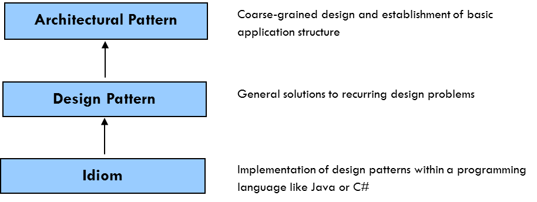
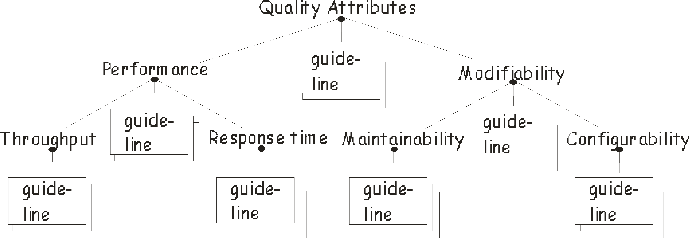

# Description

Object-oriented development and design won a foothold in the early 90s. Another concept introduced at that time was design patterns. A design pattern can be said to be a smaller object model that supports solving different "software design issues" in a general way. A number of design patterns were defined by Gamma et al in the book "Design Patterns -- Elements of Reusable Object-Oriented Software""[GoF]. The book has become a kind of benchmark within object-oriented development.

However, design patterns are nothing new just for the IT industry. Building architect Christopher Alexander wrote his books "A Pattern Language" [ALEX1] and "The Timeless Way of Building" [ALEX2] under the slogan "a successful architecture can be reused." The books describe, for example, how to build flexible office spaces or small parking spaces. Those books were a source of inspiration for Gamma and his co-authors.

A pattern is a three-part rule that expresses a relationship between a certain context, a problem, and a solution. As Christopher Alexander suggests, "Each pattern describes a problem which occurs over and over again in our environment, and then describes the core of the solution to that problem, in such a way that you can use this solution a million times over and over, without ever doing it the same way twice."

Design patterns have become increasingly important as architecture and component-driven development emerge. Architectures could be described or classified in different so-called architectural styles, which actually are design patterns onto a slightly higher level of abstraction. Styles are broader than patterns and more generalized than patterns. For instance, layered architecture is a pattern that follows a call and return style of interaction. Design patterns are pretty much the software architect's toolbox while designing architectures.

As a practicing IT architect, you should have a demonstrated understanding of pattern concepts, styles versus pattern, and demonstrated competence in deriving and communicating pattern and style.

# Overview

## Why patterns?

The best solutions usually consist of smaller, simple mechanisms that solve problems in a reliable and efficient manner. Large, complex systems are often developed from just such mechanisms. Knowledge of these mechanisms is often found in the heads of individual developers and architects. Design patterns are useful for developers and architects because they:

-   Document simple mechanisms that has proven practice
-   Provides common definitions and descriptions
-   Provides brief descriptions of solutions as a combination of patterns
-   Enables reuse of architectural-, design- and implementation decisions

## Pattern Catalog

For a design pattern to reach proliferation and use, it is required to be documented and categorized in an easy and understandable manner. Such documentation is usually called a pattern catalog. [GoF] gives a suggestion of how a pattern catalog can be designed and how the patterns can be categorized. This categorization has two dimensions, purpose and scope. Purpose defines what a design pattern is supposed to accomplish. According to the [GoF] definition, a pattern has creational, structural or behavioral purpose. Scope defines whether the pattern applies to a class or object, ie instance of the class.

[GoF] has since then received a number of followers in terms of design patterns. Another book that has become a benchmark in the topic is "Pattern-Oriented Software Architecture" by Buschmann et al [POSA]. [POSA] widens the definition of a pattern in various aspects, for instance that a pattern does not necessarily have to be object-oriented.

## Pattern- and problem categories

[POSA] also make a different categorization of patterns than the equivalent in [GoF]. Their classification scheme is based upon two criteria, pattern categories and problem categories. Problem categories provide a problem-oriented view to the use of patterns. Every pattern addresses a specific problem that may arise in a design situation, and this categorization criteria groups patterns into different problem areas.

Pattern categories in its turn are a division of patterns on different abstraction levels. Architectural patterns are patterns used in the coarse-grained design and establishment of architectures. Design patterns extend and refine the coarse-grained design, and are also used in the more detailed design. An architectural pattern is on a higher level of abstraction than a design pattern and has a greater impact on the architecture as a whole. It is still, however, something that presents a solution to a specific recurring problem, as opposed to a style that is rather a categorization of architecture. [POSA] makes a distinction between styles, architecture patterns, design patterns and so-called idioms. Styles are very similar to architectural patterns, but differ in some important respects:

-   Styles describe only the overall structural framework for applications, while architectural patterns define the basic structure of an application
-   Styles are independent of each other, but a pattern depends on the smaller patterns it contains and on the larger patterns in which it is contained
-   Patterns are more problem-oriented than styles. Styles are independent of a specific design situation

Idioms finally, are used within implementation of architecture into a programming language. An idiom was according to the original definition, tied to a specific programming language and only applicable for software.

[

Although [GoF] has been a source of inspiration for the authors of [POSA], they do, to a certain extent, criticize it in respect of the classification of patterns mentioned. As an example, they think that the difference between structural- and behavioral patterns are too vague. Problem categories more explicitly express the problem areas a developer faces when designing software. The scope criterion doesn't really give any guidance for a developer to select a pattern. That is because it doesn't relate to any specific design situation. Scope criterion also isn't applicable to non-object-oriented patterns, such as Layers and Pipes and Filters.

Both [POSA] and [GoF] demonstrate a number of patterns that can be reused during development. You will of course not need all of these patterns every time, but knowing that they exist and their meaning makes it next time easier to find a solution to a problem or to solve a problem in a general way. Once you create your own patterns, you could relate them to existing ones and classify them according to existing classification schemes.

## Evaluation of patterns

How do you know when to use a pattern and in which design situation? One way to evaluate patterns is to relate them to various "non-functional" requirements, or quality attributes. Patterns are often used to solve various "non-functional" requirements. However, these quality attributes are often in conflict with each other.

As well as design patterns, quality attributes are often grouped into different categorizations. Different quality attributes can then further be divided into "subcategories", as for example, performance and modifiabilty in the image below:

[

Performance and modifiability requirements are often conflicting. If you want one, you often have to compromise on the other. Even within a "subcategory" there may be a conflict. The performance attribute as an example, distinguishes between response time and throughput. Optimizing for one can sometimes be detrimental to the other. One example is indexing of a database table. A general rule is that the index improves response time, while throughput declines.

As for modifiability, one can distinguish between configurability and maintainability. Focusing on configurability gives the best possible flexibility. Addressing the configurability attribute may for example concern usage of configuration files and meta-databases. Unilaterally optimizing for configurability will likely have consequences for performance. A guideline could thus read: "If performance is an important issue, so transform the modifiability requirement from configurability to maintainability". Maintainability refers to how well and easily we can maintain our application. During a system's lifecycle, we know for sure that we will have to change program code in a number of different components. Research studies have shown that efficiency drastically drops during maintenance phase, in contrast to development. Therefore it is of importance to consider the maintainability quality attribute.

One way to perform transformations as mentioned above is to apply the right design patterns. Design patterns are designed to make the application code more general, and therefore easier to maintain. Generally speaking, most design patterns are conducive to the modifiability quality attribute, such as maintainability, configurability, interoperability and reuse. Architecture patterns in its turn makes important "trade-offs" those quality characteristics in between.

# Proven Practices

Patterns and styles occur almost everywhere in software design related activities. Patterns are the basic building blocks of leading development frameworks such as .NET and Java. Commonly used patterns, such as factories and adapters, are embedded at different levels in those frameworks. Without knowing it, developers use patterns on a daily basis during design and development.

The "Layers" architectural pattern is probably the most used pattern as the body of structure for entire applications. Most applications follow the structure of presentation, business logic, and database layers.

Patterns and styles follow the trends and hypes within the IT industry in general to a certain extent. The service-oriented architectural (SOA) style was introduced around 2000 and promised to solve all the shortcomings of object-orientation and earlier paradigms within distributed computing. It didn't really come out that way, and SOA has been declared dead since a couple of years. Nowadays the "newbie" among architectural styles is the "Micro Services ". "Micro Services" is "SOA done right" according to the advocates.

However, the generic structure and definition of patterns is timeless, as for instance described by Christopher Alexander, and independent of any hype or trend.

# Sub-Capabilities

## Patterns Recognition, Harvesting and Reuse

Processes and activities related to identifying and harvesting reusable solutions to commonly occurring problems. Patterns are descriptions or templates for how to solve a problem that can be used in many different situations.

| **Iasa Certification Level** | **Learning Objective** |
| :-: | :-: |
| **CITA- Foundation** | -   Learner will be able to name the various types of patterns commonly used by the current organization and understand their purpose
| **CITA -- Associate** | -   Learner will be able to use a number of patterns in their design activities
| | -   Learner will be able to document design patterns
| **CITA -- Specialist** | -   Learner will commonly use patterns in their architecture and design.
| | -   Learner can communicate patterns and their value to others.
| **CITA -- Professional** | -   Learner will be able to act as a mentor for design patterns
| | -   Learner can speak publicly on design patterns and participate in industry forums.

## Leverage of Styles, Patterns and Anti-Patterns

Usage of good styles and well-known patterns, as well as avoidance of recognized ineffective and counterproductive practices (anti-patterns)

| **Iasa Certification Level** | **Learning Objective** |
| :-: | :-: |
| **CITA- Foundation** | -   Learner will be familiar with the concept of patterns and how patterns exist at different levels of granularity e.g. code -> architecture
| | -   Learner will be able to explain patterns they have encountered or used in previous work.
| | -   Learner understands the difference between patterns and styles
| **CITA -- Associate** | -   Learner understands the value and implications of using patterns during design.
| **CITA -- Specialist** | -   Learner will be an expert in design patterns and be able to highlight the advantages and disadvantages of different patterns
| **CITA -- Professional** | -   Learner will be able to drive the introduction of design patterns into the organization

## Pattern Evaluation

Patterns could be evaluated against different quality attributes. Patterns are often used to solve problems regarding "non-functional" requirements.

| **Iasa Certification Level** | **Learning Objective** |
| :-: | :-: |
| **CITA- Foundation** | -   Learner will understand the relation between patterns and quality attributes
| **CITA -- Associate** | -   Learner knows how to balance quality attributes using patterns
| **CITA -- Specialist** | -   Learner is using patterns to balance different quality attributes during design
| **CITA -- Professional** | -   Learner uses architectural patterns and styles to balance quality attributes at the enterprise level
| | -   Learner facilitates balancing and optimization of quality attributes using patterns and styles throughout the organization

# Related Capabilities

-   [Balancing and Optimizing Quality Attributes](boqa.md){:target="_blank"}
-   [Design Methods and Processes](design_methodologies_and_processes.md){:target="_blank"}
-   [Decomposition and Reuse](decomposition_and_reuse.md){:target="_blank"}
-   [Software Architecture and Patterns](software_ap.md){:target="_blank"}

Resources

**Books:**

| [POSA] | Buschmann et al, "Pattern Oriented Software Architecture -- A System of Patterns Vol 1", Wiley 1996 |
| [GoF] | Gamma et al, "Design Patterns -- Elements of Reusable Object-Oriented Software", Addison -- Wesley 1994 |
| [ALEX1] | Alexander Christopher et al, "A Pattern Language: Towns, Buildings, Construction", Oxford University Press 1977 |
| [ALEX2] | Alexander Christopher, "The Timeless Way of Building", Oxford University Press 1979 |

**Blogs/Webcasts/News/Reference Resources:**

[hillside.net/patterns](http://www.hillside.net/patterns){:target="_blank"}

# Author

## Anders Larsson
*Solution Architect -- Softronic*

Anders Larsson has been working in the IT industry since 1994 and for more than ten years within IT-architecture related assignments. His focus is on solution architecture and is primarily working in turning business requirements into realizable solutions. He's also working at the intersection of IT-architecture, technical design and software engineering. Anders has served on the board of Iasa Sweden since 2007 and in recent years as a training manager in Sweden.
