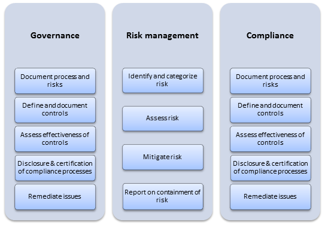
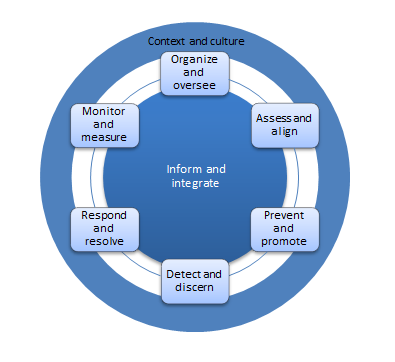
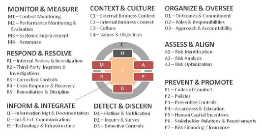

# Description 

Governance, Risk and Compliance (GRC) for an architect is an ongoing effort to ensure business objectives are taken into account in determining the required evolution of an enterprise through supporting prioritization and decision-making process and monitor performance and compliance (defined in laws, regulations, contracts, strategies and policies) against an agreed-upon evolution in support of those business objectives. Mapping ownerships of organizational capabilities and responsibilities to resolve overlaps based on the RACI (Responsible, Accountable, Consulted, and Informed) model are also included in GRC. This model can lead directly to improved business performance, smarter investments, and increased productivity when managed and controlled at an enterprise-wide level.

Wikipedia Definition: Governance, Risk Management, and Compliance are three pillars that normally work together, in conjunction within an organization with the important purpose of assuring that it meets its objectives. Governance is the combination of processes established and executed by the board of directors that reflects the organization's structure, how it is managed, led and driven towards the achievement of its goals. Aligned with the risk management, which involves the prediction and management of risks that could hinder the organization to achieve its objectives, and the compliance with the company's policies and procedures, laws and regulations, a strong and efficient Governance is considered key to organization's success.

# Overview

With a growing regulatory environment, higher business complexity and increased focus on accountability, enterprises are forced to pursue a broad range of governance, risk and compliance initiatives across the organization. However, risks are interdependent and controls are shared which leads to uncoordinated and unmanaged initiatives or getting planned and managed in silos, potentially increasing the overall business risk for the organization. Additionally, duplication of efforts is present due to parallel compliance and risk initiatives causing costs to be uncontrolled. GRC is a discipline with the purpose of coordinating and integrating these initiatives across governance, risk management and compliance through control, definition, enforcement, and monitoring in order to create efficiency, enable more effective information sharing and reporting and avoid wasteful overlaps. The basic concepts of GRC can be explained by the following

-   Governance -- The overall management approach and oversight role and process to manage and mitigate business risks
-   Risk management -- The set of processes through which management identifies, analyzes and responds (if and where necessary) to risks that might affect the realization of business objectives, enabling the organization to evaluate all relevant business and regulatory risks and controls and monitor mitigation activities in a structured fashion
-   Compliance -- Conforming to stated requirements, laws and regulations

Note that the capability covered is regarding GRC from a business perspective as a whole. For in-depth knowledge for each of the elements with regards to Business Technology Strategy, consider reviewing the capabilities for each of these in the BTS section.

**GRC and Architecture**

Problems always have solutions and architects are no strangers to problems. Organizations face many complex challenges as they do business in an increasingly complicated global marketplace giving rise to many problems to solve. One of the many ways to solve this problem involves managing the business and developing an integrated approach to risks and maximizing opportunities throughout the enterprise by operational standards -- and making sure they are met. This is performed by making the corporation's governance, risk management and compliance activities more efficient and effective by integrating activities that are usually siloed, duplicative or contradictory to enhance the value. Multiple systems cause confusion due to duplicative and contradictory processes and documentation. Additionally, the redundancy of work and sheer expense of maintaining multiple point software causes the cost of compliance to become unmanageable.

The Governance, Risk and Compliance process

The interrelationship of management, the Board of Directors and key stakeholders provides organizational balance of power, which depends on mutual accountabilities and unfettered exchange of information. The interrelationship needs to work well in order for the organization to obtain maximum value, i.e. clearly articulating an enterprise's objectives, be it financial or nonfinancial, and defining methods by which it establishes and stays within the boundaries that will likely occur when driving towards the objectives. In other words, creating and protecting value by doing the "right" things the "right" way, also called Principled Performance. This is performed by a number of key business processes being subjected to an integrated approach through GRC activities, which are fundamentally interconnected and dependent on similar people, processes and technology. Note that this does not necessarily mean a consolidation effort but applying a common vocabulary, approach and technology infrastructure to GRC processes and coordinating activities. This ensures consistent information flow throughout the organization and enhances efficient resource management. However, GRC usually focus on one area in order to replicate improvements. Here is where architects come in -- we provide a holistic view of the entire GRC process throughout the organization by integrating activities across all functions.

There are eight universal outcomes by applying these GRC functions and capability elements

-   Achieve business objectives
-   Enhance organizational culture
-   Increase stakeholder confidence
-   Prepare and protect the organization
-   Prevent, detect and reduce adversity
-   Motivate and inspire desired conduct
-   Improve responsiveness and efficiency
-   Optimize economic and social value

According to best practice principles, GRC can be broken down into eight functions and capability elements:

1.  Organize and oversee -- The ability to define outcomes, commitment, roles and responsibilities as well as approach and accountability
2.  Assess and align -- The ability to identify, analyze and optimize risk mitigation
3.  Prevent and promote -- The ability to define code of conduct, policies, preventative controls, awareness and education, human capital incentives, stakeholder relations and requirements and risk financing/insuring
4.  Detect and discern -- The ability to define hotline and notification, inquiry and survey and detective controls.
5.  Respond and resolve -- The ability to perform internal review and investigation, third-party inquiries and investigations, corrective controls, crisis response and recovery as well as remediation and discipline
6.  Monitor and measure -- The ability to define context monitoring, performance monitoring and evaluation, systematic improvement and assurance
7.  Inform and integrate -- The ability to define and perform information management and documentation, internal and external communication, technology and infrastructure
8.  Context and culture -- The ability to define and incorporate external and internal business context, culture, values and objectives

The GRC capabilities

**Enterprise Architecture**

By working with architects who own or share a specific GRC sub-capability element, enterprise architects should manage all GRC concerns associated with sub-architect capabilities, such as GRC capabilities regarding control environment in terms of laws, regulations and business requirements. The enterprise architects have a holistic view of how the enterprise operates with integrated GRC capabilities. The enterprise risk management is linked to performance management, where the architect uses the enterprise view to help the organization meet its strategic plans and objectives while staying within mandatory and voluntary boundaries.

The enterprise architect will interact at the highest levels of GRC management to ensure management has appropriately handled GRC concerns supporting prioritization and impacting key enterprise business and technical decision-making processes.

**Solution Architecture**

Solution architects will most commonly manage GRC concerns while working with the PMO, project manager, project sponsor and different stakeholders for each initiative and function (legal, finance, risk management, compliance etc.).

**Business Architecture**

With an added focus on business focused GRC concerns impacted by technical change, business architects model and analyze GRC issues. They will understand, model and assist in integrating GRC initiatives associated with legal, finance, capital, compliance and operations to understand where governance, risk and compliance exposure impacts strategic planning and portfolio management. Business architect will oftentimes work with their associated business leadership or function at the director and VP levels to analyze critical governance, risk and compliance factors for each of function. The business architecture will contain details required in addressing governance, risk and compliance exposure and impacted areas towards business goals, processes and capabilities.

**Information Architecture**

Information architects address the risk of information exposure and poor information security planning in terms of usage, information storage and retrieval, transformation and transmission. They are concerned with understanding and analyzing risks which impact the overall use of information in the enterprise.

**Infrastructure Architecture**

The infrastructure architect will analyze data center, network, storage and IT operational risks such as device security. They will develop risk models with the risk management office to offset technology capital risk exposure as well as network security.

**Software Architecture**

The software architect is responsible for addressing software development and deployment related risk exposure and analysis. Software risks include the security and use of software intensive systems. These include software hacks (security) but also business critical risk associated with software function and use.

# Proven Practices

Governance, Risk and Compliance is not just one particular subject, discipline or endeavor. It is the attempt to develop a unified approach to interrelated tasks and events within an enterprise. The Board of Executives of any enterprise want to know whether the organization is aptly protected against potential risks thereby defining and understanding risk tolerances of the enterprise, managing them and ultimately optimizing the risk/return of the business. Furthermore, both customers and regulatory agencies demand increased accountability and transparency of corporate executives and board of directors. The costs associated with compliance are also increasing significantly while at the same time resources are being stretched thin. These are highlighted in each sub-capability, where the architect must balance the need of delivery on execution, management of stakeholder expectations, roles and responsibilities, and communication of architectural details that relate to GRC, e.g. risk management activities, which is essential for most capability areas.

The GRC Capability Model according to the Open Compliance and Ethics Group

**Benefits of GRC and Architecture**

According to a recent note from Gartner, "*For Sarbanes-Oxley, we put the burden on a global Bank at about 0.2 percent to 0.4 percent on EBITDA. So if the Securities and Exchange Commission is one of 370 regulators for a global bank -- to approach each regulatory program individually would eat up all the profits. Lots of companies have separate compliance programs for every regulatory regime. As regulatory regimes proliferate, a comprehensive compliance program keeps regulations from depressing earnings*". An integrated GRC approach enables an organization to integrate and streamline these individual compliance initiatives, so it can significantly reduce the cost of compliance. This is where architects with a more holistic view and technology depth can prove to be a very valuable asset.

By integrating architecture into GRC activities the organization will gain the following benefits:

1.  Integrating GRC departments to leverage domain knowledge and mitigate risks, breaking silo-based functions, improving communication and becoming a business partner
2.  Steering thought process towards organizational risks and providing a foundation to form a risk oversight committee, playing a pivotal role in educating board members about risks, and an executive level Chief Risk Officer
3.  Understanding the business strategy, drivers, strategic risks, risk impacts, risk appetite and management attitude thereby developing a risk management strategy with better visibility of risks in both business and technical settings
4.  Understanding of GRC activities, integrating functions, business and technical environment, relevant tools and technology to proactively and continuously manage risks to improve resource utilization, allocation and timely addressing uncertainties

**Table 1. Best Practice Scorecard**

|  | **Components** | **Non-existent** | **Partially implemented** | **Effectively implemented** |
| **1** | **Integrated GRC departments** |\
 | x |\
 |
| **2** | **Chief Risk Officer** |\
 |\
 | x |
| **3** | **Risk Oversight Committee** |\
 |  x |\
 |
| **4** | **Risk Management Strategy** |\
 |  x |\
 |
| **5** | **Strategic Risk Assessment** |\
 |  x |\
 |
| **6** | **Risk Culture** |\
 |  x |\
 |
| **7** | **Risk Appetite Model** |  x |\
 |\
 |
| **8** | **Business Partner Relationship** |  x |\
 |\
 |
| **9** | **Risk Reporting & Communication** |\
 |  x |\
 |
| **10** | **Tools & Technology** |  x |\
 |\
 |

# Sub-Capabilities

The capabilities outlined in this section strongly correlate to three distinct capabilities in Business Technology Strategy section, namely Governance, Risk Management and Compliance. For more in-depth knowledge regarding the requirements for an architect in each of these areas, it is recommended to go through each of the before-mentioned capabilities. This section is regarding the business aspect of GRC, strongly affecting the work for an enterprise architect and most of all a business architect.

## Organize and oversee

The capability involves defining outcomes, commitment, roles and responsibilities as well as approach and accountability. The GRC system is organized and overseen to integrate with and when appropriate modify the existing operating model of the business and assigning management specific responsibilities, accountability and decision-making authority to achieve system goals.

| **Iasa Certification Level** | **Learning Objective** |
| :-: | :-: |
| **CITA- Foundation** |

-   Understand how to define decision-making authority
-   Define roles and responsibilities through different techniques in multiple scenarios

 |
| **CITA -- Associate** |

-   Apply techniques to organize GRC system (RACI)
-   Identify areas for integrating GRC system to existing operating model

 |
| **CITA -- Specialist** |

-   Take responsibility for assigning management responsibilities to achieve system goals
-   Lead GRC teams and stakeholders to appropriately address roles and responsibilities

 |
| **CITA -- Professional** |

-   Lead enterprise level GRC organizing and overseeing activities within architecture initiatives
-   Address critical enterprise class GRC initiatives within technical and business activities

 |

## Assess and align

The capability involves identifying, analyzing and optimizing risk mitigation. Risks are assessed and risk profiles optimized with a portfolio of initiatives, tactics and activities.

| **Iasa Certification Level** | **Learning Objective** |
| :-: | :-: |
| **CITA- Foundation** | -   Understand risk mitigation types and classification scheme
| | -   Define and differentiate between primary concepts in risk assessment such as business impact analysis, risk profiles, risk probability
| | -   Understand critical risk identification and analysis tools and techniques
| **CITA -- Associate** | -   Apply risk analysis and mitigation techniques to GRC level scope and interact with stakeholders
| | -   Identify areas for risk exposure, impact, mitigation and the most effective approach
| | -   Support and participate in risk management organization and identification activities
| | -   Awareness and collaboration with risk operations staff and risk operation requirements
| **CITA -- Specialist** | -   Take responsibility for risk mitigation techniques on GRC activities
| | -   Lead GRC teams and stakeholders in risk analysis and to appropriately address risks
| | -   Lead risk identification, analyze exposure and use classification techniques for risks (confidentiality, integrity, availability)
| **CITA -- Professional** | -   Lead enterprise level risk mitigation activities within architecture initiatives and engagement model
| | -   Identify and address critical enterprise class risks in future business and technology strategy and activities

## Prevent and promote
The capability involves defining code of conduct, policies, preventative controls, awareness and education, human capital incentives, stakeholder relations and requirements and risk financing/insuring. Desirable conduct is promoted and motivated, while undesirable events and activities are prevented using a mix of controls and incentives.

| **Iasa Certification Level** | **Learning Objective** |
| :-: | :-: |
| **CITA- Foundation** | -   Understand policy types
| | -   Define preventative control techniques in multiple scenarios
| **CITA -- Associate** | -   Apply preventative control techniques to business
| | -   Identify areas which have undesirable events and the most effective approach
| **CITA -- Specialist** | -   Take responsibility for preventative control techniques on business technology activities
| | -   Lead GRC teams and stakeholders to appropriately address desirable conduct
| **CITA -- Professional** | -   Lead enterprise level GRC activities within architecture initiatives for awareness and education
| | -   Address critical enterprise class preventative controls within technical and business activities

## Detect and discern

The capability involves defining hotline and notification, inquiry and survey, and detective controls. Actual and potential undesirable conduct, GRC system weaknesses, stakeholder concerns and events are detected using an extensive network of effective information gathering and analysis techniques.

| **Iasa Certification Level** | **Learning Objective** |
| :-: | :-: |
| **CITA- Foundation** | -   Understand detective control types
| | -   Understand GRC system weaknesses
| **CITA -- Associate** | -   Apply information gathering and analysis techniques for detective controls
| | -   Identify areas for control and the most effective approach
| **CITA -- Specialist** | -   Take responsibility for stakeholder concerns on GRC activities
| | -   Lead GRC teams and stakeholders to appropriately address GRC system weaknesses
| **CITA -- Professional** | -   Lead enterprise level control activities within architecture initiatives
| | -   Address technical and business activities on an enterprise level regarding detective controls

## Respond and resolve

The capability involves performing internal review and investigation, third-party inquiries and investigations, corrective controls, crisis response and recovery as well as remediation and discipline. This involves the ability to respond to and recover from noncompliance and unethical conduct events, or GRC system failures, so that each immediate issue is resolved by the organization and similar issues are prevented or resolved more effectively and efficiently in the future.

| **Iasa Certification Level** | **Learning Objective** |
| :-: | :-: |
| **CITA- Foundation** | -   Understand crisis response and recovery types
| | -   Define response and recovery techniques in multiple scenarios for noncompliance
| **CITA -- Associate** | -   Apply corrective control techniques to business technology activities
| | -   Identify areas for crisis response and recovery and the most effective approach
| **CITA -- Specialist** | -   Take responsibility for crisis response and recovery techniques business technology activities
| | -   Lead GRC teams and stakeholders to appropriately address GRC system failures
| **CITA -- Professional** | -   Lead crisis response and recovery activities within architecture initiatives on an enterprise level
| | -   Address critical enterprise class unethical conduct events and noncompliance within technical and business activities

## Monitor and measure

The capability involves defining context monitoring, performance monitoring and evaluation, systematic improvement and assurance. The GRC system is periodically and on an ongoing basis monitored, measured and modified to ensure it contributes to business objectives while being effective, efficient and responsive to changing environment.

| **Iasa Certification Level** | **Learning Objective** |
| :-: | :-: |
| **CITA- Foundation** | -   Understand monitoring and measuring types
| | -   Define improvement techniques in multiple scenarios
| **CITA -- Associate** | -   Apply improvement techniques within GRC business technology activities
| | -   Identify areas for improvement and the most effective approach
| **CITA -- Specialist** | -   Take responsibility for performance monitoring and evaluation techniques on business technology activities
| | -   Lead GRC teams and stakeholders to appropriately address systematic improvement and assurance
| **CITA -- Professional** | -   Lead enterprise level performance monitoring and evaluation activities within architecture initiatives
| | -   Lead systematic improvement and assurance on an enterprise level within technical and business activities

## Inform and integrate

The capability involves defining and performing information management and documentation, internal and external communication, technology and infrastructure. GRC information is captured, managed and documented to efficiently and accurately be communicated across the extended enterprise and to external stakeholders.

| **Iasa Certification Level** | **Learning Objective** |
| :-: | :-: |
| **CITA- Foundation** | -   Understand communication types
| | -   Define information management techniques in multiple scenarios
| **CITA -- Associate** | -   Apply information management techniques within business technology activities
| | -   Identify areas for communication type and the most effective approach
| **CITA -- Specialist** | -   Take responsibility for information management techniques on technology and infrastructure activities
| | -   Lead GRC teams and stakeholders to appropriately address information management and documentation
| **CITA -- Professional** | -   Lead enterprise level risk information management activities within architecture initiatives
| | -   Lead communication on an enterprise level within technical and business activities

## Context and culture

The capability involves defining and incorporating external and internal business context, culture, values and objectives. This requires the GRC system to address current realities by an understanding of the current culture and internal as well as external business contexts in which the organization operates. This also involves identifying opportunities to affect the context to be more consistent with desired organizational outcomes.

| **Iasa Certification Level** | **Learning Objective** |
| :-: | :-: |
| **CITA- Foundation** | -   Understand culture and value types
| | -   Define context in which the organization operates
| **CITA -- Associate** | -   Apply business context techniques within business technology activities
| | -   Identify the most effective approach to achieve desired organizational outcomes through culture within business and technical activities
| **CITA -- Specialist** | -   Take responsibility for stimulating healthy culture and values within business and technical activities
| | -   Lead teams and stakeholders to appropriately address culture and value issues
| **CITA -- Professional** | -   Lead enterprise level organizational activities within architecture initiatives regarding culture and values
| | -   Address critical enterprise level culture and value activities within technical and business activities

Resources

**Articles:**

[http://www.tomsitpro.com/articles/it-governance-certifications,2-646-5.html](http://www.tomsitpro.com/articles/it-governance-certifications,2-646-5.html){:target="_blank"}

**Blogs/Webcasts/News/Reference Resources:**

Mithell, Scott L. Switzer, Carole Stern. GRC Capability Model "Red Book" 2.0. The Open Compliance and Ethics Group, 2009. Print.

**Training:**

The Open Compliance and Ethics Group as well as the Governance, Risk and Compliance Group offer various training programs in the field.

[http://www.oceg.org/](http://www.oceg.org/){:target="_blank"}

[http://www.grcg.com/](http://www.grcg.com/){:target="_blank"}

**Certifications:**

There are numerous organizations specializing in GRC certifications with an increasing number of certifications involving IT knowledge. The following are a few examples of professional, industry-acknowledged and best practice certifications.

[http://www.grccertify.org/](http://www.grccertify.org/){:target="_blank"}

[http://www.oceg.org/](http://www.oceg.org/){:target="_blank"}

[http://www.grcg.com/](http://www.grcg.com/){:target="_blank"}

# Author

**Farzad Ahmed**
*IT Consultant -- Gartner*

Farzad Ahmed has a firm background in IT Governance within the private and public sector with focus on Enterprise Architecture, business intelligence, business development and total quality management. His current position as Management Consultant for Gartner, focuses on ensuring that IT delivers value to the business and supports their goals, visions and objectives through effective governance, architecture, risk management and portfolio management. In other words, making the IT organization a strategic business partner. Farzad worked formerly as a Management Consultant for PwC where he defined requirements and defined solutions, which he still does.

Farzad Ahmed holds a Master of Science in Electrical Engineering from the Royal Institute of Technology in Stockholm, Sweden, and holds a certification from IASA as well as other industry organizations.

