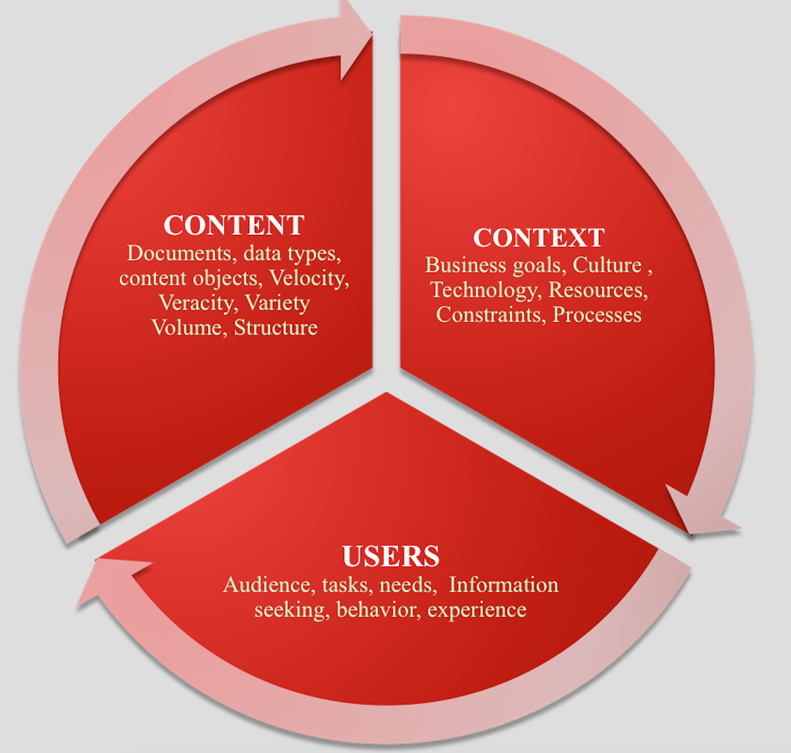
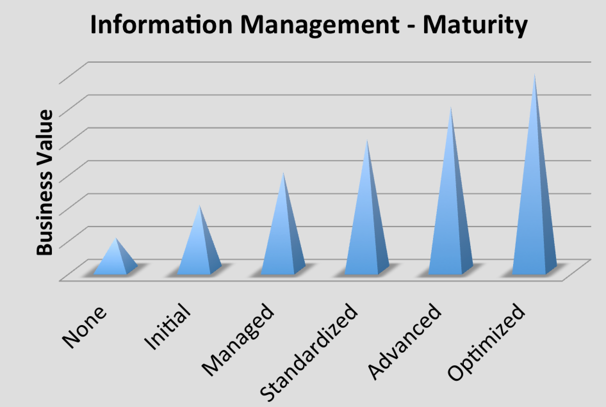

# Description 

**Information management** concerns a cycle of organisational activity: the acquisition of information from one or more sources, the ownership and the distribution of that information to those who need it, and ultimately archived or deleted.

Information is not constant and it keeps evolving.

It's the valuable corporate asset for getting the right information; to the right people at the right time is a key management objective.

# Overview

'Information management' is an umbrella term that encompasses all the systems and processes within an organisation for the creation and use of corporate information.

The most successful organisations are the ones with the most useful and actionable information.

**Architecture for Information Management**

The recipe for success begins with a good, well-rounded and complete architectural approach. Architecture is immensely important to information management success. You can architect the environment in a way that encourages data use by making it well-performing, putting up the architecture/data quickly and having minimal impact on users and budgets for ongoing maintenance (because it was built well initially).

The need of the architecture skills is important because he/she can turn information into business success.

Information management therefore encompasses 3 sections (usually referred as *infamous three circles of information architecture)*:

**Fig Ref:**  *Rosenfeld L.; & Morville P., Information Architecture for the World Wide Web, 2^nd^ Edition, 2002.*

The three sections help to answer other tough questions, too, such as:

-   What research and evaluation methods should information architects be familiar with?
-   What kinds of people should be part of the team that designs the information architecture?
-   What kinds of books and blogs should I read to keep up with the field and its practice?

Each of these must be addressed if information management projects are to succeed.

# Proven Practices

Information management practices is a key focus for many organisations, across both the public and private sectors.

A proven practice for information management involves following of set of principles  :

1.  Manage Complexity (derive and recognise the raw data to manage constraints, example -- external information needs to be authenticated, or how much information has to be derived and where it has to kept etc)
2.  Focus on objective (know what is required)
3.  Obtain Tangible and Visible benefits (information should have a value)
4.  Prioritisation information (show relevant data that carries value)
5.  Identify and mitigate risks (avoid showing risky information , follow organisation compliance guidelines when showing sensitive information)
6.  Aim to deliver long term and seamless user experience (Educate users on what is your objective, aim to provide users consistent look and feel of the information for easy readability)

## Practice: Maturity of Information management capability

Effective information management does not come together all at once. Before adopting an approach, it is important to assess the current state maturity of the information management capability. Below is a diagram that depicts the Information Maturity models with 6 major miles stones: None, Initial, Managed, Standardized, Advanced, and Optimized.

*Source: Gartner (December 2008)*

**Milestone(1) -- None**

-   No formal information management processes/principles exists, information is adhoc or  on need basis.

**Milestone(2) -- Initial**

-   Authority for information exists in IT but wields limited influence on business processes (or vice versa)
-   Business and IT collaboration is inconsistent and heavily reliant on individual data-savvy champion or Information architect in the business in each LOB

**Milestone(3) -- Managed**

-   Ownership and stewardship may be defined in individual LOB
-   Loosely defined processes exist around key applications in LOBs, and information management problems are typically dealt with reactively without systematically addressing the root cause
-   Standardized processes are in early stage among LOBs

**Milestone(4) -Standardized**

-   Business is engaged, a cross-functional team is formed , and Information Architect are explicitly appointed with clear responsibilities.
-   Standardized processes and consistency are established across LOBs
-   A centralized and easily accessible repository of data policies is established, and Information quality is regularly monitored and measured

**Milestone(5) -Advanced**

-   The organizational structure for information management becomes institutionalised and viewed as critical to business across all functions
-   Business takes full ownership for content and policy making of the information
-   Quantitative quality goals for both process and maintenance are set

**Milestone(6) -Optimized**

-   Information Management is a core business process and decisions are made with quantifiable benefit-cost-risk analysis
-   Quantitative process-improvement objectives for the organization are firmly established and continually revised to reflect changing business objectives, and used as criteria in managing process improvement

# Related Capabilities

**Human Dynamics** **:**[Leadership and Management](leadership_and_management.md){:target="_blank"}

**BTS :** [Governance risk and compliance](grc.md){:target="_blank"}, [Architecture Methodology and Frameworks](amf.md){:target="_blank"}

**IT Environment :** [Knowledge Management](knowledge_management.md){:target="_blank"}

**Information Architecture:** [Information Governance and Management](igm.md){:target="_blank"}, [Information Value](information_value.md){:target="_blank"}, [Information Operations](information_operations.md){:target="_blank"}

# Sub-Capabilities

## Information Architecture :  Integration, Security, Quality and Governance

All sub-capabilities encompass a complete information management solution by leveraging technical and business processes to combine data from disparate sources into meaningful, secured and valuable information. A complete data management solution encompasses discovery, cleansing, monitoring, transforming and delivery of data from a variety of sources.

-   **Understand your information and foster collaboration between business and IT -- **Encourage a standardised approach to discovering your IT assets and establishing a common business language.
-   **Cleanse data and monitor data quality -- **Analyse, cleanse, monitor and manage data, enabling better business decisions and improve business process execution.
-   **Transform data in any style and deliver it to any system -- **Integrate data on demand across multiple sources and targets, including Big data, while satisfying the most complex requirements with the most scalable runtime available.
-   **Manage Operations -- **Planning, control and support for structured data assets across the data lifecycle, from creation and acquisition through archival and purge.

| **Iasa Certification Level** | **Learning Objective** |
| :-: | :-: |
| **CITA- Foundation** | -   Learner will be able to:
| | -   Understand the purpose of information, policies, operational and reporting needs of a organisation.
| **CITA -- Associate** | -   Learner will be able to:
| | -   Run brainstorming meetings with stakeholders to estimate value of information and gather concerns, views from functional, operational, delivery and business value viewpoints.
| | -   Generate Information metrics and articulate the context, content and business value of the data.
| | -   Prioritise and Implement plans to support information management projects and initiatives
| **CITA -- Specialist** | -   Learner will be able to:
| | -   Create Impact on organisational information management policies and practices .
| | -   Advise and recommend best practices and techniques for Information management. To delivery sustainable and long term information management model.
| **CITA -- Professional** | -   Learner will be able to:
| | -   Work across multiple organisations and tailor information management techniques based on enterprise needs.
| | -   Justify the needs for best information management practices.

# Resources

**Books:**

[Information Architecture for the World Wide Web, 4th Edition](https://www.safaribooksonline.com/library/view/information-architecture-for/9781491913529/){:target="_blank"} by Louis Rosenfeld; Jorge Arango; Peter Morville *Published by O'Reilly Media, Inc., 2015*

Patterns of Information Management -- by Mandy Chessell, Amanda Chessell, Harald C. Smith Publisher: IBM Press, *Release Date: May 2013* ISBN: 9780133155501

[http://www.dama.org/sites/default/files/download/DAMA-DMBOK_Functional_Framework_v3_02_20080910.pdf](http://www.dama.org/sites/default/files/download/DAMA-DMBOK_Functional_Framework_v3_02_20080910.pdf){:target="_blank"}

**Articles:**

[http://www.oracle.com/technetwork/articles/entarch/oea-best-practices-data-gov-400760.pdf](http://www.oracle.com/technetwork/articles/entarch/oea-best-practices-data-gov-400760.pdf){:target="_blank"}

# Author

**Jaya Mudugal**
*Information & Solution Architect*

Customer-focused Information Architect with 12 years of experience in improvement-based technical project delivery and business analysis. Demonstrated mastery in facilitating evaluation of business requirements to provide suitable technical solution; ability to consistently deliver enhancements and solutions that drive customer satisfaction and loyalty.\
Proven mentor and trainer and can adapt quickly to the organisation's objectives and needs.

