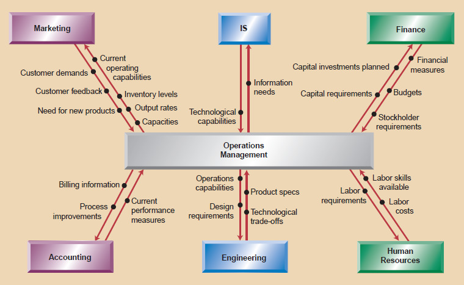

# Description

**Information Operations** is an area concerned with overseeing, designing, and controlling the process of information and redesigning [business operations](https://en.wikipedia.org/wiki/Business_operations "Business operations"){:target="_blank"} for the benefit of the organisation. It involves the responsibility of ensuring that [business](https://en.wikipedia.org/wiki/Business "Business"){:target="_blank"} operations are [efficient](https://en.wikipedia.org/wiki/Efficiency "Efficiency"){:target="_blank"} in terms of using information that is available , and is [effective](https://en.wikipedia.org/wiki/Effectiveness "Effectiveness"){:target="_blank"} in terms of meeting customer requirements.

# Overview

Information Operations is vital part of any architecture as this will measure the success of architecture more than any other area. This area decides on how robust and sustainable your architecture is.

**Architectural view**

The operational characteristics of the Information Architecture holds  significant position to determine the healthiness of information and its flow across various components of Information Architecture . An architect should be able understand the definition and distribution of information across the organisation's IT system's components and focus on the appropriate "Information Service Qualities".

In accordance with the taxonomy of The Open Group Architecture Framework (TOGAF),the notion of Service Qualities that represent a set of requirements, are applicable across the components of Information Architecture.

Hence an architect need this skill to understand/define/enable/manage  the effectiveness, reliability, and efficiency of the Information Services, categorised by :

- **Functional service qualities---**These are functional attributes of the information , such as portability of data and components, the ability to change and adapt quickly to new use cases and workflow behaviours, the request driven provisioning of new functions and information objects, but also required data flows due to compliance and regulatory reasons.

- **Operational service qualities---**These attributes include service availability, scalability, performance indicators measured by transaction throughput or minimum transaction capacity, the capability of information components to grow or shrink in capacity according to the demands of the environment.

- **Security management qualities---**These attributes are usually demanded across the business and technology domain. They include the protection of information from unauthorised access, identity control and management services, authentication services, policy enforcement, reconciliation services and so on.

- **Maintainability qualities---**These attributes include the capability to remotely access relevant components, identify problems and take corrective action, repair or upgrade a component in a running system, find a system when necessary, restore a system to a working state after a failure, and so on.

- **Disaster Recovery service qualities---**These attributes include the recovery of information from relevant components in the event of disasters. It includes Recovery point objectives, recovery time objectives, backup planning, business resumption planning and so on.

# Proven Practices

Today the business challenge is to manage data operations across various LOB's.

Key Business Challenges such as

**Data privacy**

-   Are employees‟ or customers‟ privacy being compromised?
-   Is access to data limited to the authorised people?

**Regulatory Compliance**

-   Are relevant documents preserved for the right amount of time?
-   Are business decisions made using insufficient or untrusted information?

**Information silos**

-   Are your ERP, Risk Management, Supply Chain and Business Unit systems and content stores fully integrated?
-   Do you have established processes to manage the entire information portfolio for your projects, including Environmental, Health and Safety considerations?

**Litigation**

-   Requires Records Management for ESI (Electronically stored Information)
-   Do you understand your records management requirements?
-   Can you provide a fully audited environment that preserves chain of custody?

**Information archival/disposal**

-   Who is responsible for information disposal?
-   What is your policy for archival management?

## Proven Practice : Central and Coordinated Operational Data Repository

A proven practice to address most or all the concerns related to information operations management function mention above is to have the "central and coordinated operational data repository" . The coordinated interaction of Information across LOBs will enable decision making for organisation's success in today's competitive environment.

Fig: Information flow between operations and other business functions

Information Operations is responsible for a wide range of decisions, ranging from strategic decisions, such as designing the unique features of a product and process, to tactical decisions, such as planning worker schedules.

Hence, a good practice is a highly recommended in today's dynamic business environment. Among the trends that have had a significant impact on business are just-in-time, total quality management, reengineering, flexibility, time-based competition, supply chain management, financial management, risk management, and environmental issues.

# Related Capabilities

**Quality Attributes :**[ All Skills](competency_model_m.md){:target="_blank"}

**IT Environment:** [Infrastructure](infrastructure.md){:target="_blank"}, [Governance](governance.md){:target="_blank"}, [Platforms and frameworks](platforms_and_frameworks.md){:target="_blank"}

**Infrastructure Architecture :** [Capacity Planning](capacity_planning.md){:target="_blank"}

**Information Architecture:** [Information Management](information_management.md){:target="_blank"}, [Information Usage](information_usage.md){:target="_blank"}, [Information Governance](governance.md){:target="_blank"}

# Sub-Capabilities

## Sub-capabilities

-   **Economics :** Improvements in costs, efficiency and productivity
-   **Quality of service:** Factors related to how required services are delivered to business including availability, uptime, response times, better change and release management standards etc.
-   **Agility:** The efficiency and speed with which IT responds to business and technology changes.
-   **Stakeholder Management:** Keeping stakeholders happy addressing their views/viewpoints by improving customer satisfaction time to time.

| **Iasa Certification Level** | **Learning Objective** |
| :-: | :-: |
| **CITA- Foundation** | -   Learner will realise that information operations are critical to the business; beginning to take actions (in people/organization, process and technologies) to gain operational control and visibility.
| **CITA -- Associate** | -   Learner will define the information operational services for the organisation to move to a managed environment, for example, for day-to-day IT support processes and improved success in project management to become more customer- centric and increase customer satisfaction.
| **CITA -- Specialist** | -   Learner will influence the senior management/stakeholders to enable information operational services. Helps organisation to gain efficiencies and service quality through standardisation, policy development, governance structures and implementation of proactive, processes, such as change and release management.
| **CITA -- Professional** | -   Learner will be a trusted partner to the business for increasing the value and competitiveness of business processes, as well as the business as a whole.

# Resources

**Articles:**

[https://en.wikipedia.org/wiki/Operations_architecture](https://en.wikipedia.org/wiki/Operations_architecture){:target="_blank"}

**Books:**

[Operations Management: An Integrated Approach, 5th Edition](https://www.safaribooksonline.com/library/view/operations-management-an/9781118122679/) by R. Dan Reid; Nada R. SandersPublished by John Wiley & Sons, 2012

Information lifecycle governance in a big data environment white-paper https://www-01.ibm.com/marketing/iwm/iwm/web/signup.do?source=swg- ECM&S_PKG=ov30597&dynform=13943

# Authors

**Jaya Mudugal**
*Information & Solution Architect*

Customer-focused Information Architect with 12 years of experience in improvement-based technical project delivery and business analysis. Demonstrated mastery in facilitating evaluation of business requirements to provide suitable technical solution; ability to consistently deliver enhancements and solutions that drive customer satisfaction and loyalty.\
Proven mentor and trainer and can adapt quickly to the organisation's objectives and needs.
