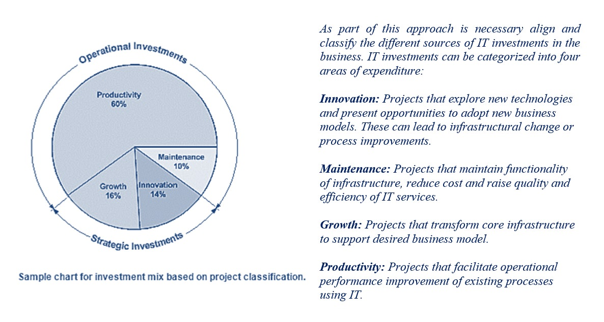

# Description

**Investment, Prioritization and Planning (IPP)** *are a **set of practices** focused on the management of asset and portfolio lifecycle, including planning and managing under a comprehensive understanding of the different investment approaches required for each.*

These practices includes skills on trending, spending, prioritization and portfolio analysis. Common understanding of where IT spends its money, what trends it could be investing in and how technology strategy relates to the project portfolio including project priority.

The concept of **balancing risk and return** is at the centre of **Investment Portfolio Management (IPfM)** discipline, which should applied among the investments as essential part of the prioritization and planning processes. The aim of IPfM is to ensure that all the IT investments are targeted to provide most value to the business, in combination, these investments reflect a balancing of risk and return that is consistent with the **strategic goals and objectives** of the business.

# Overview

Over the years, the process of **Prioritization and Planning IT Investments**, as part of the IPfM discipline, has become increasingly complex because of globally distributed teams, more-stringent governance requirements, and the need for greater transparency.

**« Not every IT project can be funded, so how can organizations make good decisions about which projects to fund, which projects to delay, and which ones to cancel?** **»**

To achieve a **strategic balance** between cost cutting and strategic growth, organizations continually strive to innovate and improve. They work to increase efficiency and transparency across business operations and to increase accountability for successes and failures, but the imbalance between project demand and resource supply is an ongoing challenge.

Given economic conditions that are constantly in flux, the mantra **"do more with less"** has been replaced with **"do more---faster---and with much less".** As a result, decisions about investment and prioritization of IT projects can no longer be based solely on limited analysis or gut instinct. Economic uncertainty adds to the pressure on organizations to do a better job of executing their projects, especially when the projects are new or different, or when they affect the operations of the entire company.

## Investment Portfolio Management (IPfM)

Effective Investment Portfolio Management (IPfM) maximizes the value delivered by IT investments to the business by ensuring alignment of project activity with business strategy on an ongoing basis. The body accountable for IPfM needs timely, accurate information to enable evidence-based decisions to assess risk, evaluate investment options and ultimately decide on which projects to prioritize.

The IPfM team should maintain an investment-wide view based on risks, resources, skills, stakeholders and benefits. By having a single view, they can focus their attentions appropriately to address issues, display agility in responding to changing business demands, provide leadership and direction to project managers, and maximize relationships with third-party vendors.

As we are reviewed the need to accurate information, analysis and collaboration between IT and the IPfM team is vital among the components of this discipline however, most business facing the following challenges with respect its IT investments:

**Limited information:** Most financial information about projects were captured and reported using only spreadsheets. The spreadsheets did not provide the CFO's office with the transparency and depth of analysis needed to make fast, well-informed decisions.

**Limited analysis:** The project selection and management process was also manually tracked with spreadsheets and was based on inconsistent processes and guidelines. A lack of standardization made it difficult for the executives to make effective decisions at the enterprise-approval level.

**Limited collaboration:** - Working with the Architecture group on projects from initiation through closure provided significant benefits. However, too often project objectives between finance and IT were misaligned, causing unclear answers to questions of project ownership, project success, and accountability.

##  Investment Portfolio Management (IPfM): Approach

A simple and common approach to establish a proper IPfM discipline across the organization is:

-   **Simplify the process:** Move from the "old way" to the "best way"

-   **Standardize the activities:** Move from many ways to one way.

-   **Centralize the governance:** Move from many locations to fewer locations.

-   **Automate all of the steps:** Transition from manual to automated processes.

Achieving the right balance of investment across these categories is key to driving appropriate behaviours from IT and delivering on business objectives.

# Proven Practices

## Asking the Hard Questions

The members of the IPfM team quickly realized that before they could identify an innovative solution that would grow with the business, they needed to understand the specific underlying challenges and opportunities in the IT projects proposed for finance. To get this level of information, the team asked the following key questions:

-   Overall, how much should we invest in IT projects?
-   Which IT projects should we fund?
-   Which projects are mandatory and must be completed?
-   Which projects are discretionary?
-   What is the expected return on investment (ROI) for each project?
-   What is the expected ROI for the portfolio as a whole?
-   Which project offers the greatest risk-adjusted return?
-   What are the underlying operational challenges for each project?
-   How can we ensure that the stated project benefits are realized?
-   How can we hold IT accountable for promised costs, quality, and speed?
-   What is the process for recommending a potentially promising IT project?
-   How can interested individuals track the status of a project?

## Simplify: Establish a single scoring process for all projects

**«** **Move from the "old way" to the "best way"** **»**

The business needed to agree on a common set of criteria and values to be used in evaluating all proposed projects. After developing a set of actionable criteria against which to judge all projects, the projects were scored and weighted against the criteria. A common set of values for the scoring criteria includes: business value, risk, strategic value, and mandated or legal initiatives.

## Standardize: Enforce the common process for all projects-

**«** **Move from "many ways" to "one way"** **»**

Once the process itself was simplified, the IPfM team took on the proven practice of standardizing the project submission process. This practice included using a consistent template designed to capture project specifics at the beginning of the submission phase. The template allowed information to be more easily reported and evaluated.

## Centralize: Deliver complete transparency for teams

**«** **Move to "many locations" to "fewer locations"** **»**

Once projects were submitted using the standard template and process, the IPfM team could create a single repository of all projects so the projects could be consistently reported, compared, and analysed across multiple dimensions. The IPfM team also could develop a communication portal to make status information available to all stakeholders. The portal provided a comprehensive view of both current and planned projects included in the IT roadmap.

## Automate: Institutionalize the processes with technology

**«** **Transition from "manual" to "automated" processes** **»**

The old and widely used Excel-driven process, limited the visibility into targeted costs and execution time frames. By automating the process, making it transparent, and using the same methodology across the organization, the IPfM team is able to eliminate the collection of individual rules and reports that had slowed the process. Using a simple, automated, online template also eliminated ambiguity and minimized the time-consuming task of aggregating project data.

# Sub-Capabilities

## Capability Mapping

The process of modeling what a business does to reach its objectives (its capabilities). Using the four-step framework (simplify, standardize, centralize, and automate), the IPfM team implemented an IPP solution that addressed the challenges of creating a new process for managing IT project proposals:

| **Iasa Certification Level** | **Learning Objective** |
| :-: | :-: |
| **CITA- Foundation** | -   Learners will be able to name the capabilities that conforms the approach to implement an IPfM discipline
| **CITA -- Associate** | -   Learners will be able to describe each capability and how it relates to business and IT.
| | -   Learners will be able to describe each capability and understands the main goals for their implementation
| **CITA -- Specialist** | -   Learners will be able to implement the Simplify and Standardize capabilities and address the common challenges into their business during their implementation
| **CITA -- Professional** | -   *Learners will be able to implement the Centralize and Automate capabilities and address the common challenges into their business during their implementation.*

## Supplier Relationship Management

The Supplier Relationship Management process is focused on the identification and management of external suppliers to ensure successful investments in products and services to achieve desired value. One outcome from this process is the development and management of a supplier selection framework by which to evaluate, analyse and make effective decisions on suppliers.

| **Iasa Certification Level** | **Learning Objective** |
| :-: | :-: |
| **CITA- Foundation** | -   Learners will be able to name the industry trends and economic factors that impact into their IT investments portfolio.
| **CITA -- Associate** | -   Learners will be able to align the prioritization and planning with the strategy goals of their organization.
| **CITA -- Specialist** | -   Learners will be able to identify and describe the AS-IS model for the prioritization and planning cycle work in their organization.
| | -   Learners will be able to define the TO-BE model for the prioritization and planning cycle work in their organization.
| **CITA -- Professional** | -   *Learners will be able to implement the IPfM discipline in their organizations providing guidance and leading practices*
| | -   *Learners will be able to determine who should own a technology investment budget according to the implementation of the selection framework for IT suppliers*

## Procurement Management

The Procure Management process is focused on the management of, and the provision of policies, internal standards and advice on, the procurement of goods and services in order to maximize the return of IT investments. Effective IT Procurement must address every stage in the lifecycle, from developing the initial sourcing strategy and execution of the procurement process and implementation, through to steady-state operations and culminating in termination or renewal of the deal.

| **Iasa Certification Level** | **Learning Objective** |
| :-: | :-: |
| **CITA- Foundation** | -   Learner will be able to name some policies, standards or regulations that ensure better procurement practices.
| **CITA -- Associate** | -   Learner will be able to define policies, standards or regulations that ensure better procurement practices.
| **CITA -- Specialist** | -   Learners will be able to identify and describe the AS-IS model for the procurement cycle work in their organization.
| | -   Learners will be able to define the TO-BE model for the procurement cycle work in their organization
| **CITA -- Professional** | -   *Learners will be able to implement an effective IPfM discipline through the implementation of the procurement and sourcing strategy across their organizations.*

# Resources

-   IASA Core Architecture Skills: Getting started with the 5 pillars of IT Architecture

-   Priority Systems
    [http://www.prioritysystem.com/reasons2b.html](http://www.prioritysystem.com/reasons2b.html){:target="_blank"}

-   The Prioritization Matrix: Do spreadsheets really suck?
    [http://spmintersections.blogspot.ie](http://spmintersections.blogspot.ie/){:target="_blank"}

-   Maximize ROI
    [http://www.ccpace.com/asset_files/maximizeROI_whitepaper1.pdf](http://www.ccpace.com/asset_files/maximizeROI_whitepaper1.pdf){:target="_blank"}

-   IT Spending: Innovation Talk vs. Survival Walk\
    [http://www.informationweek.com/it-leadership/it-spending-innovation-talk-vs-survival-walk/d/d-id/1103852?](http://www.informationweek.com/it-leadership/it-spending-innovation-talk-vs-survival-walk/d/d-id/1103852?){:target="_blank"}

# Related Capabilities

-   [Business Strategy](business_strategy.md){:target="_blank"}

-   [Financial Methods](financial_methods.md){:target="_blank"}

-   [Technology Investments](technology_investment.md){:target="_blank"}

-   [Portfolio and Program Management](ppm.md){:target="_blank"}

-   [Compliance](compliance.md){:target="_blank"}

# Author

## Juan Mestas
*Senior Solution Architect - Deloitte Ireland*

Juan Mestas is a Senior Architect in the Deloitte Technology Centre of Excellence with more than 15 years of experience in consultancy services and vertical industries, specializing on Enterprise Architecture (EA) and Solutions Architecture (SA).

Juan has successfully held multiple roles throughout his career from defining business processes with both business and technical stakeholders to the designing, prototyping and delivering architecture solutions that supports complex business challenges using a broad architecture and technology approach.

Juan's depth of experience in implementation projects of the main reference Enterprise Architecture frameworks (Zachman, TOGAF, DoDAF, and PEAF), leading enterprise architecture initiatives for the financial industry (banking, insurance) and projects of transformation in large and complex environments (public sector).

Juan counts with strong skills in design, implementation and deployment of complex enterprise solutions within the Microsoft/Oracle/IBM technology stack for different industries (energy, telecom, financial, retail, public sector). Juan is also a Scrum Trainer for Scrum.org (PST), Certified IT Architect Professional (CITA), TOGAF Certified and a MCSD Azure Solutions Architect.
