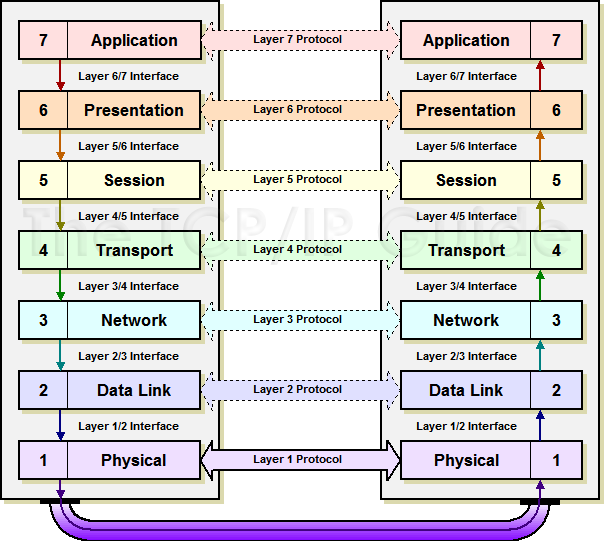

# Description

Are you aware of the categories of IT frameworks? Do you monitor trends/changes to major frameworks, and do you know what the current version of TOGAF is? As an architect, you must understand the different classifications of frameworks used in IT. You must also be able to discern the architectural qualities of different platforms; understand some of the major challenges you will have to overcome when re-platforming, refactoring, or redesigning. Having broad exposure to various platforms and frameworks is critical for some of the reasons shown below.

Depending on the context, the terms *platform* and *framework* have different meanings. In this case, frameworks are the tools employed to provide predictable, repeatable results that include methodologies. For platforms, we are describing the run-time environments that architects use to develop and deploy solutions. The most abstract frameworks may be considered the enterprise architecture frameworks that include Zachman, TOGAF, MODAF, and FEAF, whereas the most tactical may be the operational frameworks such as ITIL and COBIT. Examples of platforms include mainframe, UNIX, and Wintel and, on the application development side, Java and .Net.

Although you do not need to possess expertise in all of these, you do need to have pockets of expertise as well as some awareness and understanding of all of them.

**Definition:**

An understanding of how platforms and frameworks relate to each other and the ability to evaluate frameworks against each other in specific and different contexts.

An architect is expected to have a working knowledge of primary platforms and frameworks used throughout the public and private sectors, with emphasis on the architectural qualities rather than the specifics of the platforms.

**Cost of Not Knowing**

-   No tools implies no architecture
-   Massive IT budget spending on maintenance

**Skills Analysis**

-   I am aware of the categories of IT frameworks.
-   I keep regular tabs on platform and framework trends.
-   I have successfully introduced a framework that "made US money".
-   I lead the adoption process for product and frameworks.

**Concepts:**

A technical platform or framework is a generic technical base that allows simpler or more abstract elements to be deployed within it. A framework provides an API or interface to which one may attach specific functional elements.

Frameworks are a key element to architectural practice. They allow us to do more while creating less, and they are equally applicable to hardware, software, information, or business elements.

Frameworks are essential for the delivery of two major value elements:

-   Cost reduction and new capability

Frameworks often pose significant risks to architecture due to

-   overgeneralization, a dedication to or preference for a particular technology or direction.

**Specialization knowledge areas in regard to platforms and frameworks:**

*Software Architects*: map requirement/constraint to component decisions

*Infrastructure Architects:* map requirement/constraint to component decisions

*Business Architects:* map large-scale frameworks to business goals

*Information Architects*: map information usage to requirement/constraint

## Reflection Points

When is a framework too generic?

How much should a business architect know about platforms and frameworks?

How does awareness of frameworks change across specializations?

How often should an architect update his or her understanding of current platforms and frameworks?

# Sub-Capabilities

## Technical Framework Layering

Often frameworks, platforms, components and technologies use the principle of layering to provide services and capabilities to the layer above. This has the benefit of reduced dependency between layers of the the system. For example, the OSI model provides networking layers as seen below.

| **Iasa Certification Level** | **Learning Objective** |
| :-: | :-: |
| **CITA- Foundation** | -   The learner will be able to identify layers in common frameworks and platform models such as OSI, JEE, .NET, Cloud Computing etc.
| | -   The learner will be able to define the benefits of layering in an architecture
| | -   The learner will be able to label a model of a layered architecture
| **CITA -- Associate** | -   The learner will be able to choose appropriate platforms and layered architectures for systems delivery
-   The learner will be able to model a layered application, system, or technology
-   The learner
| **CITA -- Specialist** | -   The learner will utilize layering effectively in systems they have designed themselves.
| **CITA -- Professional** |

# Resources

**Articles:**

**Blogs/Webcasts/News/Reference Resources:**

**Training:**

**Certifications:**

# Author

**Suresh Tamminiedi**
*Lead Principal Consultant & Architect -- Stammin Inc*

I am a Value-Driven IT Professional working as Lead Principal Consultant, Architect providing IT services for start-ups, SMBs, and large-scale companies with over 13 years of extensive experience. I add value to clients' bottom-line by truly understanding their strategic business needs and leading teams towards finding optimum solutions that aligns with the business needs.

Involved in over 20 implementations as a Solution Advisor, Sr. Consultant, Lead, Architect and management of work streams. Led Teams and mentored other Sr. Consultants, Leads both onshore and offshore. Led and involved in large Global full life-cycle implementations that had employee bases of 50K-100K.

