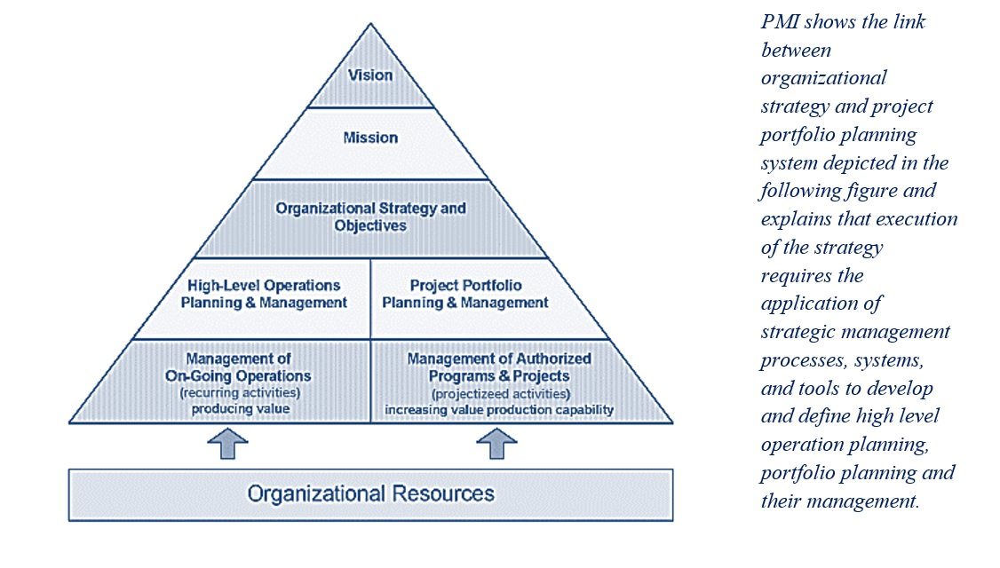
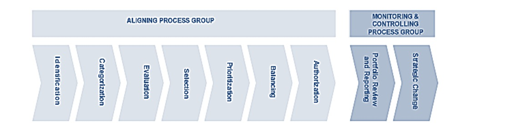

# Description

According to PMI a project is a **"temporary endeavour to create a unique product, service, or results and it lasts for a certain period of time"**. Following on this definition a project is unique and is of definite duration. Scope, Cost and Time are major elements; Quality is ultimately affected by the balance between these three elements.

According to PMI a program is a **"group of related projects managed in a coordinated way to obtain benefits and control NOT available from managing them individually"**. Programs may include elements of related work outside of the scope of the discrete projects in the program. Some projects within a program can deliver useful incremental benefits to the organization before the program itself has completed.

According to PMI a portfolio is the **"collection of projects and programs ordered by priorities in which a company invests to implement its strategy in order to maximize value."** Priorities are set through an appropriate value optimisation process for the organisation. Risk and reward are considered and balanced, and programmes are selected based on their alignment with organisational strategy

The **key** **difference** between a **program** and a **project** is the **finite nature of a project**, a project must always have a specific end date, and else it is an ongoing program. The **key** **difference** between a **Portfolio** and **Program** managements is that it is a process that is clearly characterised by **business leadership alignment**.

# Overview

**« Project management exists in a broader context that includes program management, portfolio management and project management office. Frequently, there is a hierarchy of strategic plan, portfolio, program, project and subproject, in which a program consisting of several associated projects will contribute to the achievement of a strategic plan. »**

Many organizations have large numbers of change initiatives running in parallel, addressing a wide range of factors such as industry trends, globalization, emerging markets and rapid technology innovation all create challenges and opportunities to which businesses need to respond. These "responses" requires continuous change across all aspects of the business that comprises people, processes, organization and technology.

**Portfolio Management (PfM)** is critical for decision making, governance, and to ensure that business objectives are supported by the right set of projects whereas project management is critical to ensure that budget, resource allocation, activity and work are accurate and delivered on time.

**Program Management (PgM)** is the way to provide an "abstraction layer" above the management of projects and focuses on selecting the best group of projects, defining them in terms of their objectives and providing an environment where projects can be run successfully.

## Project Portfolio Management (PPM)

**Strategic changes** to the organizational state are **cascaded down** to a set of projects that are coordinated and managed **as a unit** in **programs**, such that they achieve outcomes and realize benefits **in line with strategic objectives.**

PPM is about **decisions** or choosing to do the right things at the right time. The foundation is formed based on effective delivery, with the triple constraint of delivering the agreed scope, on time and within budget, driving through from decision to completion with an appropriate level of quality. To a certain extent, every project relates to a business objective aimed at creating a competitive advantage. In delivery, perception should be focused on realizing business results and generating better performance.

PPM is fundamentally a funnel-shaped process. The starting point is the organization's strategy that needs to be translated into clear goals and objectives. Corporate strategies sometimes end up at quite a high level, but for the purposes of guiding investment decision-making, this really needs to be at the level of an individual "business driver" and ideally prioritized as well.

The common challenges at this stage are:

-   Initiatives that not only overlap, but also aim to achieve the same end result

-   Initiatives that have no link to the business strategy

-   Attempting to satisfy strategic objectives when there are no related projects in place

-   Initiatives that have overly optimistic and unsubstantiated cost and benefit estimations

Just because a project supports a strategy does not guarantee it a pass into the project portfolio. The project is still competing with other candidates for the limited resources of the organization and thus must go through the organization's standard project portfolio evaluation process. Among the criteria by which the projects will be evaluated is the degree of impact the project has on the organization's strategies. The sum of the individual strategy impact provides an overall project value score.

Certain critical data must be made explicit and communicated to all decision makers. One is the capacity of the organization. The most important is to source the most important and critical projects or to narrow the scope of the strategy.

## Project Portfolio Management (PPM): Processes

According to PMI, PPM Processes are aggregated into two groups:

-   Aligning group

-   Monitoring and Controlling croup

**Aligning Process Group:** How projects will be categorized, evaluated, and selected for inclusion, and managed in the portfolio. The processes within this group are most active at the time the organization refreshes its strategic goals and defines short-term budget and plans for the organization.

**Monitoring and Controlling Process Group:** How to review performance indicators periodically for alignment with strategic objectives. The purpose of this process group is to ensure that the portfolio as a whole is performing to predefined criteria determined by organization as ROI and NPV.

# Proven Practices

## Aligning program and organization objectives

Works with key stakeholders to define the objectives of the portfolio and programs in alignment with those of the organization and develops for each program their strategic vision and roadmap. This vision and roadmap are then used to monitor the program's ongoing alignment with the organization's objectives and to communicate and lead program resources in the same direction.

## Providing specific domain knowledge to achieve objectives

Using a team of people referred to as the Domain's Subject Matter Experts (SMEs) provides specific knowledge based on the program's main objectives. For example, on a large systems implementation, the Domain's SMEs may provide the systems architect, process designers and system engineers to help integrate the overall effort at the enterprise level and help reduce the potential for misalignment.

## Recognizing the importance of organization readiness/transformation

People play the most critical role in a portfolio and program's effectiveness. Resistance to change, inadequate sponsorship, unrealistic expectations, no understanding or management of stakeholder expectations, poor communications or training, lack of skills, and poor change management can wreak havoc on program effectiveness. Take an active role in understanding the stakeholders and their needs and in developing and implementing effective communication and training plans to keep them actively engaged in and informed about the program.

## Enhancing PMO daily management to achieve results

Elevate the PMO by focusing on results and outcomes in addition to the traditional trio of cost, schedule and scope. It extends the PMO's reach, serving as a collaboration point to coordinate the efforts of multiple projects.

# Sub-Capabilities

## Portfolio and Program Governance

The aim of Project Portfolio Control/Assurance is to ensure that projects within a portfolio are carried out with the appropriate methodologies and governance, to help deliver successful projects on time and to maximize the value delivered by IT to the organization.

| **Iasa Certification Level** | **Learning Objective** |
| :-: | :-: |
| **CITA- Foundation** | -   Learners will be able to name the components that conforms the Project Portfolio Control/Assurance discipline
| **CITA -- Associate** | -   Learners will be able to describe each component and how it supports the achieving of benefits to the business.
| **CITA -- Specialist** | -   Learners will be able to implement a consolidate view of financial status across the Project Portfolio
| | -   Learners will be able to define the major milestones and interdependencies among the Project Portfolio and Programs
| **CITA -- Professional** | -   *Learners will be able to define a consistent strategic decision-making processes (around agreed to decisions) together within a common process to managing and leveraging critical/constrained resources.*
| | -   *Learners will be able to define key performance indicators across the Culture, Organization, Governance, Enterprise Communications, Organization Capability and Metrics & Rewards for the business.*

## Program and Project Management

The aim of Program & Project Management is to ensure that each project carried out within an organization has a clear, consistent and rigorous project management methodology.

Effective program management comes from a number of mutually-dependent factors. This includes a formal and rigorous project methodology; formal processes for risk and issue management; clear change-control policies; standardized reporting to convey clear messages to all stakeholder groups; as well as a standardized set of project deliverables.

The Project Management dimensions cover the scope of Program Management and include governance, planning and budgeting, the project management office, quality assurance, risk and issue management and project leadership.

| **Iasa Certification Level** | **Learning Objective** |
| :-: | :-: |
| **CITA- Foundation** | -   Learner will be able to identify the main phases and activities for the methodology of Program and Project Management.
| **CITA -- Associate** | -   Learner will be able to define activities, standards and constraints that ensure better Program and Project Management practices.
| **CITA -- Specialist** | -   Learners will be able to identify and describe the AS-IS model for the Program and Project Management cycle work in their organization.
| | -   Learners will be able to define the TO-BE model for the Program and Project Management cycle work in their organization
| | -   Learner will be able to create a transformation plan to move toward the TO-BE desired model across the business.
| **CITA -- Professional** | -   *Learners will be able to implement an effective PPM discipline through the implementation of the Program and Project Management methodologies, formal processes for risk and issue management; clear change-control policies; standardized reporting to convey clear messages to all stakeholder groups; as well as a standardized set of project deliverables.*

# Resources

-   IASA Core Architecture Skills: Getting started with the 5 pillars of IT Architecture
-   [Distinguishing portfolio management, program management and project management](https://www.projectsmart.co.uk/distinguishing-portfolio-management-programme-management-and-project-management.php){:target="_blank"}
    
-   [Eight Distinctions between Portfolio Management & Program Management](http://leadingstrategicinitiatives.com/2011/07/25/eight-distinctions-between-portfolio-management-program-management/){:target="_blank"}
    
-   [A Concise Guide to the Differences between Programs and Projects](http://leadingstrategicinitiatives.com/2010/10/25/a-concise-guide-to-the-differences-between-programs-and-projects/){:target="_blank"}
    
-   [PMI Body of Knowledge](http://www.pmi.org/){:target="_blank"}
    
-   [PMOver Transforming the Program Management Office into a Results Management Office](http://www2.deloitte.com/content/dam/Deloitte/ru/Documents/Operation/dtt_PMOver_eng_260309.pdf){:target="_blank"}
    
-   [In control: how project portfolio management can improve strategy deployment](http://performance.ey.com/wp-content/uploads/downloads/2013/02/Improve-strategy-deployment.pdf){:target="_blank"}
    
-   [How to implement Management of Portfolios within 100 days](https://www.axelos.com/CMSPages/GetFile.aspx?guid=bbf43295-8481-4a52-afae-220e2b757dda){:target="_blank"}
    
-   [Project portfolio adjustment and balance: a case study in the chemical sector](http://www.scielo.br/pdf/prod/v22n4/en_aop_t6_0007_0160.pdf){:target="_blank"}

# Related Capabilities

-   [Business Strategy](business_strategy.md){:target="_blank"}
-   [Investments, Prioritization and Planning](investment_prioritization_and_planning.md/){:target="_blank"}
-   [Governance, Risk and Compliance](grc.md){:target="_blank"}
-   [Capacity Planning](capacity_planning.md){:target="_blank"}
-   [Managing the culture](managing_the_culture.md){:target="_blank"}
-   [Customer relations](customer_relations.md){:target="_blank"}
-   [Leadership and Management](leadership_and_management.md){:target="_blank"}
-   [Collaboration and negotiation](collaboration_and_negotiation.md){:target="_blank"}
-   [Technical Project Management](technical_pm.md){:target="_blank"}
-   [Compliance](compliance.md){:target="_blank"}

# Author

**Juan Mestas**
*Senior Solution Architect -- Deloitte Ireland*

Juan Mestas is a Senior Architect in the Deloitte Technology Centre of Excellence with more than 15 years of experience in consultancy services and vertical industries, specializing on Enterprise Architecture (EA) and Solutions Architecture (SA).

Juan has successfully held multiple roles throughout his career from defining business processes with both business and technical stakeholders to the designing, prototyping and delivering architecture solutions that supports complex business challenges using a broad architecture and technology approach.

Juan's depth of experience in implementation projects of the main reference Enterprise Architecture frameworks (Zachman, TOGAF, DoDAF, and PEAF), leading enterprise architecture initiatives for the financial industry (banking, insurance) and projects of transformation in large and complex environments (public sector).

Juan counts with strong skills in design, implementation and deployment of complex enterprise solutions within the Microsoft/Oracle/IBM technology stack for different industries (energy, telecom, financial, retail, public sector). Juan is also a Scrum Trainer for Scrum.org (PST), Certified IT Architect Professional (CITA), TOGAF Certified and a MCSD Azure Solutions Architect.