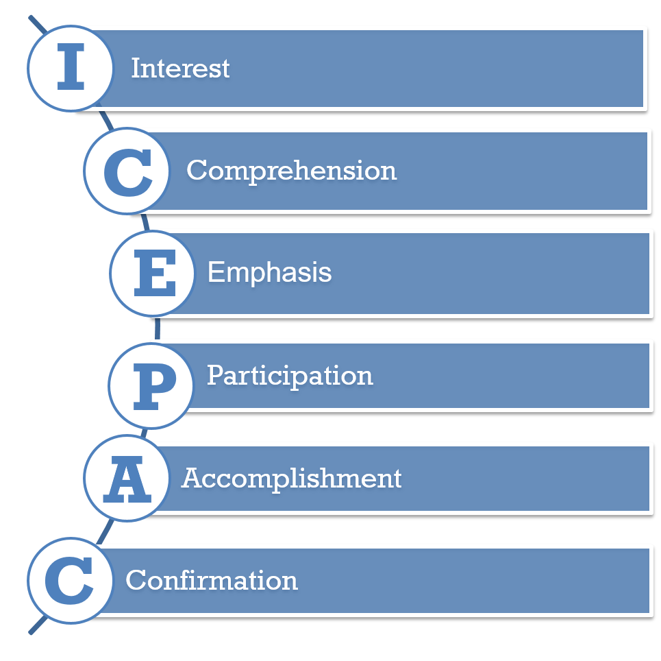

# Description

Presentation skills get back to the old axiom of knowing ones audience. It does one little good to build the perfect presentation in English if the audience only speaks French. Presentations are just another word for communications. Communication occurs when a message is delivered or presented and the receiver understands it. It is our job as the sender/presenter to put the message in a context the receiver can understand. To effectively communicate we must understand our audience and put our communications into terminology they could understand.

# Overview

**Why does an architect need this skill?**

Today's architect must wear many hats including that of presenter. Often the architect will be asked\required to give a presentation of why solution X is the correct solution. Furthermore, the presentation must often include budgetary information, design information, and an analysis of different alternatives. The ability for an architect to clearly and concisely present to decision makers and stakeholders in a manner that conveys the appropriate\required message is paramount. Once the solution is selected the architect will again be tasked to present the status of the project at various times throughout the lifecycle of the project. Lastly, the architect will often provide a closeout presentation and\or documentation on the success or failure of the project.

**Common tasks involved in this skill?**

Frequent email updates to provide and solicit status.

Frequent written and verbal project status updates.

Face-to-face and virtual presentations on the status of the project.

Executive briefings often completed in person with PowerPoint and written documentation leave behinds.

**What is their ownership in this skill?**

The architect must own this skill. This skill is a vital communications piece of the overall project. The clarity, frequency, and relevancy of the presentations will often determine the success or failure of the project.

**Name an example of how an architect would use this in daily activities?**

Preparing daily project updates to stakeholders.

Soliciting updates from project members regarding status.

# Proven Practices

**Describe why an architect should be involved in this skill at a corporate level.**

The architect has the overall responsibility for delivering the vision of the project. As such it is imperative that the architect communicate clearly and in a medium that is useful and understood by the intended audience. Therefore it is incumbent on the architect to select the correct presentation medium to deliver the intended message.

**Primary push back and/or challenges for architects.**

Most architects are highly skilled at their specialty---infrastructure, business, etc.---but often are not skilled at communications. They usually have a vision within their head of what is to be but are challenged to explain that vision to someone so that they clearly understand the intention. Often architects will take the viewpoint that their job is to provide the vision and someone else's job is to provide the documentation. However if the architect cannot clearly communicate\present their vision of the project how can anyone document it?

**How would a stakeholder engage an architect for assistance utilizing this skill?**

The stakeholder may ask the architect to prepare a presentation for a meeting to help explain the intended solution to other departments, senior executives, or outside entities. The stakeholder may understand their area of influence very well but may not be as astute when it comes to the business or industry as a whole. It is up to the architect to bring the entire picture into focus.

ICEPAC is an acronym we can use to develop interesting presentations for conference delivery an stakeholder meetings:

I -- Interest

Spark interest. It seems obvious, but people won't pay attention if they are bored. Help them understand the value, to them, of knowing the information and explain the consequences of not knowing the information. Relate the information to the audience by finding new and innovative ways to present the material, and avoid death-by-PowerPoint or bullet list oblivion.

C -- Comprehension

Check for comprehension, though the softer skill of reading body language and checking for eye contact. Ask questions of people attending meetings and make sure you always spell out the three letter acronyms you use. After all, how many ways is SOA used right now? Would a lead developer and network engineer interpret SOA the same way?

E -- Emphasis

Make sure and emphasize key points so the audience remembers them. A good approach to take is the same one used by trainers, tell them what you will tell them, tell, them, and then tell them what you just told them. To move information from short-term memory to long-term memory most humans need to hear something 2-3 times in 15 minutes. Additionally, stating "This is important" or pausing for a moment or two are good ways to bring attention to what you are saying.

P -- Participation

Participation helps. Most people naturally want to help so if you pose a question to the audience or members of a meeting, you get them engaged and they will then have a vested interest in the outcome. Also, combine listening with doing. People remember doing things better than they remember hearing about things.

A -- Accomplishment

Having you ever attended a meeting with no agenda, no clear idea of what needed to be decided or agreed upon? Feeling a sense of accomplishment is important, especially in a meeting. Make sure and set clear agendas, with goals for the meeting and outcomes you desire.

Before closing the meeting, asked if there are any other topics that need to be covered in that meeting or the next meeting, and recap the decisions that were made, sending meeting minutes highlighting any action items and setting completion dates for each.

C -- Confirmation

Some points about confirmation have already been made, possibly 3 times in this lesson. When closing a meeting with stakeholders, confirm that they understand what the meeting objectives and everyone is clear on decisions made and follow-up in email.

# Sub-Capabilities

## Public Speaking

The ability to deliver a message in front of an audience that is clear, concise and targeted.

| **Iasa Certification Level** | **Learning Objective** |
| :-: | :-: |
| **CITA- Foundation** | -   Learner will be able to prepare an outline for a 15 minute presentation
| **CITA -- Associate** | -   Learner will be able to prepare a basic presentation for a 15 minute presentation
| **CITA -- Specialist** | -   Learner will be able to develop a 15 minute presentation on a given topic to include supporting graphics, PowerPoint file, content, and references
| **CITA -- Professional** | -   Learner will be able to deliver a 15 minute presentation to an audience while demonstrating a mastery of the material, utilizing the proper cadence for the material and audience, demonstrating audience eye contact and engagement
| | -   Learner will answer relevant questions while maintaining control of the presentation

## Information Visualization

The ability to represent complex data and ideas with graphics, charts, diagrams and pictures.

| **Iasa Certification Level** | **Learning Objective** |
| :-: | :-: |
| **CITA- Foundation** | -   Learner will be able to identify key data points within a given set of data
| **CITA -- Associate** | -   Learner will be able to represent identified data points utilizing graphics, charts, diagrams, and pictures
| **CITA -- Specialist** | -   Learner will be able to validate data
| | -   Learner will be able to identify gaps within data
| **CITA -- Professional** | -   Learner will be able to articulate the meaning of the data to a given audience and answer questions regarding that data
| | -   Learner will know how to present data to facilitate overall understanding of the desired message

## Presentation Punctuality and Coherence

The ability to manage a presentation and keep it on-track, on-time, and on-message will often dictate the success of a given presentation.

| **Iasa Certification Level** | **Learning Objective** |
| :-: | :-: |
| **CITA- Foundation** | -   Learner will be able to prepare a 15 minute presentation that is relevant, coherent, and can be delivered in the allotted time
| **CITA -- Associate** | -   Learner will be able to deliver a 15 minute presentation within the given timeframe
| **CITA -- Specialist** | -   Learner will be able to effectively manage a presentation while responding to questions, comments, and distractions
| **CITA -- Professional** | -   Learner will be able to adjust a presentation, on-the-fly, to effectively deliver the intended message based on the interaction and feedback, both verbal and non-verbal, of the audience

## Impromptu Presentation

Utilize a given unscheduled encounter to provide an update or further a project objective or idea. Often times the seeds of a project or great idea are planted during a chance encounter. The architect must be able to utilize these chance encounters to plant the seeds necessary to accomplish the needed objective.

| **Iasa Certification Level** | **Learning Objective** |
| :-: | :-: |
| **CITA- Foundation** | -   Learner will be able to develop a 60 second elevator pitch that describes the current projects or project status
| **CITA -- Associate** | -   Learner will be able to deliver a 60 second elevator pitch that describes the current projects or project status
| **CITA -- Specialist** | -   Learner will be able to adjust the elevator pitch based on the position of the person in the elevator
| **CITA -- Professional** | -   Learner will be able to utilize targeted questioning based on the feedback from the person in the elevator to further the conversation

## Written Presentation

The ability to clearly communicate in the written form. The document should have a beginning, a middle, and an end. The document should convey a message(s), tell a story, which is clear and targeted to the intended audience.

| **Iasa Certification Level** | **Learning Objective** |
| :-: | :-: |
| **CITA- Foundation** | -   Learner can develop a presentation that is free from grammatical error
| **CITA -- Associate** | -   Learner can develop or update a presentation that is free from grammatical error and tells a story that is pertinent to the audience
| **CITA -- Specialist** | -   Learner is able to...
| **CITA -- Professional** | -   Learner routinely evaluates potential investments in terms of the effects they have on company health and performance
| | -   Learner measures and monitors company performance
| | -   Learner evaluates financing and funding options using financial analysis
| | -   Learner can troubleshoot the financial performance of a process or business unit to determine the root causes of poor (or good) performance

## Formal Presentation

Understand the three fundamental flows in a business: information, funds, and goods. Demonstrate knowledge of where and when different flows intersect and why that matters. Demonstrate ability to describe effects on one flow due to activities in one or both of the others.

| **Iasa Certification Level** | **Learning Objective** |
| :-: | :-: |
| **CITA- Foundation** | -   Learner can name and describe the three fundamental flows
| **CITA -- Associate** | -   Learner can identify the three flows in a case study or business
| |-   Learner can describe when the flows intersect and why, and describe what that means
| **CITA -- Specialist** | -   Learner can identify, describe and document each of the flows in their company
| | -   Learner can describe how a project might affect one or more of the flows
| | -   Learner can identify when a project has not considered a flow even though there is likely an effect on that flow
| **CITA -- Professional** | -   Learner demonstrates deep understand of the three flows within the context of his or her company
| | -   Learner can evaluate a potential investment in terms of the effects it might have on each of the flows

# Resources

**Articles/Books**

Atkinson, Cliff, 2005 (copyright 2011). *Beyond Bullet Points, 3^rd^ Edition*. Microsoft Press [http://www.microsoftpress.com](http://www.microsoftpress.com){:target="_blank"}.

Roam, Dan, 2009 (copyright 2008, 2009). *The Back of the Napkin: Solving Problems and Selling Ideas with Pictures*. New York, NY: Penguin Group

**Blogs/Webcasts/News Sources** 

Presentation Skills: Free tips & advice to enhance your presentation skills. Retrieved March 12, 2014, from [http://www.presentation-skills.biz/](http://www.presentation-skills.biz/){:target="_blank"}.

Presentation magazine Retrieved March 12, 2014, from [http://www.presentationmagazine.com/Essential_Presentation_skills.htm](http://www.presentationmagazine.com/Essential_Presentation_skills.htm){:target="_blank"}.

How to Improve Your Presentation Skills by Sarah Kessler Retrieved March 12, 2014, from [http://www.inc.com/guides/how-to-improve-your-presentation-skills.html](http://www.inc.com/guides/how-to-improve-your-presentation-skills.html){:target="_blank"}.

Oral Presentation Skills A Practical Guide by C. Storz Retrieved March 12, 2014, from [http://people.engr.ncsu.edu/txie/publications/oral_presentation_skills.pdf](http://people.engr.ncsu.edu/txie/publications/oral_presentation_skills.pdf){:target="_blank"}.

**Training**

Toastmasters International [http://www.toastmasters.org/](http://www.toastmasters.org/){:target="_blank"}

Presentation Training Institute [http://presentationstraining.net/](http://presentationstraining.net/){:target="_blank"}

# Authors

## Dan Fain 
*Security & Identity Architect -- Microsoft*

Driven executive specializing in applying proven sales, relationship management and professional services background to deliver exceptional technical leadership in both domestic and international environments. 20-year management background with strong experience directing staff members from Australia, Asia, Europe and the Middle East. Effectively apply IT resources to achieve organizational goals while improving efficiency and profitability. Strong technical background includes MCITP, MCSE, IA/CND Level III DoD, CISSP, CITA-P, and CEH certifications and expertise in LAN, WAN and VPN technologies and information systems security.

## **Shrikumar Sharma (co-author)**

