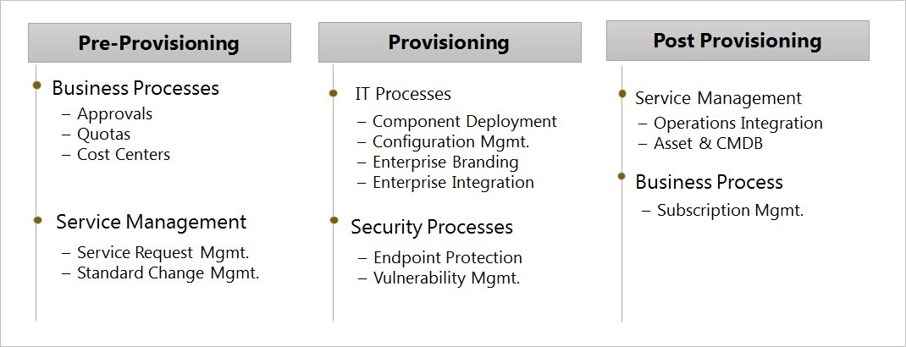

# Description 

Provisioning is a process that focuses on enabling the services defined within a service catalog as per the agreed service level agreements driven through a combination of tools, technologies and processes. Typically, the provisioning process includes the orchestration of business processes, IT processes and service management processes working in tandem to aggregate, deploy and make the services available as per the service definition.

IT Infrastructure provisioning involves the deployment of IT foundational services -- the server, storage, network and associated services including load balancers, security keys, access methods, etc. Over the last few years, with the wide adoption of virtualization technologies across the enterprises has opened up avenues for automated and dynamic provisioning of the foundational services. With enterprises embracing agile development methodologies and cloud services maturing, the solutions that encompass dynamic and automated on-demand IT provisioning methodologies are being architected to meet the agility demands and to deliver optimal value.

# Overview

Why Does an Architect need this Skill?

Provisioning forms part of the technology architecture that details out how the different core IT infrastructure services be bundled together and deployed to meet the service definition. It discusses the building blocks, methods and processes involved in deploying the services. Across enterprises, typical provisioning process involves three major tasks that are shown below

As per TOGAF, Technology Architecture is one of the cog of the Architecture Development Methodology (ADM) and as a part of the technology architecture definition, it becomes imperative to architect and design the provisioning solution that deliver the technology components.

IT Infrastructure provisioning involves the following:

-   Provisioning of servers
    -   Physical/Virtual servers
    -   Cloud based (Private and Public)
-   Provisioning of storage and file system
    -   Traditional storage (SAS/SATA/iSCSI, etc.)
    -   Cloud storage (Ephemeral/Elastic)
-   Provisioning of network
    -   Traditional network interfaces, subnets, etc.
    -   Software Defined networking
    -   Cloud based networking (VPCs, subnets, security groups, elastic interfaces, etc.)
-   Provisioning of other components
    -   Load balancers
    -   Access keys

An end to end provisioning design focuses on the aggregation and deployment of all the components of the IT service as per the pre-defined specifications. The components involved could be on a cloud infrastructure or a virtual environment or a physical environment. The challenge lies in a provisioning design that is modular and can support end to end provisioning by orchestrating different types of components.

Further, with virtualization and cloud deployment models, the provisioning of foundation components has been simplified and happens within minutes. However, the services deployed will still need to be adhered to enterprise security, service management and governance policies before they are available for enterprise users. Hence the design of the provisioning process has to include the deployment orchestration of the above said controls to ensure the provisioned service is enterprise ready.

In addition, the agile project delivery methodologies and *Devops* revolution drive agile infrastructure provisioning needs thus letting the developers to provision and de-provision environments on demand. These demands add a different dimension to the overall provisioning -- one by driving the need of managing the IT infrastructure through APIs and CLIs and the second by driving a modular design paradigm for provisioning that could incorporate faster changes

Being cognizant of the different aspects of provisioning and dependent components will allow the solution architect to articulate the importance and the need for an end to end solution both at a tactical and a strategic level. The level of knowledge and understanding will depend on the architect's capabilities in the infrastructure area, understanding of enterprise policies and methodologies leveraged for orchestration and automation between various components and processes.

# Proven Practices

**Common tasks involved in this skill**

The architect will be involved in multiple phases of provisioning design

-   Assist in creating a requirements document by consulting with various technical stakeholders including security, service management and the developer communities. The architect should review the requirements for feasibility and value proposition. For example a requirement for being able to provision a server within 10 minutes shouldn't discount the security configurations to be applied
-   The architect will assist in defining the end to end provisioning of the fit for purpose infrastructure services
-   The architect need to ensure that the provisioning follows existing corporate standards and processes
-   The design of the provisioning should have necessary abstraction required to be extended to multiple cloud service providers and in-house hosted systems
-   The provisioning design should be modular to handle faster changes
-   Architect to involve engineering and operations team in the architectural design to ensure effective and agreed on solution across the design, build and run technology stack.
-   Create a provisioning design document that is a subset of the larger infrastructure design document to include the delivery methodologies and solutions to address the deployment of the foundational components of the infrastructure design
-   The architect need to ensure that the design document is included as part of the project/initiative artifacts for reference by various engineering groups
-   Assist through the deployment phase of the project, monitoring and evaluating the deployment to ensure that it meets defined design and modify procedure or architecture if deemed necessary

**What is their Ownership in this skill?**

The architect(s) will lead the architectural and design aspects of provisioning. He will collaborate with multiple stakeholders involved to design a unified solution. The architect will be able to effectively align the solutions with the business and technical requirements.

**How is this skill used by the architect in daily activities?**

The Architect would be expected to be able to:

-   Understand the requirements to develop a viable provisioning design
-   Ability to translate business requirements to technical design
-   Present solution to management and other stakeholders
-   Understand different technology offerings in the market place, understanding technology landscape will allow the architect ability to design and/or recommend appropriate solution(s)

**PROVEN PRACTICES**

**Describe why an architect should be involved in this skill at a corporate level?**

An architect is responsible for linking technology decisions with business strategy. Provisioning of IT infrastructure with growing demands of swiftness and multitude of platforms being available requires careful architecting and designing of solutions that are enterprise grade. It is imperative that IT support the business demands and a solution or enterprise architect is uniquely positioned to bridge the gap between business requirements and technical feasibilities.

# Sub-Capabilities

## Provisioning

| **Iasa Certification Level** | **Learning Objective** |
| :-: | :-: |
| **CITA- Foundation** | -   The Learner should be able to identify the key requirements for the provisioning design
| | -   The Learner should be able to identify various enterprise processes involved in provisioning
| **CITA -- Associate** | -   The Learner should be able to identify various sub processes and components involved in provisioning
| | -   The Learner should be able to articulate various provisioning methodologies -- Dynamic provisioning, Automated/Policy driven provisioning
| | -   The Learner is able to articulate the key considerations in the design
| **CITA -- Specialist** | -   The Learner will be able to demonstrate working knowledge of different design considerations
| | -   The Learner is able to design the solution including the orchestration between various components involved in provisioning
| | -   The Learner is able to customize the design to include or exclude various components to meet the requirements
| | -   The leaner is able to articulate cost implication of the defined design. Also the ability to articulate cost/benefit analysis based on various solution options
| **CITA -- Professional** | -   The professional will be able to understand various technology disruptions like auto-scaling, varied delivery models like developer defined infrastructure, etc. and propose approaches and solutions that can scale for enterprise consumption
| | -   The Learner will have experience with delivering provisioning solutions leveraging complex environments, processes and can discuss working with engineering and operational teams

# Resources

**Articles:**

[http://pubs.opengroup.org/architecture/togaf9-doc/arch/](http://pubs.opengroup.org/architecture/togaf9-doc/arch/){:target="_blank"}

**Training:**

**Certifications:**

# Author

**Chandra Sekhar Allaka** 

Is a TOGAF 9.1 certified Architect with more than 12 years of experience in consulting, design and delivery across vertical industries, specializing on Solutions Architecture (SA). He has been actively working on Cloud, IT Automation and Transformation solutions. Passionate and seasoned technologist with core focus on Consulting, Strategy Definition, Design and Delivery of business value added strategic technology solutions and Processes

Chandra's core skills include Solution Strategy, Design and Implementation around Cloud, Cloud Orchestration and Brokerage, Enterprise Modernization, IT Automation and Transformation and Systems Management. Most recently, Chandra has worked with a major wealth management company in Australia helping the customer with their cloud journey

