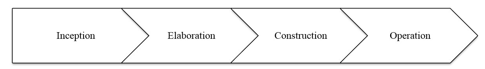
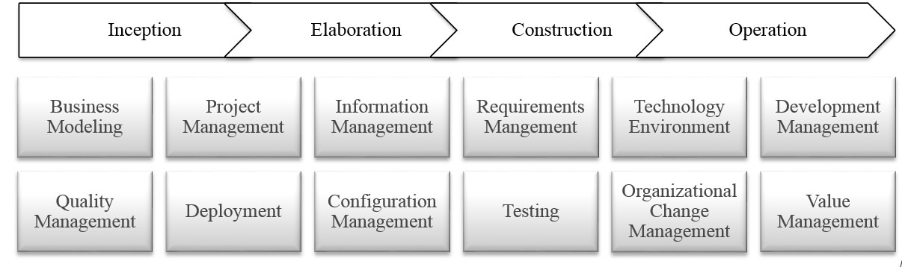
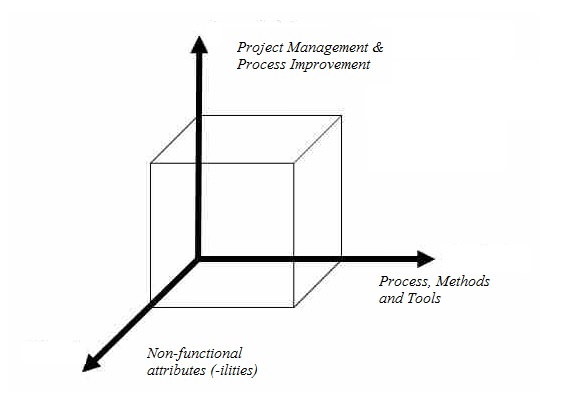

Description
===========

According to IEE the definition of Software Engineering (SWE) is "**The application of a systematic, disciplined, quantifiable approach to the development, operation and maintenance of software, that is, the application of engineering to software".** Following from this definition, Software Engineering means applying the **principles of engineering** to the Software Development field. As we can see, Software Development (SWD) and Software Engineering are interrelated terms, but they don't mean quite the same thing. The key difference is the continuity of applying engineering practices beyond the Software Development spectrum, covering aspects such as the Transition, Operation, Evolution & Maintenance, Decommissioning and Retirement.

According to IASA the definition of Architecture is **"the practice of business, organization or client gain through the application of technology strategy. It is the art and science of designing and delivering valuable technology strategy"**. Following from this definition, the main concern for an Architect is the delivery of value to the business. Along the Technology Strategy spectrum there are different elements capable of providing the realization of benefits to the business to greater or lesser extent according the economy, business imperatives and industry/technology trends.

Among these elements, the **conception, delivery and operation** of Software Products is a main source to **create and sustain a competitive advantage for the business**. Different industries have turned to look inside their capabilities to leverage solutions of software as **key enablers** for an increasingly competitive and changing business environment. **Architects** **may deliver value** to the business, providing alignment and strategic leadership along the Software Engineering practices of the business.

Overview
========

**«** **As with any engineering activity, the Software Engineer starts with a "problem definition" and applies tools of the trade to obtain a "problem solution". However, unlike any other engineering, Software Engineering (SWE) seems to put great emphasis on methodology or methods for obtaining a solution. The justification is within the peculiar nature of the "problems" solved by SWE. These "wicked problems" can be properly defined only after being solved.** **»**

Many organizations have large numbers of software initiatives running in parallel, addressing a wide range of factors such as industry trends, globalization, emerging markets and rapid technology innovation all create challenges and opportunities to which businesses need to respond.

These "responses" requires continuous change across all aspects of the business that comprises people, processes, organization and technology. The production of large and complex solutions based on software usually requires the coordination and collaboration of different teams spread among numerous divisions of the business. These teams comprises a variety of persons and roles including architects, developers, marketing staff, standards experts, and customer representatives.

At the early beginning of a Software Engineering engagement, Architects may use as first outcome the "**Problem Identification**", this is actually the result of a lot of background work in the general area of the problem, based on the ability to decompose a domain to identify the issues that needs to be addressed and the problem to be solved. It also required an understanding of the external factors by which we can model the problem space.  A correct "Problem Identification" allows a clear understanding of the **business imperatives** and an early approach to potential delivery of value.

Based on the Problem Identification and **working with the stakeholders**, Architects may **identify clearly the key requirements** and the expected **quality attributes** for the software and **evaluate the expected benefits** of its implementation within the **alignment with the business goals**. As result of this evaluation, Architects can abstract the problem space and provide a model that identify the tools necessary to solve it.

This abstraction should contains a high level statement of the software model: a definition of the information that the system requires to solve the problem (**the inputs**), the explicit techniques used to process/analyse/transform that information (**the compute model**) and the results that will be produced (**the outputs**). This abstraction will also include a decomposition of the major functional blocks involved in the system.

The model provided at the early beginning of the engagement must be reviewed and assessed in the different phases of the life-cycle across the different disciplines in greater or lesser extent according to the Software Development Process involved.

Software Engineering as others engineering fields involves a common life-cycle approach and a set of disciplines which are focused on the conception, delivery and operation of the software solution.

Lifecycle
---------

Inception
---------

The objective of the Inception phase is to clearly define the project's scope, requirements, budget, timeline and approach to deliver the solution. During the Inception phase, the business case is established and project scope defined. The Inception phase includes activities that will help refine the vision and approach to delivering the solution.

The business goals and objectives established during Inception will result in high level business requirements that are used for the foundation requirements. The project will document critical success criteria, identify potential risks, estimate the resources needed and develop a detailed plan that includes a breakdown of all work to be performed and the dates of any major milestones during the Inception phase.

### **Key activities**

The following are some of the key activities performed during the Inception phase:

-   Initiate the Project
-   Plan the Project
-   Mobilize Project Resources
-   Plan Requirements
-   Plan Testing
-   Plan Change Management

Elaboration
-----------

The objective of the Elaboration phase is to capture requirements, business processes, and system architecture and design the solution. Additionally, the strategy to test and deploy the solution is created during the Elaboration Phase. During the Elaboration phase, a sound architectural foundation is established to eliminate the highest risk elements of the project. Technical feasibility of the project is proven before leaving the Elaboration phase by assessing whether evaluation criteria have been met.

To accomplish these objectives, architectural decisions must be made with an understanding of the whole system: its scope, major functionality and non-functional requirements such as performance requirements. The Elaboration phase activities make sure that the architecture, requirements and plans are stable, and the risks are sufficiently mitigated, to determine the cost and schedule for the completion of the development.

### **Key activities**

The following are some of the key activities performed during the Elaboration phase:

-   Define Business Process Models
-   Define Software Requirements
-   Define Architecture
-   Define Change Management Strategy
-   Define Training Approach
-   Plan Functional Design
-   Produce Functional Specification
-   Produce Technical Specification
-   Design Data Conversion Solution
-   Design Change Management Materials
-   Define Test Plans
-   Plan Production Deployment

Construction
------------

The objective of the Construction phase is to develop, test and validate that the system meets all requirements and performs as per the agreed benchmarks. During the Construction phase, all remaining components and application features are developed and integrated into the product, and all features are thoroughly tested.

The outcome of the Construction phase is a product ready to put in hands of its end-users. Some of the activities include developing technical platform, user interface solution, test cases and data conversion component solution. Additionally, the Construction phase consists of activities that demonstrate that the solution has been constructed in accordance to established and accepted requirements.

### **Key activities**

The following are some of the key activities performed during the Construction phase:

-   Plan Software Development
-   Develop Technical Platform
-   Develop and Unit Test Code
-   Develop Change Management Materials
-   Design Training Materials
-   Develop Test Cases
-   Establish Test Automation
-   Plan Post-Production Service Delivery
-   Deploy Non-Production Software
-   Perform Smoke Testing
-   Perform Regression Testing
-   Perform System Testing
-   Perform Performance Testing
-   Perform Security Testing
-   Perform Integration Testing
-   Perform Data Conversion Testing
-   Perform Test Automation
-   Develop Training Materials

Transition
----------

The objective of the Transition phase is to deliver the final product or solution. The Transition phase is entered when the product or solution is mature enough to be deployed to the end-user domain. This typically requires that some usable subset of the product or solution has been completed to an acceptable level of quality and that user documentation is available so that the transition is smooth and sustainable.

This phase concentrates on the activities required to deliver the product or solution into the hands of the users. Typically, this phase includes several iterations, including beta releases, general availability releases, as well as bug-fix and enhancement releases. Considerable effort is expended in developing user-oriented documentation, training users, supporting users in their initial product use, and reacting to user feedback. At this point in the life-cycle, however, user feedback should be confined primarily to product tuning, configuring, installation, and usability issues.

### **Key activities**

The following are some of the key activities performed during the Transition phase:

-   Deploy Non-Production Software
-   Perform Smoke Testing
-   Perform Regression Testing
-   Perform User Acceptance Testing
-   Perform Data Conversion Testing
-   Perform Automation Testing
-   Develop System Hand-Over Artefacts
-   Perform Pre Go-Live Change Management Activities
-   Facilitate End-User Training
-   Deploy Production Solution
-   Design Post-Production Service Delivery
-   Plan Service Delivery Transition
-   Perform Service Delivery Transition
-   Perform Post-Production Support
-   Perform Post Go-Live Change Management Activities

Operation
---------

The objective of the Operation phase is to stabilize and maintain the deployed solution. The Operation phase is initiated after the product or solution is deployed to production.

This phase concentrates on the activities required to achieve steady-state maintenance and operations. Steady-state maintenance and operations is achieved by monitoring, measuring, and responding to variances in operations and service delivery instances and through continuous service improvement. This is accomplished through change and enhancement requests and through reported production defects and incidents.

### **Key activities**

The following are some of the key activities performed during the Operation phase:

-   Monitor Services
-   Perform Service Delivery
-   Decommissioning
-   Retirement

Disciplines
-----------

Software Engineering comprises different disciplines along its life-cycle:

**Business Modelling** -- The goal of this discipline is to understand the business of the organization, the problem domain being addressed by the project, and to identify a viable solution to address the problem domain.

**Project Management** -- The goal of this discipline is to direct the activities that takes place on the project. This includes managing risks, directing people (assigning tasks, tracking progress, etc.), and coordinating with people and systems outside the scope of the project to be sure that it is delivered on time and within budget.

**Information Management** -- The goal of this discipline is address the value, usefulness, accessibility, and security of an organization's data and information assets. It includes tasks related to data and information requirements, standards, management, and security and controls.

**Requirements Management** -- The Requirements discipline outlines the processes that support the planning, development and management of a project's requirements. Requirement activities should begin after the Project (Charter) is approved and the project has begun.

**Technology Environment** -- The goal of this discipline is to support the rest of the effort by ensuring that the proper process, guidance (standards and guidelines), and tools (hardware, software, etc.) are available for the team as needed. Technology defines the approach to design, develop, test, and operate the infrastructure and software components required for the system applications.

**Development Management** -- The goal of this discipline is to transform your model(s) into executable code and to perform a basic level of testing, in particular unit testing. Development addresses the tasks for designing, developing, and testing the custom components of the software applications.

**Quality Management -- **The goal of this discipline is to perform an objective evaluation to ensure quality. Quality Management includes tasks to plan and monitor for quality, verify and validate deliverables, and assess project processes and assets against organizational standards.

**Deployment** -- The goal of this discipline is to plan for the delivery of the system and to execute the plan to make the system available to end users. Plan, communicate, manage, deploy, and confirm the system transition to the live environment while maintaining the integrity of existing system(s). Deployment will include activities related to the migration of code and/or configuration across the non-production as well as to the final production systems/ clients

**Configuration Management** -- The goal of this discipline is to manage access to your project work products. This includes not only tracking work product versions over time but also controlling and managing changes to them.

**Testing** -- The Testing discipline outlines the tasks that support the planning, creation, and execution of Test Cases to verify that an application meets the requirements of the identified project. This discipline, which is tasked with finding and exposing weaknesses in the software product, focuses primarily on evaluating or assessing product quality.

**Organizational Change Management** -- Organizational Change Management addresses adoption and sustainability of the change initiatives. It encompasses an integrated approach to communications, stakeholder engagement and preparation, training, and organizational alignment and transition.

**Value Management** -- The goal of this discipline is provides an approach to identify, measure, and track expected implementation benefits. It includes tasks to identify, prioritize and quantify improvement opportunities, develop the business case, measure potential value impact, and develop an approach to track benefits realization.

Proven Practices
================

**Choose the "appropriate" Software Development Process** -- It is important to choose the appropriate development life-cycle process to the project at hand because all other activities are derived from the process. For most modern software development projects, some kind of spiral-based methodology is used over a waterfall process. Having a process is better than not having one at all, and in many cases it is less important on what process is used than how well it is executed.

**Gathering the right amount of Requirements** -- Gathering and agreeing on requirements is fundamental to a successful project. This does not necessarily imply that all requirements need to be fixed before any architecture, design, and coding are done, but it is important for the development team to understand what needs to be built. Quality requirements are broken up into two kinds: functional and non-functional. Non-functional requirements describe the performance and system characteristics of the application. It is important to gather them because they have a major impact on the application architecture, design, and performance.

**Principles to evolve the Architecture** -- Choosing the appropriate architecture for your application is key. The key best practice is for the architect to focus on architectural principles and make sure that everybody in all of the teams (business people, developers, implementation teams) understand that there's a set of principles that need to be kept in mind, and why they're there so that people buy into them.

**Keep it Simple** -- Even with a good architecture it is still possible to have a bad design. Many applications are either over-designed or under-designed. The two basic principles here are "Keep it Simple" and information hiding.

**Ain't it only coding?** -- Construction of the code is a fraction of the total project effort, but it is often the most visible. Other work equally important includes requirements, architecture, analysis, design, and test. In projects with no development process (so-called "code and fix"), these tasks are also happening, but under the guise of programming. A best practice for constructing code includes the daily build and smoke test. Martin Fowler goes one step further and suggests continuous integration that also integrates the concept of unit tests and self-testing code.

**More than only one pair of eyes** -- It is important to review other people's work. Experience has shown that problems are eliminated earlier this way and reviews are as effective as or even more effective than testing. Any artefact from the development process is reviewed, including plans, requirements, architecture, design, code, and test cases. Peer reviews are helpful in trying to produce software quality at top speed.

**Testing in whole** -- Testing is not an afterthought or cutback when the schedule gets tight. It is an integral part of software development that needs to be planned. It is also important that testing is done pro-actively; meaning that test cases are planned before coding starts, and test cases are developed while the application is being designed and coded.

**Loading....** -- Testing is usually the last resort to catch application defects. It is labour intensive and usually only catches coding defects. Architecture and design defects may be missed. One method to catch some architectural defects is to simulate load testing on the application before it is deployed and to deal with performance issues before they become problems.

**Configuration management** -- Configuration management involves knowing the state of all artefacts that make up your system or project, managing the state of those artefacts, and releasing distinct versions of a system. There is more to configuration management than just source control systems.

**Quality and defects management** -- It is important to establish quality priorities and release criteria for the project so that a plan is constructed to help the team achieve quality software. As the project is coded and tested, the defect arrival and fix rate can help measure the maturity of the code. It is important that a defect tracking system is used that is linked to the source control management system. By using defect tracking, it is possible to gauge when a project is ready to release.

**System operations and support** -- Without the operations department, you cannot deploy and support a new application. The support area is a vital factor to respond and resolve user problems. To ease the flow of problems, the support problem database is hooked into the application defect tracking system.

**Measuring success** -- You can measure your development process against an industry standard known as the Capability Maturity Model (CMM) from the Software Engineering Institute at Carnegie Mellon University. Most projects starts at level 1 (initial).

Sub-Capabilities
================

Software engineering is a rich, multi-faceted, and evolving field. It is often useful to think of it in three main sub-capabilities, each sub-capability being concerned with one particular aspect:

Process Methods and Tools
-------------------------

The dimension of Process, Methods and Tools contains all of the tools, techniques, methods, and processes required to develop software.

| **Iasa Certification Level** | **Learning Objective** |
| :-: | :-: |
| **CITA- Foundation** |

-   Learners will be able to name the different process, methods and tools to develop software
-   Learners will be able to describe a complete process approach to develop software

 |
| **CITA -- Associate** |

-   Learners will be able to understand the differences among the processes to create software and be able to identify strengths and weakness of each one
-   Learners will be able to describe the different methods to cover each discipline of Software Engineering.

 |
| **CITA -- Specialist** |

-   Learners will be able to define the right tools regarding the methods and the chosen processes for the construction of software.
-   Learners will be able to define approaches for applying the different disciplines along the Software life-cycle

 |
| **CITA -- Professional** |

-   *Learners will be able to define a consistent strategic decision-making processes to track the value realization for the software.*
-   *Learners will be able to define key performance indicators across the different phases of the process to create software.*

 |

Project Management & Process Improvements
-----------------------------------------

The dimension of Project Management & Process Improvements contains the management techniques required to organize software projects successfully, to monitor the effectiveness of the development, and to improve the development process.

| **Iasa Certification Level** | **Learning Objective** |
| :-: | :-: |
| **CITA- Foundation** |

-   Learners will be able to identify the main phases and activities for the methodology of Project Management.

 |
| **CITA -- Associate** |

-   Learners will be able to define activities, standards and constraints that ensure better Project Management practices.

 |
| **CITA -- Specialist** |

-   Learners will be able to identify and describe the AS-IS model for the Project Management cycle work in their organization.
-   Learners will be able to define the TO-BE model for the Project Management cycle work in their organization
-   Learners will be able to create a transformation plan to move toward the TO-BE desired model across the business.

 |
| **CITA -- Professional** |

-   *Learners will be able to implement an effective Project Management discipline through the implementation of the Project Management methodologies, formal processes for risk and issue management; clear change-control policies; standardized reporting to convey clear messages to all stakeholder groups; as well as a standardized set of project deliverables.*

 |

Non-functional (Quality) Attributes
-----------------------------------

The last dimension addresses the way in which the non-functional attributes of the software being developed in achieved. Non-functional attributes refer not to what the software does (its function) but instead to the manner in which it does it (its dependability, security, composability, portability, interoperability, etc., these are sometimes referred to as the '-ilities').

| **Iasa Certification Level** | **Learning Objective** |
| :-: | :-: |
| **CITA- Foundation** |

-   Learners will be able to name the common set of quality attributes for software development.

 |
| **CITA -- Associate** |

-   Learners will be able to describe the common set of quality attributes for software development.
-   Learners will be able to identify the non-functional requirements for a software product and map them to the right quality attributes.

 |
| **CITA -- Specialist** |

-   Learners will be able to define approaches to meet the goals defined by the quality attributes.
-   Learners will be able to create models and views in function to the quality attributes for the software product.

 |
| **CITA -- Professional** |

-   *Learners will be able to balance and optimize the quality attributes in function to the value realization of the software product and the alignment with the business goals.*

 |

Resources
=========

1.  IASA Core Architecture Skills: Getting started with the 5 pillars of IT Architecture

1.  IEEE.org -- <https://www.ieee.org/index.html>

1.  Software Engineering Institute -- <https://www.sei.cmu.edu>

1.  Agile Software Engineering Process -- <http://www.ambysoft.com/unifiedprocess/aup11/html/disciplines.html>

1.  Software Design and Architecture -- <http://www.ics.uci.edu/~andre/informatics223s2007/taylorvanderhoek.pdf>

Related Capabilities
====================

-   [Business Strategy](https://btabok.iasaglobal.org/btabok_3/business-strategy/)
-   [Investments, Prioritization and Planning](https://btabok.iasaglobal.org/btabok_3/capability-descriptions/investment-prioritization-and-planning/)
-   [Governance, Risk and Compliance](https://btabok.iasaglobal.org/btabok_3/governance-risk-and-compliance/)
-   [Capacity Planning](https://btabok.iasaglobal.org/btabok_3/capacity-planning/)
-   [Managing the culture](https://btabok.iasaglobal.org/btabok_3/capability-descriptions/managing-the-culture/)
-   [Customer relations](https://btabok.iasaglobal.org/btabok_3/capability-descriptions/customer-relations/)
-   [Leadership and Management](https://btabok.iasaglobal.org/btabok_3/capability-descriptions/leadership-and-management/)
-   [Collaboration and negotiation](https://btabok.iasaglobal.org/btabok_3/capability-descriptions/collaboration-and-negotiation/)
-   [Technical Project Management](https://btabok.iasaglobal.org/btabok_3/technical-project-management/)
-   [Compliance](https://btabok.iasaglobal.org/btabok_3/capability-descriptions/compliance/)
-   [Advanced Quality Attributes](https://btabok.iasaglobal.org/btabok_3/capability-descriptions/advanced-quality-attributes/)

Author
======

Juan Mestas
Senior Solution Architect -- Deloitte Ireland**

Juan Mestas is a Senior Architect in the Deloitte Technology Centre of Excellence with more than 15 years of experience in consultancy services and vertical industries, specializing on Enterprise Architecture (EA) and Solutions Architecture (SA).

Juan has successfully held multiple roles throughout his career from defining business processes with both business and technical stakeholders to the designing, prototyping and delivering architecture solutions that supports complex business challenges using a broad architecture and technology approach.

Juan's depth of experience in implementation projects of the main reference Enterprise Architecture frameworks (Zachman, TOGAF, DoDAF, and PEAF), leading enterprise architecture initiatives for the financial industry (banking, insurance) and projects of transformation in large and complex environments (public sector).

Juan counts with strong skills in design, implementation and deployment of complex enterprise solutions within the Microsoft/Oracle/IBM technology stack for different industries (energy, telecom, financial, retail, public sector). Juan is also a Scrum Trainer for Scrum.org (PST), Certified IT Architect Professional (CITA), TOGAF Certified and a MCSD Azure Solutions Architect.

