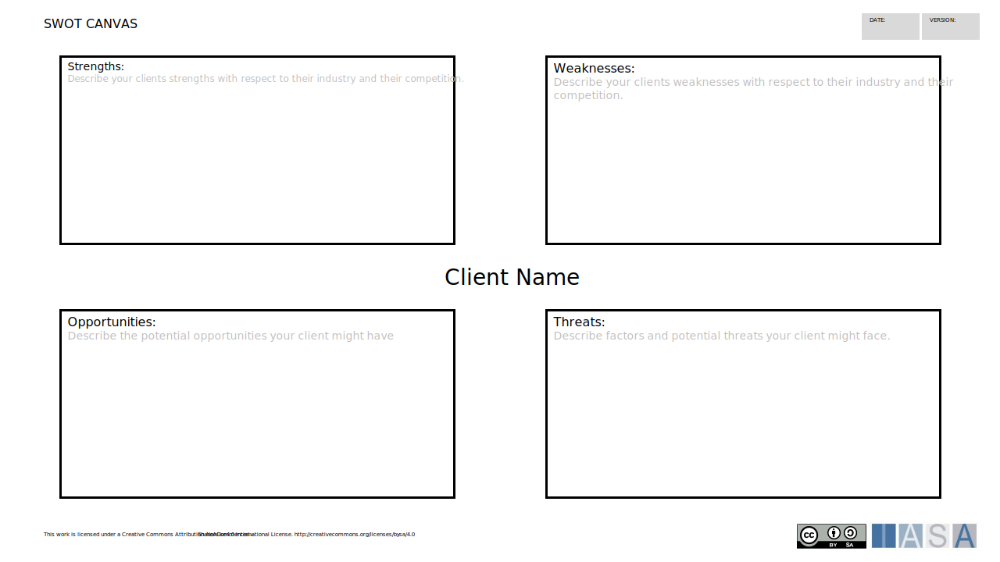

# Description

The process of strategy development and rationalization defines how the business architect and IT architect work together. The objective is to produce the business direction and a model that will focus the activities of the organization. It defines the principles, standards, structure, and dynamics of the business and technical strategic direction. Strategy development includes the production of components required for an appropriate architecture strategy. This involves understanding how to evaluate a business problem and identify an appropriate technology solution, a key part of this is identifying, analyzing, and simulating market trends.

Architects are expected to be familiar or experienced in the different ways of developing a strategy, an important area is the alignment of business strategy and the technology strategy.  The IT architect will need to be able to justify the architecture and describe the rationale behind it.

# Overview

The ability to understand how strategy is developed and rationalized is skill for architects.

The architect will need to be able to justify decision at project level and ensure they are aligned with the Strategy, if there is a discontinuity this will need to be escalated.

Strategy rationalization is the process of coming up with a technology solution that delivers or supports a business goal.

-   Business goals are created in exactly the same way that technology goals are.
-   Architects should always attempt to lead the business.
-   Architects should equally participate in business strategy that is led from other business units.
-   In either scenario, an architect should be responsible for defining the technology strategy.
-   A technology strategy is any plan that uses technology as its central component in accomplishing a goal (i.e., growth in market size or share).

Architects will also be expected to:

-   Participate in the development of organisation and project strategy
-   Ensure delivery against business goals
-   Lead Line of Business/capability strategy development across all related projects
-   Act as a focus for innovation and the application of new technology

# Proven Practices

The proven practices involved include:

-   Strategic Management -- Understanding how the organization works in the context of the internal and external environment
-   Strategy Development -- How to develop and document the technology strategy
-   Formation of IT Policies and Principles -- the best way of making the strategy which has been developed useful to projects is to have a clear and agreed set of policies and principles which will help shape solutions.

In order to deliver the above, there are some enabling practices which help:

-   Using the language of Business -- as architects we have to be able to communicate in terms that the audience understands, this underpins all BTS capabilities.
-   Strategic Thinking -- how to view the organization as a holistic entity an see how it can be changed over time.
-   Innovation Management -- how to make best use of the opportunities offered by changing technology.

# Sub Component Skills

## Strategic Management

A field that deals with the major (intended and emergent) initiatives taken by executives on behalf of owners, involving utilization of resources, to enhance the performance of firms in their external environments. This involves the analysis of the internal and external environment, some of the commonly used tools in this area are described below.

PESTLE or PEST

This involves using a systematic approach to classifying the influences on an organization, for PEST these are:

-   Political -- Factors that are influenced by government, such as tax, trade restrictions and political stability. Governments also control subsidies and tariffs which have a big impact on markets.
-   Economic -- This included growth rates, interest rates, the level of inflation and exchange rates, this will have huge impacts on the organization's finances.
-   Social -- Factors include the cultural aspects and health population growth rate, age distribution, career attitudes and emphasis on safety. These influence demand for products.
-   Technology -- This covers technological aspects like R&D activity, automation, technology incentives and the rate of technological change. In the context of BTS this will be addressed automatically by the other capabilities.

And two additional components can be added to give PESTLE analysis:

-   Legal -- Factors include employment law, [health and safety law](https://en.wikipedia.org/wiki/Health_and_safety_law){:target="_blank"} and regulation which applies to specific industries, for example Sarbanes Oxley These factors can affect how a company operates, its costs, and the demand for its products.
-   Environmental -- This covers ecological and environmental aspects such as weather, climate, and[climate change](https://en.wikipedia.org/wiki/Climate_change), which may especially affect industries such as tourism, farming, and insurance

Scenario analysis with SWOT

SWOT (Strengths, Weaknesses, Opportunities and Threats) analysis is very commonly used as part of any strategy activity, typically a group will work together to complete the SWOT. A summary is shown below:

Scenarios are developed and tested against the information captured in the SWOT.

| **Iasa Certification Level** | **Learning Objective** |
| :-: | :-: |
| **CITA- Foundation** | Learner will be able to: |
| :-: | :-: |
| | -   Understand the purpose of strategic management
| | -   Describe at least one of the analysis techniques
| **CITA -- Associate** | Learner will be able to: |
| :-: | :-: |
| | -   Apply the analysis techniques to simple problem areas
| | -   Identify and recommend which technique to use for any specific problem area
| **CITA -- Specialist** | Learner will be able to: |
| :-: | :-: |
| | -   Explain how to use multiple techniques
| | -   Apply a number of techniques to a scenario
| **CITA -- Professional** | Learner will be able to: |
| :-: | :-: |
| | -   Introduce new techniques into an organisation
| | -   Lead the application of strategic management with senior stakeholders to produce an organization level strategy

## Strategy Develoment

Many organizations will produce an IT Strategy document or slide pack, the architect needs to be able to pull together the information and direction produced by the other sub-capabilities into a coherent whole. This will be aligned with the Enterprise Architecture and should drive it to a significant degree. The exact content will vary depending on the approach taken but typically there will be the following: a summary of the business strategy, an analysis of the current portfolio of systems and projects, a description of the target IT state from a process, information, data and technology business view, and a resourcing section.

As the strategy forms a consolidated view, there are a number of areas which should be considered:

-   Enterprise Architecture frameworks activities, such as TOGAF, will be closely linked to strategy development
-   The IT Service Management processes, which may be aligned to ITIL, provide a valuable view as to how IT will actually operate
-   The Software Development Life Cycle (SDLC) processes and resourcing for this

There are several strategy techniques; an organization will usually have a preferred approach an assessment of a significant number of these are described in Strategy Safari by Mintzberg, Ahlsyrand & Lampel.

The communication of the strategy also needs to be considered, as will only be useful if people know and understand how it applies to them.

| **Iasa Certification Level** | **Learning Objective** |
| :-: | :-: |
| **CITA- Foundation** | Learner will be able to: |
| :-: | :-: |
| | -   Define the importance of strategy
| | -   Describe the approach taken in their organisation
| **CITA -- Associate** | Learner will be able to: |
| :-: | :-: |
| | -   Contribute to activities which create the strategy
| | -   Apply the strategy to projects they are involved in and describe how it has influenced decisions
| :-: | :-: |
| **CITA -- Specialist** | Learner will be able to: |
| | -   Lead the creation of sections of the strategy in their specialty
| | -   Recommend new techniques to the organisation within these sections
| :-: | :-: |
| **CITA -- Professional** | Learner will be able to: |
| | -   Develop the approach to strategy development with senior stakeholders
| | -   Lead the creation of multiple sections of the strategy, including negotiations with external parties
| | -   Develop a communication plan for the strategy

## Innovation Management

Innovation is application of basic research or invention to explore the possibilities for new ways of conducting business and organizational processes. Businesses strive to develop an innovative culture which can be as a part of a single project team trying to do things differently. Recently the concept of disruptive innovation is generating lot of discussion this is recognizing that some technology innovations can radically change multiple markets and have very wide spread impacts, these are important areas for architects to focus on and understand how your organization can benefit.

When applying innovation to strategy the approach described in Blue Ocean Strategy from W. Chan Kim and Renee Mauborgne, is a valuable model. Many innovation processes are looking for new ways of doing business in existing business spaces and changing business models to better compete or even find uncontested market spaces in existing marketplaces. Blue ocean strategy uses strategy canvas maps and value mapping strategies to identify open market spaces, these provide opportunities for very rapid growth as there is no completion.

Within Innovation management there are five steps required to effectively derive the business value from the novel technology or process:

-   Identification -- what is the problem
-   Ideation -- what ideas will work
-   Incubation -- does it really work?
-   Valuation -- is it going to do us any good?
-   Implementation -- can we get it to market?

There are a number of techniques which can help with innovative thinking, these are linked to creativity and include:

-   Six Hats Thinking by Edward de Bono -- this will provide multiple perspectives to the problem space
-   Group Brainstorming -- to generate and classify a lot of ideas
-   Mind Mapping -- Helps to spot links and generate interesting connections
-   Scenario based analysis -- this can help to clearly identify the problem or customer need

The value of the innovation depends on which area of the business it can be applied to, or how it affects the products/services sold, a simple classification is:

-   New uses for existing products
-   New markets or demographics
-   New business model
-   Enhancement/extension of existing product features
-   Completely new product

When the architect promotes the adoption of an innovation it is absolutely essential that the risk is understood by the business, the IASA BTS course contains a risk taxonomy,

The architect must be able to apply the risk taxonomy in the context of their organization and the area of the innovation. Every organization will each have an attitude to risk, which is dependent on the market sectors they are in and their place in them.

| **Iasa Certification Level** | **Learning Objective** |
| :-: | :-: |
| **CITA- Foundation** | Learner will be able to: |
| | -   Define the importance of innovation
| | -   Actively participate in Innovation processes, such as brainstorming or Six Hats
| :-: | :-: |
| **CITA -- Associate** | Learner will be able to: |
| | -   Apply the appropriate innovation tools for the area under investigation
| | -   Describe the stages of an innovation process
| | -   Understand the level of risk the organization will tolerate and the reasons behind this
| | -   Identify areas for innovation within the area they work in
| :-: | :-: |
| **CITA -- Specialist** | Learner will be able to: |
| | -   Lead innovation sessions using the appropriate tools
| | -   Assess the appropriateness of adopting innovation based on the business value which can be gained.
| | -   Understand the cumulative nature of the risk exposure due to innovation within the organisation
| :-: | :-: |
| **CITA -- Professional** | Learner will be able to: |
| | -   Introduce an innovation adoption process into an organisation
| | -   Apply strategy canvas maps and value mapping strategies to identify open market spaces where innovation can produce new products or services
| | -   Identify and justify significant innovations which need C-Level approval

## Strategic Thinking

Deep understanding of what is critical to the business in making appropriate decisions, anticipation of new trends in the industry by using deep understanding of business and industry trends, as described in Industry Analysis. Strategic thinking also includes the organizational attitude to risk and the how to recognize where the organization should sit with regards to the adoption of new technology and processes.

Attitude to risk

Every organization will have a different attitude to risk, and appetite for taking risks, understanding this is a complex area involving balancing of threats and opportunities, at the same time and managing the differing expectations of regulators and other stakeholders. It is easy to see the extremes of this with

It is always helpful to think about the risk levels before recommending a strategy as it will have a big influence on whether approval is given.

New Technology

There are several commonly use models to describe the adoption of new things. The technology adoption curve is a useful way to identify where the organization is in relation to others, with respect to how soon a technology will be use after it emerges.  The point of adoption may vary within an organization depending on how critical the technology is to operational running. The diagram below shows the stages in the curve:

When looking at adoption from the perspective of the product, the Hyper-Cycle, produced by Gartner, is frequently used. This is a useful model to apply when identifying when your organization should jump into using a technology, as most organizations will want to avoid adopting something which will be the subject of supplier consolidations or failures. This is a general model so it must be used with caution, there are no rules to say a technology must follow this path.

| **Iasa Certification Level** | **Learning Objective** |
| :-: | :-: |
| **CITA- Foundation** | Learner will be able to: |
| | -   Define the technology life cycles and have a broad understand of how they apply
| | -   Understand the organisation's attitude to risk in general terms
| :-: | :-: |
| **CITA -- Associate** | Learner will be able to: |
| | - Analyse specific areas to with regards to new technology adoption
| | - Apply the organisational risk appetite to recommendations for new technology.
| :-: | :-: |
| **CITA -- Specialist** | Learner will be able to: |
| | -   Monitor and evaluate significant areas to recommend when new technology should be adopted
| | -   Apply the risk attitude of the organisation to justifications, balanced against the potential of missed opportunities
| :-: | :-: |
| **CITA -- Professional** | Learner will be able to: |
| | -   Monitor the market for disruptive innovations and develop opportunities within the organisation
| | -   Produce strategies which include the interaction of multiple new technologies and how they will impact the organisation

## Formation of IT Principles and Policies

The development of principles and policies will provide high level guidance to projects by taking the IT strategy to level where it can easily be seen to be applicable to the decisions which are made at project level. This is one of the activities which, if one correctly can have a very significant influence on what and how IT systems are developed.

What Principles Are\
Based on the TOGAF definition, an architectural principle is:

**A fundamental statement of belief which guides the future direction of the architecture and supports the decision-making process.**

Principles are expressed in simple language, usually in one or two sentences. A good principle is

-   constructive (it helps to drive decisions forward and highlight issues)
-   compelling (it is strongly motivated by drivers, goals and other principles)
-   memorable (it is clear, concise and understood)
-   testable (we can determine if it is being followed)
-   decisive (it unambiguously sets direction)
-   useful (it is not a truism: could the opposite ever be true?)

Principles are an extremely useful part of the architectural definition process. They focus thought on the key areas of concern, ensure that a common understanding of goals and objectives is achieved, and ensure that this common understanding is documented in a way that stakeholders can understand.

How Principles Are Used
Principles come with three associated elements.

-   Rationales justify or explain the motivation for the principle, that is, why it has been adopted. Many rationales themselves are business drivers or other principles
-   Implications are the consequences or outcomes of adopting the principle. Many implications turn into further principles themselves
-   Actions are particular tasks that arise from adopting a principle. These often lead to further investigation or clarification activities

The diagram shows how these ideas all fit together.

The diagram illustrates in particular one of the key benefits of developing principles: they can be used to justify architectural decisions right back to business drivers and goals. This is illustrated in the diagram by means of an example, in this (simplified) example, the architectural choice using some existing hardware can be justified back to the business driver which requires an improved financial position.

Policies

Policies can be created to cover many aspects of the organisation, an area which forms part of the IT strategy involves technology usage. To help projects make fast decisions the creation of polices for the specific technologies is of great benefit. Where there a range of options a technology selection grid can be used. The following areas should be covered:

-   Information Dimension -- DataBase Management Systems
-   Application Dimension -- Application/Web servers, application development tools
-   Infrastructure Dimension -- Operating Systems, Hardware and networking, storage

The above list is not exhaustive; this is a technique which should be used where appropriate.

| **Iasa Certification Level** | **Learning Objective** |
| :-: | :-: |
| **CITA- Foundation** | Learner will be able to: |
| :-: | :-: |
| | -   Understand how to use Principles and Policies
| | -   Identify good principles
| | -   Name the most important principles in the organisation
| **CITA -- Associate** | Learner will be able to: |
| :-: | :-: |
| | -   Apply the principles and Policies on projects to make decisions
| | -   Identify principles and policies within their area of expertise
| **CITA -- Specialist** | Learner will be able to: |
| :-: | :-: |
| | -   Identify exceptions to principles and policies and justify them appropriately, based on the effect on business value
| | -   Develop a full set of principles working with the experts across multiple areas
| **CITA -- Professional** | Learner will be able to: |
| :-: | :-: |
| | -   Introduce the concept of IT principles and policies into an organisation
| | -   Extend the areas covered by IT principles as the organisation changes

# Related Capabilities

**Business Technology Strategy**

-   Business Fundamentals
-   Industry Analysis

**Business Architecture**

-   Business Strategy
-   Technology Strategy and Innovation

# Resources

## Books:

-   The Ten-Day MBA 4^th^ Edition by Steven A. Silbiger ISBN978-0-08-219957-7
-   Management by Peter Drucker ISBN 978-0-06-125266-2
-   Blue Ocean Strategy by Renée Mauborgne and W. Chan Kim ISBN 978-1-59-139619-2
-   Strategy Safari by by Henry Mintzberg, Bruce W. Ahlstrand, Joseph Lampel ISBN 978-0-74-327057-1

## Blogs/Webcasts/News/Reference Resources:

-   IASA BTABoK

## Certifications/Training:

-   IASA Business Technology Strategy

# Author

## Chris Cooper-Bland
*Group Head of Architecture -- Endava*
