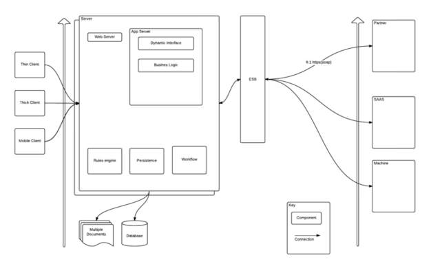

# Description 

Technologies, platforms and frameworks are all common references in software architecture and yet they each have subtleties which distinguish them.

# Definitions

**Technology** is the collection of tools, including machinery, modifications, arrangements and procedures used by humans. [Engineering](http://en.wikipedia.org/wiki/Engineering){:target="_blank"} is the discipline that seeks to study and design new technologies. Technologies significantly affect human as well as other animal species' ability to control and adapt to their natural environments. The term can either be applied generally or to specific areas: examples include *construction technology*, *medical technology* and *information technology*.

**Platform Technology** is a term for [technology](http://en.wikipedia.org/wiki/Technology){:target="_blank"} that enables the creation of products and processes that support present or future or past development. It establishes the long-term capabilities of research & development institutes. It can be defined as a structural or technological form from which various products can emerge without the expense of a new process/technology introduction.

**Software Framework** is an [abstraction](http://en.wikipedia.org/wiki/Abstraction){:target="_blank"} in which software providing generic functionality can be selectively changed by additional user-written code, thus providing application-specific software. A software framework is a universal, reusable software environment that provides particular functionality as part of a larger [software platform](http://en.wikipedia.org/wiki/Software_platform){:target="_blank"} to facilitate development of [software applications](http://en.wikipedia.org/wiki/Software_application){:target="_blank"}, products and solutions. Software frameworks may include support programs, compilers, code libraries, tool sets, and [application programming interfaces (APIs)](http://en.wikipedia.org/wiki/Application_programming_interface){:target="_blank"} that bring together all the different [components](http://en.wikipedia.org/wiki/Software_component){:target="_blank"} to enable development of a project or solution.

# Overview

Technology, Platforms and Frameworks is a both a capability as well as an ongoing list of components the software architect uses to deliver technology strategy.

The software architect will deal primarily with software components which provide reusable services of some type to other components in their design. Some of these components will be built and some purchased. In addition, these components may be hosted within the software being designed and some may be hosted elsewhere, either within the organization or without.

Diagram 1 displays the simple relationship.

# Practices

Integration

# Practices By Role

Integration

# Sub-Capabilities

| **Iasa Certification Level** | **Learning Objective** |
| :-: | :-: |
| **CITA- Foundation** | -   Learner will be able to discuss the process of data mapping.
| **CITA -- Associate** | -   Learner will be able to complete a data mapping exercise.
| | -   Learner will be able to identify gaps between source and destination data models.
| **CITA -- Specialist** | -   Learner will be able to validate the output of a data mapping exercise.
| | -   Learner will be able to identify problems areas such as differences in character encoding and design an appropriate transformation
| **CITA -- Professional** | -   Learner will be able to mentor others is data mapping.
| | -   Learner will be able to review the output of a data mapping exercise, highlighting any problem areas.

## Testing

The output of an ETL must be tested to ensure the data fulfills all of the business requirements and is of acceptable quality.

| **Iasa Certification Level** | **Learning Objective** |
| :-: | :-: |
| **CITA- Foundation** | -   Learner will be able to identify attributes that drive pricing for software, hardware, services and infrastructure.
| **CITA -- Associate** | -   Learner will be able to explain standard pricing strategies for software, hardware, services and infrastructure.
| | -   Learner will be able to identify and compare different pricing strategies.
| | -   Learner will be able to identify solution attributes and business needs that influence pricing.
| **CITA -- Specialist** | -   Learner will be able to interpret pricing strategies for software, hardware, services and infrastructure.
| | -   Learner will be able to identify optimal pricing strategies based on current and future business needs.
| | -   Learner will be able to differentiate between pricing and valuation of IP.
| **CITA -- Professional** | -   Learner will be able to develop, review and recommend pricing strategies for IP, software, hardware, services and infrastructure.
| | -   Learner will be able to develop and review valuation of technology pertaining to IP development and transfer or acquisition of IP.

## Enterprise Application Integration Design

While the ETL process is about consolidating data from many sources into one, Enterprise Application Integration, or EAI, is about distributing data between two or more systems. Data exchanged using EAI is typically either transactional and/or related to an event in an executing business process, or distribution of master data

| **Iasa Certification Level** | **Learning Objective** |
| :-: | :-: |
| **CITA- Foundation** | -   Learner knows what Messaging and EAI Patterns are.
| | -   Learner knows what A2A and B2B integration is.
| **CITA -- Associate** | -   Learner can distinguish between EAI Patterns and understands how Asynchronous Messaging can contribute to a loosely coupled architecture.
| | -   Learner can give examples of scenarios for A2A and B2B integrations
| **CITA -- Specialist** | -   Learner can fully use EAI Patterns to describe complex integration scenarios.
| | -   Learner can judge when messaging should be applied or not.
| | -   Learner can combine middleware products to implement both A2A and B2B integrations
| **CITA -- Professional** | -   Learner use

# Resources

[Extract, Transform, Load](http://en.wikipedia.org/wiki/Extract,_transform,_load){:target="_blank"}
 (Wikipedia)

[Home](https://dataintegration.info/){:target="_blank"}

[http://www.dataacademy.com/files/ETL-vs-ELT-White-Paper.pdf](http://www.dataacademy.com/files/ETL-vs-ELT-White-Paper.pdf){:target="_blank"}

[ref 1] [http://www.enterpriseintegrationpatterns.com/](http://www.enterpriseintegrationpatterns.com/){:target="_blank"}

[ref 3] [http://en.wikipedia.org/wiki/Comparison_of_business_integration_software](http://en.wikipedia.org/wiki/Comparison_of_business_integration_software){:target="_blank"}

[ref 5] [http://en.wikipedia.org/wiki/Advance_ship_notice](http://en.wikipedia.org/wiki/Advance_ship_notice){:target="_blank"}

# Author

**Paul Preiss**
*CEO -- Iasa Global*

During his tenure at Iasa, Paul has taken it from a single user group with 50 members to an influential global organization with over 80,000 in its professional network. He orchestrated the development of dozens of chapters and leaders in over 50 countries. He brought Iasa to the forefront of the architect profession and employs staff around the world in the growth of the organization. He led the development of the Iasa Board of Education, the Certified IT Architect Professional (CITA-P), the Iasa skills curriculum and is actively working with universities, governments and other professional bodies to stabilize the profession of IT architecture.

Prior to Iasa, Paul was the Director of Engineering and Chief Architect of a large digital asset management company. His global experience stems from the time he spent in Japan as the Chief Architect in Dell Pan Asia. He has worked for some of the largest companies and on many of the largest projects ever delivered including projects for DHL, Sears, IBM, and others. Paul has a bachelor's degree in Japanese from the University of Texas at Austin.