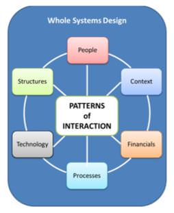

# Description

Architects often think of design narrowly, in terms of software components or a computing system that has interfacing applications that serve a bounding scope. "Whole Systems Design" considers the "whole" rather than the individual parts of a solution and emphasizes the role of interconnection between elements of the system(s), and promotes the concept of "Design as a Discipline"

As an architect, taking a whole systems design approach means you must understand the entire IT environment, including the people, infrastructure, development environment and organizational structure -- to name just a few. The consequences of not taking a whole systems approach to design include poor overall design efficiency (optimizing part of the system does not optimize the whole system), increased costs, decreased solution effectiveness and decreased quality attributes support.

Whole system design:

-   Requires that you consider the "whole system" of interconnected elements -- The "whole system" of interconnected elements that participate in, impact, and influence the design process, including the nature and rich tradition of design theory and practice, relevancy of understanding design as a discipline.
-   Includes context, people, processes, structures, technology as well as patterns of interaction
-   Is not a narrow definition of design only in terms of single software components or a system with integrated applications defining its scope.
-   Includes the systems sciences, systems theory, and systems thinking; and involves developing a "whole systems" perspective and understanding its importance to architects; including recognizing and addressing complex systemic problems and architecture practice.
-   Involves modeling as essential design action, modeling tools, and business patterns, including the importance of context and the architect's role in the creation of a design culture.
-   Requires design judgment and the construction of meaning, including work redesign, industry perspectives, and the increasing importance of architectural influence on design.

Software architecture brings together the two worlds of technology and design, and as a systems or software architect, you are a member of an emerging design profession.

A discipline is a way of thinking; it is a branch of knowledge with rules of practice and established methods of conduct. A discipline is about learning.

# Overview

Whole systems design requires that you consider the "whole system" of interconnected elements, including the context and the people, processes, structures, technology and other elements, as well as their patterns of interaction.

Losing sight of the "whole system" will increase the cost of delivering and supporting your solution and will likely impact the business value it provides to your organization. A critical piece of systems thinking is balancing short-term and long-term perspectives -- you should design only what is necessary, but need to consider what may be necessary in the future.

|  | **Systems design** is the process or "art" of defining the hardware and software architecture, components, modules, interfaces, and data for a computer system to satisfy specified requirements.

The words "art" and "systems theory" are not words that software architects would usually think of as a part of their discipline, however Systems Theory should be considered as an important area of knowledge for architects, since in many ways computer systems design can be considered as the application of systems theory to computing.

This definition of computer systems design shares many elements with the broader landscape of design and the concept of "design as a discipline".

**Systems theory** is the interdisciplinary study of systems in general, with the goal of elucidating principles that can be applied to all types of systems at all nesting levels in all fields of research. The term does not yet have a well-established, precise meaning, but systems theory can reasonably be considered a specialization of systems thinking; alternatively as a goal output of systems science and systems engineering, with an emphasis on generality useful across a broad range of systems (versus the particular models of individual fields). *(Wikipedia 2014)*

 |

Design practice follows a methodology and while the practice of design in a computing systems context may follow different methodologies than bricks and mortar architectural design, there are elements of both the "trade" and the persons that practice the trade, that are common. Design practice uses modeling and non-verbal communication media as the language of design and these "graphical" modes of thought are central to designing. Design practice uses synthesis and pattern formation as thinking tools. Different designers construe a task in different ways, which leads them to very different patterns of designing, and yet there are fundamental patterns that all designers follow:

-   Design practice usually engages in collaborative (group) work. Design activities are inherently collaborative and engage those being served. In ***our*** business, **our** stakeholders (customers, end users, and budget holders) are engaged from the beginning in our design process.
-   Design knowledge emerges from a conscious "not-knowing" and is built through reason, intuition, and imagination as elements of inquiry. This initial state of conscious "not-knowing" allows the architect to consider the whole and not be limited to what might be seen or assumed.
-   Design addresses complexity yet strives for simplicity. This is truly an art.  Great designers can unravel thorny problems and find solutions that seem easy.
-   Design seeks to find the underlying patterns. For example, if designing a telephone system, the designer would look for patterns in how the system might be used. In what order are steps usually done? What are the relationships of different tasks and movements to each other?
-   Design composes for sustainability. -- Designers must always think about this. Is it designed to last?

Design maintains the whole. As architects, we must first consider the larger whole within which our solution or application must operate, and recognise that parts of a design must sometimes be sub-optimized to serve the whole system and enable its success.

As Donald Knuth once said "Premature optimization is the root of all evil"; in Whole Systems Design, the optimization or isolated design of a single component of the overall system can undermine the  effectiveness of system as a whole.

# Corporate Best Practices

1.  Ensure that Systems Design & Systems Thinking is part of the architecture curriculum.
2.  Establish Technical (or Solution) Architecture Review Groups to allow solutions to be reviewed by resources from all of the IT disciplines.
3.  Ensure architects are considering the broader context of their work regardless of the level of architecture at which they are working. For example application architects need to consider the broader context of the solution into which their application fits, solution architects need to consider the broader context of the enterprise into which their solution fits. Ensure that this broader context forms part of the organization's expectations for Architecture Descriptions at all levels.

# Sub-Components Skills

## Integrative view of Architecture

Taking an "Integrative View" of architecture encompasses the systems sciences, systems theory, and systems thinking. An Integrative View of architecture means requires the development of a "whole systems" perspective and understanding its importance to architects, including recognizing and addressing complex systemic problems.

| **Iasa Certification Level** | **Learning Objective** |
| :-: | :-: |
| **CITA- Foundation** | -   Learner will be able to describe the concepts of Whole System Design.
| | -   Learner will be able to differentiate whole systems design from other modes of design.
| **CITA -- Associate** | -   Learner will be able to explain the systems design from a whole systems perspective.
| | -   Learner will be able to relate the whole systems design process to the practice of systems architecture
| | -   Learner will be able to understand modeling in relationship to essential business patterns and structures.
| | -   Learner will be able to recognize and describe an expanded definition of context in solution design.
| | -   Learner will be able to recognize the role of architect in the creation of a design culture.
| | -   Learner has researched and is able to explain the frameworks that support whole systems design.
| **CITA -- Specialist** | -   Learner will be able to apply one or more frameworks that support whole systems design.
| | -   Learner will be able to identify the project benefits derived from taking a whole systems design approach
| | -   Learner will have a rich understanding of the organization's IT environment
| | -   Learner is able to validate that the given perspective includes the whole system and not just parts of it.
| | -   Learner is able to explain the elements of the organization's IT environment which must be understand to gain a holistic architectural perspective.
| **CITA -- Professional** | -   Learner will be able to describe how to create/adopt effective architecture approaches, methodologies, or reference models.
| | -   Learner will be able to drive the introduction Whole Systems Design and Systems Thinking.
| | -   Learner will act as a mentor for Whole Systems Design.
| | -   Learner will write and speak publically, and contribute to the development of Whole Systems Design thinking.

## Synthesis of Systems, Network and Services Design

The "whole system" of interconnected elements that participate in, impact, and influence the design process, including the nature and rich tradition of design theory and practice, relevancy of understanding design as a discipline.

| **Iasa Certification Level** | **Learning Objective** |
| :-: | :-: |
| **CITA- Foundation** | -   Learner will be able to identify a containing whole (system) of which the thing to be explained is a part (or is intended to become a part).
| **CITA -- Associate** | -   Learner will be able functions as part of the architecture team for the organization's IT environment.
| | -   Learner will be able to provide a broader vision of the environment in which their projects operate.
| **CITA -- Specialist** | -   Learner will have a rich understanding of the organization's IT environment
| | -   Learner will be able to discuss how they have leveraged existing services in a solution.
| | -   Learner will be able to discuss how the whole environment has impacted their project.
| | -   Learner will be able to explain the anticipated complications of creating architectural solutions within an existing complex IT environment.
| | -   Learner will be able to explain their own design process in the context of design as a discipline.
| **CITA -- Professional** | -   Learner will be able to mentor others in the discipline of design
| | -   Learner will write and speak publically, and contribute to the development of the concept of design as a discipline.

## Design Evaluation, Redesign and Decoupling

Design judgment and the construction of meaning, including work redesign, industry perspectives, and the increasing importance of architectural influence on design. The diagnosis of design problems, unique aspects of design judgment, approaches to problem solving, and methods for unleashing creative potential.

| **Iasa Certification Level** | **Learning Objective** |
| :-: | :-: |
| **CITA- Foundation** | -   Learner will be able explain the concept of "big picture" thinking
| | -   Learner is familiar with the concepts of design evaluation
| **CITA -- Associate** | -   Learner will be able to evaluate simple designs
| | -   Learner is able to describe the processes followed to understand the work performed in a whole system design
| | -   Learner understands and can explain key design deliverables which support whole system design e.g. Context Model.
| | -   Learner will be able to describe the use of systemic thought and design to plan and resolve problems.
| | -   Learner will be able to describe the context and interactions between contextual elements that will impact the design.
| **CITA -- Specialist** | -   Learner will be able to balance the short-term and long-term perspectives of a project and express this in the design.
| | -   Learner will be able to generate and clarify alternative representations of the system that can meet the project requirements and expectations.
| | -   Learner is able to diagnose and describe design problems.
| | -   Learner will be able to devise criteria by which design alternatives can be evaluated.
| | -   Learner is able to evaluate design alternatives and makes recommendations to decision makers.
| **CITA -- Professional** | -   Learner is skilled in the evaluation of complex designs.
| | -   Learner will be evaluating and driving improvements in design efficiency in the organization.
| | -   Learner will be able to mentor others in design evaluation
| | -   Learner will write and speak publicly, and contribute to the development of the design evaluation techniques and methods.

# Related Capabilites

-   [Architecture Description](architecture_description.md){:target="_blank"}
-   [Requirements Discovery and Constraints Analysis](requirements_discovery_and_constraints_analysis.md){:target="_blank"}
-   [Design Methods and Processes](design_methodologies_and_processes.md){:target="_blank"}
-   [Decomposition and Reuse](decomposition_and_reuse.md){:target="_blank"}
-   [Design Analysis and Testing](design_analysis_and_testing.md){:target="_blank"}

# Resources

-   Meadows, Donella (2008) --  Thinking in Systems: A Primer
-   Ackoff, R.L. (2006) -- Ackoff's best.
-   Brooks, F (2010) -- The Design of Design: Essays from a Computer Scientist.
-   Checkland, P. (1999) -- Systems thinking, systems practice.
-   Cohen, J. & Stewart, I. (1994) -- The collapse of chaos: Discovering simplicity in a complex world.
-   Gharajedaghi, J (2011) -- Systems Thinking, Third Edition: Managing Chaos and Complexity: A Platform for Designing Business Architecture.
-   Lawson, B. (2000) -- How designers think: The design process demystified.

# Author

## Sean Gordon
*Technical Expert for Solution Architecture -- Chevron*

Sean Gordon works for Chevron [http://www.chevron.com/](http://www.chevron.com/){:target="_blank"} where he is Technical Expert for Solution Architecture. He has over 25 years of IT experience including 10 years working for Microsoft as a consultant in Architecture and Enterprise Integration. His current focus is on developing Target Architectures for Chevron's various asset classes.

Sean is an Honorary Lecturer at Dundee University School of Computing [http://www.computing.dundee.ac.uk/](http://www.computing.dundee.ac.uk/){:target="_blank"}. He is also a member of the judging panel for the ScotlandIS Young Software Engineer of the Year Awards [http://www.scotlandis.com/](http://www.scotlandis.com/){:target="_blank"}.
