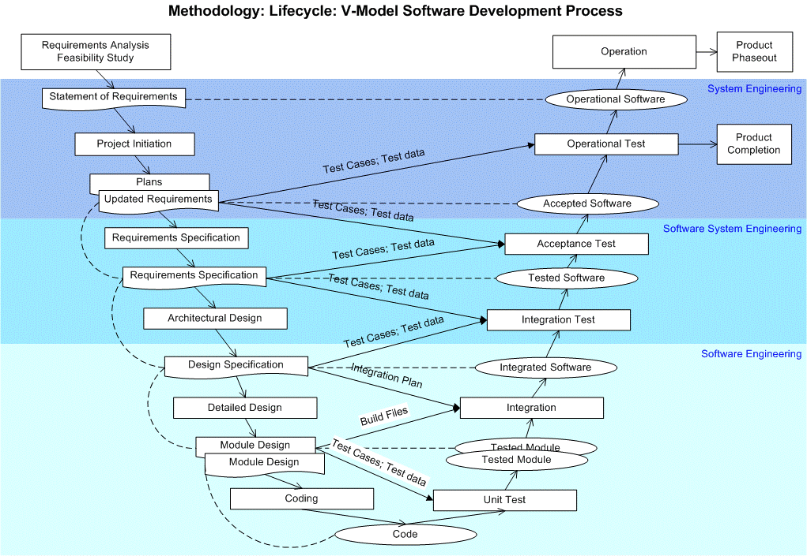

# Description

Testing is an activity to assess product quality and improve it by identifying defects and problems. It consists of the dynamic verification of the behavior of a program over a finite set of cases selected from an execution domain test (which is usually infinite), related to the expected behavior, measuring the functional and non-functional system in terms of defects found ("We showed the presence of errors but not their absence [Dijkstra]").

Within the activity of testing are put on trial two aspects of software quality: validation ("Did you build the right thing?": Are we responding to the real needs of the user?) and verification ("did you build the thing right ? " there were requirements, but we need to verify that the product is compliant with its specification). If we purely talk about the finished code, the testing would be using just for verification.

The V-model (ITIL-Foundation) is a popular method that shows different levels of testing surrounding the SDLC general common activities:

If we talk about another set of capabilities that must deliver the product generated along a development cycle, we will expand a little further, because we must comply capabilities that architecture must meet and verification Concerns nonfunctional within it:

-   Example 1: We use a range of architecture assessment methods as ATAM, ARID, QAW, SAAM, which validate through scenarios or through concerns with the hypothesis that the architecture is capable to solve skills which is willing, through functional and non-functional scenarios prepared or through validation of their quality attributes.
-   Example 2: We use testing to validate the usage of specific quality attributes, such penetration methods to validate a subset of system of security definitions, or we use testing to validate the expected response times for a system. Depending on the model used, this type of testing is included within the level called "integration testing".
-   Example 3: We use testing to measure the level of adherence to a reference model based on metrics that static code analysis can give us about the product built incrementally (Structural Testing).
-   Example 4: We use testing to measure "the level of testing", for example using coverage testing methods and mocking.
-   Example 5: Inside modular designs, we use testing to validate low-level structures first and we require implementing test methods at a high level for test the entire system, usually pursuing policies that prove that development unit is suitable to function as a whole and not to attempt to justify what takes built for each component.

Consider not to let the testing to the end, since there is a premature effort that can manifest itself, without having to wait out an entire development cycle to correct aspects of the software that may become apparent in early stages of development. Therefore, it is essential that the architect thinks in driving products include capabilities that allow being testable, including components to assess comprehensively acceptance in the process and integrate the phases of the development cycle used.

Similarly create and have the infrastructure to help developers to create more testable code, approaching each time the software is self-check developed without requiring human intervention to do so. A high level of automation requires the creation of good tests, and is summarized by the acronym FIRST: F (Fast: quick to run), I (Independent: without Preconditions), R (Repeatable: not Depending of external factors), S (Self Checking: determined by its own if has passed or rejected), T (Timely) --

Design reviews and code walk-throughs and inspections are other way to find defects in the product developed. Joined with the use of checklists, they allow finding defects in the implementation, to deliver a product with a lower percentage of defects to validate.

The application of testing involves a cost that the project should assume, but in early stages, it is lower than letting it for last phases. A testing may not be exhaustive and the architect or designer must make a balance between the levels of testing to reach without exceeding the cost level raised for the project, which will cover the technical debt.

Several critical receives software development because, depending on the time of delivery of the project, there are units of software that are not tested with acceptable standards of quality. Otherwise, the product does not deliver what it had actually meet within the time constraint, getting the stage of testing breaching the expected levels of quality for the product.

An architect must design solutions that fits inside proven static and dynamic testing practices, considering the scale and type of software delivered to cover functional and non-functional requirements of the solutions. Inside the constraints of time and budget around Software Development Lifecycle (SDLC) of the project, product must cover the software quality expectations with agility and easy to use practices to find defects.

# Overview

**Why does an architect need this skill?**

Architect provides the link between Business needs and the IT method to include the ability to verify its right implementation.

**Common tasks involved in this skill?**

-   Quantify the degree of conformityof a developed product against the required software quality attributes
-   Test reference archtiectures to achieve the right product objectives using proven evidence through testing.
-   Suggest tools, process and techniques at the right phase of lifecycle to test language classes, components or techniques.
-   Help to automate testings that will be useful inside the testing cycle of the project
-   Evaluate the defined architecture using an evaluation methodooogy
-   Testability included in the product to be developed preventing problems in integration and product evolution
-   Advise including testing methods development cycle, with its corresponding automation starategy
-   Coordinate testing practices to give feedback about the concerns of the product
-   Evolve candidate architectures as you iteratively test and improve your architecture
-   Involved in quality practices initiatives

**What is their ownership in this skill?**

It depends of the size of the project. For small teams the architect and technical leader are responsible to implement the testing strategy to use by the team, while large products may include

Note that the responsibility to make the automated test are the technical group and the QA group verifies its conformity with the product requirements.

**How an architect would use those skills in daily activities?**

This can help to ensure that the expected quality of the product be achieve and the main concerns of the architecture could be verified, considering the operation in real life. Not doing so can lead to problems involving monetary losses or reputation of the business.

# Proven Practices

**Describe why an architect should be involved in this skill at a corporate level**

TBD

**Primary push back and/or challenges for architects**

TBD

**How would a stakeholder engage an architect for assistance utilizing this skill?**

TBD

# Sub-Capabilities

Sub-capabilities are divided according ISO-IEC organizational process as reference:

## Test Fundamentals

Capabilities to guide a testing process inside a project, understanding the overall testing lifecycle. Testing activities are not only running testing; those activities incudes planning and control, design, check the results, reporting, reviews.

| **Iasa Certification Level** | **Learning Objective** |
| :-: | :-: |
| **CITA- Foundation** | -   Learner will be able to know different proven testing methods
| | -   Learning knows basics testing lifecycle and principles
| | -   Learning how to include testing activities to derive resilient architectures
| | -   Guide the development team to build deterministic test strategies
| | -   Understand the benefits of testing culture within the development process.
| | -   Learner knows the roles and products derived for testing activities inside a SDLC
| | -   Learner knows static and dynamic techniques that could be used in SDLC.
| | -   Learning can demonstrate experience recommending testing structuration strategies
| | -   Learning can conduct testing review or inspections processes.
| **CITA -- Associate** |
| **CITA -- Specialist** |
| **CITA -- Professional** |

## Test Management, Monitoring and Control

Experience integrating testing practices within the development of projects around the organization

| **Iasa Certification Level** | **Learning Objective** |
| :-: | :-: |
| **CITA- Foundation** |
| **CITA -- Associate** |
| **CITA -- Specialist** | -   Recognizes importance of independent testing
| | -   Knows the activities for test planning, lifecycle and estimation
| | -   Knows how to measure progress in testing evaluation
| | -   Knows how to organize and present an architecture evaluation session.
| | -   Know how to evaluate software architectures
| | -   Knows how to justify with data the implications of te4sting in software quality attributes measurement.
| | -   Knows the potential benefits and risks to include and support tools for
| | -   Different strategies of testing specification, testing execution and result analysis.
| | -   To test harness and nonfunctional quality attributes
| | -   To support performance and monitoring
| | -   Best practices according the project context
| | -   Assume critical position regarding the status of the product and the evidence delivered over the performed testing.
| | -   Know the benefits of testing in modifiability or maintenance of legacy software.
| **CITA -- Professional** |

## Dynamic Test Process and Automation

Experience integrating testing practices within the development of projects around the organization.

| **Iasa Certification Level** | **Learning Objective** |
| :-: | :-: |
| **CITA- Foundation** |
| **CITA -- Associate** |
| **CITA -- Specialist** | -   Involve configuration management and test automation as needed to reduce timeboxes side project SDLCs.
| | -   Involve best techniques practices inside software development cycles and justify it.
| | -   Collaboration with the product testing team to define the best strategies to engage in the management of each project to be undertaken.
| | -   Ensure the proper use of testing tools within the organization.
| | -   Actively collaborate to produce nonfunctional viewing requirements and testing strategies involved to measure.
| | -   Know how to measure the testing results to compare this information with the expectations of the product architecture delivered
| **CITA -- Professional** |

## Test Improvement and Financials

Related with the capability to apply testing techniques in each of the projects of the company, and ensuring that a testability level is achieved for the proposed architecture in financial terms.

| **Iasa Certification Level** | **Learning Objective** |
| :-: | :-: |
| **CITA- Foundation** |
| **CITA -- Associate** |
| **CITA -- Specialist** |
| **CITA -- Professional** | -   Learner knows the basis implications to include different sets of testing practices inside the development process.
| | -   Standardize techniques and tools used at organization level.
| | -   Decide for a project how much testing is enough including technical safety and business risks.
| | -   Learner can demonstrate experience in defining a complete testing strategy for the project understanding the budget implications (Tradeoff between testing and its respective cost).
| | -   confidence about the level of quality of previous developed products
| | -   Understand the TCO involved in testing activities including activities, tools and support for the evolution lf the product.
| | -   Adherence to organizational standards, best practices and policies of testing within the SDLC

# Resources

**Articles:**

- IASA BTABoK
[https://btabok.iasaglobal.org](https://btabok.iasaglobal.org){:target="_blank"}

- Software Architecture.
[http://carlosreynoso.com.ar/archivos/arquitectura/Arquitectura-software.pdf](http://carlosreynoso.com.ar/archivos/arquitectura/Arquitectura-software.pdf){:target="_blank"}

- Testing introduction
[http://www.fceia.unr.edu.ar/ingsoft/testing-intro-a.pdf](http://www.fceia.unr.edu.ar/ingsoft/testing-intro-a.pdf){:target="_blank"}

- About agile architecture and C4 view/modeling
[http://www.codingthearchitecture.com/](http://www.codingthearchitecture.com/){:target="_blank"}

- About TDD Practice, pro's and con's
[http://david.heinemeierhansson.com/2014/tdd-is-dead-long-live-testing.html](http://david.heinemeierhansson.com/2014/tdd-is-dead-long-live-testing.html){:target="_blank"}

- About Checklists and code review PSP practices
[http://blog.fogcreek.com/increase-defect-detection-with-our-code-review-checklist-example/](http://blog.fogcreek.com/increase-defect-detection-with-our-code-review-checklist-example/){:target="_blank"}

- About micro-services, determinism, testing culture and testing maintenance
[http://martinfowler.com/articles/microservice-testing/](http://martinfowler.com/articles/microservice-testing/){:target="_blank"}

[http://martinfowler.com/articles/nonDeterminism.html](http://martinfowler.com/articles/nonDeterminism.html){:target="_blank"}

[http://martinfowler.com/articles/testing-culture.html](http://martinfowler.com/articles/testing-culture.html){:target="_blank"}

[http://martinfowler.com/bliki/TestPyramid.html](http://martinfowler.com/bliki/TestPyramid.html){:target="_blank"}

- Apply the appropriate testing method according the project scope

[http://context-driven-testing.com/](http://context-driven-testing.com/){:target="_blank"}

- Test architect

[https://blogs.oracle.com/johnmorrison/entry/test_architect](https://blogs.oracle.com/johnmorrison/entry/test_architect){:target="_blank"}

- BI and DW testing

[https://msdn.microsoft.com/en-us/library/gg248101.aspx](https://msdn.microsoft.com/en-us/library/gg248101.aspx){:target="_blank"}

- Ministry of testing

[http://www.ministryoftesting.com](http://www.ministryoftesting.com){:target="_blank"}

[http://www.ministryoftesting.com/wp-content/uploads/2013/06/TTP8.pdf](http://www.ministryoftesting.com/wp-content/uploads/2013/06/TTP8.pdf){:target="_blank"}

**Blogs / Webcasts / News / Reference Resources:**

- SEI Quality Attribute Workshop and its ATAM relationship
[http://www.sei.cmu.edu/reports/03tr016.pdf](http://www.sei.cmu.edu/reports/03tr016.pdf){:target="_blank"}

- Software architecture in practice (3rd)
[http://www.amazon.com/Software-Architecture-Practice-Edition-Engineering/dp/0321815734](http://www.amazon.com/Software-Architecture-Practice-Edition-Engineering/dp/0321815734){:target="_blank"}

- Engineering Long-Lasting Software: An Agile Approach Using SaaS and Cloud Computing, Beta Edition
[http://amzn.com/0984881212](http://amzn.com/0984881212){:target="_blank"}

- Software testing adventure reference poster
[https://sites.google.com/site/swtestingmap/stadventure](https://sites.google.com/site/swtestingmap/stadventure){:target="_blank"}

**Training/Standards/Certifications:**

- Carnegie Mellon University / Personal software process PSP/TSP certification
[http://www.sei.cmu.edu/reports/09sr018.pdf](http://www.sei.cmu.edu/reports/09sr018.pdf){:target="_blank"}

[http://seicertification.clearmodel.com/get-certified/software-development/](http://seicertification.clearmodel.com/get-certified/software-development/){:target="_blank"}

- ISO-9126 & ISO-29119 software testing
[http://www.softwaretestingstandard.org/](http://www.softwaretestingstandard.org/){:target="_blank"}

- International Software Testing Qualifications Board (ISQTB)
[http://www.istqb.org/](http://www.istqb.org/){:target="_blank"}

# Author

**Andres Hurtado**
*Software Architect & Developer*

Software architect and developer working inside private and public sectors. He has worked in Colombia, designing and implementing enterprise solutions and has over 14 years of experience in software development process, enterprise application integration and research about technologies to leverage the product development.
