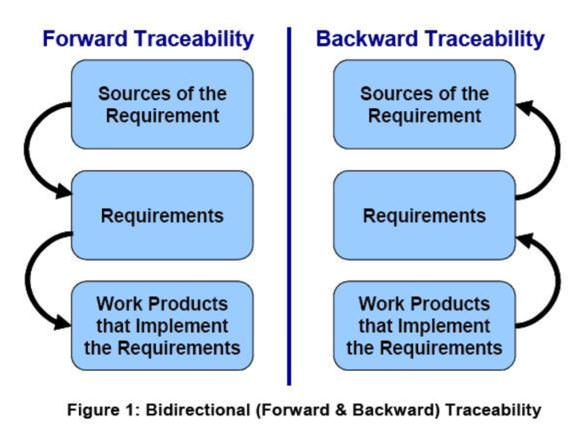

# Description

Traceability is one of the essential activities of good requirements management. It involves the process of documenting the life of a business concern and providing bi-directional traceability to the capability or capabilities associated with that concern. The purpose of having Traceability is to ensure that the right products are being built at each phase of the software development life cycle, to trace the progress of that development and to reduce the effort required to determine the impacts of requested changes.

Architects must be able to support to the Project teams with thought process of establishing right traceability practices from the Business requirements through to the sustained system and describe the vital role of traceability throughout the lifecycle of the 'solution under development'. Architects should have mastery in the use of associated techniques and tools and demonstrate competence in highest priority techniques.

# Overview

The IEEE Standard Glossary of Software Engineering Terminology defines traceability as "the degree to which a relationship can be established between two or more products of the development process, especially products having a predecessor-successor or master-subordinate relationship to one another." [IEEE-610]

Traceability is used to track the relationship between each unique product-level requirement and its source. For example, a product requirement might trace from a business need, a user request, a business rule, an external interface specification, an industry standard or regulation, or to some other source. Traceability is also used to track the relationship between each unique product-level requirement and the work products to which that requirement is allocated. For example, a single product requirement might trace to one or more architectural elements, detail design elements, objects/classes, code units, tests, user documentation topics, and/or even to people or manual processes that implements that requirement.

Good traceability practices allow for bidirectional traceability, meaning that the traceability chains can be traced in both the forwards and backwards directions as illustrated below.

For example, if a Solution is being developed using the Microsoft Solution Framework model, Microsoft provides an ALM tool called 'Microsoft Visual Studio Team Suite' that provides a process template for the traceability as below:

Architects need this skill to ensure the 'solution under development' is being developed in an expected manners throughout the life cycle of the project. Through traceability, it gives a 360 view of the business requirement being realized in the solution.

One common tasks involved in this skill is identifying the right tool for managing the solution under development. The tool should be able to support establishing the bi-direction traceability between the various work-items produced during the software development life cycle (SDLC) at various stages i.e. Requirements Analysis, Design, Development, Test, Deploy, Operations.

Establishing traceability correctly gives a timely view of the current state of the 'Solution under development' and thereby helps Architect assess the stability of the Solution and help provide inputs to the stakeholders of the Solution in terms of triple constraints viz., Resource, Schedule, and Scope.

One of the daily activities during the SDLC is to generate a report of the forward traceability and backwards traceability of the Project. The adopted tool should support providing the report to facilitate an understanding of the current state of the Project.

# Proven Practices

Architect provides a unique cross discipline view of the activities involved in the projects, across the business and the technical areas as establishing traceability requires a balanced understanding of the business domain (vision, goals, objectives, requirements) and technical underpinnings of the SDLC methodologies, processes and the various tools that support the same.

Key challenge that Architect may face in establishing this skill is the teams' adoption as the right practice of traceability gives the accurate view of the project progress thereby exposing the Project teams' daily accountabilities towards reaching the goal.

Engagement of an Architect for utilizing this skills requires the following:

-   Clear visibility of the business problems that the Solution is expected to meet (Business vision, goals, objectives, Requirements)
-   Choosing the right SDLC methodology/ process that aligns with the business and IT team
-   Selecting the right ALM (Application Life Cycle Management) tool that supports the various phases prescribed by the selected methodology
-   Drive the adoption of the traceability through the selected ALM tool among the project team as a daily activity throughout the SDLC
-   Build traceability reports that help in providing the progress of the 'solution under development' towards realizing the goals
-   Analyze the impact of a change

-   -   All work products affected by a changed requirement
    -   All requirements affected by a change or defect in a work product

-   Assess current status of the requirements and the project
    -   Identify missing requirements
    -   Identify gold plating

# Sub-Capabilities

## Traceabilty Management

The processes and techniques to describe and follow the life of an artifact from its origins, through its development and specification, to its subsequent deployment and use, and through periods of ongoing refinement and iterations.

The Software Engineering Institute (SEI) Capability Maturity Model Integration® (CMMI®) states that the purpose of the process area in "Requirements Management is to manage the requirements of the project's product and product components and to identify inconsistencies between those requirements and the project's plans and work products." [SEI-00]. One of the specific practices under the Requirements Management process area is to "Maintain Bidirectional Traceability of Requirements." [SEI-00].

| **Iasa Certification Level** | **Learning Objective** |
| :-: | :-: |
| **CITA- Foundation** | -   Learner is aware of the Application Life cycle management tools and templates and the concepts of the Traceability management
| **CITA -- Associate** | -   Learner has an application knowledge on the ALM tools that supports the traceability and relate the Traceability reports to its intended purpose during the course of the SDLC
| **CITA -- Specialist** | -   Learner has a working knowledge on various ALM tools that support different methodologies of SDLC in building the products
| | -   Learner knows how to model the templates for all work products that capture the information of traceability throughout SDLC
| | -   Has an experience in using the tools successfully in delivering Waterfall/ Agile driven Projects
| **CITA -- Professional** | -   Learner has an experience to synthesize the traceability (both forward and backward) reports that help Organization realize the benefits of maintaining bidirectional traceability through the realization of the following:
| | -   Analyze the impact of a change in case of any changes in Business requirements
| | -   All work products affected by a changed requirement
| | -   All requirements affected by a change or defect in a work product
| | -   Optimize the efforts required to build the product
| | -   Propose improvements to the traceability templates

## Bi-Directional Traceability

Documentation, visualization and description techniques that help establishing the traceability chains that can be traced in both forward and backwards directions as illustrated in the figure titled 'Bi-Directional (Forward & Backwards) Traceability'..

| **Iasa Certification Level** | **Learning Objective** |
| :-: | :-: |
| **CITA- Foundation** | -   Learner has a knowledge of work products such as Requirements, Design, Code, Test etc. in SDLC that contribute to defining the bi-directional Traceability (i.e. both Forward and backward Traceability)
| | -   Learner knows how the development work products together help in building the product and establishing the bi-directional traceability
| **CITA -- Associate** | -   Learner has a working knowledge of using the templates for various work products that record the activities towards building the product in SDLC
| | -   Learner has a knowledge of building a traceability matrix that summarizes in matrix form from business requirements to their associated functional requirements and then on to other work product elements
| **CITA -- Specialist** | -   Learner has a working knowledge of modeling the Traceability Matrix
| | -   Learner should be able to relate the functional requirements to its source (business requirements)
| | -   Learner should be able to break-down the functional requirements at a unit-level to be able to trace it to the underlying work products that implement the requirement
| **CITA -- Professional** | -   Learner summarizes the goal of meeting the Business needs of the Product by assessing the Traceability Matrix that helps in documenting both Forward and Backward Traceability across all of the work product
| | -   Learner should be able to provide recommendations and directions in establishing the Traceability templates that aids to reduce the risk of missing out developing a feature related to a business requirement
| | -   Assess the current status of the requirements and the project\
    o Identify missing requirements\
    o Identify gold platings

## Verification and Validation

The process of checking that a product, service, or system meets specifications and that it fulfills its intended purpose through the adoption of right Traceability Techniques.  Forward Traceability ensures proper direction of the evolving product (that we are building the right product) and indicates the completeness of the subsequent implementation.

| **Iasa Certification Level** | **Learning Objective** |
| :-: | :-: |
| **CITA- Foundation** | -   Learners is aware of the concepts of Verification and Validation
| | -   Learner is aware of the tools and processes to conduct Verification and Valid
| **CITA -- Associate** | -   Learner has a working knowledge of developing required tests (Test Cases) for the Functional requirements
| | -   Learner has a working knowledge of developing a Test Plan that helps in provides the strategies of Verification and Validation techniques
| **CITA -- Specialist** | -   Learner reviews the Test activities (Test Plans, Test Cases etc.) and provide the feedback
| | -   Learner has working knowledge of leading the Test Activities and build the Test Reports out of the test activities
| **CITA -- Professional** | -   Learner synthesizes the Traceability Reports, Test Reports, and Traceability Matrix and ensures the following
| | -   Proper direction of evolving product that we are building the **right product**
| | -   The evolving product remains on correct track vis-a-vis to the original and/or evolving requirements (that we are building the Product right)

# Reference Resources

IEEE-610

IEEE Standards Software Engineering, IEEE Standard Glossary of Software Engineering Terminology, IEEE Std. 610-1990, The Institute of Electrical and Electronics Engineers, 1999, ISBN 0-7381-1559-2.

SEI-00

CMMI^SM^ for Systems Engineering/Software Engineering, Version 1.02 (CMMI-SW/SW, V 1.02); CMMI Staged Representation, CMU/SEI-2000-TR-018, ESC-TR2000-018; Continuous Representation, CMU/SEI-2000-TR-019, ESC-TR-2000-019; Product Development Team; Software Engineering Institute; November 2000.

**Articles**

Requirements Traceability [http://en.wikipedia.org/wiki/Requirements_traceability](http://en.wikipedia.org/wiki/Requirements_traceability){:target="_blank"}

Application Lifecycle Management [http://en.wikipedia.org/wiki/Application_lifecycle_management](http://en.wikipedia.org/wiki/Application_lifecycle_management){:target="_blank"}

Ivar Jacobson international   [http://www.ivarjacobson.com/resources/resources/white_paper/](http://www.ivarjacobson.com/resources/resources/white_paper/){:target="_blank"}

Cunningham & Cunningham Inc.  [http://www.c2.com/cgi/wiki?UserStoryAndUseCaseComparison](http://www.c2.com/cgi/wiki?UserStoryAndUseCaseComparison){:target="_blank"}

Ivar Jacobson's Blog: [http://blog.ivarjacobson.com/ivarblog/](http://blog.ivarjacobson.com/ivarblog/){:target="_blank"}

A Guide to the Business Analysis Body of Knowledge (BABOK Guide) [http://www.iiba.org/BABOK-Guide.aspx](http://www.iiba.org/BABOK-Guide.aspx){:target="_blank"}

IIBA Online Library  [http://www.iiba.org/Learning-Development/Online-Library.aspx](http://www.iiba.org/Learning-Development/Online-Library.aspx){:target="_blank"}

Microsoft Solution Framework  [http://en.wikipedia.org/wiki/Microsoft_Solutions_Framework](http://en.wikipedia.org/wiki/Microsoft_Solutions_Framework){:target="_blank"}

**TRAINING:**

IIBA Business Analysis Training  [http://www.iiba.org/Learning-Development/Endorsed-Education-Provider-Training.aspx](http://www.iiba.org/Learning-Development/Endorsed-Education-Provider-Training.aspx){:target="_blank"}

**CERTIFICATIONS:**

International Institute of Business Analysis' (IIBA) [Certification of Competency in Business Analysis (CCBA)](http://www.iiba.org/Certification-Recognition/CCBA-Certification.aspx){:target="_blank"}

International Institute of Business Analysis' (IIBA) [Certified Business Analysis Professional (CBAP) certification](http://www.iiba.org/Certification-Recognition/CBAP-Designation.aspx){:target="_blank"}

MCSD: Application Lifecycle Management  
[https://www.microsoft.com/learning/en-us/mcsd-application-lifecycle-management.aspx](https://www.microsoft.com/learning/en-us/mcsd-application-lifecycle-management.aspx){:target="_blank"}

# Author

## Vidyasagar Chitchula
*IT Architect -- Microsoft Global Services (India)*

Vidyasagar is a certified CITA-P, TM Forum BDM and TOGAF Practitioner. He has led architecturally significant enterprise engagements for Global Top 500 Companies.

Vidyasagar has been an architect working for Microsoft Services Global Delivery since 2008. He has 13**+** years of total experience in the Software Industry. His experiences have been in product and project development in architecture, design, and development of distributed applications in the Microsoft technology space in the domains viz., CRM, Agro ERP, Medical Transcription, Academia, Hospital Information Systems and Telecommunications. Prior to Microsoft, he worked as a Technical Architect for Pivotal CRM, a CDC Software Company with revenues of about USD 500 million.

On the business front, Vidyasagar is a seasoned professional in CRM space by way of working on 3 CRM products and multiple domains viz., Telecommunications, BFSI, Utilities, Professional Services and Health Care. He possesses great product and services knowledge in CRM space with 11 years of experience in that area alone. He has worked with diversified clientele in his 11 years of CRM experience that include fortune 500 Organizations in Telecommunications, BFSI, BPO and Professional Services organizations across the world, USA, LATAM, Singapore, India, Europe, MEA. His special interests include building solutions in the telecommunications domain.

Prior to his IT experience, he had another 2 years of experience as a teaching assistant in academia while pursuing his Masters in Software Systems.
