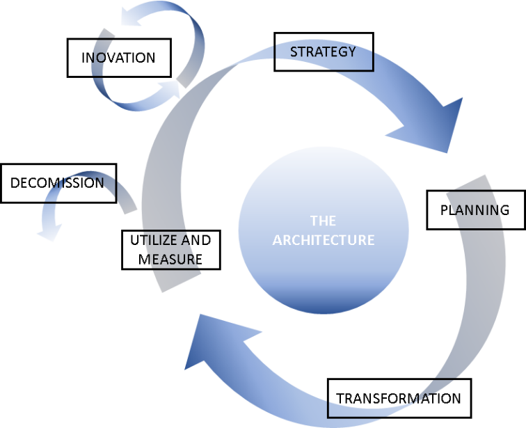
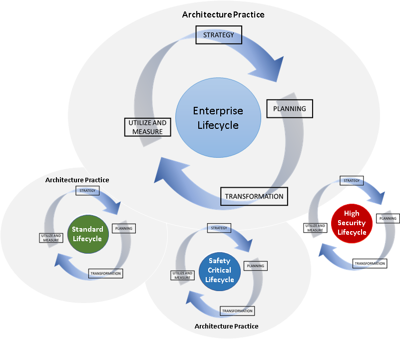
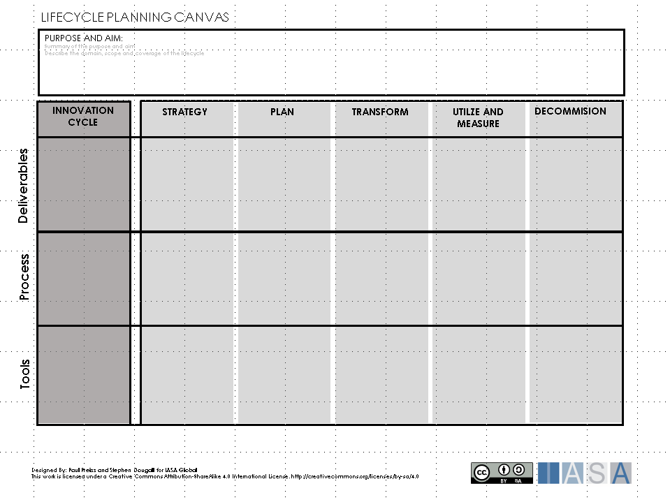
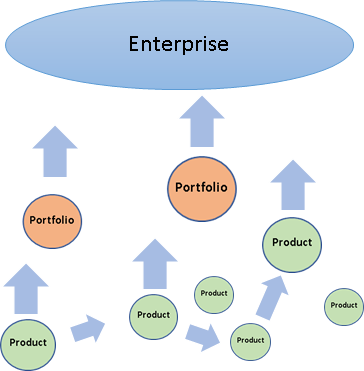
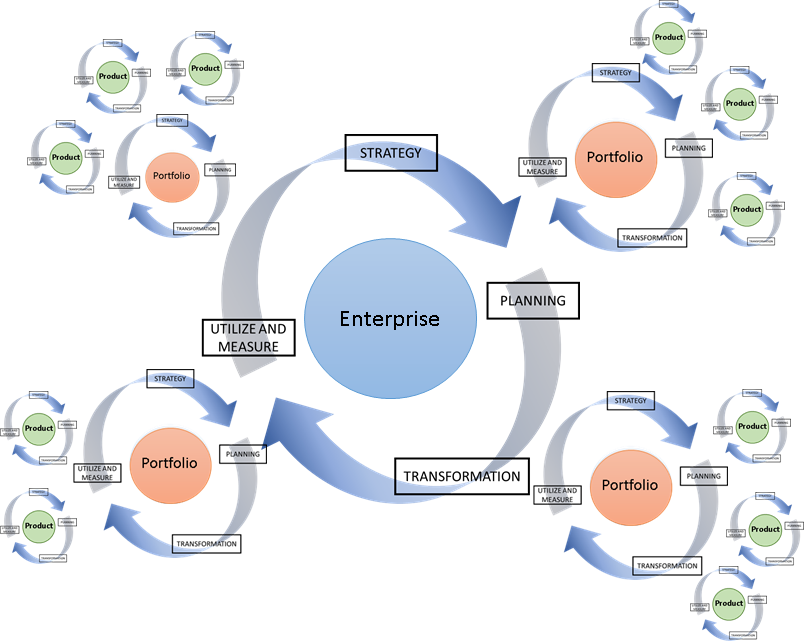
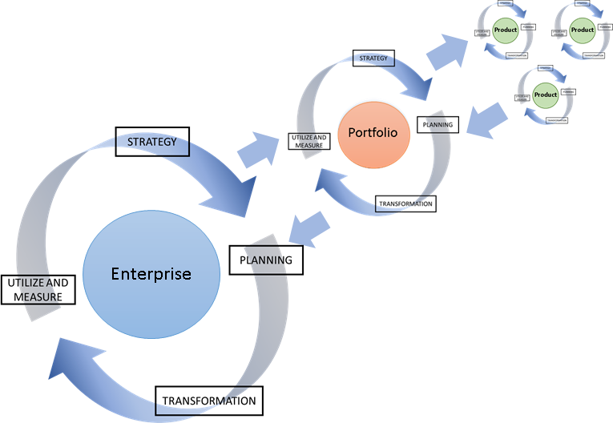

> "A series of stages through which something (such as an individual, culture, or manufactured product) passes during its lifetime"
**Merriam Webster Dictionary**

# What is a lifecycle

The architecture lifecycle, or Architecture Development Life Cycle
(ADLC), are the stages that an architecture goes through from its
inception to its decommissioning. The ADLC provides a guiding process
for developing architecture, and helps the architect understand and
communicate the state of the architecture.

 

The diagram above shows the stages of the ADLC. The ADLC is an iterative
cycle to ensure that the architecture develops and evolves in line with
its surrounding environment.

The following are the stages of the ADLC:

- **Innovation Cycle** -- the continuous cycle of value driven ideas
  for changing the business and gaining value. This continually drives
  the evolution of the architecture.

- **Strategy**-- the charting of the architecture direction in the
  long term, and the assessment and prioritization of business cases
  and assignments. This results in a statement of the requirements for
  developing the architecture.

- **Planning** -- given an assignment and the requirements on the
  architecture, the fundamental blueprints for the architecture are
  developed. The architecture practice or team are also assessed in
  terms of what is required to deliver the architecture
  transformation.

- **Transformation** - the use of the architecture in creating
  deliverables, such as a product or solution, which provides the
  sponsor with an expected value. This includes refinement of the
  architecture during the product or solution development.

- **Utilize and Measure** - the use of the architecture in practice
  after deployment of the deliverables. This includes measurement of
  the architecture to assess if it provided the expected value for the
  sponsor.

- **Decommission** -- when utilization of the architecture has run its
  course and no longer provides value to the sponsor, the architecture
  may be decommissioned or replaced by another architecture.

The ADLC is a cycle which aims to continuously improve the architecture,
where measurement of the architecture provides the feedback for further
innovation.

# Why we need the lifecycle

The ADLC provides a method including tools, deliverables and processes
which help the architect develop a quality architecture. With the
standard stages in the lifecycle it provides a common process between
architects in developing an architecture. It helps architects
communicate the status of an architecture, and to know what is required
of the architect in each stage of the lifecycle.

The lifecycle helps the architect to perform architecture activities in
an ordered sequence at the right stages of the lifecycle, and provides a
way of communicating process in the architecture development.

Developing the ADLC itself allows the architecture practice to
incorporate a standard way of working with architecture development.
This facilitates an iterative and continuous improvement of architecture
practices and may also provide the foundations for governance.

# Lifecycle Approach

## Plan the Journey

Architectures are often developed for the long term from an initial
innovation through to decommissioning. Use the strategy and planning
stages of the lifecycle to assess the starting point (baseline
architecture), the future state (the target architecture) and any stops
on the way (transition architectures). Assess if the current lifecycle
provides the means to ensure that transformation is feasible and
manageable. A series of iterations of the lifecycle can be planned
evolving the lifecycle to meet increasingly challenging transformations.

## Plan the Scope and Coverage of the Lifecycle

Consider the scope that the lifecycle will address, this will drive the
tools, processes and deliverables that the lifecycle provides as
support. For example, an enterprise lifecycle requires a different set
of tools and processes than a lifecycle intended to support product
development. The coverage of the lifecycle is also important. If the
lifecycle is intended for broad coverage then the architect team has to
ensure that the capacity is available to support the usage of the
lifecycle.

## Business Value drives the Lifecycle

The innovation cycle and the strategy phase of the ADLC are the drivers
for architecture transformation. It is important at the strategy stage
to show the business value that will be gained as a consequence of
transforming the architecture. This creates stakeholder interest and
promotes the architecture as well as helping to secure investment for
any [assignments]{.underline}.

## Size DOES NOT matter

The ADLC can be applied to different scopes, single solutions or large
portfolios, the lifecycle can be adapted to the required scope. The
[tools]{.underline}, processes or [deliverables]{.underline} the
architects choose to apply in the lifecycle may vary depending on the
scope or the nature of the [assignment]{.underline}.

## Continuous Evolution

The ADLC allows the architect to develop the architecture, and the
lifecycle itself in iterations which means that the lifecycle grows
organically. With each new iteration of the lifecycle the needs of the
domain can be assessed and the lifecycle adapted accordingly.

This provides a "start small, scale fast" approach and ensures that the
lifecycle does not grow faster than the capacity of the architecture
practice or team managing the lifecycle.

## Partner the Project Management Process

The ADLC and project management process have joint interests. The
project management process may rely on aspects of the ADLC to ensure
successful project delivery and the ADLC may rely on the project
management process to drive the architecture through the transformation.
There may be commonalities in stakeholders, deliverables, resources and
skills. Partnering and aligning the ADLC and project management process
makes both processes stronger and can increase effectivity, both in
agile and traditional methods.

## Specialize the Lifecycle

As the lifecycle develops many tools, processes and deliverables can be
defined in the various stages of the lifecycle. If the lifecycle evolves
on a "one size fits all" principle it can be difficult for architects
working in specialized architecture domains to know which parts of the
lifecycle to use or why they are relevant. Instead a specialized
lifecycle can be developed from existing lifecycles specifically for a
particular domain (for example, high security, safety critical, telecom,
medical devices). When developing a specialized lifecycle, it is
important that the architecture practice or team responsible has the
capacity to maintain the lifecycle and includes specialists in the given
domain.

## Staffing the Lifecycle

Staffing the Lifecycle When the lifecycle is adopted in a particular
domain, ensure that allocation of architects is sufficient to drive the
lifecycle processes, deliverables and tools. It is important that the
architects have the capacity and ability to execute the lifecycle,
otherwise the lifecycle may not be used correctly or at all.

Where specialist or particularly complex areas need to be addressed in
the lifecycle execution, a culture of consulting can be established.
This provides a way to quickly boost capacity, knowledge and increase
the speed of architecture decisions over a short period of time.

Ensure the architects are trained and experienced architects. In some
organizations the architect role can be filled by resources who have
knowledge in technical project management, or lead developers with
business skills. Neither of these provide a replacement for an
architect. For example, a general doctor may know a lot about the human
body, illnesses and medicines, but if we are going to perform surgery
it's the surgeon we look to.

# Applying the lifecycle in practice

## Innovation Cycle

The innovation cycle provides the driver of architecture transformation.
This can be initiated in a number of ways, the idea written on a napkin
in the restaurant, or born out of a business strategy to reach a new
market.

The innovation cycle may provide the foundation for the architecture
vision and plants the seeds for business cases.

## Strategy

The strategy stage of the ADLC is about considering ideas for gaining
value, planning the long-term development of the architecture and
refining the ideas to a set of requirements which can be used to select
assignments for the transformation architecture.

During the strategy stage of the lifecycle, the strategy and goals for
the architecture may be reviewed, validated or updated. Business cases
and assignments are born out of the innovation cycle and refined in the
strategy stage. The strategy and goals of the business may determine how
these are prioritized.

The feasibility of the ideas from the innovation cycle are verified.
Many ideas may not even make it into the next stage of the lifecycle,
they may lack feasibility, timing might not be right or there simply may
not be investment available. To assess the feasibility of a given idea
the following Innovation Assessment Card can be used.

This card can be used by teams or individuals to assess a series of
ideas or innovations. The following steps describe how the card is used.

**Step 1: Describe the innovation**

Describe the innovation in text or present the general reasoning behind
why the innovation is a good idea.

**Step 2: Detail the benefits of the innovation**

At a more detailed level, list the benefits of the innovation. For
example, reduced cost, increased productivity, personnel motivation or
greater market share. To express the benefits more clearly add "+"
symbols next to each benefit to indicate how strong the benefit is.

 

**Step 3: List the changes required**

In order to realize the benefits something has to change. This can be
everything from business processes, working culture, applications or
infrastructure. List the significant changes that are required to
realize the benefit.

**Step 4: Identify the stakeholders**

Stakeholders provide the influence and power to make the innovation
happen. List the stakeholders that are affected by the changes or stand
to make gains from the benefit.

**Step 5: Estimate the Effort and Value**

From the information regarding benefits, required changes and
stakeholders make a rough estimate of the effort required to achieve the
benefits on a scale of 1-10. For example, this may include effort to get
stakeholders on-side, or the effort required to make the significant
changes. Then using the collective benefits, estimate the value that may
be gained on a scale of 1-10.

Innovations can then be prioritized by effort and value and result in
assignments. These may even be planned for inclusion in future lifecycle
iterations by creating transition architectures and a long-term target
architecture. The execution of these cycles can be expressed on a
strategic [roadmap]{.underline}.

The strategy stage ultimately results in a selection of assignments and
the definition of [requirements]{.underline} for transforming
architecture, these are used as a basis for the planning stage of the
lifecycle.

## Planning

The planning stage of the ADLC is focused on describing how to move from
the baseline architecture (currently deployed architecture) to an
architecture which meets the expectations of the business as expressed
in the assignment and requirements.

Planning the architecture transformation involves the definition and
development of the initial versions of the architecture deliverables,
these describe the planned architecture. The needs of the transformation
have to be assessed in terms of what is required from the architecture
practice and other stakeholders.

The lifecycle itself may be assessed to ensure that it provides the
necessary support for the transformation.

The planning stage delivers a definition of the expected deliverables,
initial versions of some of the deliverables, and provides the resources
which are sufficient for transformation to start.

## Transformation

Transformation The transformation is a [design]{.underline} intensive
stage in the lifecycle where architecture [deliverables]{.underline} are
further developed and eventually delivered.

It is at this point in the lifecycle that development teams or business
teams start to make the transformation from the baseline architecture to
the expected architecture. The architecture continues to evolve during
the transformation stage. When teams first start to use the
architecture, they can uncover weaknesses, optimizations, risks,
requirement changes and constraints which were not apparent during the
planning stage. Therefore, the architecture can continue changing during
transformation to ensure that the architecture delivers the right
quality and is effective.

Equally important is to ensure that during the transformation stage the
architecture is followed by the teams executing the transformation.
Architects perform [governance]{.underline} activities to support teams
in following and understanding the architecture. This ensures that the
critical [requirements]{.underline} of the architecture are met, for
example: legal requirements, safety requirements, security requirements.
At the same time governance can act as a forum for gaining insight on
the difficulties in the transformation which can lead to architecture
changes.

## Utilize and Measure

Once the transformation is complete the new architecture becomes the
baseline architecture as it is the current state. The architecture has
been deployed but just deploying the new architecture does not
automatically mean that value will be achieved. The ADLC uses the
utilize and measure stage to assess if the architecture provides the
value that was expected at the beginning of the cycle.

The architecture may be monitored to assess if goals have been met or if
the original business case has been realized. The business may have
defined specific KPI (key performance indicators) which are monitored to
assess just how successful the architecture deployment has been. What is
to be measured may depend specifically on the value that the
architecture intended to provide.

During this stage an analysis may be performed on the architecture to
provide feedback into the next cycle. Measurements may be taken on
factors such as [automation]{.underline}, [technical debt]{.underline}
or even the [velocity]{.underline} of development during utilization.

## Decommissioning

Decommissioning is the final stage in the architecture lifecycle. While
an architecture can iterate many cycles in the ADSL, if during the
measurement stage the architecture is found to be no longer sustainable
then it may be decommissioned.

When an architecture is to be phased out it should be done in an orderly
fashion to reduce risk and reduce the impact of removing the
architecture. During decommissioning it is important to ensure that
stakeholders are aware of the phasing out of the architecture and the
effects. During decommissioning the architecture deliverables may be
archived and in some cases destruction of deliverables or information
may be managed according to required practices. For example, sensitive
information, software or hardware, may require a specific
decommissioning process.

# Developing the Lifecycle

Lifecycles can be developed and specialize to meet a particular business
domain or culture, but all lifecycle should have one thing in common,
they are developed by architects for architects. In small organizations
the lifecycle may grow from a single architecture assignment with a
small group of architects, where maintaining and developing the
lifecycle occurs as a natural part of the architecture development.

In larger organizations, as the coverage of the lifecycle spreads, the
development and maintenance of the lifecycle requires more effort. This
likely results in an architecture practice taking responsibility for the
lifecycle. In very large organizations different business areas may
place different requirements on the architecture lifecycle and may even
have serval architecture practices working in different lifecycle
domains. For example, in the diagram below, the organization has an
enterprise practice which specializes in maintaining and developing the
enterprise lifecycle. There are also two more architecture practices,
one which maintains and develops the standard architecture lifecycle for
developing solutions, and another which specializes in the domain of
safety critical solutions. Finally, there is also a lifecycle for the
high security domain which is not yet attached to an architecture
practice, this may be due to the domain being in the very early stages
of development where a small group of architects may be maintaining the
lifecycle for a small number of solutions.

Although it can appear that these lifecycles exist in their own bubble,
this is not the case. Lifecycles interact with each other exchanging
outcomes, feedback and innovation for improvement, this optimizes the
architecture practices of the organization as a whole.

 

As the adoption of the lifecycle spreads in the organization, the
lifecycle itself will require development to meet the needs of the
architecture practices or teams. An assessment of the lifecycle may be
performed periodically or even at the start of a lifecycle iteration.

To help the architect team or practice plan lifecycle development the
Lifecycle Planning Canvas can be used. It is recommended that this
canvas be used in a workshop with the architecture team.

**Step 1: State the purpose and aims of the lifecycle**

At the beginning of the workshop the purpose of the lifecycle should be
stated just to make sure participants have the same view of the
lifecycle. For example, the lifecycle may be specialized to support a
specific domain or scope. Sometimes the purpose and aims of the
lifecycle change over time, this is why it is important to re-iterate
the purpose and aim before starting the planning.

 

**Step 2: Describe the current status**

The participants write down on sticky notes the current deliverables,
processes and tools which are supported in the lifecycle and then place
them in the appropriate lifecycle stage. The participants can then
discuss which items work well in the lifecycle, and which items do not.
Items which do not work well may be subject for improvement, or simply
redundant, in which case redundant items may be removed from the
lifecycle.

**Step 3: What is needed**

With the current deliverables, processes and tools already placed on the
canvas, the participants can now focus on items which are required in
the lifecycle to better support architecture development. The
participants write down items they think need to be added to the
lifecycle and place them in the correct item category and lifecycle
stage. The participants can then motivate and discuss these items until
agreement is reached.

At the end of the workshop the resulting items on the canvas can be
incorporated in the lifecycle. This will likely mean formally
documenting the description of the lifecycle, communicating the changes
out to architects or perhaps even training.

# Architect-Led Adoption of the Lifecycle

Once the need for a lifecycle is established, the strategy for leading
the adoption of the lifecycle should be defined. By this we mean how we
spread the adoption of the lifecycle within the organization. Different
organizations have different kinds of business services, products and
cultures. It is important to choose a strategy that fits the
organization, as this establishes a lasting impact immediately and a
provides a solid base for value creation and delivery.

Two recommended approaches are the "bottom-up" or "middle-out" approach.

## Bottom-Up

This approach focuses on adopting and developing the lifecycle around
products or services. Architects focus on creating a value-based
decision culture, this balances business prioritization with technology
value. When using this approach, the architect often requires the
ability to collaborate with architects responsible for other products or
services, and requires that the architect has a good degree of technical
skills. The execution and development of the lifecycle spreads from
product to product moving through the organization and gaining momentum.
The lifecycle is refined and improved on the collective experiences of
the products or services.

 

This approach is often useful in organizations where technology is core
to the business, the products or services, not just an enabler. Products
or services often rely on technical innovation in order to gain
competitive advantage. Focusing the lifecycle around the products or
services brings the lifecycle closer to the source of value.

## Middle-Out

The middle-out approach focuses on the business domain of the
organization. Architects analyze the primary value streams of the
organization and develop the lifecycle to facilitate the speedy delivery
of outcomes. The lifecycle is developed at the core of the business
domain, and adoption of the lifecycle spreads outwards. The architects
grow their teams and stakeholders to proactively spread the lifecycle
and architecture practice to more and more products and services. This
approach views architects as essential in decision making and the
leadership of the value stream.

 

This approach is often suited to organizations where technology is a
facilitator or enabler in the business domain. Technology may provide
optimization or enable a value stream but the technology is not often
the product or service itself.

# Executing the Lifecycle

As adoption of the lifecycle spreads through the organization, many
portfolios and products will be executing iterations of the lifecycle
simultaneously. Depending on the product, portfolio or even the
architecture assignment the iterations of the executing lifecycles will
turn at different speeds. This can provide a challenge for the
architecture practice in maintaining and developing the lifecycle since
the scope of change increases.

In some cases, a specialization of the lifecycle may be created to
address products or portfolios in different domains, this results in
different types of lifecycle which may be developed and maintained
separately. This can help to reduce the scope of change.

 

The diagram above shows an organization with three types of lifecycle: a
lifecycle which is tailored to the need of the enterprise architecture
practice, a lifecycle which is tailored to executing portfolios and a
lifecycle which is tailored to development of products. The diagram also
illustrates, for example, that the Enterprise cycle iterates at a slower
speed than the product lifecycles. This is natural since a
transformation at the Enterprise or Portfolio scope is likely to require
that several products complete an iteration of their own lifecycle.

 

## Lifecycle at Scale

As the lifecycle coverage increases, so does the scope of change. Since
execution of lifecycle iterations all run at different speeds making
changes to a lifecycle can be challenging. In this case, formal change
control processes may be used to release revisions of the lifecycle,
especially if there is an intention to perform governance activities.
This will avoid products or portfolios having to make changes to the
lifecycle in mid-iteration, which can be detrimental to the delivery of
the architecture transformation.

Products or portfolios may continue with their current revision of the
lifecycle during the iteration, and governance may be performed against
the stated revision. When the product or portfolio have completed their
iteration, they can then move to a new revision. This may also give the
architecture team or practice the opportunity to test changes in the
lifecycle on a limited scope before publishing lifecycle changes for
full adoption.

# References and further reading

**TOGAF ADM**
[TOGAF ADM](https://pubs.opengroup.org/architecture/togaf8-doc/arch/chap03.html){:target="_blank"}

BTABoK 3.0 by [IASA](https://iasaglobal.org/) is licensed under a [Creative Commons Attribution-NonCommercial 4.0 International License](http://creativecommons.org/licenses/by-nc/4.0/). Based on a work at [https://btabok.iasaglobal.org/](https://btabok.iasaglobal.org/)
