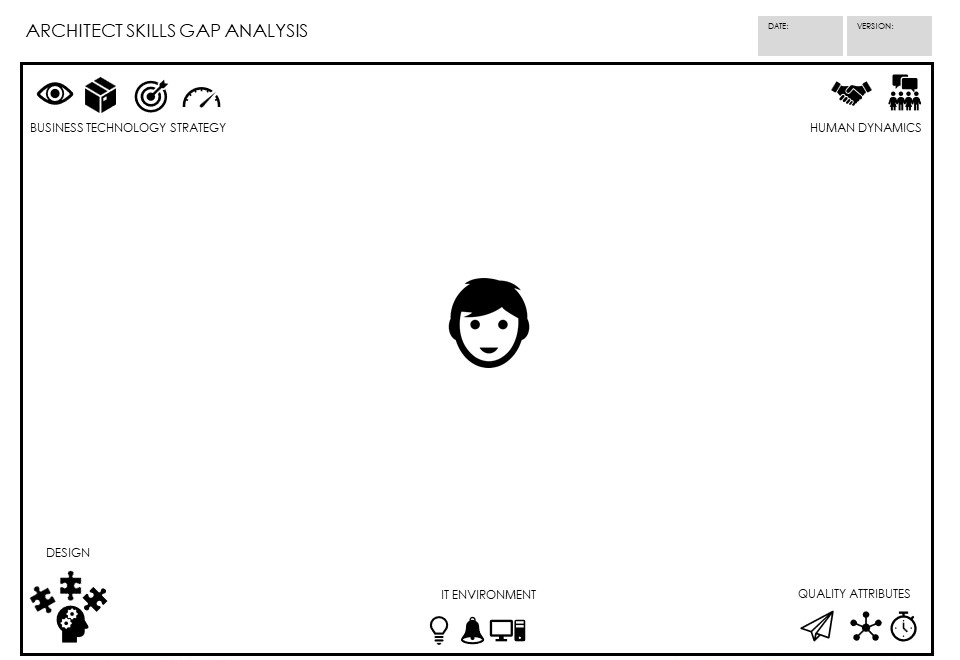

>   "A practice model is the only way to organize a successful architecture group in the long term." **Paul Preiss**

# What is an Architecture Practice

The average corporation has employees who are educated and skilled. They acquire these employees through interviews and other hiring methods. However, this model does not apply to professions. Doctors are not 'promoted' into being doctors, nor are lawyers or accountants. Instead, professions organize themselves into 'practice models'. A practice model is a group of professionals, most of whom are reasonably junior, who grow through learning a particular set of skills and apply those skills to create something of value.

The technology world is currently does not employ anything close to a practice model, even although it could be argued that there are many professions. The employers look at certifications, interviews, and experience and decide what job the person qualifies for, whether it be an architect, a programmer or a manager. There's one big problem with this, it makes creating architects, engineers and professionals random or more accurately based on the beliefs within that current organization at that time. It is also common for this to change drastically as staff changes, management changes occur, creating long term confusion, cost and friction.

## How Does a Practice Mindset Differ From Most Organizations

Think about all of the professional groups from more standard professions like law and medicine. In these groups, the basis for advancement, delivery, and growth of the profession lies within the overall body of practitioners and is less based on the internal politics, policies and structure of the organizations that employ them. This practice mindset restructures the idea of a career around mastering a shared body of knowledge and even sub-specializations within the profession. Medical practices are by far the easiest to be described in terms of this mindset. Doctors, nurses and operational staff including executive management follow different models for education, skill mastery, advancement, mentoring and thought leadership. It also impacts areas of measurement, innovation and societal interactions including relationships with higher education, law and government, not to mention the relationship to ethics.

There is no method, for example, of promoting someone to a surgeon within an organization. Learning, mentoring, competency growth, certifications, and most of all successful demonstration of competency within the modern body of knowledge guide the career of the individual.

# Why is a Practice Important to Architects

A practice mindset may be the most essential change in architecture and technology over the next few decades. While technology advances and management techniques and remain driving forces, they have reached a level of societal impact (human safety, fiscal impact, [culture](culture.md), and law) which require a fundamental shift in the approach of technologists to employment, growth and scope of impact.

In addition, a practice model brings significant benefits to all parties within the system. Problems that have plagued IT and organizations both vendor and non-vendor alike can be linked with the solutions provided by using a practice model rather than a management model for professionals involved in the field. This is not limited to architects but they and engineers are the most obvious candidates for the development of a true professional model. Below are issues and benefits that can be achieved through this shift in employment and experiential model.

| **Benefits/Issues**                                      | **Description**                                                                                                                                                                                                                                                                                                                                                                                    | **Practice/Professional Impact**                                                                                                                                                                                                                                                                                                                                                                                                                                |
|----------------------------------------------------------|----------------------------------------------------------------------------------------------------------------------------------------------------------------------------------------------------------------------------------------------------------------------------------------------------------------------------------------------------------------------------------------------------|-----------------------------------------------------------------------------------------------------------------------------------------------------------------------------------------------------------------------------------------------------------------------------------------------------------------------------------------------------------------------------------------------------------------------------------------------------------------|
| **Effective adoption of modern methods and techniques.** | The industry currently experiences great difficulty in using, adapting, growing and maturing useful techniques such as Agility, CI/CD, DDD, etc.                                                                                                                                                                                                                                                   | A practice model requires that professionals maintain certain minimum levels of modern understanding. A professional is required to acquire new skills and to use them in practice and share findings in useful ways with other professionals                                                                                                                                                                                                                   |
| **Difficulty in finding and retaining talent**           | There are never enough architects to go around. In fact, scarcity defines many of our engagement models (see Assignment). Great architects are hard to find and difficult to create even for the most advanced global organizations.                                                                                                                                                               | Much of this difficulty rests in the lack of a professional practice model. Since each company, service integrator and vendor 'create' their own version of architects, they are effectively re-inventing everything themselves over and over again.                                                                                                                                                                                                            |
| **Poor understanding of value**                          | Architects are often seen as an unnecessary resource who struggle to define their value to companies and society.                                                                                                                                                                                                                                                                                  | Again professions have faced this challenge dozens of times. A professional model defines its value 'as a body' both internally and externally.                                                                                                                                                                                                                                                                                                                 |
| **Clear role interactions**                              | Role confusion dominates the technology industry today. Multi-skilled teams, T-shaped skills, random job titles. The confusion creates the chaos that is modern technology delivery.                                                                                                                                                                                                               | Professional models have very clearly identified and agreed upon role interactions and responsibilities. In most of these cases, these interactions are legally enforced.                                                                                                                                                                                                                                                                                       |
| **Common competencies across organizations**             | As each organization defines architecture differently, an architect in one company has almost nothing in common with one from another company. This increases the cost of hiring and training and decreases quality and value dramatically.                                                                                                                                                        | Professions are defined by competency models, not by role or job title. Competencies are measured by demonstrated success. This allows ease of hiring and a common language across boundaries both corporate and cultural. It also increases the quality and value delivery for every practitioner.                                                                                                                                                             |
| **More successful delivery**                             | Often success is a whimsical notion defined by a management team based on unclear objectives which go unmeasured.                                                                                                                                                                                                                                                                                  | A practice model has very clear objectives and members of the profession do not advance unless they are able to show that they have contributed, lead and delivered against those measures.                                                                                                                                                                                                                                                                     |
| **Trust and Ethics**                                     | There are severe trust and ethics issues developing in modern technology delivery. Vendors and SIs are untrusted by clients. Technologists are untrusted by other business groups. This lack of trust costs the world billions in broken promises, lawsuits and missed opportunities. Ethical practice does not effectively exist in modern technology at all.                                     | Professions are founded on a societal contract based on ethics and trust. This contract is enforced through liability, legislation and litigation. Doctors, lawyers, architects, structural engineers, psychologists to name a few are able to practice primarily because they are trusted. This trust is based on rigorous enforcement of ethics with clear penalties for breach.                                                                              |
| **Structured Career Path**                               | Becoming an architect is still almost a random roll of the dice. The path to Distinguished Architect is half luck or worse. This lack of career path creates more confusion in value, role and execution than almost anything else in the industry.                                                                                                                                                | Professional practice models use an externalized (professional) career path that cannot be superseded by any other role, title or authority. This career path guarantees (within human limits) the baseline quality of the practitioner. It also creates a large pool of potential candidates who are able to select their career early and grow in accordance with their competencies.                                                                         |
| **Technical Debt and Legacy Modernization**              | There is a pile of unpayable debt lying hidden in almost every organization on the planet. This debt is easily in the region of billions of dollars. The debt is a large pile of poor decisions made by those who are either unaware or unwilling to manage it. This debt then makes modernization (note: legacy is NOT debt) very difficult and costs companies in more ways than can be counted. | Professional models manage healthy debt and are aware of the difference between unmanaged, unhealthy debt and healthy, value impacting loans. The techniques involved in this management are part of the competencies and the body of knowledge that every practitioner must demonstrate success in executing. Without a profession, the worlds technical debt will ultimately consume its ability to pay it back.                                              |
| **Low Value contribution**                               | Without competency assurance, the individual practitioner much less the total group of architects will not be able to give anything close to a value-based contribution, at least compared with a similar group of competency based architects. This lack of value heightens then negative aspects of the entire spectrum of architecture execution throughout the industry.                       | In many organizations, the term architect, the word architecture or anything related are seen as completely negative. There are executive leaders of many large companies who simply reject the notion that architecture has any value at all (this comes from direct quotes from corporate assessments). Professional models suffer some difficulties based on the poorest performers but they are by far more valuable overall than non-professional methods. |
| **Extremely high costs of architects and architecture**  | It is well established that architects are expensive. But they are much more expensive than they need to be. Maintaining an architecture practice independently means training, career path, mentoring, and dealing with the mistakes of poorly skilled practitioners.                                                                                                                             | A practice method develops professionals along a very carefully managed career path from early learning through true mastery. This allows organizations to a) offload the expense of hiring and training to the profession and the practitioner and b) to lower the overall cost of employment through clear utilization and engagement methods without the wasted reinvention of practice methods based on executive whims.                                    |

While this list is in no way a comprehensive list of the pros and cons of investing in a professional practice model, it clearly defines the value that can be achieved by doing so.

# Competencies, Career Path and Advancement

Much has been made about what is an architect. However, that is fundamentally the wrong focus. Any profession is defined by four fundamental components, a) its value proposition to society, b) the competencies required (often by law) to practice it, c) an updated and well-attended body of knowledge, and d) the method by which an individual advances to the highest levels of the profession. These elements are not decided by natural law or philosophical debate, they are decided by a large enough body of individuals working together to agree on them and then enforcing those standards internally and externally as well as championing them to society, government and laypeople. This is how all respected professions are built. Within that context it is also an expectation that a) all practitioners will contribute learning back into the body of knowledge, b) new techniques will be researched independently to the best of the professions abilities for safety and efficacy, c) that those who practice poorly will be removed from the profession and d) that advancement will only be achieved through successful demonstration of the competencies.

This requirement may sound like an onerous burden, and frankly, it is. Professions are expensive propositions to society as they require a huge underlying infrastructure to maintain. From university accreditation (think about the difficulty of medical school accreditation), mentoring effectiveness, common employment methods, certifications, legislation, even global treaties often include elements of professional designation and cross-border accreditation. However, when something is as critical to human safety, identity, global security and fiscal interests of organizations, it requires a true professional infrastructure to ensure it is as optimized as possible within human system boundaries. This body of knowledge (the BTABoK) is founded on the notion that technology strategy and architecture have reached this critical stage.

Therefore the BTABoK is founded on the tenet that all organizations which hope to achieve true digital advantage, ensure the safety of people, and deliver ethical and sustainable technology as a part of their operations should switch to a shared competency model, common career path and change their methods of advancement. A later section will describe the very simple, cost-effective ways of achieving this very important goal.

The competency model in the BTABoK is very well established and in use by organizations all over the world. Using a competency-based approach removes the confusion about titles and roles and has the added benefit of allowing the individual to grow and improve their overall architecture career, which equates to skills, and achievements, in very specific and achievable ways. Explore the competency model in depth here. Or join the thousands of individuals who have taken self-assessments and peer assessments here.

Figure 1 BTABoK Competencies and Specialization

The competency model used in the BTABoK establishes a clear value proposition within the profession and that is Business Technology Strategy. Later sections of this article will clarify how that applies to specialists such as business or software architects as well as how sub-specialists or technical experts are included. In addition, the [Extended Team](extended_team.md){:target="_blank"}article explores ways to use the competencies in environments where architecture as a profession is not firmly established. Below is a common canvas used to highlight competency strengths and weaknesses in both individuals and architecture teams.

Figure 2 Architect Skills Gap Analysis Canvas

The skills gap analysis canvas provides a tool for estimating a team or an individuals current competency levels based on the five pillars. For detailed use instructions see the canvas.

# The Architects Practice in the Enterprise

The most important element of building an architecture practice is simple but at the same time difficult. Take everyone in the company, and its direct vendors and service integrators with the title architect and roll them into an Architecture Practice. Some call this a Center of Excellence, some call it other names. The basis for the practice is to get all architects aligned with the primary success elements of the architecture practices:

-   A competency, experience based career path,
-   A value outcome based mindset,
-   A set of measured quality attribute based structural drivers,
-   A clear understanding of current maturity of the practice, and
-   An agreed path towards increasing maturity over time.

The practice, may need to include representatives from 'non-architect' roles but that are doing architecture work, especially in early maturity phases. The extended team article describes this in detail.

## Large or Small Groups and In-Between

There is a great deal of difference between an architecture practice with 1-15 members and one with 1000+. Iasa has worked with practices of all sizes in military, government, commercial, product vendor and service integrator business. The BTABoK methods are built to scale both up and down. It is essential that the organization understands the principles of developing an engagement model and to ensure the practice model fits the organization context .

# Building an Architecture Practice

As in all of the outcome model articles of the BTABoK there are a set of objectives and measures which can aid the architecture practice in growing the success of the outcomes and goals. The practice should clearly define and envision its drivers, its success criteria, its measures and metrics and should review every concept listed in the BTABoK to decide the applicability of those concepts.

In general, the Architecture Practice should be responsible for the following 5 types of activities.

1.  Building a Practice Steering Body
2.  Growing People
3.  Growing Maturity
4.  Growing Acceptance/Awareness
5.  Managing the Engagement Model

## The Architecture Practice Steering Body

In larger architecture practices a steering group is recommended to drive the success of the overall practice. It should include representatives from every area where architects are employed or used, potentially including representatives from primary vendors or service integrators. However, those companies need to adhere to the concepts of the BTABoK before being invited to this level of integration.

To form a steering group, create a representative group small enough to accomplish leadership but large enough to represent the architects of the organization. In most organizations there is a hierarchical order of enterprise and chief architects at the top who often report to a VP of IT or a CTO. These individuals often either invent the engagement model or rely on vendors methods and advice. This is a mistake as much of the real decision making and execution is done by architects during delivery. These individuals must be as committed to the engagement model as the leadership. Therefore, the steering committee should include representatives from all of the specializations as well as even 'junior architects' who have demonstrated a deep commitment to the success of the practice. The purpose of this group is to define the practice, role, tasks, deliverables etc. that make up the engagement model of the organization. They may take freely from the BTABoK but may also use other sources such as DODAF, TOGAF, FEAF, SAFe, BCS, etc. However, it should be noted that framework adoption does not generally work by itself, most frameworks are not Bodies of Knowledge and are therefore very prescriptive in their approach. In addition, most frameworks do not include a fully rounded view of the practice from the perspective of all of the specializations.

## Growing People

Great professionals make great practices. The first responsibility of the architecture practice is to mature, grow, and nurture the competencies of its' members. This is no small effort in today's world as the members will themselves have different backgrounds, beliefs about architecture, understanding, competencies. In many cases these differences are the primary limit to the perception of value as well as the maturation of the practice itself. It is very common for groups of architects to blame the organization or industry for their difficulties when they themselves do not agree on a common set of outcomes, techniques or practices.

Growing the group of architects is based on:

-   Adopting a competency model,
-   Measuring each practitioner and extended team member against it,
-   Committing to both knowledge and mentoring based growth,
-   Measuring the growth in competencies,
-   Rewarding/promoting/supporting individuals for achievements, and
-   Committing learning back to a shared industry body of knowledge.

People advancement can be done as a part of training but it is essential that the training be followed up and supported in the engagement model and via a mentoring method that allows individuals to try new skills under appropriate circumstances.

## HR and Job Titles

One of the most difficult and longest to change processes to deal with in a mature practice is that of HR, employment, promotion and titles. In the current environment titles are relatively arbitrary as well as promotion methods when considered from the perspective of the industry. Even within very large organizations there is a huge amount of variety. A great place for the development of the practice is with Human Resources who are experienced using external skill standards for hiring, promotion and ethics. However, even HR in most types of organizations are not fully familiar with how hiring, promotions and titles are handled when professional designations and achievement are important to outcomes. Accounting and law may provide a certain level of guidance in these areas but a steering body working actively with IASA and HR will aid the development of such standards.

## Understanding Current Touchpoints

One of the first areas of an architecture practice works with is to identify interactions with other groups and stakeholders. For example, are a portion of the architects working with operations, or IT Management or Business Management? Does the architecture team work across the PMO or product management, change planning, business capabilities, strategy etc. Most architecture practices have a very heavy focus area. For example, the software architects may be working heavily with DevOps which puts them primarily in contact with a) developers, b) operations, c) product owners, and d) mid-level IT Management. This kind of clustering of interactions limits their ability to truly understand the business value and objectives of senior management. The reverse may be true of a group of business architects working on capabilities or strategy with senior business management. In each of these cases the goal of understanding touchpoints is to create a strategy which allows the practice to flow from strategy to execution to digital advantage (benefits) without loss of architecture excellence or maturity.

To understand the type and nature of interactions with stakeholders the Architecture Touchpoints Canvas can be used. This exercise is best done by the entire steering group. The goal is to document the target state of the engagement model with current staff and competencies. It is also useful in understanding the current state of interactions.

Figure 3 Architecture Touchpoints Canvas

## Growing Maturity

The maturity of an architect practice is measured by understanding its impact on the outcomes (zone measures) of the digital advantage of an organization. It is impacted primarily by the competence of the team and the maturity of the engagement model. However, it should be noted that even an extremely competent team may only mature the architecture practice within the limits of the overall company maturity. For example, if the executive team is not mature in operations, finance, etc or is resistant to digital transformation, the architecture practice maturity will be limited. See BTABoK Maturity Model{:target="_blank"} and Architecture Capability.

## Architecture Practice Objectives

As a part of the practice and engagement model there should be clear objectives for the entire group of architects employed by an organization, including vendors and SI partners. This means the practice has to set and measure these objectives and how they are being achieved alongside working with other business units on digital advantage. In most cases these two elements will cross over significantly. Effectively the architecture practice becomes responsible for a portion of outcomes related to all areas of the business it officially supports. However, it needs to be noted that based on the BTABoK, this level of support must be proactive involvement in the delivery of value for the business units the practice engages with, including the IT business unit, thus enterprise wide objectives are only possible if there are enough architects to commit to such proactive engagement. See the [Coverage](coverage.md){:target="_blank"} article for more guidance.

## Growing Acceptance/Awareness

The architecture practice as a whole, not just the steering body must represent itself as a professional group that serves a valuable and essential function of the enterprise. It also must strive to demonstrate this to the industry. The purpose of the first is to always grow awareness around how the organization perceives architecture as an organizational capability. The purpose of the second is to ensure that the organization is desirable as an employer or client in the architecture community and profession. This is also a secondary outcome of the presentation and contribution of thought leadership back into the community of architects.

## Managing Contributions and Collaboration

There are numerous ways for every level of architect to contribute back into the profession in a way that is measured. These contributions should become a fundamental part of achievement especially early on in the architect career path. Many architects believe they cannot contribute until they are very senior but in many ways this is the root cause of our lack of shared professional body of knowledge.

Some examples and opportunities include:

-   Sharing experiences applying BTABoK concepts or methods of a concept or method on a project -- both and good and bad results (of course this contribution must have private data removed but the learning remains)
-   Creating videos, articles, or other records of applying patterns or techniques and tagging them to the body of knowledge
-   [Patterns](../patterns/architecture_pattern_repository.md){:target="_blank"}, [quality attributes](quality_attributes.md){:target="_blank"} and [viewpoint](views.md){:target="_blank"} examples
-   Supporting working groups delivery especially where the working group needs more junior members to help with the overall time contribution required

For more senior members

-   Videos, interviews, and speaking opportunities
-   Article contribution to official publications and organizations (beyond personal blogs)
-   Mentoring and teaching
-   Contribution to the Body of Knowledge
-   Coordination of organization architecture practice learnings as overall contributions
-   Participation in and leadership of working groups
-   Influencing the organization to adopt external levels of knowledge and practice

## Managing the Engagement Model

It is essential that this group create an understandable [engagement model](engagement.md){:target="_blank"} and that they do so in a way that represents the real work of the architects in the organization. For a full description of developing an engagement model see Engagement Models.

The Architect Capability Canvas provides a tool for overall capability management of the architecture practice and there are multiple additional [canvases](../structured_canvases/structured_canvases_m.md){:target="_blank"} that aid the development of a truly well-understood and accepted model of practice.

## Processes, Deliverables and Tools

One of the critical elements of the engagement model is the processes, deliverables and tools architects in the practice use to deliver their work, including frameworks, documents, collaboration, etc. The architecture practice should make annual or bi-annual updates to this based on feedback, experimentation and success from the entire practice group.

The Engagement Model Designer can be used to understand current and future state techniques on a single page.

BTABoK 3.0 by [IASA](https://iasaglobal.org/) is licensed under a [Creative Commons Attribution-NonCommercial 4.0 International License](http://creativecommons.org/licenses/by-nc/4.0/). Based on a work at <https://btabok.iasaglobal.org/>
