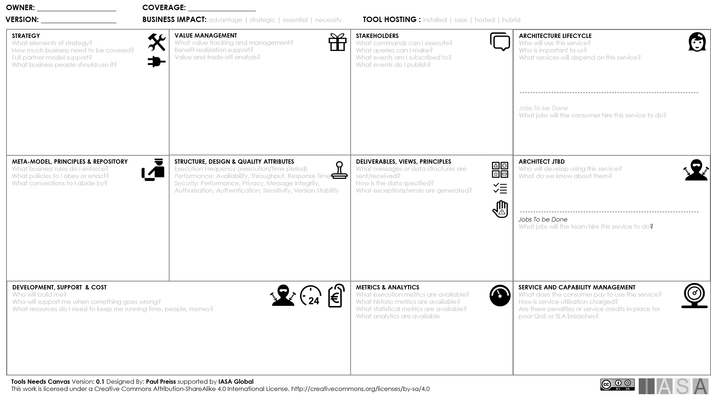

> "A fool with a tool is still a fool."
**John Doe**

Architecture tools support the delivery and development of the architecture practice through automated and manual means. An architecture tool provides either a spot solution or a comprehensive solution in delivery of a set of architecture task(s).

The industry has many architecture tools available in the marketplace. Each of the BTABoK concepts may be mirrored or augmented by an architecture tool. However, it is equally important to note that an architecture tool is first for the use of communicating and managing technology strategy and while it may overlap with other technology management tools, such as a CMDB it should not attempt to replace them or it will become unwieldy.

Engagement Principle: The tool of choice should support an engagement model for architects first. Many tools are simply IT management tools using the word architecture.

## Overview

Architecture tools are the techniques and devices architects use to uncover or design the strategy and structure of a system as well as its form. True architecture tools are complex and no tool on the marketplace covers all of the essential elements.  

## Tool Capabilities and the BTABoK

How do we cover the vast touchpoints of an architecture tool without covering all technology tools? Think of each of the BTABoK topic areas and imagine how a tool would support it. We have tools for design. We have tools for [governance](governance.md){:target="_blank"}, tools for product and project planning, [roadmapping](roadmap.md){:target="_blank"} and [stakeholder](stakeholders.md){:target="_blank"} management. Soon we have a tool that covers all aspects of business and technology strategy and execution.

The goal of an architecture tool is for a group of architects to think, communicate and automate the delivery of 'valuable business technology strategy'. The meaning of that in practice can be interpreted but there are a number of methods we use to uncover the needs of a practice and how to best match a tool to those needs.

The following BTABoK concepts and elements are the most essential in selection of a tool.

| **Characteristic** | **Importance in Selection** |
| --- | --- |
| [Strategy](strategy.md){:target="_blank"}, objective tracking and visualization | Traceability through the [architecture lifecycle](architecture_lifecycle.md){:target="_blank"} is the critical objective of strategic tools as well as design methods for understanding and extracting business inputs and outcomes which affect [architecture decisions](decisions.md){:target="_blank"}. The team should evaluate its adoption of customer, business, and employee design techniques and be sure these are supported and connected throughout the meta-model of the tool. For example, do capabilities properly display in a business dependency network model or does the tool support [customer journeys](journey.md){:target="_blank"}? Can objectives be traced and mapped to architectural requirements and decisions. |
| Architecture delivery lifecycle | The tool needs to support different phases, activities and deliverables brought about during the ADLC. Review lifecycle decisions and impacts to estimate tool support. |
| Value management and tracking | Benefits realization and value management sit at the core of architectural decisions. The value of a decision can be shown and managed and the tool supports flexible techniques for value calculation. |
| Meta-model management | Meta-model flexibility (what architectural concepts connect to what others) is critical in an architecture toolset. Organizations often customize their definitions of requirements, quality attributes, principles and many others. In addition many meta-models are likely in place in larger organizations. |
| Service and Capability management | One of the most dynamic and powerful models of the enterprise in both business and technical domains are capability and service models. These can be connected and dynamically rerouted on a very frequent basis in highly agile environments. The tool may need to support definition and change and impact analysis of services and capabilities. |
| Implementation of the architecture repository | Repository implementation within the tool should be carefully considered as this implementation establishes most of the limits of a tool for the architecture practice. |
| Technology and business modeling | Modeling and design are often the primary consideration for tool selection though many simpler tools can do a fine job of design including white boards or lucid chart. Design flexibility and the ability to define rigorous models versus communication or free form models as well a connectivity to communication tools like MS office are also critical. |
| Investment planning and prioritization | Significant elements of the architecture lifecycle center on the decisions to invest and to prioritize investments of time and resources. The tools should be particularly robust in these areas. Support for roadmapping, business cases, investment options and linkages to value management methods are particularly helpful. |
| Stakeholder management | Likely one of the most important areas of tools selection is the robust handling of stakeholders, from modeling to collaboration. Stakeholder evaluation and management are some of the most critical activities of the architect and the tool should support easy to use viewing, dashboarding, commenting and other collaboration mechanisms. |
| Architecture Descriptions, Views and Viewpoints | Architectures are written and designed using conforming sets of views which deeply interact to discover and define critical components of the outcome solution often in an evolving and dynamic environment. View and viewpoint management, support for viewpoint sets and ease of conformance checking across views as well as principles is essential. |
| [Principles](principles.md){:target="_blank"} | Architectures must perform within a minimum set of guardrails, policies and constraints laid down by the environment, the enterprise, other architecture(s) as well as physical, business and technical limits and rules. Modeling, design and rules should be structured in ways that allow the architect to better understand the application and impact of these principles. |
| [Quality Attributes](quality_attributes.md){:target="_blank"} | Quality attributes are a deeply complicated element for most architecture tools as they arise from stressors and load in production environments and are often deeply intertwined. Quality attribute scenario and analysis support can be a very powerful tool for the team to understand the stressors. |
| Structural Design Complexity | What-if analysis and structural complexity analysis are very difficult elements for an architecture tool to achieve as they require deep integration into both technical and business data and information sources as well as runtime systems. The tools should provide sufficient structural design methods for complex systems to analyze architecture decisions based on deep understanding of structure. However, most enterprises, outside of mission critical systems in health and safety, do not have the finances or staffing to achieve this. |
| Delivery and Execution | Delivery and execution support is about the evolution, communication and management of design as it is embedded into working code, hardware and business rules. The tool should allow for clear version management and extended team support as well as integration with common project management, development and continuous delivery tools. |

Cards, [Canvases](../structured_canvases/structured_canvases_m.md){:target="_blank"} and Documents as Tools

The BTABoK provides dozens of cards, canvases, [viewpoints](views.md){:target="_blank"} and document templates to aid is specific architecture problem solving. Each of these whether automated or printed provides a specific tool for a specific area of application. The goal is not to use all of these tools for any effort but to learn their application and study their use to be able to use as a particular problem set arises.

## A Fool with a Tool

No matter how great the tool, the team skills will always be more important. The tools can only provide a certain amount of support for the activities of the architecture team.

## Architecture Tool Selection

The process of architecture tool selection requires the team coordinate and understand its current engagement model needs and select the most important elements to provide support.

**Step 1:** Establish a tool selection team as a part of the engagement model development effort. The team should be equally comprised of all types of architects who will be expected to use it.

**Step 2:** Use the Tool Requirements Canvas to list and describe usage requirements using a sticky note and dot-voting mechanism to identify the primary impact areas of the tool in question.

## Using the Decision Record to Select

The BTABoK Decision Record Card is an excellent tool to compare and contrast different architecture tools on the marketplace.

Additional elements to consider in tool evaluation are more related to the method by which the tool is deployed. Keep in mind tools like canvases while paper still require versioning, communication, printing and other physical limitations.

| **Comparison** | **Explanation** | **Importance in Selection** |
| --- | --- | --- |
| Integrations   | What software, hardware, IT and business systems are supported by the tool? Is the data available for integration into other systems? An API? | Integrations become very important in large team support of architecture tools. Smaller teams may benefit from the simplicity of fewer integrations. |
| Support   | How is the tool supported and licensed? | Failure in architecture tools may result in significant delays or worse deep errors in mission critical systems, evaluate vendor support options carefully. |
| Configuration   | How much of the tool is configurable? What can be renamed? Can the meta-model be altered? Reports? | Architecture terms, concepts and frameworks are highly customized in the average company. Be sure the tool can support this level of customization and the ability of the tool to grow (or shrink) to the level of engagement of the current and future team. |
| Collaboration | How many stakeholders, architects and other participants are supported? What communication, design and other devices can be used and in what environments? | The tool should support robust communication and messaging as well as optimize integration with communication tools such as Teams, Slack and Office. In this area the tool should maximize both the flexibility of collaboration as well as its depth. |
| Cost | How is the tool licensed, priced and supported? Per person, by functional area? | The cost of large architecture tools can be massive in complexity and depth for large enterprises. Even open source tools may require support or commercial licenses for advanced features. Use Iasa CBA tools to help understand these costs and value. |
| Multi-Framework Support | What frameworks are in place in the organization which impact architecture? ITIL, Agile, SAFe, etc | Most enterprises have individuals using multiple architecture frameworks, many of which are unfinished or incomplete. The concepts and models in these tools may not fit well or even directly clash with each other. Ensure your tool can deal with a variety of methods or that sufficient support for working across frameworks exists. |
| Dashboards and Reporting | How easy does the tool support reporting, dashboarding, rollup or other methods for showing progress and demonstrating the information within? | Along with collaboration reporting and dashboarding need to be as flexible as possible to allow organizations to understand the information in the tool. Be sure that these don't drastically impact cost or flexibility of the tool. |
| Security | What security protocols and standards can be supported? How private is the data? | Much of the information in an architecture tool is very sensitive and possibly damaging to a company if it is lost or stolen. Ensure proper levels of security are available for intended use. |

# References

[https://sparxsystems.com/enterprise_architect_user_guide/14.0/guidebooks/ea_architecture_repository.html](https://sparxsystems.com/enterprise_architect_user_guide/14.0/guidebooks/ea_architecture_repository.html){:target="_blank"}

[https://pubs.opengroup.org/architecture/togaf92-doc/arch](https://pubs.opengroup.org/architecture/togaf92-doc/arch){:target="_blank"}

[https://www.sciencedirect.com/science/article/pii/B9780124199842000045](https://www.sciencedirect.com/science/article/pii/B9780124199842000045){:target="_blank"}

[https://bizzdesign.com/blog/5-top-tips-for-organizing-your-architecture-repository/](https://bizzdesign.com/blog/5-top-tips-for-organizing-your-architecture-repository/){:target="_blank"}

[https://docs.aws.amazon.com/whitepapers/latest/establishing-enterprise-architecture/enterprise-architecture-repository.html](https://docs.aws.amazon.com/whitepapers/latest/establishing-enterprise-architecture/enterprise-architecture-repository.html){:target="_blank"}

[https://www.academia.edu/6549603/Enterprise_Architecture_Tool_Selection_Guide](https://www.academia.edu/6549603/Enterprise_Architecture_Tool_Selection_Guide){:target="_blank"}

BTABoK 3.0 by [IASA](https://iasaglobal.org/) is licensed under a [Creative Commons Attribution-NonCommercial 4.0 International License](http://creativecommons.org/licenses/by-nc/4.0/). Based on a work at [https://btabok.iasaglobal.org/](https://btabok.iasaglobal.org/)