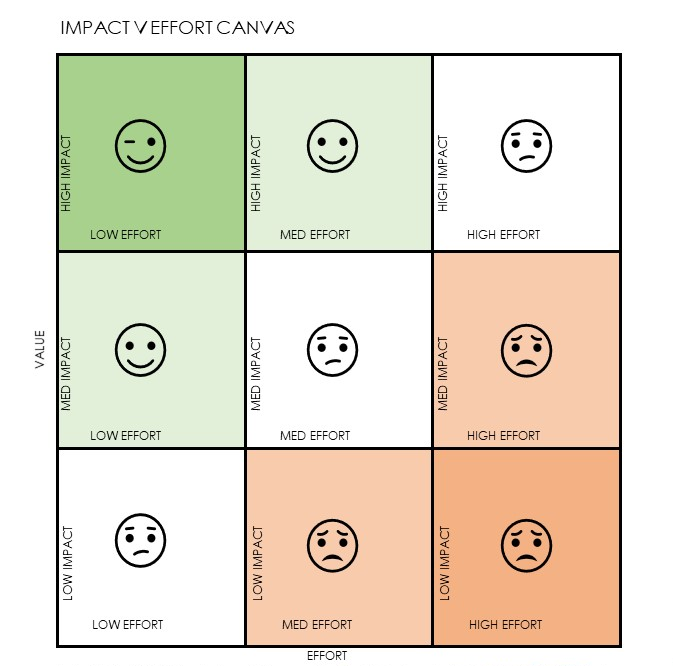

> "I do not want to waste any time. And if you are not working on important things, you are wasting time."
**Dean Kamen**

# Architecture Portfolio and Assignment

The portfolio of work at an organization is the amount of people, process, or technology change undertaken by an organization during a time limit set based on budgetary and or resource utilization guidelines. It includes product and program changes. Portfolio changes are managed at the highest level and include program and project level investments in organization outcomes. The architecture practice participates in this change based on their current engagement maturity.

Architecture assignment is the process, methods and goals which describe the way a team of architects engages in work with a customer or organization. It requires more than just assigning an architect on a project or product. It also specifies:

1.  How architects choose work within the portfolio (or continuous delivery cycle).
2.  How architects work together to grow in experience, mentor, and ensure success.
3.  How the team prioritizes work with a client or project management office or [agile](agility.md){:target="_blank"} releases.  
4.  How the team delivers the roadmap.

## Assignment Methodology

Depending on organizational maturity and architecture maturity as well as work delivery methodology in use the architecture team must customize their process. Generally there are three methods in practice at organizations for work assignment with plenty of overlap and situations where multiple methods are in use.

## Stakeholder-Driven Methods

Immature organizations and small companies often use stakeholder managed project investment and delivery methods. Powerful stakeholders are in charge of budgets or decision rights and decide on investment direction from personal views of the business. This method allows these stakeholders to decide the direction, teams and delivery outcomes based on their experience and preferences and is therefore as varied as the stakeholders themselves. In this scenario architects should use a stakeholder driven approach and begin using valuation tools to begin characterizing value on objective measures in addition to stakeholder methods. This will gradually change the investment and outcome language of the organization from political and subjective measures to outcome driven measures driving the adoption of PMO methods. This follows the principle of Value Driven Investment.

## PMO Methods

Project management methods are the standard for work prioritization in medium to large organizations and include the use of a project management office (PMO) to coordinate and discuss all investment options through a portfolio-program-project-maintenance hierarchy which is controlled by one or more investment committees of powerful stakeholders and/or budgetary comparisons using value tools such as ROI and TCO. These companies have organized around doing large expensive things relatively safely and well but tend to stifle innovation and disruption. The architecture team should first achieve excellence in participating fully in the the a) origination of architectural priorities and new business initiatives using stakeholder management techniques and business case orgination and measurement, and b) drive towards more quick release innovation management techniques for business initiatives paving the way for a agile business methods. This follows the principle of Innovation over Governance.

## Agile Methods

Agile methods are the use of change techniques which need to be fast and innovation and disruption aware. Agile businesses are those that adapt quickly, embrace change and welcome disruption. Scaled agile businesses drive not only technology change in this way but full organization, product and service change in these ways while respecting and allowing for appropriate hiarchical and slower more traditional production and operational methods to control where necessary. Architects should focus on coverage between innovation and structural safety and engineering and will need a high level of maturity and business penetration to succeed.

## Understanding Work Priority

Within any method of change priorities must be established to allow the architecture team to assign the most appropriate architect(s).

## Understanding Scope and Coverage in Architecture Assignment

Scope and coverage are both important when assigning architects and are somewhat complex. We have derived a simple method for outlining scope of impact of the team while creating the teams goals.

The difficulties in architecture often arise out of too few people trying to cover too much of the enterprise strategy. This leads to engagement anti-patterns like the ivory tower or rubber stamp effect. Enterprise architecture only teams often face this challenge as they try to stay proactive with the fraction of the resources needed.

To create an assignment methodology that works the team must divide the amount of work into portions in which they can stay proactively involved in delivery and they must cover the most important work first.

Architects are first responsible for strategic change management. Working together as a team fill out the work priority cards for the planned work prior to selection from business investment.

The recommended approach to architecture assignment is:

1.  Start with project/product level work. Using the impact/effort card assign architecture resources based on solution delivery and show success and value there. As solution successes mount the team will generate a large amount credibility and demand for its services. This can lead to team expansion but do not expand coverage too far too quickly (use recommended guidance for engagement model expansion from the engagement model guidelines).
2.  Expand work towards business architecture being sure that there is no lost work in solution delivery and that the team has begun building a working and flexible repository and a formal engagement model. Business architects (see below) will be optimally assigned at the value stream, capability, and vertical levels depending on the nature of the organization. Ensure that business architects and solution architects retain tight coupling in their roles and outcomes so that they do not branch too far. This will continue to build value stream based momentum and credibility within the enterprise.
3.  As the value stream delivery begins to become stable and more mature, the team will add specialists to help cover technical services/capability areas such as security, integration, information, and other topic areas. At this point the team should have achieved a level of maturity which is repeatable across value streams and projects/products. During each of these expansions the team should be growing its extended team integration as well as sophistication in competency areas and is ready to grow an enterprise architecture practice which drastically scales out the coverage and scope of the team.
4.  Enterprise architecture gives full coverage across value streams and technical services but retains its proactive assignment method. This means that enterprise architecture should still be actively engaged in delivery of value in addition to outcomes they must achieve within their coverage area in improvements to the overall value created in technology strategy.

## Architectural Priorities and Impact Estimation

The most motivating work for an architecture team is the change the business or grow the business type. To understand and assign architects it is necessary to understand the complexity and desirability of the work. The following characteristics provide a simple work prioritization scheme.

| **Characteristic** | **Explanation** |
| --- | --- |
| Cost to Change | Projects or changes which are extremely expensive. |
| Cost to Undo | Changes which will be very difficult or expensive to come back from or create a large amount of [technicaldebt](technical_debt.md){:target="_blank"}. |
| Newness | Unfamiliar business models or technologies. |
| Resources | High resource consumption or work that requires very specialized or rare skills. |
| Capability Milestone | Work which will achieve significant milestones in business or technical capabilities. |
| Financial Return | Work which has very high returns on the investment using value measurements. |
| Customer (real customer) Impact | Work with direct impact on [Customer Journey](customer_journey.md){:target="_blank"}, Experience, etc. |
| Risk | High [risk](risk_methods.md){:target="_blank"} with large impact and high probability of occurrence or where risk must be managed actively throughout the program. |
| Domain Complexity | Areas where the knowledge domain is sufficiently complex as in scientific processes or specialized architectures. |
| Political/Stakeholder Desirability | Impact from high power, high interest stakeholders who must be managed carefully. |

## Engagement Principle

> Architects as a group should prioritize their work based on estimated outcome impact and proactive vs reactive contribution. At some level of scope an architect is no longer able to be proactive (innovation and delivery focused), but simply reactive (governance and control focused).

## Impact Estimation Using the Roadmap Estimator

The roadmap impact and prioritization canvas is a quick and easy way to connect the concepts of work prioritization and impact with the portfolio.

The architects roadmap is a combination of architectural priorities and the estimated interdependencies between work scope. It should be addressed and updated on a quarterly or semi-annual basis if not more frequently.

**Step 1:** The architecture team reviews business cases (preferably one page NABC or lean business cases) and estimates their complexity and value in the left hand side of the canvas. If at all possible the team should be co-located at this time and adapt the canvas to use quadrants of importance in the work based on its value impact. Note: this is only for business case level work, lower level change must be handled in a triage manner on a weekly or bi-weekly basis.

**Step 2:** The team should utilize rough estimations in timeline to help align the work to the roadmap. These rough estimations are not meant to fully predict the outcome of the work but to help highlight interdependencies in step 3.

**Step 3:** The team will highlight interdependencies between the change initiatives and look for optimal interactions with stakeholders, timelines and budget. This activity will also highlight critical interdependencies where architecture leadership is paramount.

**Step 4:** Iterate on this process until the team agrees to the numbers and timelines. Assign architects based on the most critical factors identified in the previous steps. Use the stakeholder initiative map to help identify areas where stakeholder assignment based on politics and real-world delivery is needed.

## Architect Assignment

Once architectural priority is determined architects may be assigned to the work. It is likely there will be more work than there are architects. This is where architects must make decisions about what to say No to and what must be done. Much of the difficulty in architect teams is taking on more work than the team can do proactively (they are assigned during the whole [lifecycle](architecture_lifecycle.md){:target="_blank"}.

## T-shirt Sizing Assignment

Work is broken up into different 'sizes' or 'priority groups' and work is assigned to the most important items until you run out of architects or you run out of work.

## Specialization and Skills Assignment

Focus on the right fit for the work. Assign architects based on their desire for the job, their ability to deliver value and their skills for the assignment. This will necessitate rotation in most cases.

## Capability Ownership Assignment

Assign architects based on capability ownership whether it is technical or business capabilities. This leaves the architect in charge of the capabilities to which they are assigned and they coordinate and work together on multi-capability assignments.

## Integration Into the [Extended Team](extended_team.md){:target="_blank"}

In many organizations the extended team is used as architects. For example, there may be an enterprise architect team centralized while all software delivery work is done by agile teams with a senior engineer. This method is covered fully in the extended team article but it should be noted that it is both necessary and highly risky unless competencies in the extended team are well understood.

## Assignments by Across Specializations

The larger the architecture practice the more likely there will be specialization within the team. Even small teams have this as architects are clearly aligned with particular depth areas such as business, software, information, or infrastructure. The goal of the assignment by specialization is to ensure that the team does not lose it's cohesion and connected value. If that can be maintained specialization brings a huge value to a growing team.

## Business Architects

The business architect team leads the business strategy extraction and conversion to a digital strategy within value streams, capabilities and domains. This activity connects the outcomes of the organization to the initiatives delivered by solution architects during the change lifecycle. It is essential that these two groups of architects work side by side and are deeply connected in outcomes as they form the horizontal delivery chain of technology strategy tightly coupled to other business strategy.

## Infrastructure Architects

Infrastructure architects specialize in scaling the operations, operational technology and deployment outcomes for the team. This also includes cloud and solution/dev ops coupling to ensure that what is delivered meets all quality attribute needs of the value stream. Infrastructure architects will deal with both business and solution architects to ensure maximum delivery of value within reasonable quality attribute and cost concerns. They should be assigned based on value streams and service level needs and should be assigned early along side solution architects and business architects. They may be assigned as solution architects for critical infrastructure or operational technology are the point of the change.

## Information Architects

Information architects specialize in the use, transformation and storage of information within value streams and capabilities. Much like infrastructure they work alongside business and solution architects to focus on value delivery where large data, information or usage elements are in play. They may be assigned as solution architects where data and information are the central element of change.

## Software Architects

The most common form of solution architect comes from software architects where the goal is to build valuable software solutions for the enterprise. Software architects specialize in the development and delivery of complicated software delivery. They work to ensure software engineering guidelines and capabilities are followed while optimizing strategic value from team delivery.

BTABoK 3.0 by [IASA](https://iasaglobal.org/) is licensed under a [Creative Commons Attribution-NonCommercial 4.0 International License](http://creativecommons.org/licenses/by-nc/4.0/). Based on a work at <https://btabok.iasaglobal.org/>
