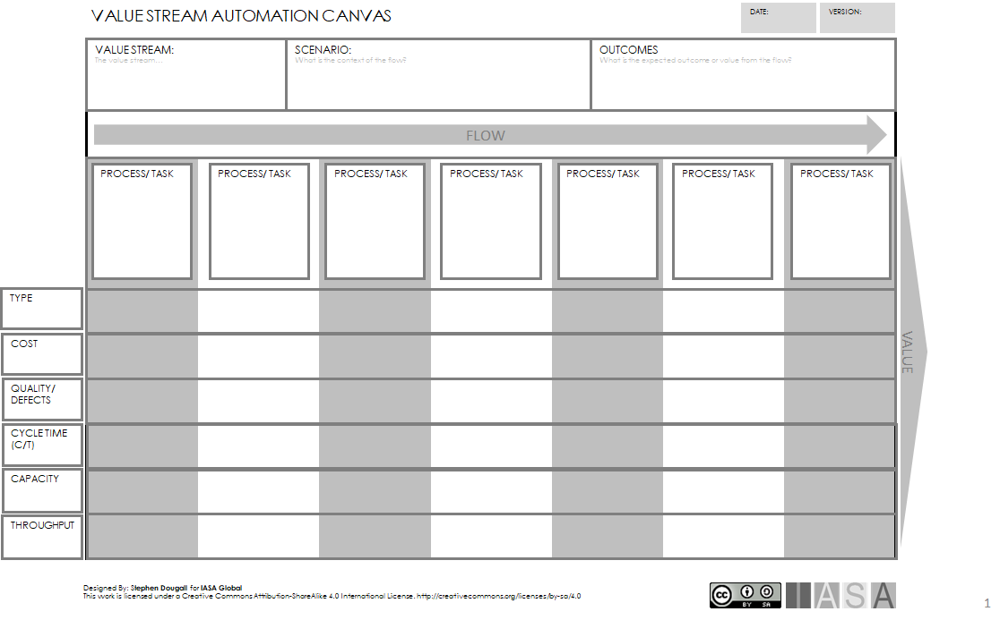

>   "The use of machines and computers to do work that was previously done by people" **Oxford Dictionary, definition of Automation.**

# What is Automation

Humans have been automating tasks and processes throughout history. The development of tools and machines which perform work previously done by people has continued through the ages, windmills, waterwheels, industrial production lines and smartphones are all forms of automation.

Traditionally automation is often thought of in terms of industrial automation, which is a subject in itself. However, this article considers automation in the broader context with a focus on business automation and IT.

The growth of automation has accelerated massively since the introduction of computers and IT, and technologies such as Machine Learning and AI, are now opening new horizons.

Automation is a key aspect of IT architecture since much of the work within this practice is concerned with automating processes. These automation innovations often have significant changes on a global scale. Consider the following:

-   Using email instead of writing and posting letters
-   Internet publishing (blogs, social media) instead of publishing paper magazines
-   On-line loan applications instead of meeting the bank manager to discuss loan terms

# Why is Automation important

All of these are automations where technology performs the work that used to be done by people, and where automation performs the task more efficiently. However, it is not always the case that automation provides efficiency and benefits. Automation of certain processes or activities can have no effect or even a negative effect on business, so it is important to consider the effect of automation. Businesses rely on automation to remain competitive, since automation can enable a business to increase its rate of value delivery, or velocity. Automation is particularly useful if it replaces tedious processes or activities which people often dislike doing. This can improve the work environment and allow people to focus on activities which create more business value.

Automation is not just about doing tasks faster or more efficiently than people, it can also be an enabler for new innovations. Constraints which previously existed suddenly may no longer exist. Consider the advertising industry, personalizing advertisements was not feasible until the gathering of personal information and behaviour was automated through search engines and social media.

Automation is also important in increasing the quality of repeatable processes. Since automation is very good at performing repeatable tasks in the same way, the results of the tasks are much more deterministic. This is difficult to achieve with human processes since it is difficult for a human to sustain exactly the same result over time, especially if the process is complex. For example, building and deploying software.

# Automation Approach

## Ethical Automation

Automation can provide a very efficient way to eradicate manual tasks, and while this may provide gains in efficiency it may not always be ethical. In particular, tasks or processes which require empathy or where value is gained by humans interacting with other humans. For example, it may be efficient to provide automated medical diagnosis to help people with illnesses, but it may not be ethical to remove nursing staff since patients require a level of empathy and caring which cannot be automated.

## Automation and flexibility

Automation provides a higher velocity when performing repeatable and deterministic tasks. However, in processes or tasks which require a high degree of flexibility, automation can be slow to adapt to the surrounding environment. Even with techniques such as AI and machine learning, it is difficult to out-perform humans in complex decision making when processing non-deterministic tasks.

## Bottlenecks

Within a particular value stream, automation is useful to speed up value delivery. The value stream may string together a number of capabilities and services in order to deliver value, so it is important to consider automation in the context of a chain of capabilities/services. Automating processes without considering the whole chain of the value stream can result in bottlenecks. For example, the automation of registering product orders in a business. The registering of orders is delivered much faster but if thethe same speed is not maintained in processing orders, the orders will bunch up in a bottleneck. In this case, it may be better to automate order processing first, and then consider the automation of registering orders.

## Loss of skills and knowledge management

As automation takes over manual processes the need for human intervention decreases. This leads to a reliance on the automation and human knowledge about the processes can degrade. This can constitute a risk, especially if knowledge is not well managed. As time progresses knowledge may be lost completely, which results in the business being fully reliant on an automation which is not understood and difficult to change. In a worst case scenario the automation may fail, and people in the organization do not have the skills or knowledge to fix the automation, or the ability to execute the process manually.

## Technical debt and automation

A critical automated process with significant technical debt is a toxic mix. This puts a business in the position of being reliant on an automated process which may be costly and difficult to change. This represents a serious business risk. The automated process may be prone to failure, rely on hardware/software which is no longer supported, or simply be very difficult to maintain. This can significantly affect the profitability of the business in a negative way, with high costs for maintenance, an inability to adapt to the market, or a loss of customers due to outages.

# Business Automation

Business automation refers to automating business processes which are external facing (on the outside) or internal facing (on the inside). For example, automated support processes such as telephone banking, or placing orders on a web site may be considered external facing forms of automation, since they directly interact with the customer. Automated support for production of orders or management of stock may be considered as internal facing automation, as these help the business to optimize processes which are not seen when the customer consumes a service.

Automation is traditionally achieved by developing software systems or robots which perform tasks at a much faster speed than is humanly possible. Some processes may be fully automated, but many processes are semi-automatic where a human operator is required to execute the automation, or monitor the automation. Examples of typical automations within a business may be, placing product orders, managing stock levels, knowledge-based customer support or appointment booking. In general, most IT developments are concerned with automating the business.

Robot Process Automation (RPA) is one technique which can be used to automate manual processes performed on a software user interface. RPA systems learn a specific behavior by watching the user perform the task on the user interface, and perform automation by repeating that task. This allows a business to create any number of robot workers to perform repeatable rule-based tasks.

# Automation IT Development

An important part of the software development lifecycle is being able to develop software and quickly deliver that software into production. In recent years DevOps practices and thinking have been moving the development and operations processes for software development closer together in order to reduce time to delivery.

*"a set of practices intended to reduce the time between committing a change to a system and the change being placed into normal production, while ensuring high quality"* - **Definition of Devops, DevOps: A Software Architect's Perspective (Ref[1])**

Automation is an important enabler for DevOps and ensures continuous integration and continuous delivery of software. The following are areas in which automation is commonly used within a DevOps environment:

-   Continuous builds of software
-   Automated testing of software (often regression test)
-   Automatic deployment of software (both to test and production environments
-   Statistics and reporting of status (both development and operational)
-   Automatic scaling for capacity (operational)

The requirements placed on delivery of software products, will drive the degree to which DevOps processes are automated.

Testing is a particularly interesting area to consider, as the level of automation depends on the nature of the software product which is being developed. Consider a complex product such as an ERP system, this may have many features and functions with which the users interact in many ways. A substantial degree of automated tests (unit tests) will help with regression testing of the deterministic operations in the system, but trying to automate the many scenarios in which the users will use the system is perhaps not feasible. Human or manual test methods are more flexible in this type of testing, and more cost effective. This is where it is important to consider the balance of automation against human based operation.

# Intelligent Automation

Methods such as machine learning and artificial intelligence are taking automation to new levels. The ability of computer systems to learn patterns of behavior, and make decisions based on algorithms is seeing the rise of new forms of automation such as self-driving cars, service desk chat bots, and complex industry processes.

However, this type of automation raises new concerns. Since this type of automation is based on learning from patterns in order to perform complex processes, it is important to ensure that the automation learns the correct patterns and this may not be as easy as it sounds. Since the patterns are often based on human behavior, the automation may well learn a negative bias from the provided data. Consider automation of selecting potential employees for an interview. The automation may be provided with data about existing employees and try to look for a pattern in the data which constitutes a good employee. The automation may well read from the data that only 10% of the employees have green eyes and draw the conclusion that an applicant is 90% more likely to be a good employee if the eye color is not green. Thus, unfairly discriminating against people with green eyes. If the algorithms and data used of this type of automation are not carefully considered then the automation may exhibit racist, sexist, anti-social or other negative behaviors.

Cybersecurity is an area where intelligent automation provides both advantages and disadvantages. With artificial intelligence new systems can be constructed to help detect and repel hackers. As hackers learn new techniques to hack systems, artificial intelligent systems can adapt and learn hacker patterns, as well as removing potential risks. However, the same is true from the hacking perspective, that new hacking tools using AI can be used to recognize weaknesses in a particular system and exploit them. Another area to consider is that since artificial intelligent systems learn from patterns there is the potential for hackers to manipulate these systems. This potentially could be done by providing false patterns which modify the behavior of a system. It is therefore important that the learning process for such systems is performed in a controlled environment.

# Automating Information Flows

A business requires a number of capabilities in order to deliver value to its customers. These capabilities interact with each other through a value stream in order to deliver value. One way to increase the velocity of the business is to automate the information flow between the capabilities.

Consider a scenario where there is a Sales Management capability which makes sales and places orders, and a Production capability which produces product to order, from the Sales Management. The Customer Service capability manages contacts with the customer regarding product defects and improvements.

Automating the information flow between these three capabilities can considerably improve business delivery. Sales Management can automatically provide information regarding actual sales and potential sales, this can feed into Production so they can plan production levels accordingly. Customer Service can provide statistics on product quality allowing Production to modify processes to remove defects.

These capabilities may all be working in different IT systems so integration is a key factor in automating the flow of information between systems.

# Measuring Automation

Automation is difficult to measure, since it really has to be placed in the context of a flow of processes aiming to deliver some kind of value. This flow of processes can be thought of in the context of a value stream. Measuring the processes in the value stream can provide valuable information about existing automated processes, and processes which may benefit from automation.

In order to do this, some measurements commonly used in the manufacturing industry can be used to help to indicate if processes are performing well, or if there are problems in the flow of work.

## Measuring the Value Stream

The following Value Stream Automation Canvas can be used to consider flows within a value stream, and measure processes and tasks. Depending on the value stream, there may be different scenarios to test, in which case a canvas can be used for each scenario. The expected outcome of the scenario should be clearly stated.

For each process or task in the value stream scenario the following metrics can be measured:

-   **Type** -- indicates if the process is automated, semi-automated or manual. This can be used as an information to identify processes which can benefit for more automation, or automated processes which are not performing.
-   **Cost** -- indicates the capital (CAPEX) and operational (OPEX) cost of the process. This can be used to compare the costs benefits of manual and automated processes, especially if an automated process requires significant investment.
-   **Quality/Defects** - the quality measure of the process which can be calculated as a percent. For example, 0.5% of orders processed may be incorrect. This can be used to track quality improvements in automation or identify automation problems.
-   **Cycle Time** -- the time taken to produce a single value unit from the process with the given resources. For example, the time taken to process a single order may be 10 seconds. This can be used to identify bottlenecks in the flow and estimate the total cycle time for the value stream by adding all the cycle times together.
-   **Throughput** - the actual number of value units being produced from the process. For example, 200 orders per hour. This shows how the process is actually performing, this measure can also help to identify bottlenecks in the flow and to estimate if customer demand is being met.
-   **Capacity** -- the capacity shows how well the process is meeting the demand for value units as a percent using the formula:

    

    For example,

    **200 orders /(3600 secs / 10 sec) = 50% Capacity**\\

    A process which is working at 50% capacity is idle for half of the time. This is used to assess if the process is under performing or over performing. Processes running at 100% capacity may be an indicator that they no longer have the capacity to meet demand, on the other hand processes which are running significantly under 100% may have a significant amount of idle time.

This method can be applied to many different scenarios and processes at different levels of the business. For example, it can be used to measure business processes such as receiving orders, but it can also be used to measure IT development processes such as packaging releases or test processes.

## Analyzing the Result

After measuring the processes in the value stream, the metrics can be used to draw conclusions. The following indicators are useful:

-   **Low-Capacity Rating** -- processes with a low-capacity percent are not being fully utilized and resources are idling. This can indicate that there is a bottleneck somewhere in previous processes. Manual processes which have a low-capacity rating may not be immediate candidates for automation, and can also be adjusted by reducing staffing levels.
-   **High-Capacity Rating** -- processes with a capacity rating of 100% have reached their limit, and cannot meet any higher demand on delivery. These may be considered as bottlenecks. These processes are very good candidates for automation or optimization. Automation can help to relieve bottlenecks.
-   **Analyse the flow** -- if the flow of processes has several bottlenecks which require automation, first automate the processes which are earliest in the flow. Automating processes which are already blocked by bottlenecks will give no effect in total value delivery.
-   **Analyze the cost** -- checking the throughput against the cost is one way to measure if an automation is value for money. If an automation requires substantial investment or has significant operating costs, then this has to be offset against the actual throughput achieved, or the costs of running a manual process.
-   **Analyze the quality** -- percent of defects is also a good indicator for potential automation. Manual processes which have quality problems can be improved by automation. However, it is also a good measure for highlighting automations which are not working correctly. It may well be that an automated process provides a much higher throughput, but quality is compromised.

## Creating Baselines

Before embarking on an automation initiative, it is worthwhile measuring the value stream before implementing the change, this measurement can then be used as a baseline. This way the value stream can be measured after the implementation of the automation and compared to the baseline. This will show if the automation has improved the flow of the value stream.

# References and further reading

**Ref** *Bass, Len; Weber, Ingo; Zhu, Liming (2015). DevOps: A Software Architect's Perspective.* [ISBN](https://en.wikipedia.org/wiki/ISBN_(identifier))[978-0134049847](https://en.wikipedia.org/wiki/Special:BookSources/978-0134049847)*.*

BTABoK 3.0 by [IASA](https://iasaglobal.org/) is licensed under a [Creative Commons Attribution-NonCommercial 4.0 International License](http://creativecommons.org/licenses/by-nc/4.0/). Based on a work at <https://btabok.iasaglobal.org/>
