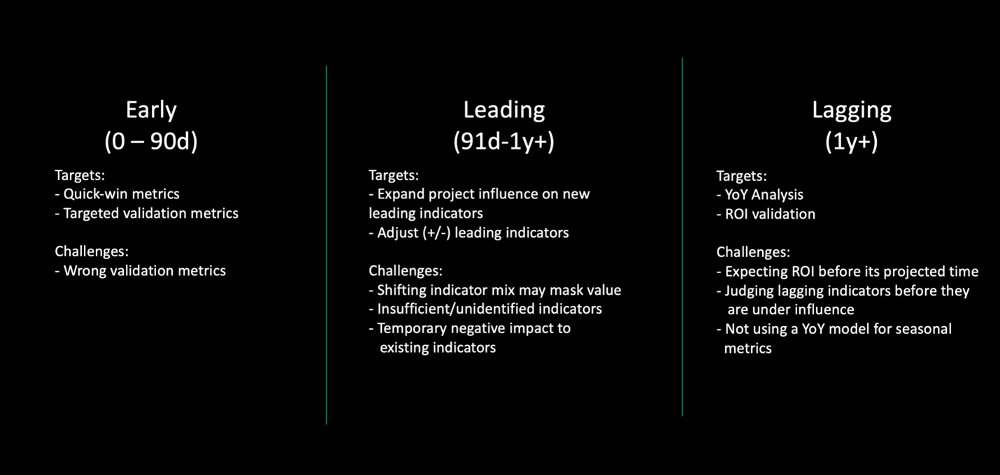

> "However beautiful the strategy, you should occasionally look at the results."
**Winston Churchill**

# Benefits Realization

Benefits realization is an organizational method, process, and commitment to understanding value generation from investment planning and strategy. 

# Why is Benefits Realization Important to Architects

# Approaches to Benefits Realization

## What is Rapid Value Management

As organizations push towards agility, they need an agile
method for ensuring their investments and objectives can be continually
inspected to ensure they are returning value. The challenge for many of those
organizations is that their objectives are often measured with lagging indicators,
and they lack early- and leading-indicators that allow them to determine if
they will meet their objective.

The answer is to use Rapid Value Management, an iterative
approach to continual value realization to ensure programs and projects are
on-track to meet the objective they target.

Rapid Value Management has a secondary effect. It can also
help create a more agile way to manage investment planning by allowing
organizations to deprioritize programs and projects that are not showing early
value and prioritize projects that are showing high early value.

# Business Value Comes from Driving the Organization’s Mission

All organizations share two common characteristics. First,
they exist to accomplish a mission. It doesn’t matter if the organization is
Commercial Sector, Public Sector, or Non-Profit/NGO Sector, they all exist to
accomplish their mission.

The second characteristic is resource constraints. All
organizations have finite resources – people, money technology and time – and
must apply those resources to accomplish their mission efficiently and
effectively.

The challenge most organizations face is that there is
little visibility on how the average employee’s daily work supports the
organizations mission. Solving the visibility problem is a critical first step
to creating a culture focused on delivering meaningful value to the
organization. The Rapid Value Management method helps architects create a
canvas that shows the mapping between programs and projects and the organizations
mission. It then provides a set of value indicators used to objectively prove
the value of those programs and projects.

# The Architect’s Role in Value Management

The Architect is responsible for ensuring that the
organization’s investments in technology and technical projects help the
organization accomplish their mission as efficiently and effectively as
possible.

**Efficiency** means driving the most value from the
smallest amount of the organization’s resources. This means managing
investments to reducing operating costs, manual processes, eliminating
technical waste and improving time to value.

**Effectively** means that investments help improve the
organization’s capability to execute its mission or to create new capabilities
that that improve the organization’s ability to execute its mission.

The Architect needs objective data to govern program or
project’s efficiency and effectiveness. They need to ability to quickly
determine if an investment won’t deliver the desired outcome so they can either
restructure or decommit from that investment to preserve resources.

To do that they need to rethink value indicators and ensure
those indicators give them the data to govern value.

# Three Types of Value Metrics

The core of Rapid Value Management is the use of three types
of KPIs – early validation indicators, leading indicators and lagging
indicators. Most architects are familiar with leading and lagging indicators,
but agile organizations need early validation indicators to ensure investments
will rturn business value.

-  **Early Validation Indicators** are measures that register impact within the first 90
  days of a program or project. Ideally, they register impact within the first 30
  days. These indicators should align with leading indicators for the program or
  project. 

-  **Leading Indicators** are measures that register impact within 91 days and one year, although larger programs and projects may take more than a year to register
  impact. A positive impact on a leading indicator should be highly predictive that
  the lagging indicator target will be reached.

-  **Lagging Indicators** are measures that show the end success or a program or project. Ultimately a positive impact on a lagging indicator should indicate an
  organization’s success in meeting their goals and executing their mission.

# Creating the Rapid Value Management Canvas

The Rapid Value Management method is designed to gather a
group of stakeholders – objective owners, resource managers, finance managers
and any other people who provide resources to a project or program.

## Step One: The Organization’s Mission

To begin, get clarity on the organization’s mission and
write it down so that it is visible to all participants. Often the
organization’s mission is on their website, in their annual reports, or in
their strategic plan. Consensus on the organization’s mission is a critical
first step. Everything else decomposes from it.

## Step Two: Long Term Goals

List the things the organization wants to accomplish that
will take longer than one year. I’m avoiding using terms like “strategy” or
“goals” because many organizations overload the definition of those terms. What
one organization calls “goals” another organization may refer to as “strategy”.
Instead, focus on identifying investments the company makes that take over one
year to accomplish. These help us understand the longer-term accountabilities.
Map these to the mission.

## Step Three: Objectives

List the objectives and the supporting OKRs the organization
wants to accomplish this year. Write them all down. These help us understand
the short-term accountabilities. Then map them to the long-term
accountabilities. Sometimes a short-term accountability will map to multiple
longer-term accountabilities. That’s OK. You can map those to multiple
accountabilities. The bigger challenge will be short-term accountabilities that
don’t map to anything.

## Step Four: Lagging Indicators

For each short-term accountability, identify the stakeholder
that owns the accountability and identify the objective measure that is used to
determine that stakeholder delivered the accountability. This measure is
critical to this step. We won’t evaluate if it’s the best means for measuring
delivery of the accountability, we just want to know what it is. This tells us
what the stakeholder for each accountability cares about. It also helps us
understand that communications with that stakeholder should always focus on
showing how work helps them deliver their accountability.

## Step Five: Early Validation Indicators and Leading Indicators

Up to this point, most of the information you will need is
available from public sources or from conversations with the right people in
your organization. But the information needed in this step is simultaneously
some of the most important and most likely missing. In fact, this is where the
disconnect between most employee’s daily work and the organization’s mission
occurs. That’s because the measures in step four are most likely lagging
indicators. They measure if you were successful, not if you <u>will be</u> successful.
For that, we need leading indicators.

You will need both early validation indicators and leading
indicators The best way to define these is to use the “time to influence” model
to determine the indicators:

·       Ask “what can we measure in the first 30/60/90
days that will give us confidence we are on-track to deliver our objective?”
These are early value indicators.

·       Ask “what can we measure between 90 days and one
year that will give us confidence we will deliver our objective?” These are
leading indicators.

·       For checks and balances ensure:

o   All early value indicators have a direct
relationship to one or more leading indicators.

o   All leading indicators have a direct
relationship to one or more lagging indicators.

o   All lagging indicators have a direct relationship
to one or more objectives.

Programs and organizations like IASA Global can help you
develop your skills in defining both types of leading indicators. If you are
new to this concept, having a neutral third-party with experience in this type
of analysis will be helpful.

## Step Six: Mapping work to Indicators

The last step is to map the organization’s work effort to
the early validation indicators. Optimally, it is best to map organizational
capabilities or products. If that’s not possible, mapping programs and projects
will be sufficient.

# Governing with Value Maps

Creating the initial canvas may take some time. Most
organizations can get an 80% complete draft done in three hours. That should be
the target the first time the canvas is built. No more than three hours of
effort.

The Value Map is a living canvas. New projects will be
proposed, projects with little value will be decommitted, projects may update
their target indicators, and resource constraints may shift priorities. The
Value Map will need to be iteratively updated minimally every two weeks to
reflect changes.

The Architect will need to continually inspect and report on
realized value. At least once a month, every investment will need to be
validated against their indicators to ensure they are returning value. Time
should be taken to determine if new value indicators have come under influence,
or if new value indicators have been identified. Funding and resources should
be contingent on showing continual value.

BTABoK 3.0 by [IASA](https://iasaglobal.org/) is licensed under a [Creative Commons Attribution-NonCommercial 4.0 International License](http://creativecommons.org/licenses/by-nc/4.0/). Based on a work at [https://btabok.iasaglobal.org/](https://btabok.iasaglobal.org/)