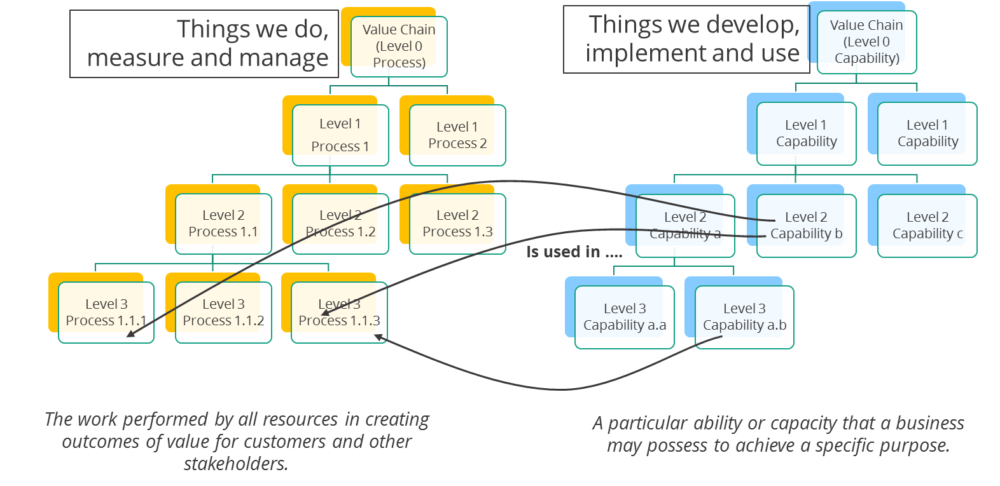
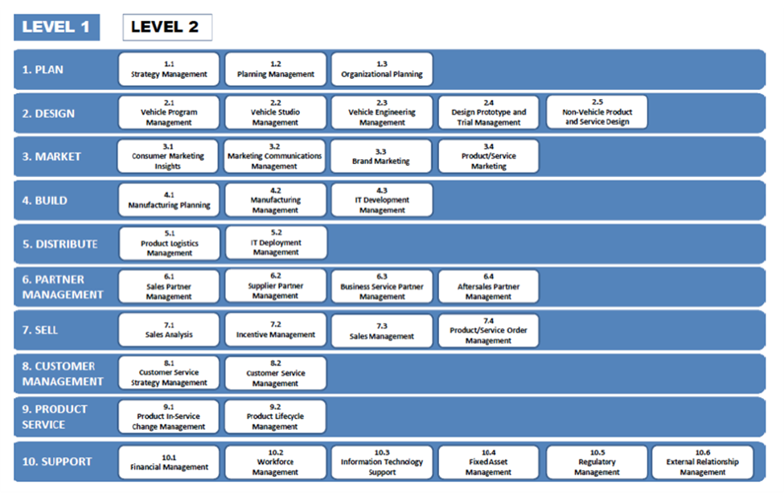

# Why do we need to think Business Capabilities?

In today’s fast-changing business environment the ability to innovate
quickly is needed to **survive.** Innovation is no longer optional nor
can it be done by a separate team. It has been **Business As Usual (BAU)**
activity. Many business organizations find themselves in industries
where customer loyalty is fickle, and customer tastes are even more so.
The ability to innovate is anchored in an ability to quickly identify
where change needs to occur (what to change?), identify the change that
needs to be made (what to change it to?), then make those changes as
smooth as possible (how to change it?). Every part of the business
is subject to change. Identifying what to change starts with the need
for change and linking back to the knowledge, skills, and tools the
organization has in its arsenal. While some business changes result in a
change to a process, most require the adjustment or acquisition of new
knowledge, skills, or tools. The combination of knowledge, skills, and
tools represent the organization’s ability to do something, working the
same way as it does for an individual.

For example, throwing and catching a baseball requires knowing what to
do and how to do it, repeated practice at doing it, and using the right
tools to make the task easier. Knowing how to line up the ball to catch
it is knowledge, but it does you no good until you’ve practiced it
enough to become proficient. Knowledge put to practice, usually through
repetition, becomes skill. Using a mitt makes catching a ball much
easier that not using one, hence the mitt is a tool.

For an organization, capturing a customer order is a capability,
something every organization needs to know how to do, but the actual
form that takes might vary from organization to organization, and even
from context to context withing an organization. Knowledge about
capturing an order might include the kinds of information you need to
record in order to unambiguously identify the customer, the items they
want to buy, and where they want it shipped. It might also include
determining whether the customer can pay for the order, either now or in
the future. How all that might be done is where differences in process
come to play, but all of the variations form the same capability.

In a local hardware store, simply knowing the name of the customer and
common descriptions of what they want might be all that is required to
accept the order and hand it off to the next capability, fulfilling the
order.

A larger business with multiple locations might have more than one
customer with the same name, so a more rigorous approach to identifying
a specific customer might be necessary. They might also have items
stored at multiple locations, so the order capture might need to
identify where the items are to be sourced, or whether they are even in
stock.

An online business, or either one of the two previous businesses with a
website, will need to allow the customer to identify themselves and the
items they want to purchase. The processes to enable order capture in
this context can be quite sophisticated, as are the tools needed to make
it happen efficiently.

In each of the above situations, while the basic knowledge about
capturing an order is fairly common, the skills and tools required can
vary dramatically. Each situation will have the capability to capture
the order, but it won’t be the same from situation to situation.

Getting back to our main question, we need to think about business
capabilities because most of the time, that is what we have to change in
order to change the results the business is getting. Put another way, we
find that we often have to learn new things or learn how to do other
things differently in order to meet the needs of our market. Both of
these usually, but not always, involve changing or building business
capabilities.

## What is a Business Capability?

As we understand the need for a business capability. The following will
make it clear to understand how a business capability is defined.

- **Definition :** A particular ability or capacity that a business
  may possess or exchange to achieve a specific purpose or
  outcome.[^2]

- **What comprises a capability:** A business capability consists of a
  set of knowledge (things you know), skills (things you can do), and
  tools (things you can use) that support the accomplishing of the
  objectives of the capability.

- **How** **doesn't matter :** How the business function is achieved
  in a particular context and processes involved in executing the
  function.

- **What matters :** What is externally visible behaviour (properties)
  and its expected level of performance (outcomes).

- **How capabilities relate to processes:** Capabilities are used in
  processes to execute one or more activities in the process, as shown
  Figure 1.

- **Measures :** A business capability will have inherent performance
  characteristics that can be measured, including capacity, activity
  cost (the time it takes to do some activity), and the defect rate.
  These measures are used to determine when investments need to be
  made to improve the capability.

 

> Figure 1. The relationship between capabilities and processes[^3].

## Business Capability Models

Models of the set of business capabilities are almost always presented
as a hierarchical structure that represents increased specificity as you
move down a branch. There are many ways to organize this hierarchy:

- Functional decomposition (tends to reflect and be influenced by the
  org chart – this should be reversed)

- Shared characteristic (e.g. owner, consumer, user of a resource,
  etc.)

- Subway routes on the process map (covered in module 6)

- Level of investment required

- Maturity

The most common is by function (an example is shown in Figure 2), but
the scheme used should be based on the reason for presenting the model
and the audience receiving it. The last two schemes, level of investment
and maturity, serve as the basis for the many “heat maps” seen in
business architecture (Figure 3). In a heat map, capabilities are
colored green, yellow, or red to represent their position on an ordinal
scale where green is “good” (less investment, more maturity) and red is
“bad” (more investment, less maturity). There is widespread debate about
the utility of the heat map, given its confusing meaning, but they
continue to be widely used[^4].

>Figure 2 Sample capability model.

>Figure 3. Sample capability heat map.

## Identifying Business Capabilities

All participants in a given industry have a common capability model. The
demands of the industry dictate the capabilities required to
participate. This commonality makes possible industry models such as
eTOM for the telecom industry, or the various industry models published
by APQC[^5] (which are capability models even though APQC calls them
process models). When building a capability model, the best place to
start is with an industry standard model.

While the industry dictates which capabilities are required, it does not
help determine which are important. Not all capabilities are created
equal, and excelling at a few important capabilities are what
distinguish industry participants from one another. The industry gives
you the set of required capabilities; your strategy determines which are
most important.

The Business Architecture Guild provides another method to find
capabilities in their BIZBoK4. The Guild’s method basically
creates a business domain class model using object-oriented analysis
techniques and wraps them in basic create, read, update, delete (CRUD)
functionality. This provides a set of capabilities that need to be
reflected in the IT application architecture, but is not sufficient for
business architecture; we say the Guild method is necessary but not
sufficient.

There are two main ways to find those capabilities important to your
strategy, and both of them yield a slightly different set of
capabilities. Both methods will be covered and both are recommended.

Perry, Stott, and Smallwood[^6] provided some guidance as to which
capabilities were important based on the selected business focus. For
the purposes of identifying what they call *the unit of competitive
advantage (UCA)*, or more commonly, core capabilities, those that help
distinguish one business from others in the market, three of the four
business focus types matter: Product, Customer, and Technology.
Different capabilities are important for each focus as they drive the
acquisition of new business and the development of new products based on
characteristics of the business focus.

In addition to core capabilities, Perry, Stott, and Smallwood identify
three additional categories: Value-added direct support, essential
indirect support, and non-essential indirect support. They recommend
that all non-essential indirect support activities be stopped as they do
not contribute any value to the busines. That leaves value-added, or
direct support, and essential, or indirect support capabilities.
Essential support capabilities are required in order to stay in business
but don’t directly benefit the service delivery. The distinction leads
to decisions about how to manage, maintain, and execute capabilities of
each kind (this is discussed further below).

In a product-focused business, market position is based on one or more
key products that form a product family, including derivatives. The
product family often includes significant elements of product support or
service. The value proposition of the business may or may not be the
product itself; the product may be a component in a larger value
proposition, such as the lifestyle sold by Harley-Davidson Motorcycles.
New business is acquired by finding additional markets for the product
family, including new uses, and new products are created by improving or
deriving from existing products. The core capabilities for a
product-focused business are:

- Develop product specifications

- Design product

- Manufacture product

- Service product

A customer-focused business provides a complete set of services and
products for customers in a particular industry. Examples include
hospital and restaurant supply companies. New business comes from
finding new customers or defining new ways to service existing
customers. New products are created or found to meet emerging
requirements from the existing customer base. The core capabilities for
customer-focused businesses are:

- Identify customer requirements

- Develop product/service specifications

- Design product/service

- Sell product/service

A technology-focused business is oriented around a specific technology,
looking for new ways to use that technology to both acquire new business
and develop new products. Examples of technology-focused companies
include Facebook, Google, Amazon Web Services, and many chemical or
pharmaceutical companies. Note that a firm’s business model might not
directly relate to the core technology, but depends on it almost
entirely. The core capabilities for a technology-focusesd company are:

- Develop technology

- Identify customer requirements

- Sell concept

- Design Product/service

It is very likely that these capabilities will already be in your model
built using either of the two initial methods (industry standard model
or the Business Architecture Guild’s method), but it is also possible
that some, such as “Identify customer requirements” might be missed.

Many companies, such as retail stores and consumer service businesses,
do not fit neatly into one of the three categories above. In that case,
the most important capabilities are those directly involved in
delivering the customer experience. To find these core capabilities, the
following steps have been shown to work quite well:

- Build stakeholder experience maps (see the customer journey template
  in Figure 4. Similar maps can be created for other stakeholder:
  Supplier/Partner, Employee, Investor, Community/Regulator)

- Identify touch points

- Identify value-delivering capabilities

- Identify supporting capabilities

>Figure 4. Customer journey map template.

Identify Touch Points and Value-Delivering Capabilities

- A touch point is a point of interaction on an experience map

- Each touch point is a business service provided by a capability
  (usually as used in a process)

- These are your value-delivering capabilities

- These capabilities are supported by other capabilities, sometimes
  with time or other types of dependencies

## Identifying and Managing Supporting Capabilities

The easiest way to identify supporting capabilities is to make use of an
Ishikawa or fishbone diagram (Figure 5). This diagram is borrowed from
root cause analysis but works very well for the problem at hand. Each
core capability identified from the experience touch points becomes the
main arrow for a separate fishbone diagram. From that arrow, the
capabilities that are required, either prerequisites or in real-time,
are added to the diagram (identified as “Primary cause” arrows in Figure
5. Capabilities identified this way are direct support capabilities, in
turn dependent on indirect support capabilities identified by the
secondary arrows (“Secondary cause” arrows in Figure 5).

This exercise can be repeated for other groups of stakeholders:
Suppliers, employees, investors, and regulators (and the communities
they represent). The diagrams for all of the core capabilities for all
groups of stakeholders, taken together, comprise the entire set of
capabilities (core, direct support, and indirect support) needed for
this business.

Many capabilities, especially indirect support, may appear on more than
one diagram. This is a good indication of shared capabilities and
provides some clues as to how they can be organized and managed.

>Figure 5. Ishikawa or Fishbone diagram.

Table 1 shows two characteristics of support capabilities that help
determine how they should be organized and managed. Support
capabilities, either direct or indirect, can be proprietary or generic.
Proprietary work needs to be owned (executed internally) or licensed and
carefully managed.

|              | **Proprietary**                                                          | **Generic**                                                        |
| ------------ | ------------------------------------------------------------------------ | ------------------------------------------------------------------ |
| **Direct**   | Provide – do it yourself                                                 | Broker – develop on-going access to the best capabilities possible |
| **Indirect** | Maintain – manage internal capability to meet cost and quality standards | Contract out – monitor to ensure compliance                        |

Table 1. Managing support capabilities.

To *provide* means both owning and developing support capabilities. To
*maintain* means that capabilities can be owned, but downplays the
importance of improvement. To *broker* means to outsource it, but pay
careful attention to make sure the work is done to specification. To
*outsource* means to enter into a contractual relationship with a
supplier, but not pay much attention to it except to monitor compliance
with the contract.

## Assessing the Impact of Change

One of the tasks of the architect is to determine the scope of a change.
Simply, this means looking at the capability model and identifying those
capabilities likely to be affected by a change. Building architects use
a technique called “red-lining” – they take a set of blue prints that
are updated to match the current building configuration then use a red
marker to indicate the changes on the drawings. It’s a very effective
practice that results in a clearly defined scope of change. The practice
can be applied to a capability model. For example, starting with your
model, as in Figure 2, use a red marker to indicate those capabilities
likely to be impacted by a change. Do this separately for each change
project.

To determine the set of capabilities that may need to change, start with
the goals in the financial perspective of the strategy map (covered in
other articles in the BTABoK). From those goals, assess what needs to
happen differently in the customer perspective. Then, focusing on the
processes that deliver customer touch points, and the capabilities those
processes use, identify the processes that directly impact the touch
points that need to change and how those changes might be made. In order
to change customer behavior, a business organization can only influence
its customer through advertising, pricing, or changing the customer
experience. Changes to customer experience require changes to processes
that deliver that experience, and often to the underlying capabilities.

For each capability identified this way, look at the current performance
measures (capacity, activity cost, defect rate) and assess whether the
current level of performance is sufficient to influence customer
behavior enough to meet the new goals. It may be that a capability is
insufficient to meet goals even though it might not directly influence
the customer behavior that needs to change. For example, the capability
to accept and process and order may need more capacity as customers are
encouraged to order more online. Identify the capacity measures that are
or will be insufficient, and determine the minimum value they need to
become. Then, determine the changes to each affected capacity required
to achieve the new measures. The collective set of changes becomes an
improvement project or program, depending on its size.

# References  

1. Goldratt, Eliyahu M. and Jeff Cox, The Goal: A Process of Ongoing
   Improvement, North River Press, Great Barrington, MA: 1984.

2. Ulrich Homann, “A Business-Oriented Foundation for Service Orientation”, Feb. 2006, [http://bit.ly/2faqT67](http://bit.ly/2faqT67){:target="_blank"}.

3. Burlton, Roger, Business Architecture Essentials : ‘Developing your Capability Architecture: It’s all about being able to get things done’, February 27, 2017, accessed August 5, 2020,  [https://processrenewal.com/business-architecture-essentials-developing-capability-architecture-able-get-things-done/](https://processrenewal.com/business-architecture-essentials-developing-capability-architecture-able-get-things-done/){:target="_blank"}

4. Whitmire, Scott A. “It’s Time to Kill the Heat Map”, March 19, 2019, accessed August 10, 2020, [https://scottwhitmire.wordpress.com/2019/03/19/its-time-to-kill-the-heat-map/](https://scottwhitmire.wordpress.com/2019/03/19/its-time-to-kill-the-heat-map/){:target="_blank"}

5. APQC's [Process Classification Framework® (PCF) ] [https://www.apqc.org/process-performance-management/process-frameworks](https://www.apqc.org/process-performance-management/process-frameworks){:target="_blank"} is a taxonomy of business processes that allows organizations to      objectively track and compare their performance internally and externally with organizations from any industry. It also forms the basis for a variety of projects related to business processes [https://www.apqc.org/resource-library/resource-listing/apqc-process-classification-framework-pcf-cross-industry-excel-7](https://www.apqc.org/resource-library/resource-listing/apqc-process-classification-framework-pcf-cross-industry-excel-7){:target="_blank"}.

6. Perry, Stott, and Smallwood, Real-Time Strategy: Improvising Team-Based Planning for a Fast-Changing World, New York, NY: Wiley, 1993.

BTABoK 3.0 by [IASA](https://iasaglobal.org/) is licensed under a [Creative Commons Attribution-NonCommercial 4.0 International License](http://creativecommons.org/licenses/by-nc/4.0/). Based on a work at [https://btabok.iasaglobal.org/](https://btabok.iasaglobal.org/)

