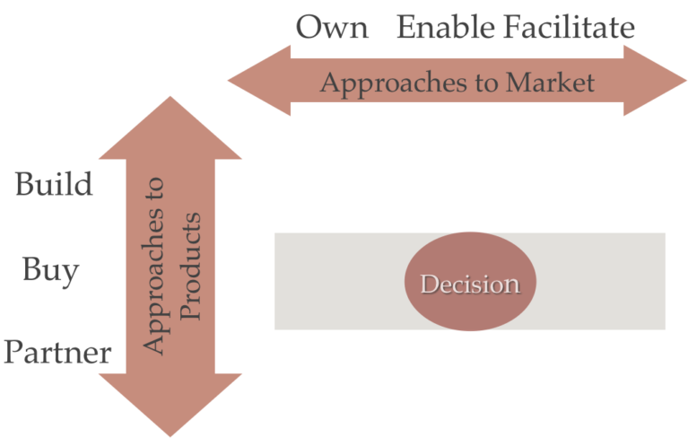
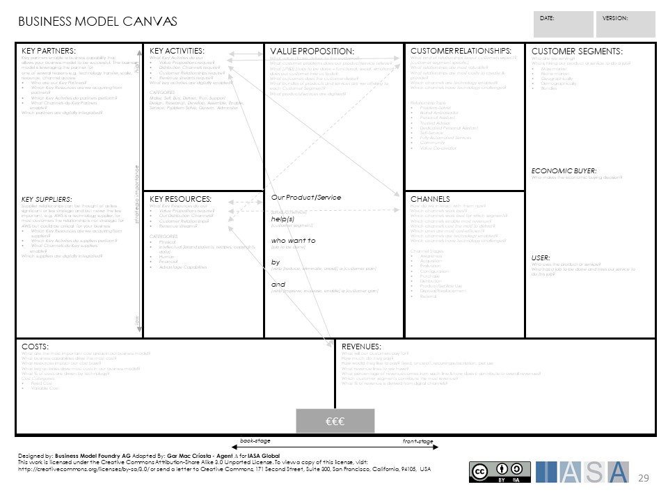

# What is a Business Model?

A business model is a plan for how a company will take advantage of its unique capabilities to respond to market conditions and provide value to a set of customers, and how the company will execute that plan. Thus, the components of a business model are an approach to the market, a business focus, a competitive focus, one or more sets of customers and channels, one or more value propositions, and a high-level operating model. Each of these are described in more detail below.

# Why is a Business Model Important to Architects?

Architects create and maintain the designs for the business model and the operating model that implements it. The operating model must cover the entire scope of the enterprise, including how technology will be used to support various processes. Along the way, decisions need to be made about which processes and technologies need to be handled in-house and which can be safely (from a competitive viewpoint) partnered or outsourced. The business model provides all of the information necessary to make these decisions, pointing out clearly which processes, capabilities, and technologies define the company’s competitive position.

The processes that directly deliver the value propositions to the customers are the starting point for these decisions. These need to be managed and executed internally. If a company outsources a capability or process necessary to its competitive position, the partner or supplier can (and often does) move in on the company’s space, often to detrimental effect. From there, competitive necessity may dictate that some of the supporting processes and technologies may also need to be done in-house.

Architects use this information to design the operating model, a huge topic covered by its own article.

# Approaches to Business Models

Like any strategy, development of a business model requires a diagnosis of the current market conditions, including the nature of the landscape and the capabilities of current and potential competitors. From there, the company needs to determine how it will approach the market and product or service development, which naturally leads to a business focus. There are four basic competitive necessities that all require a minimum level of competence, but one must be chosen to serve as the anchor for the company, the one that always wins out when push comes to shove. These decisions have a huge direct influence on how the operating model is designed.

## Market Conditions

Markets come in four types: Classical, Adaptive, Shaping, and Visionary. The market type is determined by the degree to which participants can predict the behavior of customers and competitors and the degree to which the company and its competitors can influence that behavior.

The _classical_ market is predictable but participants cannot do much to change it. The industry may be characterized by high barriers to entry (such has high capital or regulatory requirements), be subject to long product development lead times, or require special technology that is hard to acquire. The market changes fairly slowly over time and planning horizons are measured in years. The best approach is to match the market to the current capabilities of the company and involves setting goals based on those capabilities then building and fortifying a market position through successive rounds of organized planning and incremental change. Acquiring new capabilities can be both time-consuming and very expensive. Strategic plans in this type of market tend to last for years

The _adaptive_ market cannot be predicted with any degree of certainty and participants are powerless to change it. In an adaptive industry, global competition, rapid technology advancement, economic uncertainty, and constant, real-time feedback from social media combine to generate a highly and persistently unpredictable market. There are likely low barriers to entry, meaning new competitors can appear seemingly overnight (and sometimes literally overnight). Tastes change quickly as customers move from one trend to another. Strategic plans can become stale in a matter of months or weeks. In response, a company needs a more adaptive approach (hence the name) where goals and tactics can shift quickly and smoothly. Agility becomes a key capability in its own right as the company that can react the most quickly to changes in the market will tend to do better.

The _shaping_ market is unpredictable but but is susceptible to change through product and service innovation. Like adaptive environments, barriers to entry are low and demand is unpredictable. In this market, goals should seek to shape the market before someone else does, rapidly adapting through direct interaction with customers. A first-to-market strategy often works in this environment. Planning cycles are short and agility is key, as in the adaptive environment. Unlike the adaptive environment, however, focus must be beyond the boundaries of the organization to build coalitions of customers, suppliers, and ecosystems of complementary partners, such as outside developers, product designers, and influencers.

Rarely, a market that is predictable far into the future yet that future can be shaped by one or more market participants. The _visionary_ market demands bold strategies that often result in entirely new markets. The long time horizon allows for careful planning, incremental changes, and the slow accumulations of resources like the classical environment. The overriding concern is quality of execution, lest an otherwise good opportunity be killed. Execution in a visionary market requires patience as the company needs to stick to the plan for the long term for it to pay off.

## Strategic Focus

The set of capabilities for any enterprise is defined primarily by the industry in which it operates, but it must excel at those capabilities that define its competitive position. These _core capabilities_ are determined by a combination of market approach, business focus, and the competitive necessity chosen as the anchor.

## Business Focus

Strategic focus is a combination of business focus and anchor competitive necessity, concepts introduced by Perry, Stott, and Smallwood in _Real-Time Strategy_. They define business focus as how the organization intends to create industry leadership. The selected business focus provides guardrails and guidance to everything the business does. Their four business focuses are:

*   Product/service
*   Customer
*   Technology
*   Production capacity

A product- or service-focused company is organized around its products and services. New products and services are derived from current products and services. Core capabilities include product/service design, manufacturing, engineering, and customer service. Sales, delivery, and custom applications are either support services or may be outsourced to partners.

A company with a customer focus is entirely aimed at a single market or type of customer. Examples of customer-focused businesses include restaurant and hospital supply companies. Customer needs are monitored, via very intimate relationships, to determine needed products and services, which are then either created or found in the broader marketplace. New products and services are derived from changing needs. Success depends almost entirely on customer satisfaction and loyalty. Core capabilities include identifying customer requirements, creating product and service specifications, designing and services or finding products, and selling.

A company with a technology focus has a valuable and unique technical capability. This unique and valuable capability may be a specific type of technology, or the skills, tools, and processes necessary to create products or perform services. New products and services are derived from this capability and may result in technology platforms and frameworks, and may often look like solutions in search of a problem. Technology-focused companies often do a lot of custom work to adapt the core technology to specific customer needs. Core capabilities include technology development, identifying customer requirements, designing products and services, engineering, and selling concepts (as opposed to specific products).

A company focused on production capacity aims to keep its production system running at full capacity in an effort to reduce unit costs. The most common example of companies with a production capacity focus are paper mills which are often willing to sell small quantities of product at a loss to keep the system running.

## Anchor Competitive Necessity

In addition to business focus, Perry, Stott, and Smallwood identify four competitive necessities. They call these competitive necessities because each one has a minimum level of competence that an organization must have to even compete in a given industry. The four necessities are:

*   Cost
*   Quality
*   Speed
*   Service

Each necessity has implications for organizations in a given market. For instance, the highest cost firm will likely not survive long as competitors undercut its ability to lower prices. On the other hand, being the lowest cost firm is at best a short-term position as competitors will continuously find ways to cut their costs. Likewise, a firm cannot compete if it is perceived by the market to have the lowest quality levels. Having the highest quality in a market might help a firm survive, but that firm is unlikely to dominate its market. Poor service leads to a bad reputation that can take years or decades to shake.

When designing an operating model, one of these competitive necessities must be selected as the anchor. That is, the chosen competitive necessity is always given priority over the others, especially when resources are limited or in the face of competing directions.

## Approaches to Markets and Products or Services

It turns out that all organizations operate within a “bounded box” largely defined by the industry in which they operate. The capabilities, processes, and information required to run the organization are dictated by the industry. Organizations within an industry distinguish themselves from their competitors by the choices they make within that box. Figure 1 illustrates the two dimensions that form the box: Approaches to Market, and Approaches to Products.

Unlike business focus and the anchor competitive necessity, one is not limited to a single combination. In fact, different combinations may be used for every component of the value propositions.

Figure 1. The “bounded box”.

The three approaches to market are: Own, enable, and facilitate. When a company owns the market, the focus is on a select set of products and services that it creates and provides. When the market is enabled, a company partners with other firms to provide distinctly integrated experiences. Examples include support after-market products and services provided by others. When a market is facilitated, open platforms are created to encourage broad market participation (such as Amazon Marketplace).

For any given product, and to some extent service, it can be built internally, bought as a finished or partially-finished product, or one can partner with others to build it either as an outsourcing or joint venture arrangement.

## The Basic Business Model

The Business Model Canvas provides a very easy way to structure the results of the previous analysis and leads to a fairly complete model. The canvas, shown in Figure 2, consists of nine boxes that together constitute a complete business model. We will deal with only four of the boxes in this article; the others will be dealt with in other articles.

The mission model

canvas can be used to model beneficiaries over customers in non-profit, government or mission based businesses.

Figure 3. Mission Model Canvas.

## Customer Segments

The “market” represents all of the potential customers for products or services. Individual members of the market, whether they be consumers or other companies, have different needs, desires, tastes, and willingness to buy. There are two main approaches to the market: Treat all potential customers as one group, or segment them into multiple groups.

The first option is also known as the mass market approach and means that a company offers the same goods and services to the entire market. The bet is that there are enough members in the market who will accept the offer to make it worthwhile. The second option is called segmented marketing, for obvious reasons, in which groups of customers are formed based on some common set of characteristics: age, location, income, marital and family status, occupation, or any number of other possible dimensions. It is also possible to use multiple dimensions to create ever smaller and more specialized segments.

If a segmented marked is selected, there is much more work to do. In _Business Model Generation_, Osterwalder and company identify several flavors of segmentation: niche, segmented, diversified, and multi-sided. In a _niche_ market, one or two very specialized segments to service are chosen. For example, one might choose to offer personalized services to very high-net worth individuals, or on the opposite end, offer highly discounted services to those who are less well-off.

In a _diversified_ market, services are offered to two or more very different segments, and the offerings might even look like different businesses. The clearest example of this is Amazon, which has two main lines of business: providing an online marketplace for its products and those of others, and providing cloud based computing infrastructure through Amazon Web Services. Even though these two offerings are very different in nature and the customer segments they serve, they both come from a common core of highly specialized information technology skills.

In a _segmented_ market, here as a flavor of segmentation, the focus is on two or more groups of customers that have similar needs, but are still different enough to warrant separate value propositions. In this case, a wealth management firm might have a set of services it offers to people with a net worth up to some figure, and a different set of services to those with a higher net worth.

In a _multi-sided_ segmentation, an organization is providing services to two very different but complementary markets. A credit card provider, for example, needs to have both consumers who are willing to use the card and merchants who are willing to take it. Both segments are required in order to be successful, but marketing to each segment requires very different techniques.

## Value Proposition

The reality is customers don’t buy products or services, they buy value to fill a need, what the product or service can do for them. It might mean enhancing their image among their peers (most high-end fashion purchases), or taking part in a particular lifestyle (Harley-Davidson motorcycles). The value proposition might be a single product, or might constitute a whole family of related products and services. Each customer segment needs its own value proposition.

Value creation starts with understanding the customer. Each customer segment perceives value in a different way, sometimes very different. The book _Value Proposition Design_ introduces the Value Proposition Canvas, shown in Figure 3. A separate canvas is needed for each customer segment. To use the canvas, start on the right side and answer the questions about the customer’s gains, pains, and jobs they need to do. The book _Design a Better Business_ offers some tips for using the canvas. Start with the jobs customers need to get done, including how they do that job and how they feel about doing it and how they do it. Ask a lot of “why” questions. They will help uncover the pains the customer experiences while doing that job.

Gains are more difficult, and are not simply the opposite of pains. Gains are the ambitions that customers have above and beyond the relief of pains. What do customers really want to accomplish by doing this job? What would they like to do that they cannot do now? The book notes that gains often appear to be existential concerns of the customer, mainly because they usually are.

Once completed, the right side of the value proposition canvas becomes part of the customer persona for that segment. Keep it, and keep it up to date. Revisit the entire customer persona on a regular basis.

Figure 4. Value Proposition Canvas (credit: Business Model Generation, 2010).

## Channels

The collection of channels defines how an organization communicates with and reaches its customers and consist of channels for communication, distribution, and sales. Far more than just physical stores versus online, Osterwalder and Pigneur4 define a channel as a customer touch point, part of the customer’s experience journey (a canvas for defining an experience journey is shown in Figure 4). The choice and construction of channels must be very deliberate, as they provide the _only means through which customers will experience the organization_.

They go on to say that each channel has one or more of five distinctive phases:

1.  Awareness
2.  Evaluation
3.  Purchase
4.  Delivery
5.  After sales

Channels can be direct, where the customer interacts directly with the organization, or indirect, where they interact with a partner such as a retail chain, wholesaler, or online seller. Channels can also be owned and controlled by the company or by a partner.

With direct channels, the customer experience can be controlled, not only the value proposition itself, but the context around it. Nordstrom offers extraordinary service as part of its value proposition, and the entire in-store experience is designed to deliver on that.

Figure 5. Customer Journey Map Canvas.

## Customer Relationships

The types of relationships maintained with each customer segment determines how easy or difficult it can be to acquire new customers and keep existing customers. The relationship with a given customer can also influence what kind and how much business they do with the organization. _Business Model Canvas_4 give a number of types of relationships that can be established with a customer. Multiple types of relationships with each customer segment are possible as well. The types are:

*   Personal assistance
*   Dedicated personal assistance
*   Self-service
*   Automated service
*   Communities
*   Co-creation

From another angle, you need to decide whether repeat business from existing customers (car dealers try to work this way) is preferred over just taking them as they come (most retailers work this way).

These relationships will cause adjustments in the value proposition, the channels you select, and the shape and content of the operating model.

## Operating Model

The first cut at the operating model identifies the key activities and resources required to deliver the value propositions. As decisions are made about market and product approaches, key partners may be identified. The components in this first-cut operating model are necessary to the define the competitive position of the company.

## Business Model Patterns

Osterwalder and Pigneur4 identify a number business model patterns that have been widely used to great success. The effort to create a business model can often be made easier by selecting one of these patterns as a starting point.

## Unbundled

In the unbundled business, different parts of the business model canvas are assigned to different businesses. The boundaries for this division can vary widely, but one common set of divisions is customer relationship management, product innovation, and infrastructure. Mobile phone companies are good examples: the main company defines the customer segments, channels, and relationships; content providers create the value proposition; and equipment manufacturers provide the key activities, key resources, and manage key partners. One of those partners may even provide the network. In the unbundled model, each business completes its own canvas for its portion of the overall whole.

## The Long Tail

The long tail model is about selling less of more. The focus is to offer a large number of products that each sell fairly infrequently. The target market is usually a niche. Being successful in such a model requires low inventory costs and strong platforms. The self-publishing book business is a good example in that many titles are in the offering, but copies are printed only when they are ordered.

## Multi-Sided Platform

Multi-sided platforms bring together two or more distinct by interdependent groups of customers. Value exists only when all parties are present. The business facilitates interactions between the groups. Value grows as each group grows – this is the “network effect”. Social media companies, Amazon, and eBay are all examples of multi-sided platforms.

## Free as a Business Model

In this model, at least one customer segment continually benefits from a free offer. Non-paying customers are financed by another part of the business model or by another customer segment. Examples include Google, Facebook, and Skype. One form of this model is the “freemium” model in which basic services are offered for free and customers pay for more advanced offers.

## Open Model

The open model can be used to create and capture value by collaborating with other companies. This can be done from the “outside-in” by developing internally ideas generated outside the firm, or “inside-out” by sharing internally generated ideas with partners so they can exploit them. Procter & Gamble is an example of the outside-in approach when they set up a unit to systematically license and develop products using intellectual property developed by others. GlaxoSmithKline takes the “inside-out” approach by developing “patent pools” of its own inventions and licensing them to outside firms for development.

# Architecture Objectives

The ultimate goal of architecture as defined by Iasa Global is to define and implement the business technology strategy of the organization. The business model is a required input into the development of the operating model, which in turn is a required input into the development of the business technology strategy.

One of the more important outcomes from developing a business model is a classification of processes into value-delivering, direct support, and indirect support. These classes should be used to determine how individual processes and their supporting technologies are created, executed, and managed. Classification is a form of measurement, so classes of processes are the main measure of the business model.

As the operating model is designed and built, individual processes contribute in different levels to the outcomes targeted by the business model. These links help the architect identify the most effective places to make investments given changes to business goals or market conditions. This knowledge of the “plumbing of the business” is invaluable for making decisions about change and where to focus resources.

Understanding a digital business is critical in the success of any architecture initiative. Based on the BTABoK a digital business is one in which technology drivers fundamentally impact the behavior and value generated by the business model. In non-profits this may be interpreted as the value model or mission model. The goal of architecture in the BTABoK is to optimize the outcomes from technology impacts to the business model and the value it generates for customers and shareholders.

[BUSINESS-MODEL-CANVAS.ppt](media/ppt/business_model_canvas.ppt){:target="_blank"}

| **Strategic Planning** | Ensure the organization strategy is being formulated to ensure most value can be derived from current and future technology |
| **Business Planning**              |      Ensure that tactical and operational objectives for the period of the plan can be achieved in a way that derives most value from technology investments while factoring in architectural concerns & constraints                     |
|    **Architecture Advisory**                |            Ensure that proposed solutions are best aligned with business outcomes; ensure advisory requesters have a clear understanding of existing capabilities to optimise reuse opportunities and ensure well-governed architecture delivery               |
|   **Architecture Review**                 |     Ensure that reviewed architectures are consistent with the current governance and policy, issue waivers when required, request governance updates as identified.                      |
|   **Architecture Communication**                 |    Ensure that architecture successes & activities are clearly and consistently articulated to business and technology personnel.                       |
|     **Program Management**               |   Identify & ensure that significant architecture requirements are identified and architecture plans are factored into organization programs                        |
|    **Project Management**                |     Identify project level architecture considerations and prioritize accordingly, work with project teams to identify appropriate approach and delivery processes and procedures (e.g. ALM)                      |
|   **Project Risk Management**                 |    Identify significant architectural risk, record, report and manage                       |
|   **Demand Management Planning**                 |   Collaborate with program management, relationship management and business groups to assess and plan for demand                        |
|      **Portfolio Prioritization**              |       Develop/Review business cases to ensure optimal investment mix is selected that will deliver most value to organization.                    |
|     **Technology Adoption Lifecycle**               |    Identify, track, evaluate and translate future technology for organization                       |

# References and Further Reading

Reeves, Love, and Tillmann, “Your Strategy Needs a Strategy”, _Harvard Business Review_, September, 2012, pp 76-83.

Perry, Lee Tom, Randall G. Stott, and W. Norman Smallwood, _Real-Time Strategy: Improvising Team-Based Planning for a Fast-Changing World_, John Wiley & Sons, New York, NY: 1993

Hiam, Alexander and Charles D. Shewe, _The Portable MBA in Marketing_, John Wiley & Sons, New York, NY: 1992.

Osterwalder, Alexander, and Yves Pigneur, _Business Model Generation_, John Wiley & Sons, Hoboken, NJ: 2010.

Osterwalder, Alexander, Yves Pigneur, Greg Bernarda, and Alan Smith, _Value Proposition Design_, John Wiley & Sons, Hoboken, NJ: 2014.

van der Pijl, Patrick, Justin Lokitz, and Lisa Kay Solomon, _Design a Better Business_, John Wiley & Sons, Hoboken, NJ: 2016.

BTABoK 3.0 by [IASA](https://iasaglobal.org/) is licensed under a [Creative Commons Attribution-NonCommercial 4.0 International License](http://creativecommons.org/licenses/by-nc/4.0/). Based on a work at [https://btabok.iasaglobal.org/](https://btabok.iasaglobal.org/)
