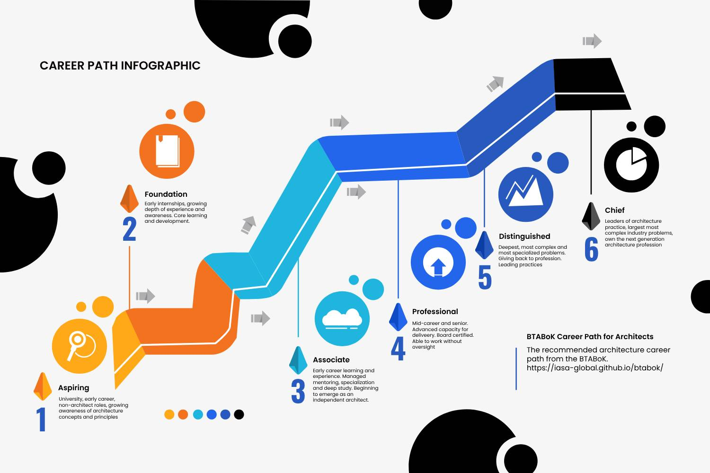
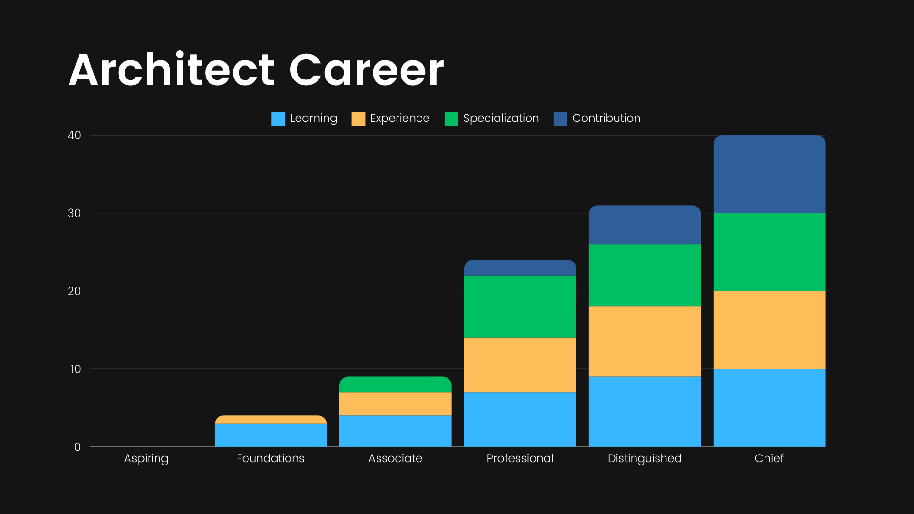
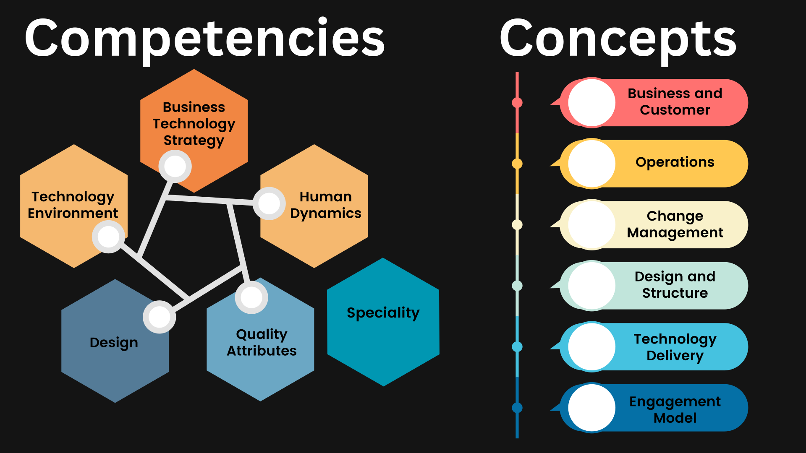

# Introduction

The career path for BT architects is an elusive concept in business. Most of the time, careers are defined by current employers, who often switch them around based on current management. This variability has made determining an appropriate and repeatable career path very difficult. However, it is an essential component to reproducing architecture's value and success over time. 

From 2006 onward, Iasa conducted many focus groups with senior architects and over 2,000 surveys to understand the career path of architects from all types of backgrounds and from all parts of the world. Since then, it has conducted over 1,000 interviews, 200 corporate assessments, and 4,500 individual competency assessments, which have supported the BTABoK Career Path. 

The BTABoK describes 6 of these career levels, 4 of which are measurable/testable by a combination of testing, homework/work submission, or experiential board certifications. Other bodies of knowledge may use slightly different names, but most generally agree on the 4-5 primary levels of architects. However, when measuring the BTABoK levels against another body of knowledge, it is deeply important to compare a) competency model and specialization, b) career levels, and c) concept areas (engagement model). Without similar depth in all three of those areas, career frameworks become much less useful in the practical world and cannot truly be compared to the BTABoK.

# What is a Career Path

noun 

1. The series of jobs or roles that constitute a person's career, especially one in a particular field. 

    "you never know how your first job might influence your career path." 

A career path is a set of knowledge items and skills learned over a period of time. Within a specific field, the knowledge and experience must roughly match those of other professionals in the field. 

It is important to note the difference between a managed career path and a randomized one.

## Randomized Career Path - Job or Role Based

The current model in architecture is effectively random. While some belief exists that there are common career models, the actual careers of modern architects are essentially randomized based on radically different contexts of the employers and architect they happen to work for. A job as an architect in Microsoft is significantly different in tenor, skills and purpose than within a bank. 

Sometimes, the randomized path is a starting point, especially when individuals are unsure which direction to take. Also, applicable skills and knowledge are perhaps not so repeatable when changing roles. Fields that tend towards the arts rather than science and engineering often have similar challenges. 

In reviewing over 200 job descriptions from significant employers in different industries for the [BTABoK Job Description](https://usc-word-edit.officeapps.live.com/we/job_description.md) templates, it was found that little or no commonality in a) length of service, b) expected competencies, c) expected job activities, d) required previous employment existed either across or within specializations. For example, business architect job categories randomly define both experience in technology as well as the type of job activities randomly. This holds true for all identified specialization areas (Business, information, infrastructure, software, solution, and systems architects). 

A randomized career path makes career advancement primarily based on the discretion of current management. Management jobs, as well as executive jobs, are always randomized ([The Big Idea: No, Management Is Not a Profession](https://hbr.org/2010/07/the-big-idea-no-management-is-not-a-profession)). Thus, a senior manager of one employer may come from a very different background than another.

## A Managed Career Path

A managed career path, by contrast, provides rigorous steps toward achieving a measurable set of skills. Skills and knowledge are repeatable and measurable. It is answerable to an institution with defined standards. The case for IT architecture as a profession implies that there should be a managed career path. 

A managed career path is the basis for all professions. It is based primarily on a set of agreed-upon competencies and levels. These levels are determined outside of organizations and employers, most often by a group of existing senior practitioners within a geography or other context. For example, the modern building architecture competency model in America is decided by a group within the American Institute of Architecture (aia.org) and its partners in government and industry. A managed career path is most commonly applied to professionals whose work has the ability to impact public safety, corporate interests, or national safety (see [Safety and Liability](https://usc-word-edit.officeapps.live.com/we/safety_liability.md)). It does not mean that all members of the profession do that level of work, nor does it limit other benefits of hiring a managed career professional. 

In a managed career path, demonstrated excellence in appropriate competencies is the primary method for career advancement. This advancement is noted by more senior professionals in the form of a career journal, which each member of the profession must maintain.

# Why is Career Path Important to Architects

The question of career path is fundamental to architects. It determines many of the qualities that allow them to perform well in their expected jobs. Some jobs become managed from when they are founded, and some remain role-based. The determining factors for this from research in the field of professions* seem to be: 

- Importance of the job to safety, financial outcomes, or societal impacts 

- Liability and security related to the execution and outcome of professional decisions. 

- The group desires the professionals to maintain minimum competency standards. Usually this results from a desire to keep quality and pricing manageable. 

- External requirements such as governments, standards, or others demand certain levels for specific jobs. 

For those jobs to be similar in nature and activity across employers and for employers to be able to hire reasonably qualified individuals for the role. There are a set of tradeoffs between either approach and the architect's career path.

|      | Role Based                                                                                                                                                  | Managed                                                                                                                                                                                    |
| ---- | ----------------------------------------------------------------------------------------------------------------------------------------------------------- | ------------------------------------------------------------------------------------------------------------------------------------------------------------------------------------------ |
| Pros | - easily adapted to the organization, less expensive upfront, follows management preferences                                                                | - high level of excellence across companies, excellent outcomes, repeatable success and value, better adoption of technology, secure and safe, better value and reliability, international |
| Cons | - lower quality of employee, requires much higher training costs, lower level of outcomes, high turnover, lack of agreed value, much more expensive overall | - lower management control and customization, increased cost of individual professionals                                                                                                   |

## The Case for a Managed Career Path for Architects

There are benefits in both random (current) and managed (future) career paths. The case for making architecture a managed profession stems from a few critical factors: 

- **Rising Levels of Societal Impact:** The impact of technology is growing daily. This impact, not just threats but things like subscription models, is becoming increasingly visible to the average person. This rising friction with individuals creates a demand for trusted professionals similar to medicine and law. While the average person will likely not hire an architect soon, society is in need of the trust that the profession creates to ensure that corporate interests or complexity do not rule their lives. 

- **Regulatory Pressure:** Increasing pressure is coming to bear on all aspects of technology as it relates to government and regulation. From things like sustainability, privacy, and accountability to impacts on purchasing, monopolies, identity, and security. The more prevalent technology becomes in society, the more regulation needs to be met to ensure appropriate use. In all industries where this level of regulation exists, professionals rise to meet the challenge and guide clients through the process. Doing so while creating value for clients and employers is the art and the science of architecture. 

- **New Technology Opportunities/Threats:** Avoiding catastrophes in both small and large scopes is one function of modern professions. Non-professionals cannot play with dangerous research or deploy dangerous products in most fields. For example, laypeople cannot do bio-research or build complex structures (buildings) because they can harm people. The rise of the use of the internet, AI, mobile platforms, and even social media and identity can harm both individuals and society. These threats are emerging faster and faster, and it has become essential to have professionals understand their implications before they are simply released to regular people or companies. In addition to threats, most organizations are not able to realize the benefits of new technologies in a repeatable way. Agility, AI, Cloud, Mobility, Digital Transformation, Manufacturing, and much more suffer from poor learning, delivering poor results primarily due to a lack of skilled and capable teams and leaders. The randomized backgrounds and skill sets of role-based architects are unlikely to be able to scale to achieve these needed results. 

- **Severe Deman/Quality Problems:** The demand for high-quality architecture professionals is growing daily. This demand can no longer be met in the role-based education methods. The system has tens if not hundreds of thousands of opportunities where a skilled architect is needed and yet no consistent method of generating them. This makes it extremely important to create a consistent and repeatable method for generating architects globally. Due to the other reason it is even more important that this be externally managed by the professionals themselves so that corporate interests do not negate the benefits. Due to this demand growth and the likely hood that it will continue for many decades it becomes very important that a managed profession emerge to meet those demands.

### Benefits of a Managed Profession

- **Excellence at all Levels:** It is familiar to expect excellence in a professional. Doctors, lawyers, accountants and other managed professions are expected to provide excellence. BT Architecture is no different when using a managed career path. Expecting people skills, business skills and technical skills at certain levels of competency can become an expectation in this method.

- **Increased Value:** With a common definition of value. A common and well understood suite of tools and a standard of excellence, any group of professionals will deliver high value outcomes. This includes reduced risk as well and increased direct outcomes in both business and technical terms. An organization has the right to expect this level of repeatable success no matter which architect or which type of architect they work with.

- **Excellence at all Levels:** It is familiar to expect excellence in a professional. Doctors, lawyers, accountants and other managed professions are expected to provide excellence. BT Architecture is no different when using a managed career path. Expecting people skills, business skills and technical skills at certain levels of competency can become an expectation in this method.

- **Better Adoption of Technology:** The industry continually struggle to adopt even basic changes to practice. From cloud (native) to agility, AI, sustainability and integration, the lack of skill and the lack of awareness are constantly sited as the reasons behind failure. By managing professional credetials externally on a rigorous career path and competency model, industry can more stably adapt to new technologies in both a beneficial and safe way.

- **International:** The BT architecture profession is one where companies are as likely to work with an international set of professionals as local ones. This means the standard of excellence must be similar in all countries. This becomes impossible in a single organization. However an externalized and recognized profession can drastically increase the opportunities there. 

### Benefits of the role-based career path:

- **Easily adapted:** In the role-based career path it is very easy to adapt the career to an organization as there are no requirements for its formation or structure. For example if one company wants to have business architects doing programming and another wants to have chief architects doing business capabilities, that is completely up to them. This obviously comes 

- **Less Expensive Upfront:**  In role-based careers the profession can be adapted to whatever the company can afford to pay. The company can decide training levels, experience and engagement level. This makes it easy to begin doing some architecture without the overhead of the higer expense/higher skilled model. 

- **Follows Management Preferences:** The role-based career path is based on the preferences and desires of management so it can be run in a much more customized way at least as long as individuals are found who are willing to do the work. 

### Tradeoffs of Role-based Career Paths

- **Increased Risk/Decreased Value:** In the role-based career path it is very easy to adapt the career to an organization as there are no requirements for its formation or structure. For example if one company wants to have business architects doing programming and another wants to have chief architects doing business capabilities, that is completely up to them. 

- **Higher Training Cost:** In role-based careers the profession can be adapted to whatever the company can afford to pay. The company can decide training levels, experience and engagement level. This makes it easy to begin doing some architecture without the overhead of the higer expense/higher skilled model.

- **High Turnover/Low Satisfaction:** When architecture is a management-defined activity as opposed to a professional one, the practicioners are often severely disappointed with the role. Surveys indicate that most architects are deeply disconnected from their current practice models as they do not mirror the expected job activities and value proposition that architects are expected to perform. 

- **More Expensive:** In the long run, architecture practices using this model appear to be much more expensive than a managed profession when measured against similar quality outcomes. It follows the old adage, "You can't afford to do it right, but you can afford to do it twice."

Managed career path has almost the opposite characteristics of the role-based career.  A managed professional will move significantly faster to excellence in the field and the overall profession will hold much higher value outcomes for its clients. Think of the difference in medicine after the establishment of professional levels.

# BTABoK Approach

- Architecture is a a profession meant to aid in the delivery (execution) of business technology strategy. By this we mean that requires a consistent structure of knowledge and specific set of competencies which are defined and measurable to achieve its value to society. 

- The value of the profession and the effects it has on society, corporate interests and safety are high enough to demand a professionally managed career path.

- Specializations are supported in a variety of instances and work together to fulfill these needs for large engagement models. 

## Career Levels

The career levels are adaptable to employer and client context in regular and understandable ways. Each of the levels is both a milestone as well as the period of time afterwards before they achieve the next milestone.

### Aspiring - Unmeasured

Aspiring architects are anyone wishing a career in architecture or prior to starting their journey into mastery. Many senior architects describe this time either in another role or job (some quite unrelated) the time 'before' they understand what they wanted to become. This could be a senior developer or a sales person. But somewhere along the way they learn enough about the skills and nature of architecture to begin learning more formally. This is sometimes an organic process or may involved taking an introduction to architecture course from a teaching provider or university. 

The movement from Aspiring to Foundation is handled through a basic set of exams which test basic understanding and awareness of concepts and skills. It is not expected that the learner will be able to deeply apply these skills but it is extremely important that the aspiring architect understand them all together. It is also important that the aspiring architect learn to identify which critical deliverables and techniques work together at the foundation of understanding (the Red Thread). Once they have demonstrated this understanding as a test or as a reviewed set of deliverable examples they may move on to foundational learning.

### Managed Career and Higher Educaition

A managed career path has the distinct advantage of having stable relationships and systemic support for appropriate higher education. It offloads much early career learning to these environments. Medical doctors attend medical school, nurses, accountants, building architects all have their analogous relationships with higher education. The BTABoK career path requires full support for partnership and accreditation of universities in 4 fundamental ways. 

- **Accreditation:** The BTABoK material is used to accredit universities curriculum and learning against the architecture career path. It forms the basis for professional to higher education partnership and allows universities to provide the kind of primary competencies and knowledge necessary to enter the field. It is expected that some form of specialized college, degrees or other aspects will be formed over the coming decades. 

- **Internship and Employment:** Graduates of programs need to enter into fully managed internships and residency programs which guarantee the application of the competencies within the workd environment and with advanced mentoring. By creating this relationship universities which form architecture learning environments will benefit and the profession will achieve a stable pathway to an architecture career. 

- **Research and Advisory:** Advanced professions do a signficant amount of research. This research should be conducted in appropriate ways and university systems make excellent research centers. By building shared research programs between universities and professionals a huge amount of value can be created while simultaneously reducing risk. 

- **Outreach:** A profession is always about its youngest members. How many new graduates want to become architects. Joint outreach into the education system is needed to create this funnel of highly capable and motivated future architects. 

| Attribute             | Description                                                                                           |
| --------------------- | ----------------------------------------------------------------------------------------------------- |
| Expected Length       | 1 year                                                                                                |
| Learning Method       | Unstructured                                                                                          |
| Learning Level*       | 0 or Unknown                                                                                          |
| Experience Level*     | 0 or Unknown                                                                                          |
| Specialization Level* | 0 or Unknown                                                                                          |
| Contribution Level*   | 0 or Unknown                                                                                          |
| Next Step             | Introduction to Architecture**, Interaction with Architecture Community, Self-paced reading and study |

*levels are measured in 0-10 based on how far the individual is expected to achieve to move to the next level

**be careful about first courses, either take one that truly surveys the field or take muliple courses to get a broad understanding

### Foundational - Measured

Early stage architects describe a period of learning about the foundations of the field. The BTABoK describes these as understanding 'The Red Thread' or learning the basic set of competencies of an architect (The 5 Pillars). This introductory period is followed by a long period of working to deeply understand these primary skills and deliverables. The Foundation architect is often described as an intern/resident or similar inside of employers. Depending on the length of their experience in another role/job such as programming or product management, they may advance more quickly or slowly through this level. 

The growth as a Foundational Architect primarily involves deepening study and application of core skills and concepts. The core skills used are those involved in supporting the 'red thread'. These deliverables are the ones used by the average architect as a part of a reasonably simple client engagement. Note: as a part of Iasa studies, this has been a contentious point as the industry does not have common definitions etc it has taken much effort to extract the 'general' case from the specific employer case. 

The movement from Foundational to Associate involves demonstration of the skills and learning aligned with the foundation set of skills in the 5 pillars and a new level of competency in the primary deliverables of an architect. In addition, most architects will add the beginnings of specialization at this phase. To progress to the associate or advanced stage the architect must submit a body of work, examples and demonstrated understanding of the primary foundation skills of the architect. 

| Attribute             | Description                                                                              |
| --------------------- | ---------------------------------------------------------------------------------------- |
| Expected Length       | 1-2 years                                                                                |
| Learning Method       | Structured Learning - specific concepts and skills are needed                            |
| Learning Level*       | 2                                                                                        |
| Experience Level*     | 1                                                                                        |
| Specialization Level* | 1                                                                                        |
| Contribution Level*   | 0                                                                                        |
| Maintenance           | Per Year: 30 hrs learning, 2 weeks delivery focus experience                             |
| Next Step             | Core Architecture Concepts, Foundation Certification, Self-Study, Architecture Community |

*levels are measured in 0-10 based on how far the individual is expected to achieve to move to the next level

### Associate/Advanced - Measured

The BTABoK recognizes the application of both terms asssociate or advanced to this stage of an architects career. This is the time of both deep specialization and deep experiential growth. It is expected the associate architect will be working on prodocts/projects under a mentor who has already achieved professional status. Many leaders of architecture practice describe this as the hardest time in an architects career and the time where some drop out or are sidelined into another role. 

The associate architect work through a series of advanced skills within the 5 pillars of architecture as well as beginning their specialization focus (B,I,I,S,S,S). This specialization areas allow the architect to learn both core knowledge areas as well as topic areas for their specialization. For example an associate software architect would be growing their humand dyanamics skills (core) but also would be focused on software engineering, platform engineering and service design. This period of time is often described as one of intense learning/trying of new ideas. The more structured/mentored this process is, the better the outcomes in terms of creating highly skilled architects.  

The associate architect should be focused on skills learning and application in each pillar as well as development of deeper skills in their specialization. It is critical to get both mentored as well as individual experience in these skills. At the same time the associate architect should begin contributing both to the internal practice as well as attending industry activities such as conferences and training. 

To be recognized as an associate architect one must submit examples of both work product and experimental deliverables. In addition, deep testing in both core and specialized concepts is necessary preferrably on multiple competencies and concepts. 

| Attribute             | Description                                                                       |
| --------------------- | --------------------------------------------------------------------------------- |
| Expected Length       | 2-5 years                                                                         |
| Learning Method       | Structured Mentoring                                                              |
| Learning Level*       | 5                                                                                 |
| Experience Level*     | 3                                                                                 |
| Specialization Level* | 3                                                                                 |
| Contribution Level*   | 1                                                                                 |
| Certification Method  | Testing, Work Demonstration, Graded Work                                          |
| Maintenance           | Per Year: 10 hrs contribution, 30 hrs learning, 2 weeks delivery focus experience |
| Next Step             | Experiential Mentoring, Specialization Focus, Complex Problems                    |

*levels are measured in 0-10 based on how far the individual is expected to achieve to move to the next level

### Professional - Measured

The professional level of architect is one in which the primary skills have been learned an practiced to the degree necessary to work reliably without signficant oversight on all but the most complex architecture challenges. The level of application of professional should be the multi-project/product level. A professional architect should be able to work with a team of associates to produce high value and reasonably complex results and valuable results. 

The professional designation is done through a deep level of validation through testing, review of work products and board-based interviewing. This degree of validation ensures a number of benefits to the profession and clients. 

1. It reduces signficantly the amount of validation that an employer or client needs to do, reducing cost and inefficiency. 

2. It increases the level of benefits the employer or client can expect as it increases the likelihood that all architects are trained and practiced in the latest techniques. 

3. It creates an ethically driven practice and relationship between architect and client. 

4. It ensures those that cannot do the job fully yet are not put in charge of things they cannot yet handle. 

See CITA-Professional Details

It is perfectly acceptable to remain a professional architect for an entire career. Many architects, like other types of professionals are perfectly satisfied delivering high quality services to employers and clients for years. However to remain at the professional level, certain minimum skills have to be maintained and emergining techniques must be learned. The maintenance of professional status/board requires three primary learning/experiential areas. 

1. The latest techniques in architecture, including those within the 5 pillars must be learned annually. These techniques can be brought into the existing practice of the architect. 

2. The architect must continue to deliver within their specialization. Without constant use of professional skills they can atrophy over time. 

3. The architect must contribute back to the profession by helping to grow associates and learning through both thought leadership and mentoring. 

| Attribute             | Description                                                                                     |
| --------------------- | ----------------------------------------------------------------------------------------------- |
| Expected Length**     | 3-5 years ?                                                                                     |
| Learning Method       | Mentoring , Experience                                                                          |
| Learning Level*       | 6 or Unknown                                                                                    |
| Experience Level*     | 6 or Unknown                                                                                    |
| Specialization Level* | 6 or Unknown                                                                                    |
| Contribution Level*   | 3 or Unknown                                                                                    |
| Certification Method  | Board of Professionals, Work and Success Demonstration                                          |
| Maintenance           | Per Year: 20 hrs contribution, 20 hrs learning, 2 weeks delivery focus experience               |
| Next Step             | Contribution to Industry, Extreme Problem Focus, Deep Specialization, Cross Practice Leadership |

*levels are measured in 0-10 based on how far the individual is expected to achieve to move to the next level

**professional architects may choose to remain at this level their whole career as achieving a distinguished level requires huge investment

### Distinquished - Measured

The journey to distinguished is often quite dificult for an architect as with any professional. A distinguished architect is able to handle the most difficult architecture challenges in the marketplace. The focus of distinguished architects are towards practical outcomes and large, complex problem domains. The distinguished designation is both a leadership and a practicioner evaluation.

The distinguished architecture certification is a deep level of review of the candidates experience profile against the competency model, both their in the field, as well as their contributions back to the field. The distinguished architect will have achieved a signficant degree of leadership of the most complex architecture teams and products. They will have developed architecture practicies within their specialization and will have given a great deal of that back into the body of knowledge. 

The distinguished practicioner is using advanced techniques often within their specialization to deal with complex product/programs and delivery on enterprise scope outcomes. They have achieved mastery of the five pillars as well as signficant depth in their chose specialization area. 

| Attribute             | Description                                                                                            |
| --------------------- | ------------------------------------------------------------------------------------------------------ |
| Expected Length       | Unknown                                                                                                |
| Learning Method       | Mentoring/Experience, Specialized                                                                      |
| Learning Level*       | 8                                                                                                      |
| Experience Level*     | 8                                                                                                      |
| Specialization Level* | 8                                                                                                      |
| Contribution Level*   | 8                                                                                                      |
| Maintenance           | Per Year: 40 hrs contribution, 2 weeks delivery focus experience, 2 weeks leadership                   |
| Next Step             | Leadership of a practice, signficant industry contribution, advanced research, extreme transformations |

*levels are measured in 0-10 based on how far the individual is expected to achieve to move to the next level

### Chief - Measured

The chief architect designation is the pinnacle of the measured career path. It represents a true leader of architecture practice. The chief architect has achieved a milestone in career development and capability that requires extreme effort to gain. They are the heads of their practice model both in specialized as well as generalized career measurements. 

Chiefs of architecture are still responsible for change but are the heads of the full practice as well. The BTABoK recommends that all large architecture practices are lead by Chief Architects. It is recommended that chief architects practice both within their specialization as well as in large change initiatives. 

The board process for chief architects recognizes the leadership of the proffesional architect. It is a review of large change initiatives as well as how well they have built architecture practice models that lift up their fellow architects both internal to an organization as well as externally (through mentoring and thought leadership). It reviews their career up to the point of leadership and how they have stayed up to date with all areas of their professional career. In the words of a chief anesthesiology of a major heart hospital said, "First, I see patients, then I help other doctors see patients". The chief architect is committed to the most junior architect in their practice to the degree they are the most senior. 

Chief architects represent the best of our career path. A commitment to excellence in both strategy and execution an comprehensive understanding of business and technology and the ability to guide clients to outcomes. This excellence will show itself in all levels of:

1. Hands on practice leadership

2. Successful change initiatives

3. A complete commitment to client success

4. A comprehensive and handson approach to measured competencies

5. An ethically driven body of work

6. A focus on giving back to the profession in signficant and measurable ways

| Attribute             | Description                                                                                                                                                              |
| --------------------- | ------------------------------------------------------------------------------------------------------------------------------------------------------------------------ |
| Expected Length       | Career                                                                                                                                                                   |
| Learning Method       | Mentoring/Exprience, Specialized                                                                                                                                         |
| Learning Level*       | 10                                                                                                                                                                       |
| Experience Level*     | 10                                                                                                                                                                       |
| Specialization Level* | 10                                                                                                                                                                       |
| Contribution Level*   | 10                                                                                                                                                                       |
| Maintenance           | Per Year: 40 hrs contribution, 2 weeks delivery focus experience, 8 weeks leadership                                                                                     |
| Next Step             | Leadership of profession, designing next generation professional outcomes. Navigate outreach at board level and country level. International leadership and recognition. |

*levels are measured in 0-10 based on how far the individual is expected to achieve to move to the next level

## Types of Growth Required

### Learning Primary Skills and Structured Mentoring

Learning is a major element of the architect career growth and expectations for continued excellence. The architect learns through training, reading and experimentation. The architect is continuously learning. 

There is a difference between core learning and topic area learning. Core learning are the skills, activities and materials that are industry and technology agnostic. They focus on things like requirements, value, design, and strategy. These are applicable across all types of architects. Topic area learning is also valuable but is specifically focused on a single depth area of learning. Technology learning on platform engineering and cloud are examples of topic area learning. It is essential that the architect understand the difference. 

Currently only measured core learning is accepted into the BTABoK career path. The measurement of the learning must be done against an area of the BTABoK and submitted to accreditation. This is due to the current volatility of the professional marketplace. 

### Managed Mentoring and Experience

Experience is the primary learning engine of the architecture profession. The level of complexity of the profession is so signficant that it must be learned by doing. Because of the types of experiences needed to create excellence in architecture it best to get this under the guidance of a professional who is already certified at the professional level. This gives rise to professional mentoring which is the primary method of learning for other complex professions like building architecture and medicine. The Iasa Mentoring Program is one such legitimate program where professional experience can be gained. 

### Contribution and Leadership

Giving back to the profession is a critical aspect of professional life and growth. It is the means by which the profession improves itself and its practices. Contribution can take both lightweight and heavy forms. For example, speaking at a conference can be useful in giving back, but a major contribution to the body of knowledge that has been well researched is a much bigger overall contribution. Currently BTABoK Accreditation, Mentoring and Career Path require measured contributions back to the profession for both maintenance and progression in the field. 

### Addressing Competencies and Specialization

Possibly the most difficult part of the career path as it stands in industry is when to learn which competency and at what level of sophistication. In addition, how long can a competency go unused in a professionals background before it becomes irrelevant to an architects current role. This is tremendously important when combined with specializations. For example, how high are the business skills in a software or systems architects? Are they employed every day? What about the technical competencies in a business architect? When were they last used? How much technical skill does a business architect need to maintain to be able to work effectively with other architects and across employers?

The BTABoK answer to that is similar to other professions. It is understood that architects will gather specific and structure core competencies early in their career. They will learn and demonstrate all 5 pillars of skill. During associate and advanced education they will choose a specialization. 

# References and further reading

[Career Path: Definition and Role in Professional Development](https://peoplespheres.com/career-path-definition-and-role-in-professional-development/#:~:text=A%20career%20path%20is%20a,into%20throughout%20their%20working%20life.)

[Career Path Definition and 12 Steps to Pave Yours (+Examples)](https://www.betterup.com/blog/career-path#:~:text=There%20are%20four%20types%20of,help%20you%20perform%20your%20job.)

[Deciding on a Career in Medicine | Students &amp; Residents](https://students-residents.aamc.org/choosing-medical-career/deciding-career-medicine)

[Architectural Experience Program (AXP)](https://www.ncarb.org/gain-axp-experience)

https://aaca.org.au/national-standard-of-competency-for-architects/2021nsca/

Salaries

[Physicians and Surgeons : Occupational Outlook Handbook: : U.S. Bureau of Labor Statistics](https://www.bls.gov/ooh/healthcare/physicians-and-surgeons.htm#tab-5)

BTABoK 3.0 by [IASA](https://iasaglobal.org/) is licensed under a [Creative Commons Attribution-NonCommercial 4.0 International License](http://creativecommons.org/licenses/by-nc/4.0/). Based on a work at [https://btabok.iasaglobal.org/](https://btabok.iasaglobal.org/)
