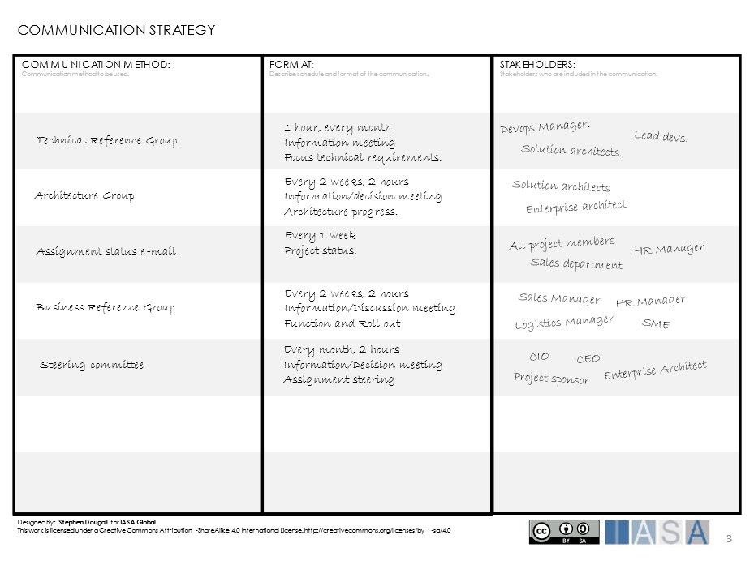

> "The act of working together with other people or organizations to create or acheive something"
**definition of Collaboration, Cambridge Dictionary**

# What is Collaboration

Collaboration is people or organizations working together to deliver
value. Participants in a collaboration may have different perspectives
on value, but a collaboration has a common objective. For example, two
organizations may collaborate to deliver a software product. The value
for organization A is to expand development capacity, while the value
for organization B is to gain experience and learn new technologies.
However, both organizations achieve this through the common objective of
delivering the software product.

Collaboration often arises, where there is a need for skills, knowledge
or resources from different parties in order to achieve a common
objective.

The following are examples of typical parties involved in a
collaboration:

- **Individuals** -- individual people with special knowledge or
  skills working together with other parties

- **Teams** (Products/Services) -- teams in the same organization
  which work with different products or services, collaborating to
  deliver greater value to a common customer

- **Business Units** -- collaboration on an organizational
  perspective, for example European offices working together with US
  offices

- **Capabilities** -- collaboration between the capabilities of the
  organization to increase value flow, for example Production working
  together with Sales

- **Partners** -- collaboration with external organizations, for
  example, suppliers or re-sellers

It is important for the architect, and the architecture practice, to
identify and maintain collaborations which optimize value delivery. The
architect plays a significant role in facilitating collaboration in
every aspect of their organization.

# Why Collaboration is Important

When collaboration works well, it leads to significant gains in
productivity and provides vital access to skills, experience and
knowledge. Without collaboration an organization may be forced to invest
in training programs, and procuring experience in a given subject area,
and this can take a long time.

Collaboration is not only about gaining skills and knowledge, it can
also be about the positioning of an organization, initiative, product or
service. For example, an organization wishing to launch a product on a
new market, may partner with another organization which is already
established in the market. This makes entry to the market easier.

Collaboration between parties with different skillsets or perspectives
is also a driver for innovation. When the different perspectives meet,
new ideas are born. Insight into different viewpoints strengthens all
parties in the collaboration. It can also provide motivation for change,
or disruption, giving the organization a competitive advantage.

Networks of collaborations between the different capabilities within an
organization strengthen value streams. This provides an effective
delivery mechanism for value.

It is important for an architecture practice to collaborate well with
the different parts of the organization. This allows the architecture
practice to gain traction and [coverage](coverage.md){:target="_blank"} throughout the
organization. This leads to respect and understanding for the
architecture practice itself, and the architectures that the practice
produce.

# Collaboration Approach

## Know the stakeholders

The parties participating in a collaboration have an invested interest
and influence, on the outcome of the collaboration. These participants
are [stakeholders](stakeholders.md){:target="_blank"}. In order for a collaboration to be
successful, it is important to understand the stakeholders needs. This
ensures that the participants can work well together, and that the
participants will be motivated and satisfied with the outcome of the
collaboration.

## Avoid silos

Many organizations create a structure in order to make the organization
manageable. This structure contains organizational units which may be
based on, for example, geography, capabilities or special business
functions. It is common that organizational units become silos (vertical
communication and collaboration), looking after their own concerns,
neither sharing or collaborating with other organizational units. This
is sub-optimal as it reduces potential for innovation and shared
solutions. A typical indication of a silo culture is the duplication of
very similar solutions or processes across different organizational
units. Horizontal collaboration and communication in an organization can
help break the silo structure, and promote re-usable solutions and
processes across the organization.

## Buy-in and win-win

In order for a collaboration to be successful there has to be "buy-in"
for the participants. That is to say, that the participants have to gain
something from the outcome of the collaboration. Participants in a
collaboration who have no vested interest in the outcome, are unlikely
to be motivated to ensure the collaboration is a success. The best
collaborations have a "win-win" scenario for all parties.

## Collaboration does not happen by itself

Collaboration requires time and effort. The architecture practice can
provide technologies, solutions, structures and processes which nurture
a culture of collaboration, and even more specifically can pin-point
areas in the organization which can be optimized by collaboration in
order to deliver greater value.

## Work Out Loud

Work Out Loud is a way of working, in which individuals are encouraged
to work transparently, and actively share what they are working with.
This way of working uses two principals, observable work and narrate
work. Observable work is just as it sounds, individuals make their work
available where others can see it and comment or contribute. Narrating
work means that individuals describe what they are doing in a log, for
others who are interested to follow, rather like social media. This
method of working promotes networking and collaboration throughout an
organization.

## Decisions

In order to drive collaboration forward it is important that
decision-making runs smoothly, especially in joint ventures.
Collaborations may rely on collective decision-making between the
different parties and this can take time. It is important to ensure that
there are structures in place, which can be used, if the parties cannot
resolve a decision or situation. This may be a committee or steering
group which is impartial and can support the decision-making process.

## Responsibilities

In a collaboration between several parties, it is normal that each part
will place expectations on the other parties. If the responsibilities of
the parties are not clear, this can lead to friction within the
collaboration, where expectations are built up but not fulfilled by one
or more parties. To avoid this, it is important to define the
responsibilities of each part, so expectations are clear.

# On the Outside

Collaborations with parties outside the organization is usually achieved
by creating some sort of partnership which is advantageous to value
delivery. Collaboration with partners does have its limitations, since
the partner is not likely to have the same kind of access to information
that an internal collaboration will have. Since the partner cannot be
steered by the organization, contracts or partnership agreements are
used to ensure that responsibilities, conditions and principles are
adhered to. A partnership agreement takes time to work through and often
involves a review of legal conditions. This means that it can often take
some time to get a partnership up and running, compared to an internal
collaboration.

Collaboration with partners can be really useful to an architecture
practice. It can open doors to new technologies, competitive rates (for
products or consulting services) or access to learning new skills.

# On the inside

Collaborations within an organization can take many forms. In order to
facilitate good collaboration, tools like collaboration platforms,
document management systems, wikis or the organization\'s intranet can
be used. These provide a good starting point for the organization to
share knowledge and information. The [value streams](value_streams.md){:target="_blank"} within
the organization require collaboration between different parties in
order to effectively deliver value. So good collaboration is essential
to effective value delivery.

Key factors in collaboration are transparency and trust between the
parties. A collaboration with little trust is defensive, and makes
working together difficult. This can arise if there are conflicting
expectations on parties involved, this may be regarding the valued
gained from the collaboration, or the outcome of the collaboration.
Trust is affected by transparency, if the parties involved in the
collaboration are not open with each other, this will negatively affect
the trust between the parties.

It is important for an architecture practice to work well together with
the different areas of the organization. This helps to promote the
practice of architecture, and spread architectures throughout the
organization. It also provides the architecture practice with a
substantial network of knowledge and stakeholders, which aid value
delivery.

# Key Considerations for Collaboration

## Confidentiality

Different parties participating in a collaboration may have to adhere to
different rules regarding confidentiality. This is true both for
internal and external collaborations. Confidentiality can hinder a
collaboration as it restricts information to certain participants, and
if handled incorrectly can lead to feelings of exclusion. If
confidentiality substantially restricts the information flow between
participants, it may well be that a collaboration between the
participants is not feasible.

## Internal politics

Internal politics influence and affect collaborations.
[Stakeholders](stakeholders.md){:target="_blank"}, internal or external, will have vested
interests in the different outcomes of the collaboration. These
stakeholders are likely to try and influence the collaboration to their
best advantage. Analysis of the stakeholders in a collaboration is
important, managing stakeholders in the right way can make some aspects
of a collaboration much easier. For example, securing financial backing,
spreading positivity or providing access to resources.

## Communication

Communication is one of the most important factors in a collaboration.
Good communication ensures that participants work well together, and
that all parties in the collaboration get the information they need.
When starting a collaboration initiative, it is a good idea to consider
a communication strategy.

 

The communication strategy helps to define the methods by which
information is communicated to participants in the collaboration. It is
also used to plan communication to [stakeholders](stakeholders.md){:target="_blank"} who are
interested in the outcome of the collaboration. The canvas above can be
used as a method for helping to define a communication strategy.

## Organizational barriers

In large organizations there is often a complex structure for the
organizational units and capabilities. These organizational units have
their own interests (political, financial, influence, competition,
etc..) and this can create organizational barriers to a collaboration. A
[value stream](value_streams.md){:target="_blank"} may rely on several organizational units
working together effectively in order to deliver value, organizational
barriers represent a threat to efficient value delivery. To reduce
organizational barriers, make sure key stakeholders from the
organizations are well represented, and that the participants have a
vested interest in the successful outcome of the collaboration.

## Geographical barriers

When the participants in a collaboration are not placed in the same
geographical location, finding a flow in working together can be
challenging. If the collaboration is running over several countries,
then aspects such as time-zones become an issue. It requires much more
planning to set up meetings and get all participants in attendance.

There are many tools which help in working remotely (remote meetings,
knowledge sharing, collaboration platforms), however there is a lot to
be said for face-to-face meetings. Human factors such as the atmosphere
of a meeting, and the body language of participants, are difficult to
convey over remote tools. Meetings which are innovation based, or
require complex conceptual thinking, also require a certain interaction
between the participants, and this is difficult to achieve when using
remote tools. It is important to get the right balance between working
remotely and working face-to-face, as in many cases it may be more
productive to meet people in person.

## Language

In collaborations which span across different countries, language can be
a barrier to good communication. There are a number of tools which can
help aid communication across different languages, such as translation
tools, and in the case of remote meetings auto-translation and close
captioning.

However, in these types of collaborations it is important to document
communication, as it can be easy to misunderstand verbal communication.
Verbal communication in many cases can rely on the tone of the language
to convey meaning, which might not be easy to pick up. Providing
documented communication allows all parties to verify the meaning of the
communication and leads to a better understanding between the
participants.

## Cultural differences

Cultural differences within a collaboration may create tension.
Companies and organizations nurture their own [cultures](culture.md){:target="_blank"}. In addition,
cultures may differ depending on country and even regions within a
country. A collaboration which involves many cultures can be challenging
and require a lot of effort and tolerance from the participants. At the
same time, it can also be very rewarding and spark innovation which
simply may not occur if the culture is homogonous.

## Multi-profession

Collaborations may involve the inclusion of individuals from several
different professions (UX, Development, Test, Business Management,
Subject Matter Experts), like an [extended team](extended_team.md){:target="_blank"}. In such
collaborations it can be challenging to find a common way of working.
Each profession has their own working practices and it is important to
take time to build a collaborative process which works for all
participants.

# Planning a Collaboration

Not all collaborations require planning, sometimes they just grow
organically. However, if a collaboration is required for a
business-critical activity or deliverable then it is wise to perform
some planning for the collaboration. For example, a service to customers
which requires the collaboration of several suppliers, a large solution
project with several product teams or a new strategy for security over a
portfolio of products. These all require collaboration between
stakeholders or teams which belong to different organizations.

In order to help plan for a collaboration, the Collaboration Planning
Canvas can be used.

 

The Collaboration Planning Canvas highlights several different areas
which are valuable when planning a collaboration.

The **Objective** describes what is to be achieved by the collaboration.
All participants should be agreed on the objective.

The **Outcome** describes the value delivered from the collaboration.
Again, all participants should be agreed on the outcome.

**Preconditions** is an important consideration. There may be
requirements on legal grounds, organizational, tools or special working
environments which have to be met before the collaboration can begin.

**Participants and Stakeholders** describes a list of both the active
participants in the collaboration, and stakeholders who have an active
interest in the outcome. **Contribution** is a description of what a
participant expects to contribute to the collaboration, while **Gains**
is a description of what the participant expects to get out of the
collaboration.

Contribution and Gain are important as this sets the expectations for
the participants and avoids confusion later in the collaboration. From
the start of the collaboration, it will be clear what each participant
contributes and what they expect to gain.

This is very useful to the architect when entering a joint venture with
different parties, or even as a tool to assess which stakeholders and
participants may be required for a given initiative. Even once the
collaboration is up and running, it is worthwhile to periodically review
the Collaboration Plan, as objectives, outcomes and expectations tend to
change over time. A review will help maintain the collaboration on good
terms as time progresses.

# Measuring Collaboration

Collaboration is something which is highly desirable within an
organization but it is difficult to measure broadly. Collaborative
projects can be measured on the outcome of the project, but informal
collaboration between individuals in an organization or collaboration as
a whole is much more difficult.

A common way of measuring collaboration is to commission a survey, and
ask relevant questions about collaboration to the members of the
organization. The result of a survey is highly dependent on how the
questions are constructed, and managing a survey can involve heavy
administration.

Collaboration can also be assessed by measuring collaborative
activities. Some examples of these activities are:

- Meetings

- Document management

- Schedules and tasks

- Status/progress report management

- Calendar management

- Responsibility management

- Sharing notes and Ideas

- Sharing knowledge sets on Wikis

- Sharing knowledge sets on Blogs

- Sharing contacts

- Social networking

- Search queries

These activities can be measured in terms of number of persons
performing the activity, or hours spent on the activity.

Organizational Network Analysis (ONA) is a technique by which a network
is visually constructed to show how communication and information flows
through an organization. This provides a tool for analyzing
collaboration and identifying bottlenecks, critical knowledge flows and
areas which are peripheral in the organization (potential for better
collaboration).

There are also a number of technical solutions which can help in
measuring collaboration. An organization can measure the digital flow of
information (email, chat, collaboration tools...) between the members of
the organization and use this information to visualize collaboration. AI
can also be leveraged to facilitate collaboration within the
organization. However, gathering this type of information will require
the consent of the organization's members, and careful consideration
should also be given to legal issues.

# References and Further Reading

**Work Out Loud, Bryce Williams**
[Work Out Loud](https://thebryceswrite.com/2010/11/29/when-will-we-work-out-loud-soon/){:target="_blank"}

**Organisation Network Analysis, Deloitta**
[Organisation Network Analysis](https://www2.deloitte.com/us/en/pages/human-capital/articles/organizational-network-analysis.html){:target="_blank"}

BTABoK 3.0 by [IASA](https://iasaglobal.org/) is licensed under a [Creative Commons Attribution-NonCommercial 4.0 International License](http://creativecommons.org/licenses/by-nc/4.0/). Based on a work at [https://btabok.iasaglobal.org/](https://btabok.iasaglobal.org/)
