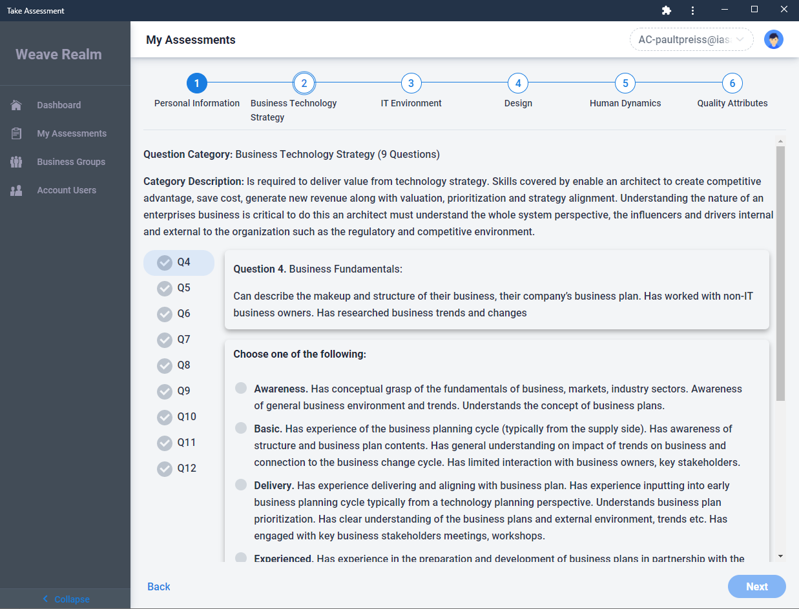
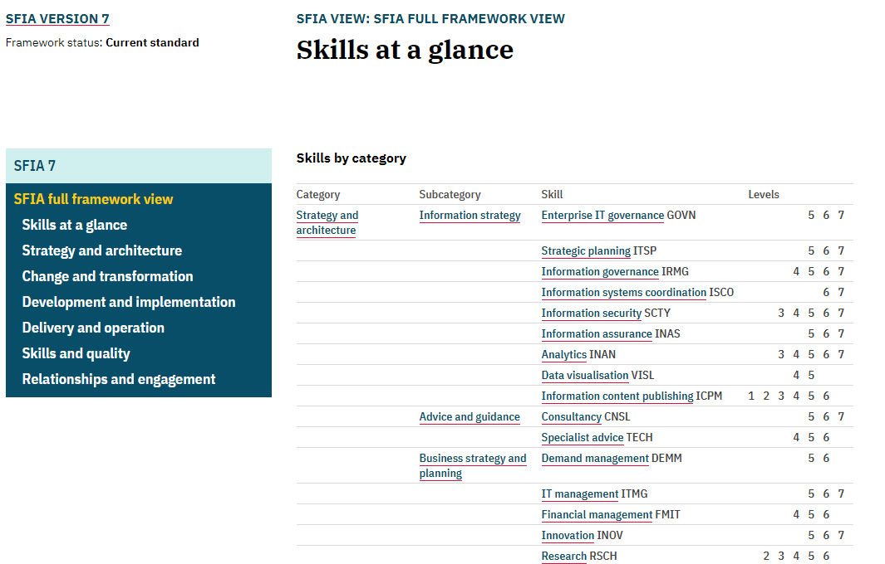
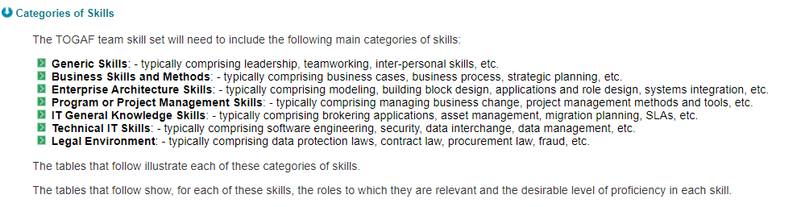

# What is Competency

Competence: such as

1.  the quality or state of having sufficient knowledge, judgment, skill, or strength (as for a particular duty or in a particular respect)
2.  law : legal authority, ability, or admissibility.

Competency is by far the most important aspect to a profession of architecture and to the individual practitioner. It includes all of the skills necessary to be successful in general as an architect and, in specific, within the context of organizations who employ or hire architects to deliver value. In this document, skills and competencies will be used interchangeably though formally the Iasa Competency Model uses the following hierarchy:

1.  Competency Pillar: one of the 5 pillars of competency for architects including, business technology strategy, design, human dynamics, IT environment, and quality attributes.
2.  Competency: one of the 42 total items within the Iasa 5 Pillars such as investment planning, whole systems design, application development, etc.
3.  Skill: a specific actionable skill within a competency which has attached learning objectives, growth levels and learning materials. May also be thought of as a sub-competency.

Competency is therefore the combined skills necessary to be a successful architect which an architect hones, develops and grows throughout their career. It is necessary to understand that a competency is focused on a general skill and not a single technology, product, or technique. For example, the BTABoK lists application development, not C#, Java, JavaScript, etc. The use of the term application development is used instead of software engineering as engineering is a field of practice and not a single competency.

In addition, competencies are listed in a way that allows flexibility in an architect's background and focus area so that no single architect will have the exact same level in all competencies (or it is highly unlikely). For example, one architect may excel in infrastructure, whereas another architect may have higher skill in application development. As long as significant and equivalent levels are met overall Iasa recognizes the architects achievement of similar milestones within their career path (see below).

# Why is Competency Important to Architects

Competency is the most important measure of an architects capacity to deliver value within the profession and their own personal goals in their career. The competency model an architect or architect team choose will define their career growth and the focus of their outcomes. For example, if the competency framework is missing 'people skill' what the BTABoK calls Human Dynamics, this set of skills will not be measured or expected from the architect.

## Team Competency is the Most Important Measure of Architecture Practices

Many architecture practices focus on their [lifecycle](architecture_lifecycle.md){:target="_blank"}, [decisions](decisions.md){:target="_blank"}, [designs](design.md){:target="_blank"}, and similar elements while ignoring a competency model. However this is the opposite of an effective practice. Skills and skill growth provide not only motivation for the architect practitioners but also allow the practice to improve overall. Process and framework can never replace skills in terms of an individual or team of architects.

In addition, the competency model will define the career growth techniques and methods for the entire practice including vendors, service integrators and partners. As a part of the engagement model the entire architecture practice should choose and support and competency model and understand its impact on their individual performance, job and [role](roles.md){:target="_blank"}.

## A Competency is Developed from Skills, Experience and Knowledge

Competence overall is made of individual competencies and their skills, knowledge and experience as per the Iasa Competency Taxonomy Figure. It is important to identify specific skills and acquire both knowledge and experience within the competency. The Iasa Competency Taxonomy uses 5 levels to measure a skill based on the individuals knowledge, experience and overall set of skills.

| **Level** | **Description** | **Explanation** |
| --- | --- | --- |
| **1** | Awareness | Has general awareness of the concept and can use shared language. |
| **2** | Basic | Has knowledge from training or study on the topic and some amount of experience related to the learning. |
| **3** | Delivery | Has knowledge and experience with smaller scoped engagements and is developing depth within the competency. |
| **4** | Experienced | Has developed sufficient experience and knowledge to work with the competency as senior levels. |
| **5** | Shaping | Has developed significant industry level competency and is shaping the industries understanding through papers, research and leadership. |

## Relationship to Blooms Hierarchy

The Iasa learning and competency framework is loosely based on Blooms Learning Hierarchy which is used significantly in education and competency development.

## Mentoring is the Best Training Method for Architects

Because of the experiential elements of the architects competency model and its wide variety it is difficult to learn without direct mentoring from an experienced architect who follows a similar set of skills and can guide the architect through career changes and challenges. In addition it is essential that the architect have oversight during their career as many of their decisions can have significant impact. Thus a mentoring based approach as is seen in building architecture and in medicine will have a profound impact on the quality and competence of the practitioner.

# Competency Tenets

The BTABoK describes the following opinions about competency for architects.

## Having Multiple Competency Models for Architects is Dangerous

This tenet shows up throughout the BTABoK in one form or another. The industry is full of half-formed and untested competency models. Most companies define a different competency model and may even use multiple models internally for different types of architects. If the profession is in any way important, this is a truly dangerous stance as each architect, company and industry will create different types of architects with radically different skill sets. At best this makes moving between companies difficult, at worst it can lead to dissolution of practices and major mistakes in production. Imagine if every hospital, pharmaceutical or other medical company defined the competencies of a doctor differently. This is not only ludicrous but dangerous.

## Specialization Has to Rest on a Common Competency Model

As an extension of the previous point, architecture clearly has specializations. The BTABoK recognizes 5 specializations (business, infrastructure, information, software and solution) and numerous sub-specializations (security, integration, etc). These specializations are essential to the healthy functioning of the architecture profession, however they are seen as depth areas of architects who have achieved excellence in the 5 pillars that define the skills of the professional architect. This is necessary to provide a foundation of measured competency for the entire profession. Without a shared competency model the specialists find difficulty in working towards a professional outcome. This would be somewhat like if surgeons had one basis for their work while obstetricians had another. The result is a non-functional architecture practice.  Early in an architects career there are very few differences in the competencies they must master. Later on specialization allows for a practice to expand to the needs of even the largest organizations.

## Saying 'They're not an architect' Makes You Not an Architect

Measuring whether an individual has achieved a level of proficiency at the profession is based on competency mastery on a very straightforward skill. Those that simply label someone 'not an architect' show their own, not insignificant lack of understanding of how to clearly measure an individuals practice. It is not easy even for board certified architects working in concert to measure an individuals skill level though the Iasa certification has made it possible and straightforward. The only real method for determining an individuals level of proficiency at such a complex profession is board certification methods, anything else is simply opinion.

## The Profession Gets One Primary Value Proposition but Lots of Secondary Ones

One of the great debates in the field is what the value proposition of architects is or should be. The specializations often argue and debate then what this proposition should be. Business architects often argue that pure business strategy is the value while software architects talk about the value of software intensive systems to business outcomes, and so on. Essentially this argument is not a value add to the profession as it confuses the customers and clients of the practitioners. Stakeholders and clients cannot be expected to understand such fine grained expert arguments. Instead it is important that the profession come together around a simple value proposition as the primary differentiator to the field. For example, there is no confusion about why a client visits a doctor, lawyer or accountant, regardless of that individuals specialization area. The value proposition the BTABoK provides is the augmentation of business technology strategy in both small and large settings.

# Approaches to Competency

The engagement model for a practice should define the competency framework they are to use and it should be approved an reviewed by the entire architecture team.

## Developing a Competency Model

The team should review the competency framework to ensure that it provides enough guidance to ensure success for the practice. The following principles should dominate the selection of the framework.

-   The competency model should be easy to understand and follow. Each competency should be unambiguously defined and explained along with any sub-competencies.
-   The competencies should include multiple levels of achievement to allow for growth of the architect throughout their career.
-   The competencies should be the baseline for specialization. Shared competencies between specializations should be identified as well as differentiators for specializations.
-   It should be clear what the target value of the competencies are and the type of architect they create.
-   The competencies should be maintained by an open body but adaptable to an organization, culture or climate.
-   The competencies should include learning strategies which allow the individual or team to assess their current skill and acquire new ones.

## Assessing Your Competencies

There are numerous methods for competency assessment. The most rigorous is certification by both test (knowledge) and board examination (experience). However, certification should be attempted when the architects have a degree of understanding of their current competency levels. Reliable methods for competency assessment include:

-   Self assessment -- the Iasa maintains a tool for self assessments against the Iasa competency model (send email to <contactus@iasaglobal.org> for access -- this is available to full members)

Self-Assessment Tool -- Full Member Access

-   Peer assessment -- it is useful to have peers and mentors do assessments of an individual giving them feedback on their skills
-   Mentoring assignments -- mentors can assign tasks and experiments which the architect completes to demonstrate skills.

## Adapting the Iasa Competency Model

Not all cultures and organizations can directly use the Iasa competency model as is, though this is significantly less common that normally thought. For the vast majority of companies simply adopting the job descriptions, organization methods and community method in the Iasa people model will be easy enough.

To adapt the Iasa competency framework the team should set aside time in its engagement model management meetings to define a mapping between desired competencies and the Iasa competency framework. A mapping spread sheet has been defined for SFIA+ and TOGAF competencies. This can be used to define the organizations changes and map those changes back to the Iasa competency model. This spreadsheet will allow individual and assessment teams (certification and otherwise) to clearly understand what and why competencies were changed in the organization.

Iasa Competency and Comparisons (example image -- full text available)

## Connecting to HR and Internal Levels

The BTABoK competency model is made to be adapted to internal levels of an organization which controls career advancement. This is done for two reasons; a) it reduces the burden on the organization for managing the architect career path since it can be managed externally and Iasa provides primary tools for career advancement outside of experience gained in the organization and b) it provides an external check on an architects career progression which avoids internal based advancement which may or may not match with industry expectations.

# Iasa Competency Model

The Iasa Competency Model is fully documented as a part of the BTABoK.

## Understanding the 5 Pillars

The 5 pillars form the primary basis for the architecture practice. They are rooted in business technology strategy as the primary enabler of an architects career path which differentiates an architect from an engineer, business person and avoids role conflicts.

## Specialization Competencies

The Iasa provides suggested specializations in the 4 primary architect types. These are business, information, infrastructure and software. These specializations emerge after an architect has gained proficiency in the 5 pillars. Rooting the specializations in a common set of competencies allows the specializations to work together effectively regardless of the differences in their day in and day out practice.

## Solution and Enterprise Architecture

To many solution and enterprise architecture are also specializations. To others they may be treated more as a title of the profession. The BTABoK treats both of these as focus areas on generalization, meaning the solution or enterprise architect has a more rounded set of competencies from all 4 depth specializations. They can be seen as generalists who focus on either solution delivery or enterprise scoped technology strategy delivery.

## Other Competency Models

There are not many architecture competency models in the industry and they are not well connected. It is extremely important to identify what elements of the competency framework will benefit the architects in the practice the most and how flexible they are.  

## SFIA+ IT Competency Framework

SFIA+ by the British Computer Society is an IT skills management framework which includes an architecture category with 27 specific skills in 4 sub-categories.

## TOGAF Skills Framework

The open group architecture framework defines a list of 76 skills in their skills framework within 7 categories.

TOGAF Skill Categories

Within each category they define 4 levels of competence related to 9 different types of architecture-related roles. Not all of the roles are actually architects as roles like IT designer are included.

<https://pubs.opengroup.org/architecture/togaf8-doc/arch/chap30.html>

TOGAF skills are used in enterprise architecture engagement models to help define role priorities. The following are notes and opinions about the use of the framework.

Notes on the Framework

-   A competency framework for architecture should not use architecture as a skills category as it is extremely confusing over time.
-   While levels are listed there is no definitive text on each competency, making them difficult to define and connect together.
-   No learning objectives are given between the levels of skill thus it is difficult to determine what differences the levels entail. For example it is difficult to understand what a 3 versus a 4 in written communication really means.
-   There is no concept of career progression in the framework. Thus an IT application architect is presented at a single level instead of having multiple levels.
-   It is difficult to determine how specializations connect with each other nor how they work in relation to each others competencies. Specialization does not build on top of a general body of knowledge.

## European e-Competence Framework

The European e-CF is an IT skills framework which lists architecture as a set of skills aligned with a plan, build, run, manage philosophy. In addition the e-CF defines an enterprise architect with 5 primary competency areas. It is difficult to determine what areas architects in general are included in and what particular skills an architect must possess according to the framework.

# References and further reading

[https://www.researchgate.net/publication/224905497_The_Enterprise_Architecture_Competence_Framework](https://www.researchgate.net/publication/224905497_The_Enterprise_Architecture_Competence_Framework){:target="_blank"}

[https://pubs.opengroup.org/architecture/togaf91-doc/arch/chap52.html](https://pubs.opengroup.org/architecture/togaf91-doc/arch/chap52.html){:target="_blank"}

[https://sfia-online.org/en/sfia-7/sfia-views/full-framework-view?path=/glance](https://sfia-online.org/en/sfia-7/sfia-views/full-framework-view?path=/glance){:target="_blank"}

BTABoK 3.0 by [IASA](https://iasaglobal.org/) is licensed under a [Creative Commons Attribution-NonCommercial 4.0 International License](http://creativecommons.org/licenses/by-nc/4.0/). Based on a work at [https://btabok.iasaglobal.org/](https://btabok.iasaglobal.org/)