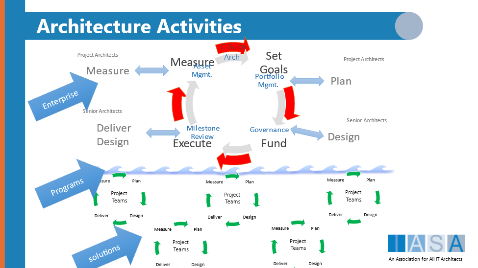
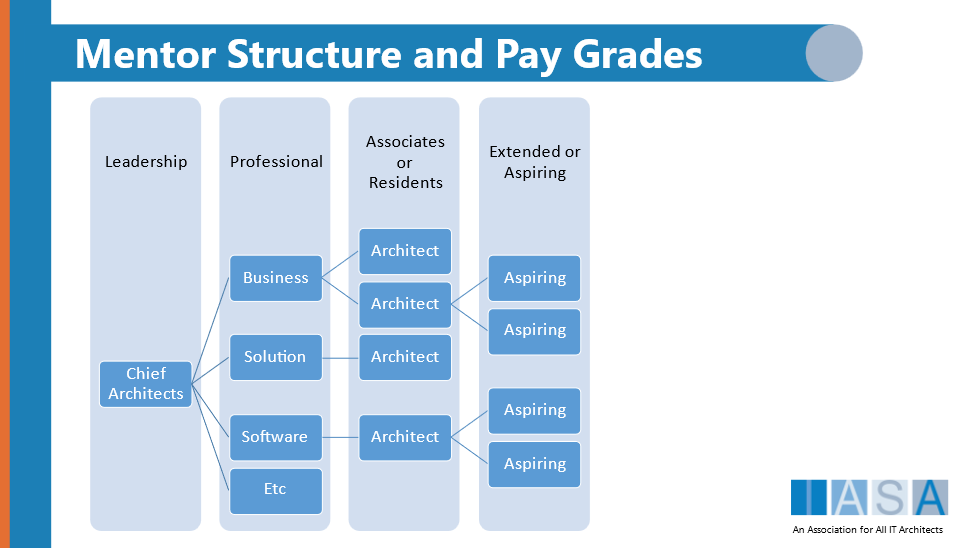

> "I think carrying moral baggage is very dangerous for an artist. If you have a duty, it's to be true and not cover up the cracks."
**Bono**

# What Is Coverage

"Cover -- verb (used with object)

1.  to be or serve as a covering for; extend over; rest on the surface of:
2.  to include, deal with, or provide for; address" -- dictionary.com"

Coverage is not a commonly used word in the architecture profession. It is often referred to as scope, or scalability (of the architecture practice not of a system), or other terms. However coverage is a better description as it describes the number of important business technology strategy decisions that are made using rigorous architecture thinking. Note: Using the term rigorous does not imply length of time the decision takes but the amount of rigor in all aspects of the decision including how quickly it should be made.

Coverage can be described as the number of tasks that should have an architects (a person with the right level of competencies), that are actually done by an architect. For example, a team is deciding on which security framework to use. They get together in a room and draw pictures of the system on the whiteboard. One team member says one product, another team member lists another product. They debate the topic and choose the first product and get back to delivery. This is an architectural decision. That same team may or may not know that two other teams have just had the same discussion and just decided on the second product. Now the organization has two security mechanisms to maintain over the lifecycle of the three products. The average enterprise has hundreds of the conversations and decisions per week. Other examples include backlog prioritization between product owner and engineers, roadmapping and product investment planning, strategic investment directions and many many more. In fact the enterprise is made up of thousands of these decisions made at different levels.

Figure 1 Architecture Decision Activities

# Why is Coverage Important to Architects

Coverage is one of the missing elements in most architecture practices. A realistic view of coverage means understanding that architecture cannot be delegated to non-architects in any scalable way any more than doctors can delegate work to non-doctors. Imagine if a hospital janitor walked into a patient room with a syringe! This topic is covered extensively in the [Extended Team](extended_team.md){:target="_blank"} article.

Coverage then is the amount of direct proactive involvement of an appropriately experienced architect involved directly with the architecture activities in an organization. This is where the architecture practice method of the BTABoK shows the deficiencies of modern architecture. Instead of direct proactive involvement, architects tend to move up and try to make policies, principles, or standards to achieve a type of coverage. However, most data indicates that this is not effective .

To effectively provide coverage for architecture activities, the architecture team must be of the appropriate size, have the appropriate competencies, and have matured their practice to the point it can handle issues, [decisions](decisions.md){:target="_blank"} and [stakeholders](stakeholders.md){:target="_blank"} at different scopes.

# Coverage Approach

The canvas below provides a tool for estimating coverage. Think of each of the columns as different areas of business and technology. The rows highlight the level of stakeholders such as the executive level and their involvement includes the senior most executives in the organization, which may be a small or large group. The columns at first seem odd but they are organized around change/transformation in relation to large and small technology decisions. Using this tool, the architecture practice can quickly decide where it is currently providing effective coverage and where it needs to grow.

Figure 2 Architect Engagement Canvas

## Extended Teams Can Only Cover So Much

The most important lesson in coverage is that it is the architect competencies that matter most in value and structural outcomes. These do not necessarily correspond to title, they must be measured and maintained regularly and include all 5 pillars in the [competency model](competency.md){:target="_blank"}. It is possible to scale coverage in the short term with an extended team model, but it requires significant mentoring and effort that begins to shift the architecture practice towards an oversight or governance focus that has meant the end of so many architecture teams. To stay pro-active and innovation focused (see [architecture practice](architecture_practice.md){:target="_blank"}, [engagement model](engagement.md){:target="_blank"}, [governance](governance.md){:target="_blank"}, and [innovation](innovate.md){:target="_blank"} to understand these relationships) the architecture team must stay actively involved from strategy to execution to measurement. Thus, the extended team should become the source of new architects as the maturity of the practice builds.

Figure 3 An example of mentoring methods

## Do Not Use Scope as a Form of Coverage

The second greatest error in the basis of coverage is that one architect at a higher level of scope can cover the architectural decisions below them. This is the root of scope-based roles such as domain architect and enterprise architect. These positions are valuable and necessary, but when they are used to attempt to cover more territory than can be expected they have difficulties maintaining their proactive approach, value recognition and strategy to execution.

Instead as a part of architecture assignment, cover the most pressing, important activities first. This provides significant advantage in the following ways:

1.  It builds on success, showing that products/ projects with architects are successful, or more successful than ones without.
2.  It builds stakeholder trust and relationships. With the backing of happy stakeholders, it is easier to scale the architecture practice.
3.  It keeps focus on value delivery instead of putting out fires (being the people who 'save' failing projects).
4.  And it lets the architecture team practice architecture at appropriate scopes before moving upwards.

## Think Big, Start Small, Move Fast

In the end the architecture coverage and practice will be determined primarily by the practitioners in the company and the influence of vendors or service integrators. It is essential in coverage to think big. Meaning the architecture practice should aspire to be the guiding force in business technology strategy. This is the purpose of architecture according to the BTABoK and one of the core tenets is an economic principle Think Big, Start Small and Move Fast. The organization will not necessarily welcome each stage of maturity, but if the team is dedicated and focuses on the techniques in the BTABoK as well as extending that requirement to its vendors it will ultimately succeed.

Thinking big also means that the practice must dedicate itself to the outcome model within digital advantage and in all four quadrants of IBAM. Ultimately it is by focusing on these outcomes that the practice shows the value of architecture.

## The Key to Scaling Agile Architecture

Coverage is by far the most important concept in scaling Agile Architecture techniques. Think of the the hierarchy of the organization. At the top management sets direction, objectives and strategy, and at the bottom staff members execute. This is the traditional management method. However, agile organizations have learned that decisions are best postponed until the latest possible moment and if execution isn't aligned with strategy, they will go their own way. This has been the deadlock that has lead to so many failed agile transformations and so many failed digital transformation.

The key is to recognize that execution is where the actual dependencies and complexity lies in these initiatives and architectural thinking and competencies are essential to both of these initiatives. Coverage based thinking means the organization that puts effective professionals in the heart of execution will far outpace their competition in velocity and value.

## Assign Architects Based on Competency and Learning Pathways

One of the critical areas of coverage is the Right Person for the Right Job. A software architect will make poorer decisions in a critical infrastructure project than an infrastructure architect. An associate or junior architect will make less capable decisions if put in a position without mentoring that they are not prepared to handle. It is important that during architecture assignment to keep this in mind.

## Growing Coverage Without Growing Cost

The diagram about mentor-based architecture practices also leads to another unexpected benefit. The architecture practice can grow coverage while not significantly growing cost by using associates and aspiring architects to reach the most difficult decisions; those decisions that happen at the team level. This is essential both to the enterprise as well as to the practice. Most aspiring architects struggle to get the experience they need to become senior architects or end up being promoted beyond their ability from other roles. This creates an opportunity for the organization to mature professionals through mentoring.

## Growing Coverage Over Time

The goal of coverage is to estimate the size of the overall set of architecturally significant decisions, objectives, and activities to estimate coverage. In the average enterprise this is a significant figure. It is not necessary for every decision to include an architect, in fact this method will reduce the overall workload of the team as the organization begins to understand the difference between architectural decision, [velocity](velocity.md){:target="_blank"} and information needed. Also there are many tools and techniques that can scale decision effectiveness over time. For example decision boards and delegation poker are two techniques often used to help teams understand what decisions can be made by whom.

# Understanding Coverage and Measures

Coverage is a difficult thing to measure and must be estimated based on [Scope and Context](scope_context.md){:target="_blank"}. Scope impacts the size of impact and area within an organization. For example an architecture deliverable or decision at the domain or capability level of scope should impact all decisions and architectures at lower levels of scope within the domain. However it is important to actually measure how often this happens versus how many times teams use their own methods, decisions.

This tradeoff is where the proactive architecture practice becomes important. Traditionally this is seen in organizations with high 'exemption rates' or high failure rates in architecture reviews. The exemption rate is the number of projects or teams which did not deliver according to principles, accepted practice, or target roadmap but have come far enough along that they get an exemption to the rule. In some organizations this number can be a very high percentage of projects.

## Using Projects and Size

Using the roadmapping and assignment articles it becomes apparent what the number of projects/products are in 'flight', meaning the number of discrete projects/or products that are starting or are currently underway. In the largest organizations, those in the fortune 100 range or size, this can often be in the thousands. However, these projects are not always the same size or scope. So, the largest or most complex projects may have a very large number of critical architecture decisions which impact the success of the company, whereas the very smallest or least complex may have very few. Architects use an architectural complexity rating to average this figure to understand how many architects are needed per project.

Using project figures in this way often also needs to include seniority, decision making style, risk, compliance, governance, and other aspects of architecture to estimate how much architectural work there is to do. A way of estimating using projects is that the most complex projects will need most of the architecture work whereas the less complex projects may have none. When using this method of sizing be sure to consider the types of activities architects are engaged in as well. Firefighting is very different from strategic thinking.

There are only general or anecdotal figures on this but if one assumes that an average complexity project would include 3-5 teams, it will need one full time architect from before the business case to after delivery and measurement of outcomes. For a simple product that takes 6 mo. to build and deploy, this would mean the architect would be engaged for 1-2 mo. prior and 1-2 mo. after the project delivered, though at far fewer hours at the end. In one large healthcare company, the architect team found roughly 3 requests with significant architecture impact per month out of roughly 50 total requests.

## Using Number of Teams

Another way of thinking about this is the number of teams actively engaged. This has the benefit of including vendors and Sis into the work figure. If there are 50 teams, and the average team makes 3 architecturally significant decisions during an agile sprint or release, then that gives a solid figure for how many decisions there are. If the practice assumes that each decision will require roughly 5 person-days of work, prototyping, communication, comparison (this is only an anecdotal figure), then that gives a real estimate of the workload of design, communication and strategy work requiring architecture skills.

## What about Maintenance and Small Items

There are generally two accepted ways of handling architecture at a 'small' level of scope such as maintenance requests and small feature changes. This highly depends on what style of maintenance the organization is using, for example a maintenance department in operations would be different from a DevOps style of team maintenance. The second would assume that the team that built the system would be responding to requests and the architect would be co-located with the team thus architectural impact analysis would be built in. However, either way, the key question becomes architectural impact. If the request has an impact, it is important that the architecture practice include these in estimates in their understanding of coverage.

BTABoK 3.0 by [IASA](https://iasaglobal.org/) is licensed under a [Creative Commons Attribution-NonCommercial 4.0 International License](http://creativecommons.org/licenses/by-nc/4.0/). Based on a work at [https://btabok.iasaglobal.org/](https://btabok.iasaglobal.org/)