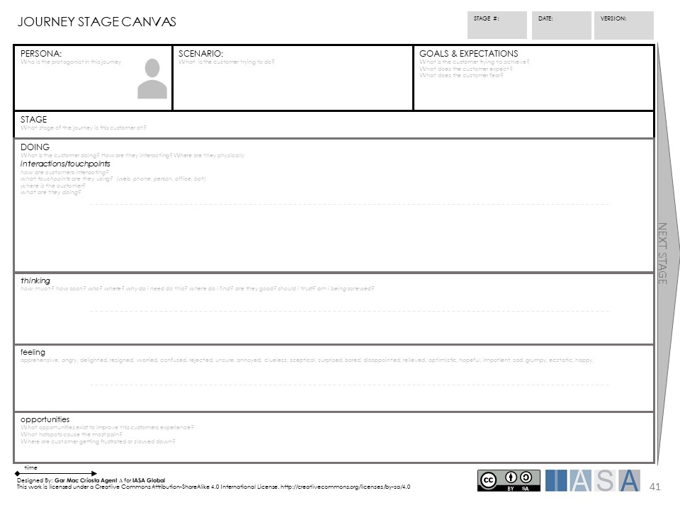

> "You are in the customer experience business &mdash; whether you know it or not."
**Harley Manning and Kerry Bodine in "Outside-In"**

# Introduction

A good customer experience, one that meets their needs, makes doing business with the company easy, and leaves them feeling good about the interaction, can lead to both top-line revenue and bottom-line cost savings. According to Parrish Arturi, one-time Senior Vice President of Customer Experience at Fidelity Investments, customer experience leads to profits, if it is treated as a business discipline[^1].

The customer experience is the aggregation of how customers feel about each step of the customer journey. The customer journey must first be mapped out to understand and improve the customer experience.

# What is a Customer Journey?

The basic customer journey contains six steps:

- Discover
- Evaluate
- Buy
- Access
- Use
- Get support

After all that, a customer might either re-engage parts of the journey again, or they may just leave.

While not readily apparent, all customer journeys have these six steps, but they might look different or be called something else. The six steps are most recognizeable for a company that sells products directly to its customers, but they exist for service business, non-profits, and government agencies, too.

The customer journey is a collection of touchpoints through which the company delivers its value proposition to the customers. They are the ends of key processes or value streams executed by the people and systems that interact directly with customers.

# Why is the Customer Journey Important to Architects?

By starting with the customer journey, the architect can readily determine which processes are key to delivering the customer experience. These processes are supported directly or indirectly by other processes, people, and systems. Taken as a whole, the collection of value-delivering processes, and direct and indirect support define the "requirements" for delivering value by the company, and cover nearly everything the company needs to do for its customers. 

As a side note, members of other stakeholder groups, such as partners, employees, investors (owners and lenders). and communities (neighbors and regulators) each have their own journeys that needs to be defined, mapped, and managed. The combined journeys of all stakeholder groups define the entire set of interactions that cross the boundary of the organization, forming what archiects call the "context diagram."

# Customer Journey Approaches

While there are a number of ways to discover and map the customer journeys, they all have the same goal: to determine those touchpoints that really matter to the company from a competitive standpoint. A small number of those approaches are covered here.

## The Customer Experience Ecosystem

*Outside-in* talks about a "customer experience ecosystem" that includes customers, employees, and systems, but expands to include partners and eventuall the entire supply chain. All of these actors work together to provide the total experience for the customer. As an example, a customer orders pet food from their favorite supplier to be delivered in one or two days. For that to happen, the pet food supplier has to have enough on hand to fulfill the order, or a solid enough relationship with *their* suppliers to ensure the goods will be on hand when they need to be shipped. Then, the pet food supplier needs to have employees available to pick and pack the order for shipping, along with the systems in place to ensure the order arrives at the right warehouse in time. The pet food supplier hands the goods over to a shipper which then delivers it to the end customer. A breakdown at any point results in the end customer not getting the goods they ordered when they need them, and that reflects poorly on the pet food supplier, even though the problem might not be their fault. 

The COVID pandemic the last two years has shown just how fragile many of those supply chains have become. Customer experiences have deteriorated across many industries. The inability of the hospitality and airline industries to hire enough people has led to customer experience horror stories that often make the national news.

Obviously, the customer experience is important, and it starts with the customer journey, then works its way back through the company to the very far ends of the various supply chains. But the customer journey is the *starting point* and therefore the most important.

## Value-delivering Touchpoints

Start by identifying all of the channels used to reach customers. For most companies, these include a website, perhaps a store, telephone sales, and maybe a direct sales force. Each embodies a unique customer journey. For each channel, identify the stages of the journey, using the Customer Journey Canvas in FIg. 1.

Each stage may be expanded using the Journey Stage Canvas in Fig. 2.

Each stage identifies a touchpoint through which the vaiue proposistions are delivered to the customer. Each touchpoint is the end of a value-delivering process. Create an Ishikawa diagram for each, with the main arrow representing the value-delivering process. The resulting collection of arrows will be used in the next two sections.

## Direct Support Processes

In order for a sales person to hand a new sweater to a customer over the counter at a store, a host of things must have been done to make that possible:

- The store had to be built
- Staff had to be hired and trained
- Inventory had to be purchased and distributed to the store
- Provision had to be made for the employee to be managed and paid
- Materials to wrap the sweater had to be purchased
- The customer had to be notified of the store's existence
- The customer had to be motivated to come into the store and look aroud
- Perhaps the customer tried on the sweater, so provision had to be made for that, both in terms of a private location and assistance

That's a pretty exhaustive list, and it doesn't take much to recognize that pretty much the entire enterprise participates in some tangible way.

A process, whethier value-delivering or not, is directly support by other processes necessary to provide information, resources, or create conditions required for the main process to execute. In a web store, for example, the development of the various systems to present the web pages and act on the user inputs is direct support. The external process used to process payments is also direct support. Each of those processes may in turn be supported by other processes, which are considered indirect support and covered in the next section.

Working one at a time, identify internal or external processes that directly support the value-delivering process being considered, and draw a branch off the main arrow for each one. These arrows can be "pruned" later, so if there is a doubt about a process and whether it is direct or indirect, include it for now.

## Indirect Support Processes

A process is direct support if it direcly affects or provides input into a value-delivering process. All other processes are indirect support. Going back to the Ishikawa digrams, consider each direct supprt process in turn. Identify the proesses that it depends on in order to be executed. Create a sub-branch on the diagram for each indirect support process, connecting it to the direct support process it supports. 

When done, the collection of digrams will include every process required to deliver value to the customer at some point in the customer journey. Many, if not most, of the indirect support processes, and maybe even some of the direct support processes, will appear more than once on different diagrams or even the same diagram. This repetition indicates that the process is shared, which is important to know.

# Conclusion

This exercise results in a complete model of the processes required to deliver value to the customer. Yes, it's a huge effort, but it highlights the connections that even seemingly unimportant tasks have with the ability to deliver that value. The identified processes, combined with those found during similar exercises for other groups of stakeholders, is the complete set of processes required for the business. The next step is to ogranize these and assign ownership into the organization structure. 

# References

**Manning, H., Bodine, K. *Outside-In: The Power of Putting Customers at the Center of Your Business*, New Harvest Books, New York, NY: 2012**

BTABoK 3.0 by [IASA](https://iasaglobal.org/) is licensed under a [Creative Commons Attribution-NonCommercial 4.0 International License](http://creativecommons.org/licenses/by-nc/4.0/). Based on a work at [https://btabok.iasaglobal.org/](https://btabok.iasaglobal.org/)