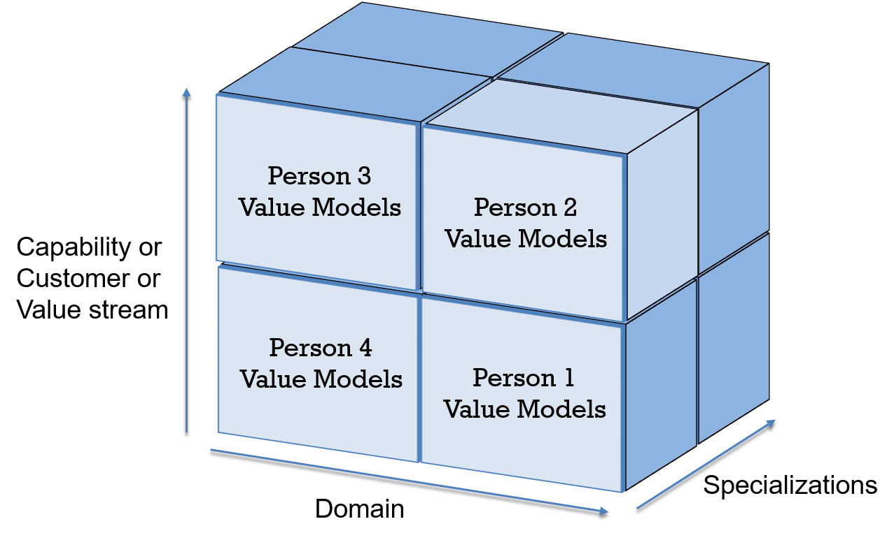
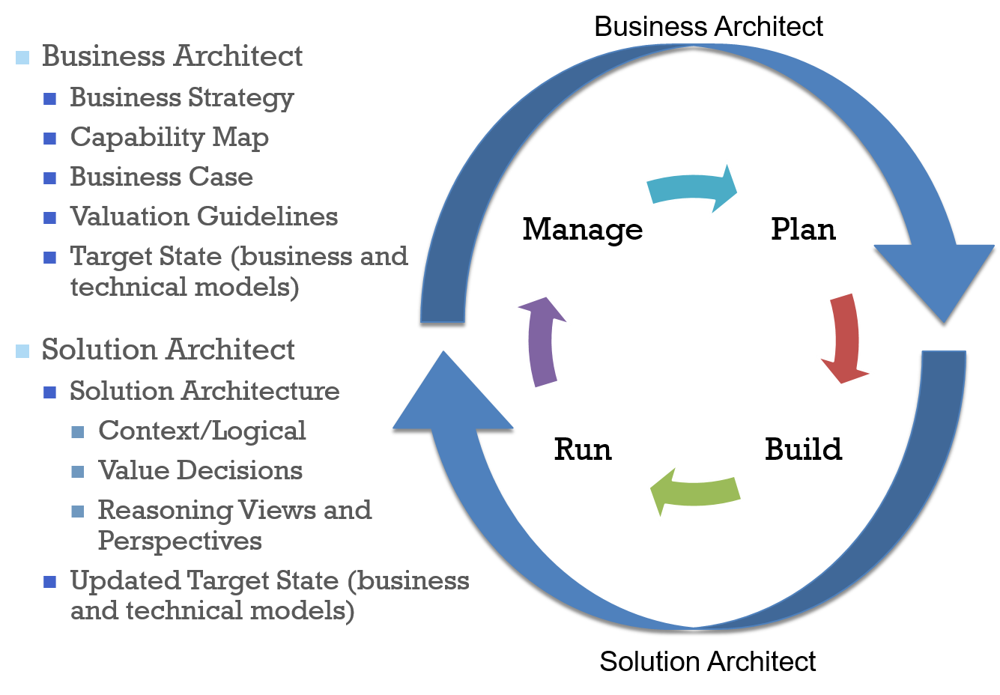

# Deliverables

So what are architecture deliverables? In general architecture deliverables are treated as large documents for projects. What is often called the architecture description. The notion of the architecture description is well documented in the iso 042010 Standard up by the ISO. The ice 04-2010 provides for architecture descriptions at that connect to views and viewpoints. And deliver on a description of a particular architecture.

Architecture deliverables often extend significantly further than a particular architecture description. They may include research into new technologies, they may include new business models and business cases. They may include proposals and power points to management or any number of and of deliverables documents for stake holders.

## Description

In general architecture teams must describe and define their deliverables in a number of different fashions. First they should describe their deliverables in terms of stake holders. Second, they should define their deliverables in terms of ownership influence and importance. Finally, they should define the deliverables in terms of capabilities, domain and specialization.

# Themes

Deliverables connect the architect to the organization. As one CITA-Professional puts it, 'they are what we leave behind'. The architect deliverable is imagined to be a long lasting, well used part of the enterprise decision-making process and from time to time that is true. In many cases though architects work on deliverables that are simply influencers or are unused by stakeholders.Communication and Thinking over Documentation and Detailed Design

This point is reaffirmed in numerous places in the BTABoK. Architects are innovators, change agents, transformation specialists, visionaries. They are forward focused instead control focused or backwards focused. They are builders instead of reviewers. All of these focal points are reaffirmed in the deliverables the architecture team.

In the Iasa Engagement model, deliverables should be considered tools for thinking, communication and leadership instead of documentation or large detailed designs. The organization has many staff members of different types which create managed documentation and the architecture team is often a small percentage of these staff members. Every piece of documentation must be maintained over time. It therefore makes sense to create as little maintained documentation as possible over time.

## Don't Confuse Views and Viewpoints with Deliverables

[Views and viewpoints](views.md){:target="_blank"} are used to describe a specific system (people, process and technology) inside an architecture description within a particular architecture [context](scope_context.md){:target="_blank"}. They should be left up to the architect to decide which are necessary in most cases. Deliverables on the other hand are items that the team delivers to the enterprise, client or organization. These are very often completely different things as deliverables may include meetings, presentations, influence, decision points in addition to an architecture description.

## Influence is not Ownership

In numerous organizations the architects are primarily influencers of other teams deliverables. When doing a deliverables analysis, the architects should review the deliverables they own against those they only influence. While value focused influence may help the organization achieve its objectives, it is less helpful to the architects achieving a value oriented and well received engagement model as owners are traditionally given credit for successes and value. The architect team should strive to own the most valued business and technology strategy deliverables and their contents with a focus on owning *as a team* the business technology strategy of the organization. Note: in large teams many business architects will own pure business models which does not reduce the primary overall team recognition as business technology strategists.If No One Reads It, Dump It

Based on architecture being communication and thinking over documentation, it is necessary to reduce the deliverables and the documentation steps for the team overall. Usage by stakeholders and the architecture team are the primary measures of efficacy in deliverables. A document which has not been opened in a year is likely less useful to the enterprise than one that is referenced daily by a stakeholder or the team. If it is not used, archive and delete it as it will slow down the agility of the overall team.

# Guidelines for Iasa Engagement Model

In reality architects are challenged with numerous, often ephemeral, deliverables based on stakeholders demands and can find it difficult to say no to powerful stakeholders. This real constraint causes a lot of difficulty in determining exactly what an architecture team should create.

# Guidelines for Deciding Deliverables

To develop an effective deliverables strategy consider the following elements:

1.  Focus and Brand -- The architecture team will be judged based on its goals and brand within the organization. Align deliverables to this brand. For example, if the team is targeting a growth in recognition for innovation, the deliverables should be aligned to business cases, innovation, ideation and other forward looking activities.
2.  Recognition and Usage -- Which deliverables will be most recognized and used throughout the client environment. The team should provide deliverables that are used and recognized and preferably owned by the architects first. All other deliverables come later.
3.  Time on delivery -- Architects deliver change. The Iasa Engagement model does not provide for a team that sits in a corner and does big documents all day. If deliverables are taking the team away from delivery of change and growth, they should be jettisoned.
4.  Deliverable type -- Review all types of deliverables including meetings and research and influence.
5.  Team size -- The team size will determine the number of deliverables it can manage outside of the most essential to change management. Do not specialize the team and create large enterprise deliverables unless they are used and the team can maintain and own them over time without lessoning its focus on delivery.
6.  Team makeup -- Take a full skills inventory of the team and ensure the teams skills are aligned with the deliverable ownership.

## Delivery Types and Outputs

The following table lists the types of output & types of engagement delivered during each stage in the lifecycle the type is referenced throughout the engagement model indicating how an architect will be involved. Any of these elements may be considered deliverables if they are repeated multiple times by different architects in the architecture methodology.

| **Type ** | **Example ** |
| --- | --- |
| **Document/Artifact ** | Office document (Word, Excel, PowerPoint etc.) |
| **Collaboration ** | Meeting (e.g. ARB, Roadmap envisioning) |
| **Model ** | Description or representation of a business, process or system |
| **Advisory ** | Formal advice delivered from architecture practice |
| **Tool ** | Architecture Repository, Lifecycle Mgmt, Project Mgmt/Product, Tools |
| **Decision ** | Decision made by appropriate governance structure (e.g. ISLT, ARB) |
| **Influence ** | Any business contact where architecture can be promoted, leveraged or presented in the context of delivering business value. |

## Deciding on Deliverables

The engagement steering committee should decide on deliverables and then validate that model through the entire architecture practice using the following steps.

| **Step ** | **Description ** |
| --- | --- |
| **Overall Complexity ** | Simple is better in early phases of the architecture maturity model. A list of basic deliverables and a more advanced set of deliverables are provided below. |
| **Strategy and Execution Lifecycle ** | Meeting (e.g. ARB, Roadmap envisioning) |
| **Architecture Methodology (Lifecycle)** | Description or representation of a business, process or system |
| **Stakeholder Mapping** | Use the power/interest grid, personas and other techniques and each team member to describe the stakeholder community. Map deliverables to the most important stakeholders. |
| **Current Deliverables** | Use the Iasa engagement methodology to describe current deliverables in terms of phase, ownership and impact. |
| **Target Deliverables** | Create a preferred list of deliverables by phase keeping them as simple as possible. Assign deliverables by role and connect to Architecture Repository, Lifecycle Mgmt, Project Mgmt/Product, Tools |
| **Templates and Guidelines ** | Where possible create a template list to ease the burden of deliverable creation and a common brand. Spend extra time on making these templates extremely attractive in line with the brand of the team. Update them regularly. |
| **Architect Team Review ** | Have each member of the architect community validate the engagement deliverables (sitting out should not be an option). By creating buy off in this manner each architect will know what to deliver to what stakeholder and when. |

## Assign Deliverable Ownership

Ownership of a deliverable does not end with the phase/project/product timeline in which it was created. Any deliverable which will retain its value over time should be assigned based on capability, internal domain and specialization.

Figure 1 Deliverable Ownership

## Align Handoff Between Architects

Architects function at different stages and scopes around the enterprise lifecycle. The handoffs and deliverables should be aligned so that they always have an owner and are updated according to the appropriate phase, specialization and [scope](scope_context.md){:target="_blank"}.

Figure 2 Example Deliverable Alignment Business to Solution

## Basic Engagement Model

When using the Iasa Basic [Engagement Model](engagement.md){:target="_blank"} the following deliverables have been found to be most effective.

| **Artifact** | **Description ** | **Source** | **Models** |
| --- | --- | --- | --- |
| **Business Models and Strategy Scorecards** | A shared combination of business models including business model [canvas](.\structured_canvases_m.md), basic business and technical capability models and a strategy scorecard indexed to the program/project list | Architecture Team | Business Model Canvas, Capability Models, Strategy Scorecard |
| **Business Case(s)** |   | Architect Team |   |
| **Estimation Model ** | Agreed estimation approach supported by finance and management teams along with specification of required metrics, hurdle rate and valuation calculations. | Finance/IT Executive | Value Stream |
| **Stakeholder Mapping ** | Stakeholder mapping capturing the key stakeholders for a given context their title, level of authority, reporting lines etc. Used by architect team and project teams to better understand stakeholder concerns. | Architect Team | Stakeholder Power and Influence Grid |
| **Master Schedule ** | Master schedule is the top-level program of work to be carried out within an enterprise or segment within a specified time period e.g. 12 months | Program Management Team |   |
| **Architecture Description(s) ** | As defined by ISO/IEC/IEEE 42010:2011 and Architecture Description addresses the creation, analysis and sustainment of architectures of systems through the use of architecture descriptions. A conceptual model of architecture description is established. The required contents of an architecture description are specified. Architecture viewpoints, architecture frameworks and architecture description languages are introduced for codifying conventions and common practices of architecture description. The required content of architecture viewpoints, architecture frameworks and architecture description languages is specified. | Architect Team | Varies By Viewpoint |
| **Viewpoints and Views** |   |   | Per Viewpoint Description |
| **Project Scorecards ** |   | Architect team |   |

## Advanced Engagement Model

The following table provides a detailed list of the architectural output that will be produced and managed as part of the advanced architect engagement model.

| **Artifact ** | **Description** | **Source** | **Models** |
| --- | --- | --- | --- |
| **Architect Description ** | As defined by ISO/IEC/IEEE 42010:2011 and Architecture Description addresses the creation, analysis and sustainment of architectures of systems through the use of architecture descriptions. A conceptual model of architecture description is established. The required contents of an architecture description are specified. Architecture viewpoints, architecture frameworks and architecture description languages are introduced for codifying conventions and common practices of architecture description. The required content of architecture viewpoints, architecture frameworks and architecture description languages is specified. | Architect Team |   |
| **Estimation Model ** | Agreed estimation approach supported by finance and management teams along with specification of required metrics, hurdle rate and valuation calculations. | Finance/IT Executive |   |
| **Stakeholder Mapping ** | Stakeholder mapping capturing the key stakeholders for a given context their title, level of authority, reporting lines etc. Used by architect team and project teams to better understand stakeholder concerns. | Architect Team |   |
| **Opportunity/ Innovation List ** | Idea bank to capture opportunities and ideas analogous to lead management in CRM. The list is open to anyone (anywhere in the organization) with an idea to offer. The list acts a lightweight knowledge management solution. The list is technology centric however process optimizations as they are typically technology supported are also captured here. | Architect Team |   |
| **Principles ** | Architecture Principles are defined to guide organizational decision-making and encourage 'good' behavior.  For example reuse/buy/build encourages reuse of existing systems first e.g. leveraging existing investments | Architect Team |   |
| **Risk Register ** | Risks are captured from an architectural perspective and managed within projects and across the enterprise/segment architecture. The risk register typically contains, risk identifier, risk description, dates (created/next review/critical), scope, nature, stakeholders, business services effected, effect, frequency, impact and monitoring controls. | Architect team |   |
| **Business Model ** | Business model contains a description of how the organization is structured from a structural perspective, business models will also contain information on how the organization is structured to produce goods/services, compete etc. Examples organization structure, strategy canvas, business model canvas, porter's generic strategy etc. | Enterprise/ BU | Business or Lean Model Canvas |
| **Business Strategy ** | Strategy to support the organization fulfilling its mission and delivering the organization vision | Enterprise/BU |   |
| **Architecture Decision ** | Decision document capturing an architecturally significant decision. The document contains the options assessed the approach taken, the criteria for deciding and the parties involved. | Architect Team |   |
| **Technology Adoption Strategy ** | Technology Adoption Strategy enables the organization to effectively adopt new technologies in a managed and controlled way. The strategy document describes the principles underpinning the strategy and the process for adoption | Architect Team |   |
| **Enterprise Application/Service Portfolio ** | Listing of the current portfolio of business services being supported by technology solutions typically contains service description, business importance, SLA's etc. | Enterprise Architect Team |   |
| **Technology Roadmap ** | Technology roadmap takes a layered view of products and services. The roadmap will capture current-state portfolio along with supporting technology and significant support and version dates (e.g. end of life, service level changes etc.) in the technology. The roadmap is used for planning activities and risk management. The roadmap will also capture the significant dates in the lifetime of business services delivered e.g. major revisions & sunset dates. | Architect Team Enterprise Architecture Team |   |
| **Capability Model ** | Multi-dimensional model of the business or business unit showing 'what' the business does. The model demonstrates the connections and dependencies between capabilities along with the value and performance of the service to the organization. | Architect Team |   |
| **Benefits Dependency Model ** | A model used to demonstrate the connection between business outcomes & benefits with technology investments. The model is used to demonstrate the return on investment and outcomes as part of a robust outcome management process. | Architect Team |   |
| **ARB Advisory ** | ARB Advisory is provided for information purposes only to enable successful architectures. Could contain product, pattern, reference architecture, people, futures etc. | Architect Team |   |
| **Architect Governance Waiver ** | Waiver granted to an architecture or architecture decision that grants permission to deviate from governance. The granting of a waiver must immediately trigger the recording of a risk. Typically contains the decision reference, description of the situation and reason, the costs associated with adhering to the governance and cost for deviation from the governance. | Architect Team |   |
| **Master Schedule ** | Master schedule is the top-level program of work to be carried out within an enterprise or segment within a specified time period e.g. 12 months | Program Management Team |   |
| **Vendor Education ** | Vendor Education is a pack of materials including governance, reference architectures, guidance, who's who, project lifecycle, vendor engagement etc. The pack is used to educate partners and prospective partners in a proactive manner to ensure that all sides have clear and explicit expectations and responsibilities | Architect Team |   |
| **Due Diligence (Vendor/Product) ** | Research performed on potential partner or vendor companies and products to underpin the rationale for selection contains, financials, market analysis, product roadmap & plans, external influencers e.g. market trends, intellectual property rights, technology dependencies etc. | Architect Team |   |
| **Post-deployment Solution Roadmap ** | Solutions move through phases during their life through to retirement, post-deployment road mapping moves from treating the solution in a project oriented mode into thinking of the solution as a product in a classic product management sense. The solution roadmap lays out the major plans for the 'product' including dependencies on underlying platforms. | Architect Team |   |
| **RFI ** | The purpose of an RFI is to collect written information about the capabilities of various suppliers. An RFI is primarily used to gather information to help make a decision on what steps to take next. |   |   |
| **RFI Assessment ** | Evaluation of responses to an RFI | Architect Team |   |
| **RFP/RFT/RFQ ** | Standard requests for proposal/tender/quotation used during a procurement lifecycle |   |   |
| **RFP/RFT/RFQ Review/Scoring ** | Evaluation of responses to an RFP/RFT/RFQ. Scoring basis is typically agreed at an enterprise basis e.g. fit, cost, capability etc. | Architect Team |   |
| **RFP/RFT Recommendation ** | Recommendation based on responses as to what to how to proceed and reasons why | Architect Team |   |
| **Service Monitoring Dashboard ** | Visualization typically supported by tooling, service runtime monitoring and configuration management database allows real-time and historical reporting on 'services' provided to the organization that are technology dependent. | Operations Team |

BTABoK 3.0 by [IASA](https://iasaglobal.org/) is licensed under a [Creative Commons Attribution-NonCommercial 4.0 International License](http://creativecommons.org/licenses/by-nc/4.0/). Based on a work at <https://btabok.iasaglobal.org/>