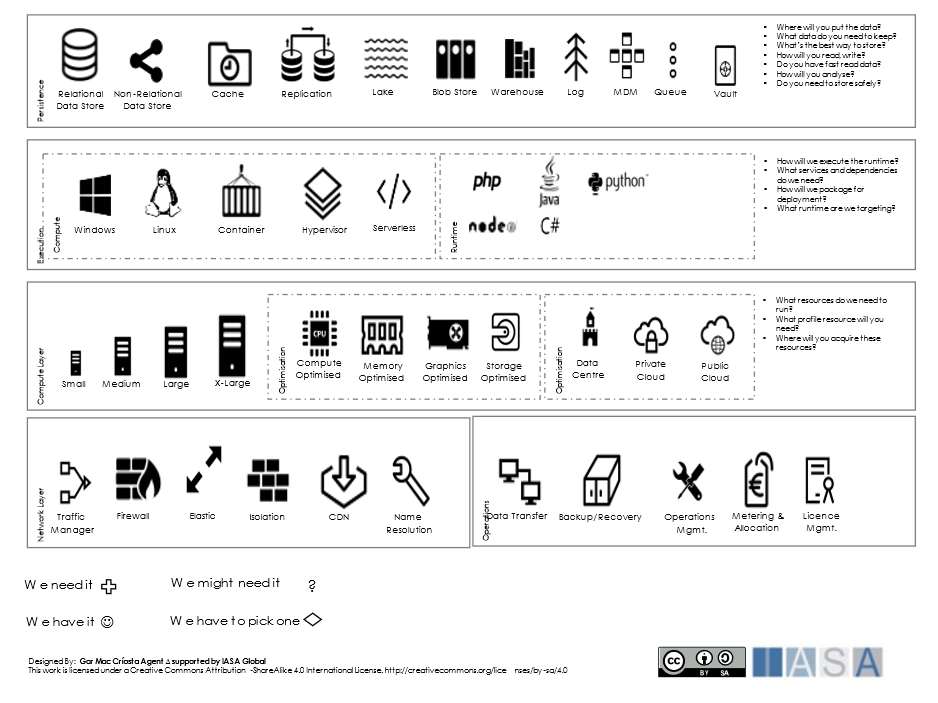
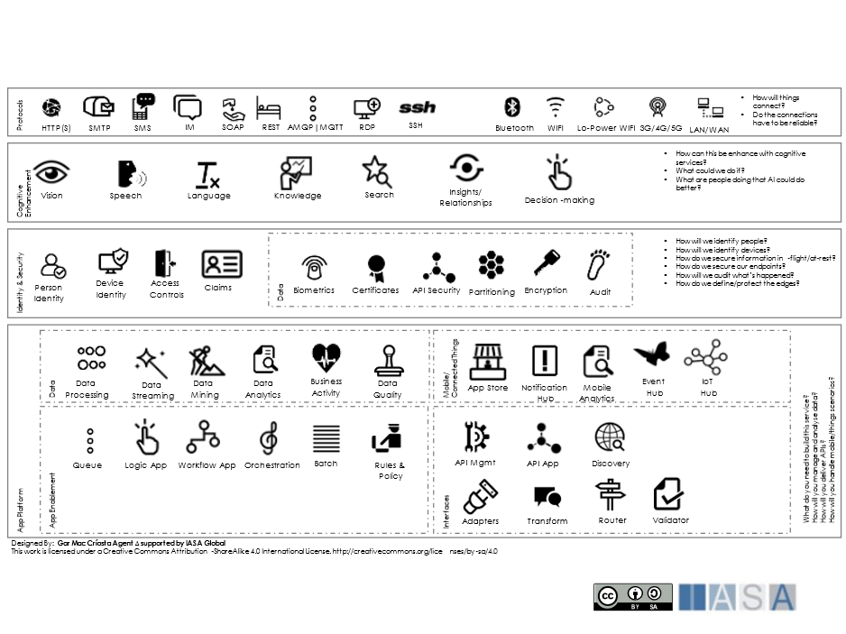

> "All architecture is design, but not all design is architecture. Architecture represents the significant design decisions that shape the form and function of a system, where 'significant' is measured by the cost of change."
**Grady Booch**

# Introduction

The ability to design—to create something where nothing was before—is
one of the most important competencies of an architect. 

Design isn’t easy. As Maarten Boasson put it, “Designing software is not
very different from designing any other complex structure: Few people
are good at it; no single recipe always produces a good product; and the
more people involved, the smaller the probability of success.” This refers to the difficulty of representing human systems in technical arenas. Architecture design is difficult because it requires both broad and deep knowledge and crosses many areas of domain knowledge in addition to the base difficulties in design itself. 

Design happens no matter how a project/product (btabok link) is organized. If it doesn’t happen in its own “phase,” it happens when a team is in the middle of code
and encounter an unexpected condition they need to handle. Whenever it
happens, it needs to be done deliberately. The documents that result
from “big up-front” design are not the design, they are a representation
of it. The design is the thinking and decisions that go into creating those
documents. For a design to be clear the thinking, and the decisions have to be obvious. That is one of the factors that make a design into architecture. 

This article will explore the nature of design, not just how to do it. The design itself is woven through the BTABoK so the article will connect those ideas and tools to the core concepts of design. It looks at the factors (benefits, costs, trade-offs, quality attributions) in the problem being solved and the domain in which it exists that influence and constrains the design. It also describes how decisions were made that can also influence and constrain the design in the end.

# What is Design?

Design is both a noun and a verb. “Design” is the verb form of architecture, although there is debate about this (one *designs* an architecture for a structure, they don’t *architect* a structure).

## Design Emerges but Architecture is Deliberate

Design is deliberate, that is it purposefully set out to create a design that works safely, achieves a specific objective, and is elegant, in that order.  

 

> *Figure 1 Design Relationships*

The figure describes the critical relationships between concepts that make up ‘design’. When designing the architect has to consider <u>requirements</u> which are derived from benefits, features, quality attributes and constraints (also <u>principles</u>). These requirements create options which have breadth, depth, may apply patterns and reference models. From these options, the architect makes a decision which impacts value, risk, quality attributes (tested through fitness functions), conformance across the design as well as principles (and exceptions). This happens for all architecturally relevant decisions where each decision may force rethinking or reworking previous designs. This leads to the balance and elegance of an excellent architecture.

## Design Trade-offs and Conformance

Design has become more important because software has become more and
more complex, because it does more than even and because the environment
in which it runs is more complex. Conformance in design suggests that the
<u>views</u>, patterns and design decisions conform to each other across design
artifacts and are balanced in their response to stimuli.

Jack Mostow suggests that the purpose of design is to create a solution
that:

> "Satisfies a given purpose Conforms to limitations of the target medium Meets implicit or explicit requirements on performance and resource usage Satisfies implicit or explicit design criteria on the form of the artifact Satisfies restrictions on the design process itself, such as its length or cost, or the tools available for doing the design"

These goals are very often in conflict, giving the architect a complex series of tradeoffs to optimize. Designing anything is almost always an optimization problem but is especially true in software-intensive systems.

The act of design is a kind of <u>experiment</u> (links), and the results of that act
are an hypothesis. The hypothesis states that if you build the software
according to the design, and run it in the specified environment, you
will get a set of expected results. The purpose of software testing is
to refute that hypothesis and cause the software to fail. Like any
hypothesis, you cannot prove it correct; you can only prove it wrong.
Failure thus plays a huge role in any successful design effort; you
design, analyze, and test until you can think of no new ways for the
design to fail.

Design and analysis are different. Analysis uses deductive reasoning to
dismantle a structure (or problem) into it constituent components to
better understand it. Design uses inductive reasoning to create a new
structure where none existed before. They are complimentary, and the
designer is constantly switching between them throughout the process.

# Why is Design Important to Architects

Design can be said to be the primary job of architects, though that carries significant debate and critical missing elements of the Role. Design includes all of the basic requirements, options and the final decision as well as the impact of that decision on other designs. The nature of design is that decisions then impact other requirements which then impact other options and other decisions. Finding balance, optimization and elegance across as many design areas as possible is the nature of what makes a design an architecture.

# Design Approach

## Design is the Process of Making Decisions

The most important part of design are the decisions that are made how those decisions are made. There are three elements that are essential in this process:

1. Decision rationale and justification is clear,

2. Design options are understandable and at the same scope,

3. Decisions can be traced back to objectives or principles.

## Make Decisions at the Last Responsible Moment

The concept of the Last Responsible Moment references a set of thinking
and techniques where design decisions are made as late as possible so
that there is the most information available for the design decision.

## Set-Based Design Can Keep Options Open

Set-based design is a technique championed by SAFe which allows design
decisions to remain open and supported until learning can help eliminate
less capable options

 

Figure 2 Set-based vs point-based design - https://www.scaledagileframework.com/set-based-design

## YAGNI – You Aren’t Going to Need It

In many scenarios it is essential to deliver only the minimum design
artifacts necessary to solve the immediate problem. YAGNI design
techniques deliver the very minimum design elements necessary without
the expectation of needing it later. This however should be taken as
another influence or stressor on a design system as it often is
primarily limited by the scope of visibility of the architect. For
example, while a simpler set of abstractions may be enough for a single
product or team, once the design is considered in a solution scope or
capability scope it becomes apparent much more is necessary.

## Understand the Options

Every design problem, set of requirements and principles serves to extend or limit the available options. The Design Landscape canvases allow the architect to think about the services and design elements needed without connecting them immediately to a product or a particular style. This stage of design allows the architect to think about
requirements and options. Then narrow down to what is needed via a set of views and viewpoints, most specifically the context view. Each option considered for the solution will likely require a decision record or decision cascade to demonstrate it is actually needed and why the final decision was made.

 
Figure 3 Architecture Landscape 1

 
Figure 4 Architecture Landscape 2

 
Figure 5 Architecture Landscape 3

## Options Come From Breadth and Depth

The options to meet a requirement come from 4 primary areas which represent the 

## Don’t Mistake Desires or Biases for Design

The process of design is rigorous and must be followed with extreme care, especially where a desired technology or design outcome is already in place. This happens because of cognitive bias or because of a desire ‘modern’ architecture. This notion of a modern architecture is itself a kind of cognitive bias where one assumes a set of design choices based on a perception of what is latest and most advanced in the design options space. According to the BTABoK there is no such thing as a ‘modern’ architecture or design, there are simply design patterns and styles which are more or less suited for solving the design challenges at hand. It is essential that the architect trace each design outcome (decision) to a requirement, a principle, or an objective to prove their use in the final system.

 

Figure 6 Ensuring Design Matches Objectives

## Design For Structural Concerns

In bridge design, the nature of the crossing, and the length of the span in particular, have the most influence on the resulting design. Together, the different aspects of the crossing form the environment or [context ](scope_context.md){:target="_blank"}for the bridge. These will impact all aspects of the design process, much like corporate or company culture, location and business type will inform all aspects of architecture decision making. As the span lengthens, the types of bridges you can build become more constrained, to the point that for spans over 1000 feet, you basically have three options.

So it is with technology systems. The [context ](scope_context.md){:target="_blank"}in which the system will live has as much influence to the design as the functional, quality attribute and constraint requirements. 

The main influences over the design are:

- The shape of the problem 

- The number and location of users 

- How data is generated and used 

- Availability requirements 

- Scale and scalability 

- Required performance levels 

- Volatility in the problem domain 

- Security requirements 

- Programming style 

- Design approach 

Of these, the shape of the problem has by far the most influence. For decades, developers have described software problems as falling into one of three categories: business, scientific, and real-time. It turns out there are good reasons for these particular categories, according to Tom DeMarco. DeMarco showed that all software can be described in terms of three dimensions:

Data: A partitioned view of what the system remembers 

Function: A partitioned view of what the system does 

Behavior: A partitioned view of the behavioral states that characterize
the system 

The term “control” is the name for the behavior dimension which is represented by the combined state machines of the entities which participate in it.

In many systems, one dimension clearly dominates the others, and this domination led to the three categories, but all three dimensions are always present. Business software is dominated by the data dimension. Scientific software is dominated by the function dimension. Real-time software is dominated by the control dimension. The dominant dimension provides the basic shape of the problem, to the point that each category corresponds to a design pattern that governs the entire shape of a solution.

The last two influences on the list, programming style, and design approach, are also important. The three main programming styles, structured or procedural, object-oriented, and functional, will influence a design by leading to certain decisions and constraining others. The choice of programming style is often made by the culture of
the workplace or history.

The design approach describes the way to go about identifying the significant abstractions that become components in a design. Each of the main design styles, including data-driven, event-driven, and responsibility-driven, among others, lead to slightly different sets of abstractions. No single approach works in every case, and in most cases, no single approach is sufficient. A combination of design approaches, or
multiple passes through the problem domain with different approaches lead to the most complete designs.

# The Four Domains of Design

George Yuan was the first to write about designing the problem domain. While his purpose was to create a complete object-oriented design method, his notions of design domains turned out to be the most useful contribution. In particular, Yuan described four domains that all designs must describe:

Problem domain: Contains abstractions that appear in the real world and have an influence over the designed solution whether they become design components. The notion that the problem domain is “designed” versus “analyzed” is unique to Yuan’s work but makes sense. There are many situations in the problem domain where choices can be made that affect subsequent work. Approaching the problem domain as a design activity, with a lot of analysis thrown in, can lead to a better result. 

Application domain: A subset of the abstractions in the problem domain that will become actual design components in the solution. The application domain is determined by literally drawing a line around abstractions in the problem domain to include some and exclude others. This line forms the application boundary and creates a host of requirements for monitoring, detecting, and reacting to events that occur outside the boundary. 

Application-specific domain: Contains abstractions created to specifically support the application being designed. Abstractions such as views and controllers created to separate concerns into layers fall into this domain. 

Application-generic domain: Contains abstractions able to support multiple applications. Code libraries and utilities fall into this domain, whether created for this solution or acquired (purchased or Open Source). 

During design, functionality can move from one domain to another, most often from the application-specific to the application-generic domain. One design goal should be to write as little code as possible to get the job done, and using application-generic abstractions go a long way towards achieving that goal.

# What Makes a Design “Good”?

Design is a sequence of choices. Design decisions become much easier and more reliably made when the design activity is guided by a set of design principles and decisions are made using well-defined criteria that have measures to support them. The principles and criteria described here are not meant to be applied to every project, or even applied to any project as “thou-shalt” directives except where agreed <u>principles</u> inform decisions. Rather, when a design decision is encountered, use the principles and criteria to guide decision making.

## Design Principles

The most complete set of design principles was developed in the context of object-oriented programming but apply equally well to other programming styles. Many of these principles have been around since the 1980s and have proven themselves in practice. The last two are the result of more than one finding in a project post-mortem. 

- Single Responsibility 

- Open-Closed 

- Liskov Substitution 

- Interface Segregation 

- Dependency Inversion 

- One Copy of Data 

- Keep Business Logic in its Place 

## Design Criteria

Design criteria define characteristics of a design that, when compared to another design for the same solution, is better because it has more of, or less of, that characteristic. In some cases, such as cohesion, more is better. In others, such as complexity, less is better. A set of defined criteria, and measures to evaluate them objectively, provide a big step from ad hoc design to actual engineering. These criteria are not meant to create project goals, that is, target values for the designer to hit. They are instead intended to assist local design decisions when deciding between two or more alternatives. They can also assist in the choice of design patterns to include in the pattern language for the project. Over time, the following criteria have proven
useful:

- Sufficiency 

- Completeness 

- Cohesion 

- Complexity 

- Coupling 

- Primitiveness 

- Similarity 

- Volatility 

# Systems Thinking

Systems thinking is a point of view. The designer approaches the solution as a working system of components. A system is the product of the interaction of its parts, not just the sum of the collection of parts. A pile of car parts is not a car until they are assembled into a system. Just as members of a team can amplify their individual abilities when part of a team, components often behave differently when part of a system than when observed individually. This cross-system feedback is as important to understand as the internals of any particular component when designing a system of any kind. Six key tools for systems thinking are:

- Interconnectedness 

- Synthesis 

- Emergence 

- Feedback Loops 

- Causality 

- Systems Mapping 

# Design Thinking

Where systems thinking is a point of view, design thinking is a discrete process for doing design and consists of five steps repeated multiple times:

- Empathize 

- Define 

- Ideate 

- Prototype 

- Test 

The process seeks to bring together what is desired of a solution with what is technically possible and economically feasible. The main contribution of design thinking is a set of tools to accompany the steps. The astute observer will recognize the observe-hypothesize-experiment-repeat cycle of the scientific method and the core definitions of design and engineering as disciplines.

# From Design to Engineering

In most modern projects, it is not sufficient to be a good designer. Design and engineering are partnered as they struggle with competing goals, requirements, and constraints. Henry Petroski makes the distinction clear: “What distinguishes the engineer from the technician\[or designer\] is largely the ability to formulate and carry out the detailed calculations of forces and deflections, concentrations and flows, voltages and currents, that are required to test a proposed design on paper with regard to failure criteria.” Applied to software, the difference between engineering it and “merely” designing it is the ability to test the proposed design against various criteria, including failure modes, before code exists to test. This extra effort doesn’t add much difficulty to the task, nor does it take very long. Over time, the teams learn to apply it to only those design decisions you haven’t made before or don’t understand well.

 

> Figure 7 Healthy Tension

In healthy tension, both architecture and engineering overlap and share responsibility. The architect is responsible for form (value) and structure (quality attribute decisions) and the engineer is responsible for structure and function (features and functionality).

The ever-increasing complexity of software, the difficulty of the tasks it is being asked to perform, and the risk of failure make moving from design to engineering an imperative. Design will still exist as described here, but it will be accompanied by new techniques and tools that allow us to test a design directly, without having to wait for code to test.

# References

**Booch, Grady, “On Design”, *Handbook of Software Architecture: Blog***, [http://handbookofsoftwarearchitecture.com](http://handbookofsoftwarearchitecture.com){:target="_blank"}

**Boasson, Maarten, The Artistry of Software Architecture. *IEEE Software, November, 1995, 12*(6), 13-16.**

**Mostow, Jack, Towards Better Models of the Design Process. AI Magazine, 1985, 6(1)**

**Petroski, Henry *To Engineering is Human: The Role of Failure in Design, *St. Martin’s Press, New York, New York: 1985.**

**Whitmire, Scott A., *Engineer Your Software!*, Synthesis Lectures on Algorithms and Software in Engineering, Andreas Spanias (Series Ed.), Morgan & Claypool, San Rafael, CA: 2021.**

**DeMarco, Tom, *Controlling Software Projects.* Yourdon Press ,Englewood Cliffs, New Jersey:1982.**

**Whitmire, Scott A., *Object Oriented Design Measurement.* John Wiley & Sons, New York, New York: 1997.**

**Yuan, George, A Depth-First Process Model for Object-Oriented Development with Improved OOA/OOD Notations. *Report on Object-Oriented Analysis and Design, 2*(1), May/June, 1995, 23-37.**

**Alexander, Chrostopher, Ishikawa, Sara, Silverstein, MMurray, Jacobson, Max, Fiksdahl-King, Ingrid, & Angel, Shlomo, *A Pattern Language: Towns, Bulidings, Construction.* Oxford University Press, New York, New York: 1977.**

**Buschmann, Frank, Meunier, Regine, Rohnert, Hans, Sommerlad, Peter, & Stal, Michael, *Pattern-Oriented Software Architecture: A System of Patterns* (Vol. 1), John Wiley & Sons, New York, New York: 1996.**

**Gamma, Erich, Helm, Richard, Johnson, Ralph, & Vlissides, John , *Design Patterns: Elements of Reusuable Object-Oriented Software,* Addison-Wesley, Reading, Massachusetts: 1995.**

**Martin, Robert C., *Clean Architecture: A Craftsman’s Guide to Software Structure and Design.* Prentice Hall, New York, New York: 2018.**

**Acaroglu, Leyla, “Tools for Systems Thinkers: The 6 Fundamental Concepts of Systems Thinking”, Disruptive Design Blog,**   
[https://medium.com/disruptive-design/tools-for-systems-thinkers-the-6-fundamental-concepts-of-systems-thinking-379cdac3dc6a](https://medium.com/disruptive-design/tools-for-systems-thinkers-the-6-fundamental-concepts-of-systems-thinking-379cdac3dc6a){:target="_blank"}

**Brown, Tim, Design Thinking. Harvard Business Review, June 2008.**

**Petroski, Henry, *Invention by Design: How Engineers Get from Thought to Thing*, Harvard University Press, Camebridge, MA: 1996.** 

BTABoK 3.0 by [IASA](https://iasaglobal.org/) is licensed under a [Creative Commons Attribution-NonCommercial 4.0 International License](http://creativecommons.org/licenses/by-nc/4.0/). Based on a work at [https://btabok.iasaglobal.org/](https://btabok.iasaglobal.org/)
