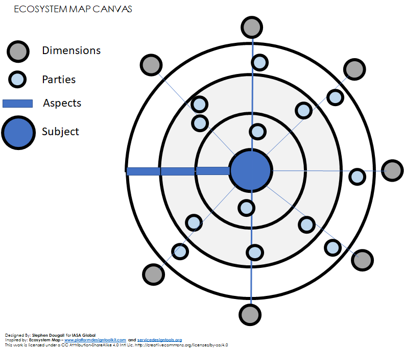
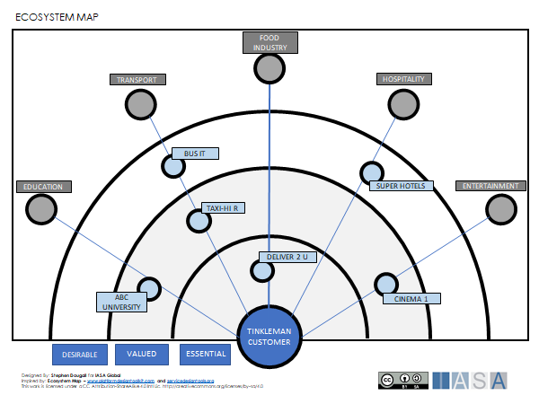
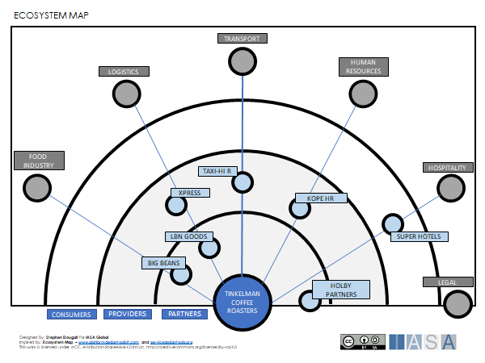
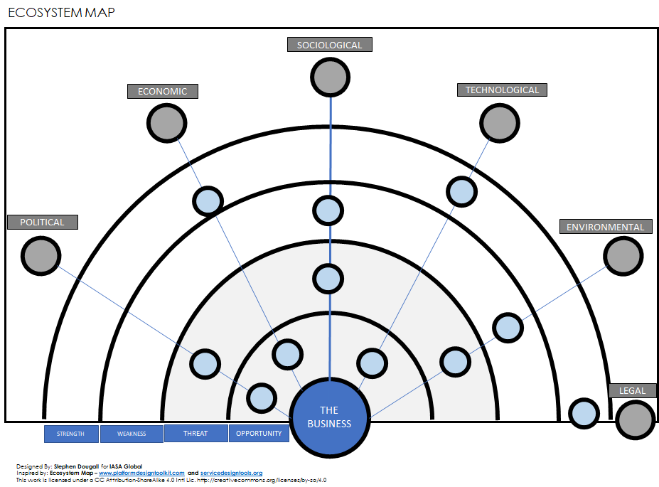

> "A group of businesses or business activities that affect each other and work well together"
**definition of Ecosystem, Cambridge Dictionary**

# What is the Ecosystem 

The Ecosystem represents the external environment within which an organization participates, interacts and is affected by other parties in
the ecosystem. Typical parties in an ecosystem are:

- Suppliers
- Customers
- Competitors
- Government Agencies
- Partners

An ecosystem may be created by design, or may naturally evolve and grow as a consequence of innovation. Ecosystems are adaptive, self-organizing
and scalable, they are loosely coupled and there is no explicit control of the parties in the ecosystem. By nature they are complex disordered
systems and will change over time due to internal and external forces.

The interaction or [collaboration](collaboration.md){:target="_blank"} of parties in the ecosystem creates [value streams](value_streams.md){:target="_blank"} which provide opportunities. When value increases the ecosystem grows, and when value decreases the ecosystem retracts, this may result in the ecosystem being overtaken by another ecosystem with greater value.

In this article ecosystems are considered from two perspectives, the ecosystem surrounding the customer, and the ecosystem surrounding the
organization.

# Why the Ecosystem is important

It is important for the architect to understand the ecosystem in order
to uncover opportunities and mitigate risks. Understanding how an
organization provides value for its customers, provides the basis for
innovation and optimization of operations. The strategies and
[decisions](decisions.md){:target="_blank"} an organization has made to integrate with the
ecosystem are a key factor in forming an architecture. Architects who
ignore the ecosystem risk missing constraints or opportunities when
developing the architecture.

The ecosystem opens business opportunity through collaboration with
other parties. This provides a basis for innovation, where different
parties in the ecosystem can collaborate to create new forms of value,
such as products and services. As an example, consider the following
statement from Jack Ma, Founder of Ali Baba.

*"Our philosophy is that we want to be an ecosystem. Our philosophy is
to empower others to sell, empower others to service, making sure the
other people are more powerful than us. With our technology, our
innovation, our partners -- 10 million small business sellers -- they
can compete with Microsoft and IBM."* **- Jack Ma, Founder Ali Baba**

Understanding the effect of events within the ecosystem and how they
affect the organization and its value chain (or value streams) is
important to reduce business risk. This understanding is critical in
making business and technology decisions, for example, it may be the
difference between choosing the right or wrong partners for the
organization's services.

All parties in the ecosystem are influenced and affected by internal and
external events. It is therefore important to understand the
relationships in the ecosystem, in order to assess the effect of such
events on the organization. Understanding the effect of these events is
key in reducing business risk and taking advantage of opportunities. For
example, ensuring the timing is right for joint ventures, or the
selection of technology partners.

Regular reviews of the organization's product or service strategies
against the ecosystem is good practice and supports sustainability.

# Ecosystem Approach

## Understand the Customer Journey

In order to understand the ecosystem it is important to understand the
[customer journey,](customer_journey.md){:target="_blank"} including the customer interaction with
parties external to the organization. This provides the basis for
potential collaboration, and an understanding about how parties can work
together to provide a greater value for the customer. For example, when
a customer purchases a car, the car dealer has a partnership with
insurance companies, so the car dealer can help the customer sign an
insurance contract at the time of purchase.

## Modular or Integrated Relationships

When an organization develops its business model, it is important to
understand the strategy for interaction with the ecosystem. This can be
expressed as a modular or integrated approach. A modular approach means
that the organization provides services which are very loosely coupled
to other parties in the ecosystem, rather like providing a platform of
services which can be used by many parties. An integrated approach means
that the organization provides services which are tightly bound to
parties in the ecosystem, rather like a supplier of parts to a specific
make of aeroplane.

This choice of module or integrated is not binary, it is rather a
question of how modular or integrated an approach the organization wants
to pursue.

## Customer and Organization form Powerful Intersections

When mapping the ecosystem from the organization and customer
perspectives, look for parties in the ecosystem which feature in both
perspectives. These parties may provide powerful opportunities to gain
capabilities and make operations more efficient, while at the same time
creating added value for the customer.

## Maximize Opportunities, Reduce Risk

Understanding the relationships in an ecosystem provides the knowledge
needed to anticipate the negative, and positive effects of events in the
ecosystem. This allows an organization to quickly take advantage of
opportunities, but also helps to identify risks and mitigate them.

# Ecosystems from the Customer Perspective

An organization may have several types of customers consuming different
types of services or products. The consumption of the service or
product, from the customer perspective, may require the use of other
services or products in order to fully satisfy the customer's needs. For
example, when a customer needs a Car Dealer to perform a service on
their car, there is a need to supply technical information about the
car, and perhaps the customer needs a hire car while the service is
being performed. The supply of technical information and the provision
of a hire car are perhaps services which are provided by other parties
in the customer ecosystem.

Understanding the ecosystem from the customer perspective allows the
architect to consider opportunities for connecting services from
different parties, or creating services which provide a better
experience and added value for the customer.

Ecosystems may also be born out of major innovations. A disruptive
service or product which changes or creates a market or industry. For
example, the introduction of smart phones. These innovations often have
a customer centric perspective, the following are examples of the
thinking which changed or created ecosystems:

- Henry Ford (Ford) asked, *"What would enable everyone to have a
  car?"*.

- Steve Jobs (Apple) asked, *"What would enable everyone to have a
  computer?"*.

- Akio Morita (Sony, The Walkman) asked, *"What would enable young
  people to have their own music"*.

- Jeff Bezos (Amazon) -- *"What would cause people to do their shopping
  online"*.

In the customer ecosystem we also want to consider the competitors to
the organization and their influence on the ecosystem.

# Ecosystems from the Organization Perspective

The customer perspective looks at the ecosystem through the eyes of the
customer, but many organizations have relationships with parties which
are invisible to the customer. These are the parties in the ecosystem
which provide essential business services and products required for an
organization to deliver value, and may even be essential to business
operations. This can perhaps be thought of as the organization
outsourcing a [capability](business_capabilities.md){:target="_blank"} that is required in order to
deliver its products and services. For example, a car manufacturer has a
relationship with suppliers of various car parts, companies providing
raw materials (such as steel), and car dealerships.

This is an important perspective for the architect to consider, in order
to ensure that the business is continuously operational, and to optimize
operations and value delivery.

Changes in the ecosystem can have a major effect on the ability of an
organization to deliver its products or services, and in turn initiate
significant changes to an architecture. A typical example of this is
regulatory or legal changes such as the introduction of GDPR (General
Data Protection Regulation) which had an effect on software suppliers,
cloud providers, and the processes by which organizations manage data.

# Analyzing the Ecosystem

An ecosystem can be viewed from many different perspectives, and each
organization will have its own set of interests in the ecosystem.
Therefore, the model used for analyzing the ecosystem has to be flexible
enough to fit different types of organizations, and different types of
customers.

The following is an Ecosystem Map Canvas, it shows an ecosystem, rather
like a universe of different parties around a particular Subject.

 

The ecosystem map consists of four concepts:

- **The Subject** -- this is the perspective from which the ecosystem
  is seen, for example, the customer, the organization, or part of an
  organization.

- **Parties** -- these are the different parties which are active in
  the ecosystem, for example, actual companies, customers or
  suppliers.

- **Dimensions** -- this groups parties together based on a common
  characteristic, for example, industry or market sector

- **Aspects** -- these are the rings in the diagram, and are how the
  subject perceives the parties, for example, provider, consumer or
  partner. The rings can be used to indicate the strength of the
  relation, from the inner most ring out.

The ecosystem can be analyzed from the customer perspective, or the
organization perspective, by placing the customer or organization as the
subject. To start the analysis the subject must be chosen first.

There are several different ways to work with this canvas depending on
how much information is known about the ecosystem. It is good practice
to decide on the aspects before placing parties on the map, it is the
aspects which make the ecosystem meaningful for the subject, and drive
which parties will be shown on the ecosystem. A good starting point for
aspects is the following:

| Organization Perspective                                                                                                                                                                   | Customer Perspective                                                                                                                                                                    |
| ------------------------------------------------------------------------------------------------------------------------------------------------------------------------------------------ |:--------------------------------------------------------------------------------------------------------------------------------------------------------------------------------------- |
| - **Partner**- partners to the organization  - **Provider**- service or product providers to the organization - **Consumer** - a consumer of the organization services or products | - **Essential** - parties essential to customer satisfaction - **Valued** - parties the customer finds valuable - **Desirable** - parties which improve the customer experience |

These aspects are not perfect, it is possible that parties may be both a
Provider and Consumer, or provide services which are Essential and
Desirable. It is up to the experience of the participants to place
parties in the aspect which fits best.

Dimensions can be added before placing parties on the ecosystem map, or
parties can be added to the ecosystem and then grouped into dimensions.
The dimensions are a common attribute shared by parties, and the way to
work with the analysis may depend partly on the purpose of the analysis.
For example, to find parties in a particular dimension, or to map
existing parties into dimensions. For both the organization and customer
perspectives a good starting point is to work with industry sectors, for
example:

- Retail

- Manufacturing

- Government

- Hospitality

- Logistics

- Transport

The dimensions are likely to be specific to the type of business the
organization works with, or the scenario of the customer.

In the case of aspects and dimensions, it is up to the participants to
decide the number of dimensions or aspects to be used. However, mapping
large numbers of aspects and dimensions can create a complex model, it
is recommended to use a limited number of aspects (max 4.) and
dimensions (max. 8) on a single map, and create several maps from
different perspectives if required.

The parties are placed in the aspects and dimensions. The parties are
the actual entities with which the customer or the organization
interacts. These may be companies, government agencies, NGOs, or
interest groups.

Mapping and analyzing the ecosystem can provide valuable insights to
relations, services and opportunities. It can highlight potential for
[collaboration](collaboration.md){:target="_blank"}, and draw attention to the really important
parties in the ecosystem.

In order to further illustrate the ecosystem map canvas, the following
examples show a map from the customer perspective and the organization
perspective.

## The Tinkleman Customer

The following example uses a fictional "Tinkleman Coffee Roasters"
company, where the subject is a customer to a Tinkleman Coffee Shop. In
this ecosystem, the aspects essential, valued and desirable are used to
indicate how important the parties are to the customer. Several
dimensions have been identified in the ecosystem which provide services
or products to the customer when they want to get a cup of Tinkelman
coffee.

 

In the above map, notice that the customer values transport to the
coffee shop, in particular through the taxi service company "TAXI-HI R",
and other customers prefer to have their coffee delivered home, via the
"DELIVER 2 U" order and collect company. Customers who are students at
the ABC UNIVERSITY value access to Tinkleman Coffee during their
studies, hopefully close to the campus. Customers at the nearby Super
Hotel often order coffee for conferences or meetings, and some customers
often pick up coffee on their way to see a film at the CINEMA 1 complex.
In this example, we can see a number of opportunities for Tinkleman to
increase value to the customer by working with other parties in the
ecosystem.

## The Tinkleman Company

The following example uses "Tinkleman Coffee Roasters" company as the
subject. In this ecosystem, the aspects partner, producer and consumer,
are used to indicate the relationship between Tinkleman and the parties.
Several dimensions have been identified in the ecosystem, which perhaps
represent types of business, but may also represent
[capabilities](business_capabilities.md){:target="_blank"} which are of interest to Tinkleman.

 

In this ecosystem there are a number of partnerships with several
companies, BIG BEANS for provision of coffee beans, LBN GOODS for
logistics from the roasting facilities to the coffee shop, and HOLBY
PARTNERS who help with legal administration.

KOPE HR human resources company regularly provide Tinkleman with
recruitment services for barista personnel. The TAXI-HI R company
provides a taxi booking service to Tinkleman for both staff and
customers, while XPRESS provide logistics services on a request basis.
The SUPER HOTELS chain are a consumer of Tinkleman Coffee for their
conferences.

In this example, there are opportunities to improve the operation of the
organization. Perhaps creating a partnership with KOPE HR for
recruitment, or perhaps automating coffee orders for conferences at
SUPER HOTELS.

# Combining the Ecosystem Map with Strategy

It is possible to combine the Ecosystem Map with techniques used in the
planning of an organization's [strategy](strategy.md){:target="_blank"}. Two commonly used
methods in strategic planning are PESTEL and SWOT. The output from both
these methods can be used to map an ecosystem. These can be combined on
the ecosystem to show the PESTEL categories as dimensions, and the SWOT
categories as aspects. Parties can then be placed on the map
accordingly, for example, pressure from an environmental NGO may be
regarded as a threat, or new technology from a partner may be an
opportunity.

This provides a way of examining the ecosystem from a strategic
perspective.

 

# Influencing the Ecosystem

Understanding the ecosystem helps organizations use the ecosystem to
their advantage, and to the advantage of their customers. Organizations
can adapt their business models to get the most out an ecosystem, for
example, building strategic alliances, partnerships and joint ventures
into new markets.

The advances in digital technology has put the platform business model
to the forefront. Rather than a linear supply chain, a platform is
provided which facilitates the exchange of value between a number of
parties. These parties may be producers or consumers. Examples of
companies which employ a platform business model are, AirBnB, Amazon and
AliBaba.

Being aware of the parties in the ecosystem, and their relationships,
helps in making important business and architectural decisions, which in
turn can influence the ecosystem. This may facilitate innovative ways to
create more value for the customer, but it will also help to create an
understanding of the cause and effect of events, such as, regulatory
changes, market fluctuations or new legal requirements. These events can
have a positive or negative effect on different parties in the
ecosystem. The ability to assess potential effects in the ecosystem, and
take action, gives a competitive advantage to the organization.

# References and Further Reading

**Ecosystem Map**
[Ecosystem Map](https://servicedesigntools.org/tools/ecosystem-map){:target="_blank"}

**Ecosystem Tools (Platform Design Toolkit)**
[Ecosystem Tools](https://platformdesigntoolkit.com/toolkit/){:target="_blank"}

**Platform Business Model**
[Platform Business Model](https://www2.deloitte.com/ch/en/pages/innovation/articles/platform-business-model-explained.html){:target="_blank"}

BTABoK 3.0 by [IASA](https://iasaglobal.org/) is licensed under a [Creative Commons Attribution-NonCommercial 4.0 International License](http://creativecommons.org/licenses/by-nc/4.0/). Based on a work at [https://btabok.iasaglobal.org/](https://btabok.iasaglobal.org/)