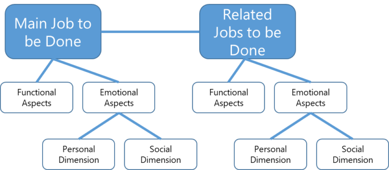
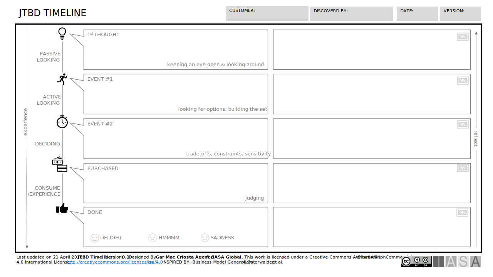
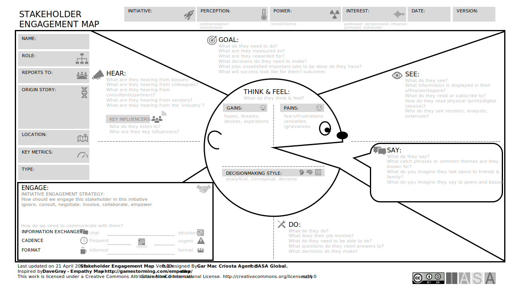
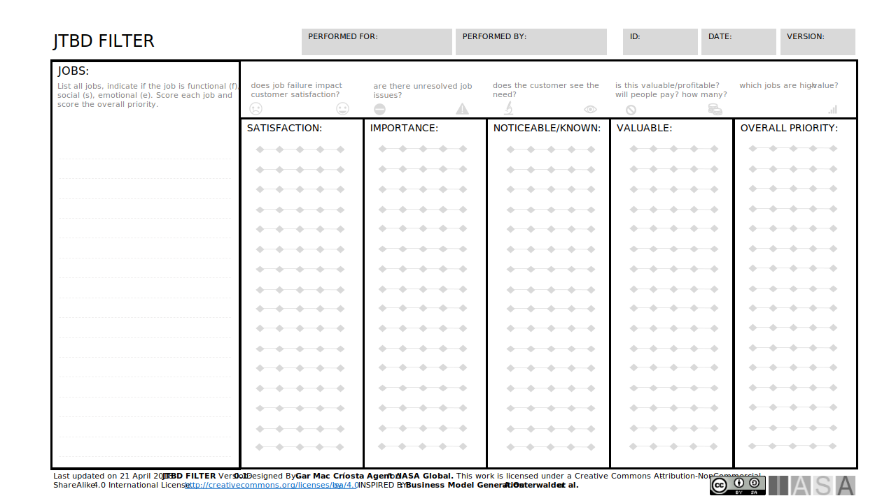
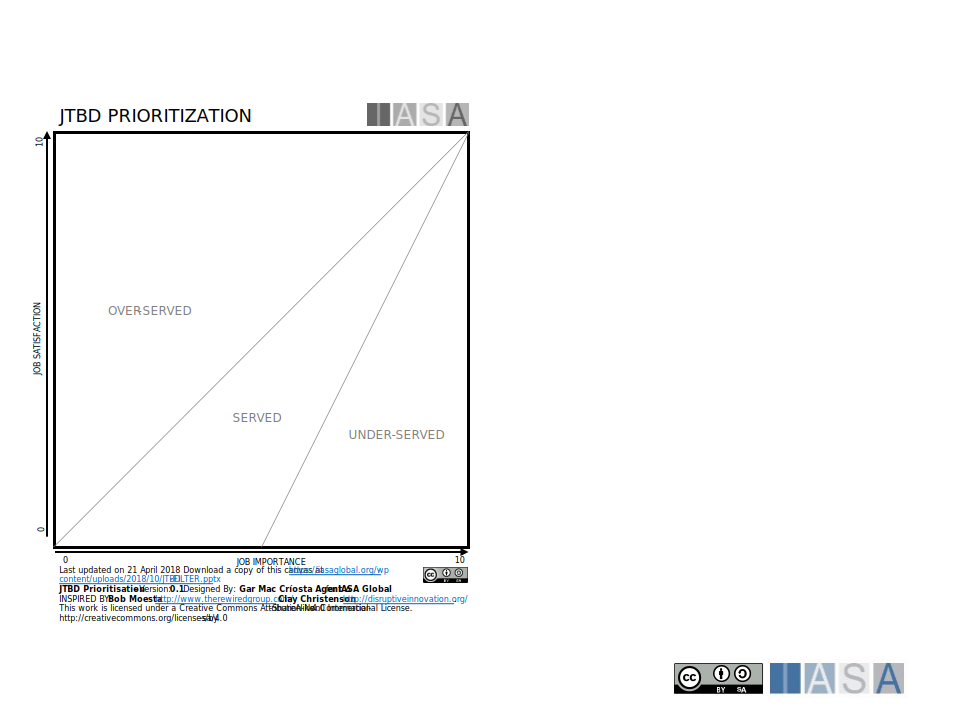

> "We see our customers as invited guests to a party, and we are the hosts. It’s our job every day to make every important aspect of the customer experience a little bit better."

**Jeff Bezos**

# What is Engagement

“Noun: the processes of engaging or engagement with

…

Verb: engaging 

*   occupy or attract (someone’s interest or attention)
*   participate or become involved in
*   establish a meaningful contact or connection with
*   pledge or enter into a contract to do something
*   reserve (accommodation, a place, etc.) in advance

“ – Oxford dictionary

Engagement is an interesting word as it can mean so many things to so many people. Even the definitions of engaging are significantly varied all the way from hiring (employing a plumber) to attraction (he or she was highly engaging). Some definitions, of course, are more modern than others due to variations in other languages and contexts. However, in the BTABoK, engagement is about imagining the digital customer/beneficiary (as in all customer-related articles, the beneficiary of a mission, government, or non-profit can be substituted with minimum changes). It is about how the customer engages with the organization and how the organization engages with the customer. Every time the customer hears, sees, describes, interacts with, or thinks about the company is the overall engagement product. The architect’s purview is how this is impacted by digital strategy and execution.

Thinking of engagement as a set of outcomes is beneficial. By nature, most individuals think of the customer from the inside out (look ‘out’ at the customer). There are often many essential things that have to change to impact engagement outcomes positively. However, it is also necessary to consider engagement from the customers ‘outside-in’ perspective. While in some circumstances, this is hard to do, for example, in legal negotiations or financial trading scenarios, it is essential to use methods by which the customer (as well as client, user, and decision-makers) can be understood. The capabilities and services which impact them can be modified, experimented with, measured, and improved.

# Why Do We Need Customer Engagement?

The BTABoK is based on an architecture practice creating digital outcomes reliably. And results are about customers/beneficiaries. Customers buy products. Customers tell their friends. Customers make emotional decisions. Customers are people. Understanding how people interact with the company, the product, environment, mood, and personal relationships is the key to creating lasting value for them and receiving value in return.

Architects, as digital innovators driving digital advantage, must be customer-obsessed. From business architecture to infrastructure to complex systems, each decision may fundamentally impact a customer, changing how they behave and perceive a company.

Figure 1 Empathy and Features

Tinder, as a dating application, changed the world with a tiny feature, the swipe. This feature was easy to implement from a code perspective but has quite literally changed the world of dating forever. For this reason, customer engagement is not about selling but about empathy and understanding. Think of the number of technology implementation decisions made in an average enterprise in a day. How many of them are genuine customer engaged? Architects using the BTABoK will be able to answer that question with tangible metrics.

# Engagement Approach

The BTABoK suggests that architecture practices be explicitly measured on IBAM (see getting started and architecture practice articles). As a part of imagining the digital customer, there are three primary areas an organization can understand and lead the competition. It is about understanding the landscape in which customers interact in customer ecosystems. Customer journeys are about understanding all of the touchpoints of a customer with the company or around the company. In customer engagement, it is about understanding the customer.

## PRINCIPLE: Stop Doing Architecture, Start Digitally Enhancing Your Customer

One of the fundamental principles of the BTABoK is to stop ‘doing architecture.’ It means that the outcome of the work is more important than the method of achieving that outcome. Thus, using models, methods, techniques, and tools is the purview of any professional. Still, the digital customer and the company’s use of technology to engage that customer effectively is the outcome the architecture practice should be achieving.

## PRINCIPLE: Customer Obsessed Architect Practices Succeed

The architecture practice may do a lot of good in structural management, stakeholder collaboration, and digital operations. However, no single more extraordinary set of outcomes exists that beat creating, growing, and positively impacting customers. This relationship has always existed in businesses. Thus, a customer-obsessed architecture practice will likely be the most successful type of practice.

## Engagement is About Empathy

The first rule of customer engagement is that it is about people. Real people are fallible, unreliable, illogical, and emotional. Their lives are busy. They have happy days and sad days. And empathy is the first step to truly understanding the customer as a person. Empathy is not a term that comes up in the average architects day; however, it may be the single most powerful tool in their abilities to make effective decisions and one of the key differentiators between the profession of architecture and that of engineering (that is not to say engineers cannot use these tools or that they lack empathy). However, it is the architect’s job to empathize with the customer. To understand how a piece of technology will fulfill their needs or make them angry or, in the worst cases, put their lives or jobs at risk. This systemic use of empathy allows the architect to prioritize decisions of all three types (value-based, structural, feature-based) that bring the most value to the customer. 

There are several tools in the BTABoK for understanding customers and even more from places like Strategyn.com.

The Persona Card contains what is called a set of empathy map ideas. The Empathy Map was designed at XPLANE many years ago as part of a human-centered design toolkit they call [Gamestorming](http://gamestorming.com/){:target="_blank"}.

Figure 2 Empathy Map

Notice that the customer has pains and gains; they see things, hear things, say things and do something. This tool is the beginning of understanding the actual customer. The BTABoK has created several canvases that include these empathy notions. They can be used to formally understand how empathy and business technology strategy align.

## Know Who Your Real Customer Is

Much is said about customers, but it is often difficult to know who the customer is as a person or who the real customer is. For example, while a particular person may sign the contract and approve the budget, they may look to another person for guidance on all decisions related to a specific area.

The BTABoK uses the following definitions:

1.  Client: The client is always the architect’s client or employer. Thus the client is never the customer of the business but the person or business who pays the company.
2.  Customer: The customer is always the person who decides to purchase, use, provide use of, or direct the use of the product. The customer is the real decision-maker.
3.  Economic Buyer: The economic buyer is the person or group who pays for the product or job. They may be the customer’s boss, a purchasing department, or the parents are both the customer and the economic buyer in the previous example.
4.  User: The product used is the one who directly engages with it. Thus, the customer of children’s toys is the parent. At the same time, the user is the child (or, in many cases, the parents as well).
5.  Stakeholder: The stakeholder is anyone involved with the client or the customer ecosystem, which impacts the success of the product or the architect’s work. Customers should never be called stakeholders.

Many of the tools in this article can be used for any of the previous examples of individuals. The following persona card is used to get into the mind of a person or group of people who have a similar story. It makes a customer segment into a real person. It is easier to design success for Tom, the father of 2, who picks his kids up from school at 3:30 and works a job as a virtual assistant, lives in Breda, and likes American football than design for a ‘user.’ It is also easier to understand his jobs to be done (get the kids home safely while succeeding at work) and his experiences, what his friends say, etc. The Persona Card is the first step in understanding the mind and emotions of a customer in a particular scenario.

Figure 3 Persona Card

## What Jobs is the Customer Doing

The work on Jobs to Be Done focuses on what a customer is trying to do, not what product they are using. For example, while a person may order a bottle of wine at dinner, they may be trying to impress a client with their sophistication. There are countless examples, but the most famous is “People don’t want a quarter-inch drill. They want a quarter-inch hole.” – Theodore Levitt. The goal of using the Jobs to Be Done method is to understand what the customer is trying to achieve and align architecture decisions with that goal. For example, a customer often does not want to take a flight; they want to be at a meeting in a particular city at a specific time. Thus the architect is actively focused on helping the customer to finish their job, not simply interact with the company.

The strategy has done fantastic work with the JTBD canvases. They provide significant business thought leadership, and their work can be found here: [https://strategyn.com/jobs-to-be-done/](https://strategyn.com/jobs-to-be-done/?gclid=CjwKCAiA6seQBhAfEiwAvPqu17VCLBjeX6BJ7DbeMNrvkm2zld5N98Qbt0qSiidyuRmYFNz1ZVWOKRoCvqkQAvD_BwE){:target="_blank"}. Their canvases have offered many of the thought patterns that shaped the customer elements of the BTABoK Structured Canvas Approach.

Doing things right requires an up-front investment of time. Asking difficult questions causes discomfort, people struggle, awkward silences ensue. Architects will need to get comfortable with the unknown. Market researchers and product developers can focus too heavily on the superficial questions— probing into whether customers like this or that better. People miss the decisions managers seek to justify their conclusions, and data is rarely readily available about Jobs to be Done. Companies already incumbent in an industry tend to ignore \[new\] niches, focusing on their business as they’ve traditionally defined it.

Architects use these tools to explore the solution and customer space to identify unseen blockers and enablers to customer engagement.

## JBTD Timeline

The architect’s goal is to facilitate and participate as an innovator throughout the customer’s process. The JTBD Timeline provides the basis for understanding the relationship between the customer and the organization, backed by the technology underpinning the relationship.

Figure 4 JBTD Timeline Canvas

Notice that the timeline provides the tools to connect JBTD to the customer journey and begin facilitating discussion about business and technology layers that impact that journey. This may be an automated set of steps, or it may be creating a quick way for the customer to contact a person.

## JBTD Forces Canvas

Another canvas that can be used to understand the customers’ behavior in the process is to understand the forces affecting the customers’ behavior and choices during the JBTD. This canvas outlines the forces that allow architects to understand why a customer may choose a new way of doing things. A great example of this comes from Uber. One of the forces on using traditional taxis was the difficulty in payment. Using a credit card with a random taxi driver or having cash were difficulties (what are called pains) in the job of getting from one place in a city to another. By using the Uber app, payment was fully automated. This ‘pain reliever’ is a major attractive force to using the product instead of the more traditional way. However, it is also important to note the forces pushing in the opposite direction. For example, consider the mindset of the individual. Suppose they are deeply unfamiliar with technology or it is difficult to set up a credit card, or they do not have a credit card. In that case, the Uber application may actually create enough anxiety to push the customer into traditional taxis and cash methods.

Figure 5 JBTD Forces Canvas

## Customer Engagement Methods Work on Stakeholders Too

The wonderful thing about people is that they are still people whether they work for the enterprise or the customer. Many if not all of the digital customer tools and methods work for stakeholders and customers. For example, the following canvas, the Stakeholder Engagement canvas, is effectively a modified Empathy Map that allows the architect to explore a stakeholder’s environment, ecosystem, pains/gains, and personality. Similar overlap exists with JBTD and other customer engagement methods.

Figure 6 Stakeholder Engagement Card

# Strategies for Engagement

Good customer focus aims to understand their needs and match them. Connecting this to technology to drive a digital business model is… digital transformation. Succeeding is Digital Advantage. The development of a customer-driven engagement model takes much time and patience.

## Building Customer Engagement into the Architecture Practice

The first step in driving digital customer engagement is adjusting the engagement model to accommodate customer obsession in the architecture practice. This may be done through a series of training, mentoring, coaching exercises, or more informal methods. A starting point is to work through a single product or value stream and show customer engagement deliverables to the architecture practice. The practice would decide which of these would be valuable to the architects and demonstrate them and their value.

## Create a Set of Architect Objectives

Architects work towards objectives measured by numerous stakeholders (including the customers themselves) and need to define what a great set of annual objectives and key results would be based on being customer-focused. Architecture practices should create a set of OKRs that relate to customer engagement. Example or standard metrics have been provided as a starting point at the end of this article.

The goal of the objectives includes the entire spectrum of architects and how their objectives align with each other. This is the most challenging part of an architecture practice but is especially difficult for architects to report to entirely different groups. The business architect’s objectives in driving digital engagement must merge effectively with the infrastructure or software architects. The goal of the activity is to create, discuss and maintain these objectives while measuring actual outcomes for the architecture practice overall.

## Create a Set of Principles

In the same way that architecture objectives drive outcomes, principles help define and shape decisions. Customer engagement principles help architects make decisions that are genuinely ‘customer-obsessed.’ This can be challenging territory, especially in deeply technical decisions. For example, it is not immediately apparent how a customer-focused decision about how to route API traffic through a set of services. And while product owners may have a deep interest in functional or feature-driven decisions, they are poorly equipped to make this kind of trade-off. However, architects are perfectly positioned to link this routing decision to the impact on quality attributes such as performance, features that require ‘sticky’ sessions such as though dependent on server-side state management, and constraints or other principles such as the guiding principle to use stateless idempotent services whenever possible. Each of these impact areas might change the customer’s direct experience and their JBTD, creating benefit or possibly adverse outcomes from their perspective.

## Prioritizing Customer Engagement

There is a relationship between customer outcomes and other elements of the engagement model. For example, in a safety-critical environment a Tier 1 Critical System, priority would likely be given to objectives and principles that are about the health of the system over an individual customer experience. In contrast, in a non-critical design (Tier 3), customer experience, journey, and engagement would involve significantly higher priority. Create customer-obsessed principles before creating more technical ones or prioritize them higher. In the guidance above, a great set of principles would include customer experience should be considered.

## Getting Access to the Right Stakeholders

Most commonly, the Sales, Marketing, and Customer Service organizations in a for-profit would have the most profound interest in customer engagement. In a non-profit or government agency, these might be membership or citizen leadership groups. This can be as simple as starting a conversation informally in many cases. An entire architecture team may be assigned to build these relationships in other cases. The architecture team must realize that creating stakeholder trust is as essential as the outcomes of the activities.

## Business and Technology Maturity

It is worth noting that many architecture practices want to be involved in digital customer success but struggle with many difficulties if their technology or business maturity are not where they need to be to facilitate the dialog. For example, suppose the marketing stakeholder has a problem with what they perceive as fundamental technology in the technology services stack. In that case, they may have a lower belief in the innovation capacity of the technologists or need to fix real problems first. Architects need to be aware of this and adjust their stakeholder management in the engagement model to succeed.

## Defining Personas, Connecting to the Full Digital Customer

Personas can be taken from the customer segments portion of the business model canvas or brainstormed independently. The persona card provides the opportunity to explore what people matter most to the company and the value proposition. These must come first as they will help decide the customer journey and the ecosystem. The customer journey and ecosystem allow the company to understand the entire digital customer and think like them. It is a robust set of tools to explore the customer’s digital interactions and quickly jump through scopes and capabilities that support the operations from services to capabilities.

## Connecting Engagement, Value, and Experimentation

Engagement is a shared goal among many business units. The architecture team must demonstrate how technology decisions impact engagement and where those tradeoffs are made based on other priorities in the overall business objectives. Connecting with real value will guide experimentation, prioritization, and value measures.

## JTBD Filter

The JTBD Filter provides the tools to understand how jobs should be served. It allows the team to prioritize jobs from an overall customer and value perspective. This will enable the team to discuss overall how valuable a particular job is to the company and the importance. Use a JTBD filtering session instead of a traditional investment prioritization session to get customer-obsessed. This will help define priorities alongside other outcome model objectives.

Figure 7 JTBD Filter

## Using a BDN with Customer Engagement Objectives

The benefits dependency canvas provides a way of translating technology enablers like cloud, AI, or integration back into business objectives, and the BTABoK Structured Canvas Approach displays the value contribution of technology to the initiative, which is essential in budgeting and value contribution reporting in benefits realization.

Figure 8 Benefits Dependency Canvas

## Doing Engagement Work with Product Management

The architect does not prioritize outside of tier 1 safety and liability issues. Outside that scope, the architect must work with product owners and other stakeholders to understand and manage the priority and detail of engaged customers. This is done through metrics, contribution, and prioritization. Speaking the language of feature, structure, value creates the optimum communication environment for facilitating outcomes. The JTBD Prioritization canvas can help facilitate precisely this kind of dialog.

## Metrics and Measurements in Engagement

Architects are responsible at all levels of scope for digital engagement. The BTABoK lists numerous areas of possible influence, outcome, and objectives for the team to which the team can commit.

| **Measure**   |      **Description**      |  **Connect Concepts** |
|----------|:-------------:|------:|
| **Net Promoter Score** |  How likely a customer is to recommend something to friends and family. | Stakeholder, Product/Project, Capability, Value Stream |
| **Customer Satisfaction** |    How satisfied the customer is based on a combination of interaction measures. Often a survey is combined with measures like key results like chat success, live call reporting, etc.   |   Customer Journey, Services, Capabilities, Value Stream, Mindset, Value Methods |
| **Customer Lifetime Value** |  [CLV=(frequency of purchase)*(Time period)*(Profit)](https://surveysparrow.com/blog/customer-engagement-metrics/#section5){:target="_blank"} |    Benefits Realization, Value Methods, Investment Prioritization, Product/Project |
| **Customer Stickiness** | How long a customer is retained. This includes customer retention measures and changes from existing to new. |    Benefits Realization, Value Methods, Investment Prioritization, Product/Project |
| **Technology Interaction Statistics** | How customers interact through digital means and omnichannel experiences. |    Quality Attributes (Usability, Security, etc.), Benefits Realization, Value Methods, Investment Prioritization, Product/Project |
| **Social Media Measures** | How to trace metrics through social media’s ‘long-tail’ effects such as mentions, positive reviews, brand championships. |    Benefits Realization, Value Methods, Investment Prioritization, Product/Project |

# References and Further Reading

[10 Key Customer Engagement Metrics to Track in 2022 (surveysparrow.com)](https://surveysparrow.com/blog/customer-engagement-metrics/){:target="_blank"}

[What is digital engagement? What drives digital customer engagement? (zendesk.com)](https://www.zendesk.com/blog/digital-customer-engagement/){:target="_blank"}

[https://strategyn.com/jobs-to-be-done/](https://strategyn.com/jobs-to-be-done/){:target="_blank"}

[https://jtbd.info/2-what-is-jobs-to-be-done-jtbd-796b82081cca](https://jtbd.info/2-what-is-jobs-to-be-done-jtbd-796b82081cca){:target="_blank"}

[https://hbr.org/2016/09/know-your-customers-jobs-to-be-done](https://hbr.org/2016/09/know-your-customers-jobs-to-be-done){:target="_blank"}

[https://medium.com/the-xplane-collection/updated-empathy-map-canvas-46df22df3c8a](https://medium.com/the-xplane-collection/updated-empathy-map-canvas-46df22df3c8a){:target="_blank"}

BTABoK 3.0 by [IASA](https://iasaglobal.org/) is licensed under a [Creative Commons Attribution-NonCommercial 4.0 International License](http://creativecommons.org/licenses/by-nc/4.0/). Based on a work at [https://btabok.iasaglobal.org/](https://btabok.iasaglobal.org/)