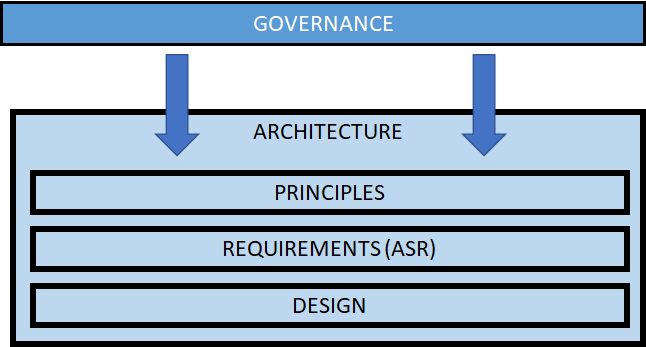
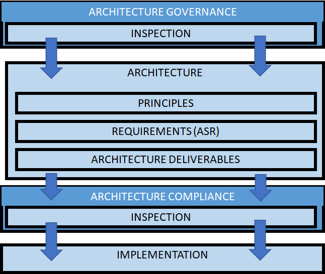
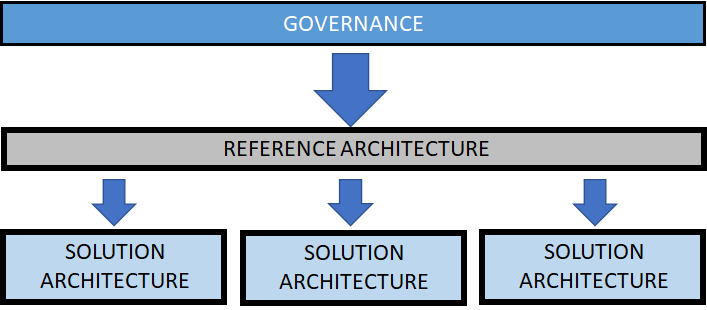

> "Governance is a system that provides a framework for managing organizations. It identifies who can make decisions, who has the authority to act on behalf of the organization and who is accountable for how an organization and its people behave and perform. Governance enables the management team and the board to run organizations legally, ethically, sustainably, and successfully, for the benefit of stakeholders, including shareholders, staff, clients and customers, and for the good of wider society."
**definition of Governance, Chartered Governance Institute UK and Ireland**

# What is Governance

Governance is an important function in many organizations and
professions, architecture and architecture practices are
should align with and where possible facilitate effective organizational
governance. There are many definitions of what governance is but most
point out that it is a framework of structures and processes which allow
the organization to operate according to a set of norms, values and
policies.

These norms, values and policies may be specific to the organization and 
to the industry sector the organization is involved in. For example,
organizations in strongly regulated business sectors are also likely to
have strong governance frameworks, since consequences of poor practices
or decisions may be severe. Consider sectors such as the medical,
pharmaceutical, nuclear or banking, where the consequences of poor
[decisions](decisions.md){:target="_blank"} may result in loss of life, or substantial
financial loss that leads to economic problems at a much higher scope.

Governance applies to architecture for the same reasons, and the
strength of governance in the organization will likely be determined by
the business sector and risk. The architecture is also important for
governance, since a well architected organization is easier to govern.

A governance framework includes the structures and processes for:

- [Decision making](decisions.md)

- Accountability 

- Values and norms

- Control

Popular frameworks such as COBIT and ITIL may be used for IT governance.
These are often used in large organizations and are comprehensive
frameworks. However, implementing such a comprehensive framework takes a
lot of time and effort. Smaller organizations may find these frameworks
overwhelming and settle for developing a framework which meets essential
governance requirements.

In terms of architecture, good governance structures and processes
facilitate decision making and help to form the architecture in a way
which is fit for the business in question. Therefore, governance aids
the development and delivery of good architecture.

# Why Governance is Important

Effective governance is important within an architecture practice to
promote good ethics and a culture of professionalism. Executing good
governance ensures stakeholders can trust the architecture practice to
carry out their work to the standard expected by the stakeholders.

Governance provides the architect with support for decision making when
developing an architecture. It facilitates the understanding of
regulatory requirements on the architecture, and helps the architect
avoid making bad decisions with significantly negative effects.

Practicing good governance facilitates transparency. Inspections in the
governance process raise issues, non-conformances and openly publish
recommendations for resolutions. This provides support for the
organization in maintaining standards and allows architects involved in
different [assignments](assignments.md){:target="_blank"} to learn from recommendations which
are openly discussed.

Having a governance framework in place helps to develop a culture of
professionalism, and facilitates the practice of good ethics.

Governance is particularly important when working in business areas
where bad decisions have severe consequences. These are often safety
critical types of business, for example, medical, nuclear, or aerospace,
where a bad decision or a missed inspection can cost lives. Governance
provides the organization with a way of regulating [safety and
liability](safety_and_liability.md), and provides clarity regarding responsibility
and accountability.

# Governance Approach

## Governance is Everyone's Business

A governance framework should be flexible and develop, based on feedback
from stakeholders, not only to facilitate solid standards and
principles, but also to ensure that the governance is practical.
Engagement with stakeholders at an early stage will help form governance
so it is less intrusive, and create a wider acceptance. The role of the
architect is to ensure that the architecture takes governance in to
consideration, so that the architecture aligns with the
[objectives](objectives.md){:target="_blank"} of the business, as well as ensuring that
resulting implementations comply to the architecture.

## Avoid "police state"

Governance is used to help the organization make good decisions, however
if governance is practiced badly, it can create a "police state"
culture. [Stakeholders](stakeholders.md){:target="_blank"} will feel controlled, and may not be
aware of why they have to follow the policies, processes or the
architecture. Practicing good governance means that the organization
must communicate and motivate governance. This can be achieved through
mentoring and training.

## Governance Helps Agility

Sometimes in agile practices, governance is seen as a negative. This is
perhaps as it goes against the [principle](principles.md){:target="_blank"} of keeping
decisions as close to the agile teams as possible. However, in most
industries it is unrealistic to assume that each team is responsible for
decisions which affect the whole organization. If done well, governance
is a real positive and actually facilitates agility by helping teams in
the decision-making process, as well as providing structures and
processes for communication.

## Bottom-up Governance

Governance done well during design and delivery, reduces
non-conformances and resulting difficulties with stakeholder management.
This means that decisions are clear prior to delivery and the resulting
delivery follows the building codes of the organization. This makes
inspections less painful and much less costly. In the BTABoK this is
termed bottom-up governance. In addition, this aspect works extremely
well with a rigorous [extended team](extended_team.md){:target="_blank"} approach, and a
partnership between architecture and engineering.

## Governance for Governance Sake

Governance is essential, especially in heavily regulated industries, but
it is important to strike the right balance. An organization wants to
have innovative teams who are not weighed down by bulky governance, at
the same time the organization needs enough governance to provide
accountability, mitigate business risks and promote corporate values and
norms. Ensure that governance is well-motivated and does not
unnecessarily constrain the architecture or the teams. This forms the
basis for the tenet, *"Architects should not be scarce resources"*.

# Governance and the Architecture Practice

The architecture practice has a role in the governance of business
technologies. This is often expressed as processes, organizational
structures and principles that are used to manage and develop
architectures.

TOGAF defines the characteristics of Architecture Governance as
including the following:

- Implementing a system of controls over the creation and monitoring
  of all architectural components and activities, to ensure the
  effective introduction, implementation, and evolution of
  architectures within the organization

- Implementing a system to ensure compliance with internal and
  external standards and regulatory obligations

- Establishing processes that support effective management of the
  above processes within agreed parameters

- Developing practices that ensure accountability to a clearly
  identified stakeholder community, both inside and outside the
  organization

While all these aspects are very relevant it is important that
governance reflects the context of the business. For example, the
requirement for governance may depend on regulations, legal obligations,
or the size of the organization. Creating a heavy governance framework
may reduce agility, so it is important to ensure that governance is
practical, relevant and is a helpful guidance which supports decision
making.

An architecture practice participates in the development of the
governance framework together with the different stakeholders in the
organization. For example, developers, product owners, sponsors,
testers, etc\... Governance is everybody's business, and broad
involvement ensures that stakeholders are aware of why the governance
exists. It is important that the governance is practical, so the
different stakeholders feel that the governance is both relevant and
realistic in the context of the business.

The following aspects are important to consider when developing a
governance framework together with stakeholders:

- **Motivation** - motivation as to why the governance is needed.
  This is an important aspect since it will be difficult to convince
  stakeholders to adopt the governance if there is no clear
  motivation.

- **Consequence** - the consequences of introducing the governance.
  This is the effect of the governance, which can be both positive and
  negative. For example, we may gain a higher level of quality
  assurance but as a trade-off against delivery time.

- **Inspection Method** - how do we validate that the organization is
  following the governance, for example, through KPI's, inspections,
  reporting \...

- **Responsibility and Accountability** - who is responsible for
  ensuring that the governance is adhered to, and who is accountable
  for the result

# Governance and Architecture

Governance not only influences the process of developing an architecture
but even affects the architecture itself. Governance may place
requirements or constraint requirements on many [products](products.md){:target="_blank"}
in the organization. For example, in the pharmaceutical industry,
manufacturing technologies have to comply to FDA (Food and Drug
Administration) regulations, if products are to be accepted to the US
market. It may be the case, that part of this regulation requires a high
level of traceability on the production of drugs. This would perhaps
lead to an architecture practice within a pharmaceutical company,
creating governance processes, policies and structures to manage
traceability, both manually and automated. This is likely to place
requirements and constraints on the architecture of such technologies,
and the architect will have to account for this when making decisions
about the architecture. Notice that the advantage of having the
governance in place is that it raises awareness of the regulation for
the architects. Governance may lead to the architect considering the
requirements placed on the architecture, and will likely influence the
characteristics of the architecture.

## Responsibility and Accountability

In any organization it is important to align strategy and objectives,
with the various architectures in the organization, whether they be
solution architectures, or enterprise-wide. In order to facilitate this,
there needs to be a clear structure as to who makes decisions, who is
accountable and who is responsible for the execution. Without this, it
may be difficult to lead the architecture work and provide a set of
coherent architectures. Without a clear structure for responsibility and
accountability we may also find it difficult to gain the trust of
stakeholders, and it may be difficult to trace decisions back to their
original motivation.

In practice, this is about defining roles and delegating responsibility
and accountability. The term roles in this case can apply to a role
given to a person or a group of people. Notice that in many cases it may
be the architect who is being governed, rather than performing the
governance.

## Standards, Norms and Principles

Standards and norms can be stated in governance to help guide how to
work with developing an architecture. For example, these may be ethical,
environmental, technology standards. These may not even be specific to
the organization and can be regarded as industry standards.

 

The architect can inherit, or develop architecture
[principles](principles.md){:target="_blank"}, these help the architecture to comply with
governance. This helps to align the architecture with the aims of the
organization, for example goals and objectives. Developing principles
help to give context and direction, which aids decision-making.

For example, some simple principles may be that "Flexibility is favored
over performance.", "COTS products are preferred to in-house
development", or "User actions must be fully traceable.".

In regulated industries these standards and principles may be strict, as
compliance to regulation is often business critical. It is therefore
extremely important, that the architect understands the implications of
governance for the architecture.

## Developing the Architecture

Governance may put forward standards and [principles,](principles.md){:target="_blank"} but
these often have to be interpreted for a solution in a given business
context. For example, the governance may state that transactions in a
system should be traceable to an individual user, but the governance
does not state what this means in the context of any given solution, or
how it should be designed or implemented.

Instead, it is up to the architect and the stakeholders to interpret
which [requirements](requirements.md){:target="_blank"} should be placed on the architecture in
order to comply to the governance. The architecture, and solution can
then be designed using these requirements. Ensuring that the
requirements on the architecture comply to governance is key to reducing
business [risk](risk.md){:target="_blank"}. If the resulting solution does not meet the
governance standards, the product may never make it to production. With
this in mind, it is recommended to perform a review of the architecture
requirements against any applicable governance, to ensure that the
interpretation is correct. This is likely to include different kinds of
stakeholders from the organization, for example, legal, financial,
political or environmental.

## Checking for Compliance

It is natural that if an organization has a governance framework in
place, it will want to check that the governance is being followed. The
same is true for governance of the architecture. An architecture is
often validated via an inspection, to assess if it meets the governance
standards. This provides assurance for the resulting architecture
[deliverables](deliverables.md){:target="_blank"}. In this case, it is the architect and the
architecture which are the subjects of governance.

However, it is not enough to ensure that the architecture follows
governance, it is also important to provide assurance that the
implementation of the technology follows the architecture. Therefore, we
have to ensure that there is architecture compliance in the
implementation. In this case, the architect is likely to perform the
inspection to ensure compliance.

Such inspections ensure that the delivered product meets the governance
criteria. It is good practice to perform regular inspections on the
architecture during development, as well as a final inspection when the
resulting solution is ready for delivery.

This ensures that there are no unpleasant surprises during the final
delivery. It is also worthwhile remembering that in many cases
governance also applies to how the architecture was developed (process),
not just the resulting architecture. So, it may be important to show
compliance in the processes and methods used to develop the
architecture, as well as the resulting architecture.

## Architecture Governance Boards

Beyond the inspections described above some organizations --
particularly those in highly regulated industries -- will need to
demonstrate assurance of architecture decision making as a control
measure in mitigating architecture related risks. This can lead to the
creation of a board responsible and accountable for overseeing good
architectural governance to fulfil this requirement. Care should be
taken when establishing these boards to ensure they do not become overly
bureaucratic or "Police State" as described earlier. Ensuring that these
boards have a well-defined and understood terms of reference and
appropriate board membership is critical to them being effective. These
should also be regularly reviewed. One or more architecture boards may
be established to cover:

- Agreement and maintenance of enterprise architecture guiderails
  (such as reference architectures, principles etc.)

- Review and approval of proposed solution architecture

- Review and approval of implementation of solution architecture (to
  manage the creation of architectural and technical debt and any residual
  risks). Using Reference Architectures

A governance framework is often applied to many different organizations
or products. In the case of the architecture practice, the same
governance will likely be applied to many solutions. It may be time
consuming and fragmented for each solution to interpret the same
governance for their architecture. This can lead to several different
interpretations of standards and principles as well as, making
inspection complex.

One way the architecture practice can make it easier for architectures
and solutions to comply to governance is to use a reference
architecture. The reference architecture can be developed which complies
to significant areas of governance and provides a set of requirements,
patterns and designs which help solution architectures with compliance.
Solution architectures can then use the reference architecture as a
foundation, in the knowledge that their solution will be largely
compliant so long as they follow the reference architecture. This can
make inspection easier since the reference architecture is deemed to be
compliant, the inspection need only check that the reference
architecture is followed.

# References and Further Reading

**Governance, what it is and why it is important -- Governance Today**
[Governance](https://www.governancetoday.com/GT/Material/Governance__what_is_it_and_why_is_it_important_.aspx){:target="_blank"}

**What is governance -- Institute on Governance**
[What is governance](https://iog.ca/what-is-governance/){:target="_blank"}

**What is governance -- Chartered Governance Institute UK and Ireland**
[What is governance](https://www.cgi.org.uk/professional-development/discover-governance/looking-to-start-a-career-in-governance/what-is-governance){:target="_blank"}

**Architecture Governance (Chapter 44), TOGAF**
[Architecture Governance](https://pubs.opengroup.org/architecture/togaf9-doc/arch/chap44.html){:target="_blank"}

**COBIT**
[COBIT](https://www.isaca.org/resources/cobit){:target="_blank"}

**ITIL**
[ITIL](https://www.axelos.com/best-practice-solutions/itil){:target="_blank"}

BTABoK 3.0 by [IASA](https://iasaglobal.org/) is licensed under a [Creative Commons Attribution-NonCommercial 4.0 International License](http://creativecommons.org/licenses/by-nc/4.0/). Based on a work at [https://btabok.iasaglobal.org/](https://btabok.iasaglobal.org/)
